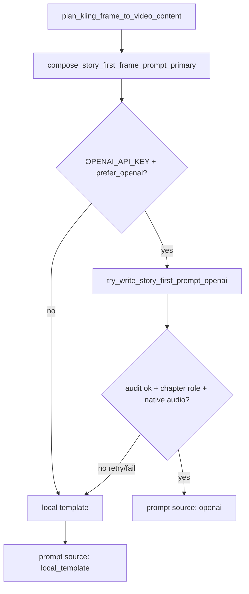

# Kling Frame Prompt — OpenAI Authorship Check

**Phase:** KLING-PROMPT-OPENAI-AUTHORSHIP-CHECK  
**Status:** IMPLEMENTED — OpenAI primary, local fallback  
**Date:** 2026-06-03

---

## Finding

Before this change, **all Kling Frame-to-Video story-first prompts were local-template only**.

| Layer | Path | OpenAI? |
|-------|------|---------|
| Frame planner | `content_brain/execution/kling_frame_to_video_planner.py` | No |
| Story-first composer | `content_brain/story/story_first_prompt_engine.py` → `compose_story_first_frame_prompt()` | No |
| Story progression | `content_brain/story/story_progression_engine.py` | No (metadata fed into templates) |

OpenAI was used elsewhere in ModirAgentOS (Director Layer, quality judge, story enricher, metadata agents) but **not** for Kling Frame prompt text generation.

---

## Solution

Added OpenAI as the **primary** story-first prompt writer with **local template fallback**.

### New module

`content_brain/story/kling_story_first_openai_writer.py`

- `try_write_story_first_prompt_openai()` — calls OpenAI chat completion (model cascade: `OPENAI_KLING_PROMPT_MODEL` → `OPENAI_DIRECTOR_MODEL` → `gpt-4.1` → `gpt-4.1-mini`)
- Validates output before acceptance
- Up to 2 attempts with validation feedback
- Returns `None` → triggers local fallback

### Primary entry point

`compose_story_first_frame_prompt_primary()` in `story_first_prompt_engine.py`

1. Try OpenAI writer
2. On failure / unavailable → `compose_story_first_frame_prompt()` (local template)

### Planner wiring

`kling_frame_to_video_planner_v3_openai_story_first` calls `compose_story_first_frame_prompt_primary()` from `_compose_frame_prompt()`.

Authorship metadata stored on each clip at `chapter_progression.prompt_authorship`:

```json
{
  "source": "openai" | "local_template",
  "openai_applied": true,
  "openai_model": "gpt-4.1-mini",
  "notes": ["openai_kling_prompt_applied:gpt-4.1-mini"],
  "story_first_audit": { ... }
}
```

Clip previews expose `prompt_authorship` alongside `story_first_audit`.

---

## Requirements Preserved

| Requirement | How |
|-------------|-----|
| 2300–2500 chars | OpenAI instructed + `fit_story_first_prompt_length()` post-process |
| story_percent ≥ 80% | Validated via `audit_story_first_prompt()` before accept |
| technical footer ≤ 20% | Marker `--- Technical execution ---` enforced; footer rebuilt if missing |
| Story Progression chapter role | Passed in user payload; validated for `"chapter role"` + role value in text |
| Character continuity | `character_continuity` in payload; cast presence validated |
| Native audio | `directives_summary` in payload; `"native"` required in accepted prompt |
| Local fallback | On missing API key, dry-run, OpenAI error, or validation failure |
| Length + ratio validation | Same audit gate as local path; generation still blocked if plan fails `validate_kling_frame_content_plan()` |

---

## Authorship Flow



---

## Environment

| Variable | Purpose |
|----------|---------|
| `OPENAI_API_KEY` | Required for OpenAI path |
| `OPENAI_KLING_PROMPT_MODEL` | Optional override (default cascade) |
| `OPENAI_DIRECTOR_MODEL` | Secondary override |

Without `OPENAI_API_KEY`, planner uses local templates (verified in validation run).

---

## Validation

```bash
python project_brain/validate_kling_prompt_openai_authorship.py
python project_brain/validate_story_first_prompt_architecture.py
python project_brain/validate_kling_frame_architecture_switch.py
python project_brain/validate_story_progression_engine_p5.py
```

### Sample run (no API key — local fallback)

| Clip | Source | Length | story_percent |
|------|--------|--------|---------------|
| 1 | local_template | 2495 | 83.61% |
| 2 | local_template | 2500 | 83.88% |

### Mocked OpenAI path

| Metric | Value |
|--------|-------|
| source | openai |
| prompt_length | 2500 |
| story_percent | 90.72% |

---

## Files Changed

| File | Change |
|------|--------|
| `content_brain/story/kling_story_first_openai_writer.py` | **New** — OpenAI writer + validation |
| `content_brain/story/story_first_prompt_engine.py` | `compose_story_first_frame_prompt_primary()` |
| `content_brain/execution/kling_frame_to_video_planner.py` | Wire primary composer; authorship in preview |
| `project_brain/validate_kling_prompt_openai_authorship.py` | **New** — authorship validation suite |

---

## Notes

- Multishot Kling prompts unchanged (512-char shot limit, separate planner).
- OpenAI writes prose; technical footer is normalized via shared `build_story_first_technical_footer()` to keep ratio compliance.
- Invalid OpenAI output never reaches generation — local template replaces it automatically.
