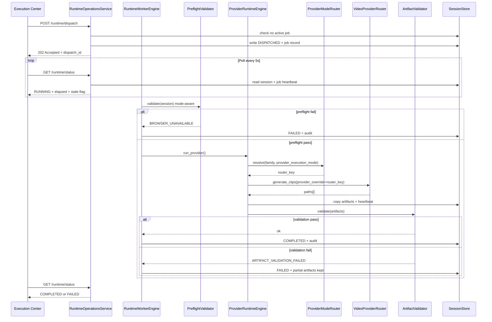

# Phase 10J — Provider Operations Design Report

Generated: 2026-05-30  
Updated: 2026-05-30 (Dual Execution Mode, Cost Telemetry)  
Status: **Design approved — implementation not started**

---

## 1. Purpose

Phase 10J operationalizes **real provider execution** for the Execution Center without modifying Runway, Hailuo, browser automation, `VideoProviderRouter`, or legacy video pipelines.

10I already calls `VideoProviderRouter.generate_clips()` when `skip_provider_execution=False`. 10J wraps that call with:

1. Background execution worker  
2. Runtime status polling  
3. Provider preflight validation  
4. Artifact validation  
5. Failure taxonomy  
6. Retry governance  
7. Runtime observability  
8. **Dual execution mode** — browser and API paths for the same provider family without runtime redesign  
9. **Provider cost telemetry** — storage-only dispatch economics for future governance  

**Design goal:** Execution Center can **submit**, **monitor**, and **recover from** long-running provider jobs safely — in either **browser** or **api** mode — while **recording cost telemetry** for future dashboards and provider recommendation.

---

## 2. Design Principles

| Principle | Rule |
|-----------|------|
| **Black-box providers** | Orchestrators and router called unchanged; no DOM/API edits |
| **Extend 10I** | `ProviderRuntimeEngine` remains the execution core; 10J adds an operations shell |
| **Session as source of truth** | All durable state in session JSON + artifact dir + audit JSONL |
| **Fail before RUNNING** | Preflight rejects before provider call or worker start |
| **No HTTP blocking** | Dispatch API returns immediately; client polls status |
| **Requeue over in-flight retry** | Browser failures require new 10H queue cycle |
| **Backward compatible** | Dry-run (`skip_provider_execution=True`) stays synchronous for seeds/tests |
| **Mode-agnostic runtime** | Never hardcode browser-only or API-only; mode is a resolved field, not a provider identity |
| **Preferred, not forced** | `preferred_mode: browser` today; switch to `api` later via config only |

---

## 3. Architecture Overview

### 3.1 Layered model

```
┌─────────────────────────────────────────────────────────────────┐
│  Execution Center UI (ui/web)                                   │
│  — dispatch button, poll status, observability panel            │
└────────────────────────────┬────────────────────────────────────┘
                             │ REST
┌────────────────────────────▼────────────────────────────────────┐
│  ui/api — RuntimeOperationsService (10J)                        │
│  POST /runtime/dispatch  → accept job                           │
│  GET  /runtime/status    → poll session + job                   │
│  GET  /runtime/jobs      → active jobs index (optional)         │
└────────────────────────────┬────────────────────────────────────┘
                             │
┌────────────────────────────▼────────────────────────────────────┐
│  RuntimeWorkerEngine (10J — NEW)                                │
│  — job registry, thread worker, heartbeat, finalize             │
└────────────────────────────┬────────────────────────────────────┘
                             │
        ┌────────────────────┼────────────────────┐
        ▼                    ▼                    ▼
 ProviderPreflight    ProviderRuntimeEngine   ArtifactValidation
 Validator (NEW)      (10I — extended hooks)   Engine (NEW)
        │                    │                    │
        └────────────────────┼────────────────────┘
                             ▼
                   ProviderModeRouter (10J — NEW, thin)
                     → ApiExecutionAdapter  ──┐
                     → BrowserExecutionAdapter ┘
                             ▼
                   VideoProviderRouter (UNCHANGED)
                             ▼
              Hailuo / Runway orchestrators & API providers (UNCHANGED)
```

### 3.2 New modules (proposed)

| Module | Path | Responsibility |
|--------|------|----------------|
| `RuntimeWorkerEngine` | `content_brain/execution/runtime_worker_engine.py` | Background job lifecycle |
| `RuntimeJobRegistry` | `content_brain/execution/runtime_job_registry.py` | Active/completed job index on disk |
| `ProviderPreflightValidator` | `content_brain/execution/provider_preflight_validator.py` | Pre-RUNNING checks (mode-aware) |
| `ProviderModeRouter` | `content_brain/execution/provider_mode_router.py` | Resolve `(provider_family, execution_mode)` → router key |
| `ProviderModeCatalog` | `content_brain/execution/provider_mode_catalog.py` | `supported_modes`, `preferred_mode`, learning keys |
| `ArtifactValidationEngine` | `content_brain/execution/artifact_validation_engine.py` | Post-provider file checks |
| `FailureTaxonomy` | `content_brain/execution/failure_taxonomy.py` | Codes, retriability, HTTP mapping |
| `OperationsPolicy` | extends `RuntimePolicy` in place or sibling dataclass | 10J policy fields |

**No new orchestrators. No edits to `VideoProviderRouter` internals.**  
`ProviderModeRouter` is a **compatibility shim** — adapters delegate to existing `generate_clips(provider_override=...)`.

### 3.3 Storage layout (extended)

```
storage/content_brain/execution/
  sessions/{session_id}.json          # session + execution_runtime (extended)
  artifacts/{session_id}/video_generation/
    prompt_bundle.json
    clip_01.mp4
  runtime/
    audit.jsonl                       # existing global provider audit
    active_jobs.json                    # NEW — in-flight job index
    jobs/{dispatch_id}.json             # NEW — job snapshot / heartbeat
    logs/{dispatch_id}.log              # NEW — optional worker stdout capture
```

---

## 4. Background Execution Worker

### 4.1 Worker model

**Choice:** In-process **daemon thread** per job (same pattern as `ui/app.py` `run_threaded`).

| Option | Verdict |
|--------|---------|
| Thread | **Selected** — I/O-bound browser/API waits; minimal change; shares `ExecutionSessionStore` |
| Subprocess | Deferred — isolation benefit but complicates session locking and logging |
| External queue (Redis/Celery) | Out of scope — violates incremental/local-first architecture |

### 4.2 Job lifecycle

```
ACCEPTED → PREFLIGHT → RUNNING → FINALIZING → COMPLETED | FAILED
                  ↓
            PREFLIGHT_FAILED (terminal, no provider call)
```

**Session state mapping** (unchanged top-level states):

| Job phase | `session.state` | `execution_runtime.state` |
|-----------|-----------------|---------------------------|
| ACCEPTED | DISPATCHED | DISPATCHED |
| PREFLIGHT | DISPATCHED | DISPATCHED |
| RUNNING | RUNNING | RUNNING |
| FINALIZING | RUNNING | RUNNING |
| COMPLETED | COMPLETED | COMPLETED |
| FAILED | FAILED | FAILED |
| PREFLIGHT_FAILED | FAILED | FAILED |

### 4.3 Dispatch flow (real execution)

```
POST /sessions/{id}/runtime/dispatch
  skip_provider_execution=false
    │
    ├─ sync path if skip_provider_execution=true (seeds, tests)
    │
    └─ async path (10J):
         1. Load session; verify DEQUEUED + integrity (delegate to 10I validator)
         2. Reject if active job exists for session_id → JOB_ALREADY_ACTIVE
         3. Create dispatch_id + job record in active_jobs.json
         4. Write session: DISPATCHED, execution_runtime.operations.job_id
         5. Spawn worker thread
         6. Return HTTP 202 { accepted: true, dispatch_id, state: DISPATCHED }
```

**Worker thread steps:**

1. Run `ProviderPreflightValidator.validate(session, policy)`  
2. On fail → `_mark_failed(PREFLIGHT_*)`, remove from active_jobs, exit  
3. Call `ProviderRuntimeEngine.dispatch()` with `skip_provider_execution=False`  
   - **Design note:** Engine may be split internally into `prepare_dispatch()` + `execute_clips()` + `finalize()` hooks so worker can set heartbeat between phases without changing router  
4. On router return → `ArtifactValidationEngine.validate(...)`  
5. On pass → COMPLETED; on fail → FAILED with artifact codes  
6. Remove from active_jobs; write terminal job snapshot to `jobs/{dispatch_id}.json`  
7. Append terminal audit events  

### 4.4 Concurrency rules

| Rule | Detail |
|------|--------|
| One active job per `session_id` | Enforced by registry mutex (file lock or atomic JSON update) |
| One browser-heavy job recommended globally | Policy flag `max_concurrent_browser_jobs: 1` (soft gate in preflight) |
| Worker crash | Heartbeat stale → status API surfaces `STALE_RUNNING` warning; operator manual recovery doc |

### 4.5 Heartbeat

While RUNNING, worker updates every **30s**:

```json
{
  "dispatch_id": "disp_...",
  "session_id": "exec_...",
  "phase": "RUNNING",
  "heartbeat_at": "2026-05-30 12:34:56",
  "elapsed_seconds": 420,
  "clip_target": 5,
  "clip_observed": null,
  "provider_resolved": "runway_browser",
  "provider_family": "runway",
  "provider_execution_mode": "browser",
  "worker_thread_id": 12345
}
```

Stored in `runtime/jobs/{dispatch_id}.json` and mirrored in `execution_runtime.operations`.

**Limitation (accepted):** Per-clip progress cannot be observed without orchestrator changes. Heartbeat proves liveness only; `clip_observed` stays `null` until post-run validation.

---

## 5. Runtime Status Polling

### 5.1 API contract (extended)

**Existing:** `GET /sessions/{id}/runtime/status`

**10J additions to response:**

```json
{
  "session_id": "exec_...",
  "state": "RUNNING",
  "runtime_state": "RUNNING",
  "dispatch_id": "disp_...",
  "job": {
    "active": true,
    "phase": "RUNNING",
    "accepted_at": "...",
    "heartbeat_at": "...",
    "elapsed_seconds": 420,
    "stale": false,
    "stale_after_seconds": 120
  },
  "provider_execution_mode": "browser",
  "provider_family": "runway",
  "preflight": {
    "passed": true,
    "checked_at": "...",
    "provider_execution_mode": "browser",
    "checks": []
  },
  "progress": {
    "clip_target": 5,
    "clip_artifact_count": 0,
    "clip_validated_count": 0
  },
  "observability": {
    "last_audit_event": "RUNNING",
    "log_path": "storage/.../runtime/logs/disp_....log"
  },
  "failure": null
}
```

### 5.2 Polling semantics

| Client | Interval | Behavior |
|--------|----------|----------|
| Execution Center UI | 5s while RUNNING/DISPATCHED | Poll `GET /runtime/status`; stop on terminal state |
| Session drawer | On tab focus + 5s if active | Show operations sub-panel |
| Overview dashboard | 30s | Count `runtime_active_count` from session summaries |

### 5.3 Stale detection

If `now - heartbeat_at > stale_after_seconds` (default **120s**) while job active:

- `job.stale: true`  
- `job.stale_reason: "HEARTBEAT_TIMEOUT"`  
- UI warning banner: *"Job may be stuck — check browser terminal"*  
- **Does not auto-fail** (Runway browser can block indefinitely by design today)

### 5.4 Optional aggregate endpoint

`GET /runtime/jobs?active=true` — list entries from `active_jobs.json` for ops dashboard.

---

## 6. Provider Preflight Validation

### 6.1 Module: `ProviderPreflightValidator`

Runs **after** queue integrity (10I) and **before** worker calls router.

**Does not import or modify orchestrator internals.** Uses registry, env, mode catalog, and thin connectivity probes only.

Preflight is **mode-aware**: checks run against resolved `provider_execution_mode` (`browser` | `api`), not against a hardcoded provider list.

### 6.2 Mode resolution (before checks)

```
provider_family     ← normalize(session provider) → runway | hailuo | minimax | ...
provider_execution_mode ← session override | catalog.preferred_mode | registry.mode
router_key          ← ProviderModeRouter.resolve(family, mode) → runway_browser | runway | ...
learning_key        ← catalog.learning_keys[mode] → runway_browser | runway_api | ...
```

Persist immediately to `execution_runtime.operations.provider_execution_mode`.

### 6.3 Shared check matrix (all modes)

| Check ID | Method | Fail code |
|----------|--------|-----------|
| `PROVIDER_FAMILY_RESOLVED` | parse family from session selection | `INVALID_PROVIDER` |
| `EXECUTION_MODE_SUPPORTED` | mode ∈ catalog.supported_modes | `EXECUTION_MODE_UNSUPPORTED` |
| `ROUTER_KEY_RESOLVED` | `ProviderModeRouter.resolve()` returns key | `PROVIDER_NOT_IMPLEMENTED` |
| `REGISTRY_ENTRY` | registry entry for router_key | `PROVIDER_REGISTRY_MISSING` |
| `PROMPT_BUNDLE` | `SessionPromptAdapter.build()` dry-run | `PROMPT_ADAPTER_FAILED` |
| `CLIP_COUNT_CAP` | count ≤ cap | `CLIP_COUNT_MISMATCH` |
| `ARTIFACT_DIR_WRITABLE` | probe write in artifact dir | `ARTIFACT_DIR_NOT_WRITABLE` |
| `DISPATCH_ATTEMPTS` | under max | `RETRY_EXHAUSTED` |

### 6.4 Browser mode checks

| Check ID | Method | Fail code |
|----------|--------|-----------|
| `BROWSER_AVAILABLE` | CDP connect probe `127.0.0.1:9222` via `BrowserConnectivityProbe` (no `BrowserManager` edits) | `BROWSER_UNAVAILABLE` |
| `BROWSER_PROFILE` | profile path exists (`storage/real_chrome_profile`) | `BROWSER_PROFILE_MISSING` |
| `BROWSER_SESSION_VALID` | CDP connect + navigate probe OR cookie/session heuristic (lightweight; no orchestrator DOM) | `BROWSER_SESSION_INVALID` |
| `BROWSER_AUTOMATION_READY` | probe page eval succeeds (Playwright attach smoke) | `BROWSER_AUTOMATION_NOT_READY` |
| `DOWNLOAD_PATH_READY` | `downloads/` writable | `DOWNLOAD_PATH_NOT_WRITABLE` |
| `REFERENCE_FRAME_PATH` | optional upload dir writable if session requires frames (future slot; pass if N/A) | `REFERENCE_FRAME_PATH_MISSING` |
| `CONCURRENT_BROWSER_CAP` | active browser jobs < cap | `BROWSER_CONCURRENCY_LIMIT` |

**Login session valid:** best-effort via CDP attach + known logged-in URL reachability (e.g. Runway dashboard returns authenticated shell). Does **not** invoke provider login flows.

### 6.5 API mode checks

| Check ID | Method | Fail code |
|----------|--------|-----------|
| `API_KEY_PRESENT` | env key from registry `api_key_env` non-empty | `CREDENTIALS_MISSING` |
| `API_ENDPOINT_CONFIGURED` | provider config has base URL (registry extension or provider defaults) | `API_ENDPOINT_NOT_CONFIGURED` |
| `API_CONNECTIVITY_PROBE` | lightweight HEAD/GET health or auth probe (Runway: tasks endpoint 401 vs 403 vs 200) | `API_CONNECTIVITY_FAILED` |
| `API_POLLING_SUPPORTED` | catalog flag `polling_supported: true` for router key | `API_POLLING_NOT_SUPPORTED` |
| `API_QUOTA` | optional; pass with warning if unknown | `API_QUOTA_EXCEEDED` (if probe available) |

**No new API integrations in 10J.** Probes only against **already-present** providers (e.g. Runway REST). Hailuo API mode may preflight-fail with `PROVIDER_NOT_IMPLEMENTED` until a future integration exists — that is correct compatibility behavior.

### 6.6 Preflight result schema

```json
{
  "passed": false,
  "checked_at": "2026-05-30 12:00:00",
  "provider_family": "runway",
  "provider_execution_mode": "browser",
  "provider_resolved": "runway_browser",
  "learning_key": "runway_browser",
  "router_key": "runway_browser",
  "checks": [
    { "id": "BROWSER_AVAILABLE", "passed": false, "message": "Chrome CDP not reachable on :9222" }
  ],
  "reject_code": "BROWSER_UNAVAILABLE",
  "reject_reasons": ["Chrome CDP not reachable on :9222"]
}
```

Persisted on:

- `execution_runtime.preflight`
- `execution_runtime.operations.provider_execution_mode`
- `execution_runtime.operations.provider_family`
- `execution_runtime.operations.learning_key`

Audited as `PREFLIGHT_FAILED` or `PREFLIGHT_PASSED` with `details.provider_execution_mode`.

### 6.7 Browser operator UX (design)

Execution Center shows mode-aware checklist before dispatch:

```
Provider: Runway
Mode: Browser

✓ Execution mode supported
✗ Browser available (CDP :9222)
✗ Login session valid
— Automation ready (blocked)
```

API mode example:

```
Provider: Runway
Mode: API

✓ API key present
✓ Endpoint configured
✗ Connectivity probe failed
```

**No Chrome launcher in ui/web** — avoids duplicating `ui/app.py`; document cross-app prerequisite for browser mode.

---

## 7. Artifact Validation

### 7.1 Module: `ArtifactValidationEngine`

Runs **after** `ProviderRuntimeEngine._execute_clips()` returns paths and copies files to artifact dir.

Router/orchestrator output is **input** to validation, not modified.

### 7.2 Validation rules

| Rule ID | Condition | Fail code |
|---------|-----------|-----------|
| `COUNT_MATCH` | `len(valid_paths) == clip_target` | `ARTIFACT_COUNT_MISMATCH` |
| `PATH_EXISTS` | each canonical path exists | `ARTIFACT_MISSING` |
| `MIN_SIZE` | size ≥ `min_artifact_bytes` (default 100_000, match Runway download) | `ARTIFACT_TOO_SMALL` |
| `EXTENSION` | suffix in `{.mp4, .webm, .mov}` or dry-run `.mock` | `ARTIFACT_INVALID_TYPE` |
| `NON_NULL` | no `None` in raw router list | `ARTIFACT_NULL_PATH` |
| `COPY_INTEGRITY` | copied size == source size (when source exists) | `ARTIFACT_COPY_FAILED` |
| `CHECKSUM` (optional) | sha256 computed and stored in metadata | warning only if skipped |

### 7.3 Partial success policy

**Approved design:** **Strict terminal FAILED** for 10J if any clip invalid.

```json
{
  "failure": {
    "code": "ARTIFACT_VALIDATION_FAILED",
    "retriable": true,
    "details": {
      "clip_target": 5,
      "clip_valid": 3,
      "invalid_clips": [4, 5],
      "reasons": ["ARTIFACT_NULL_PATH", "ARTIFACT_MISSING"]
    }
  }
}
```

Valid artifacts **remain persisted** (no rollback delete) for operator inspection.

**Future (10K):** optional `COMPLETED_WITH_PARTIAL` state — not in 10J.

### 7.4 Enriched artifact record (10J)

```json
{
  "artifact_id": "art_...",
  "artifact_type": "video_clip",
  "clip_number": 1,
  "file_path": ".../clip_01.mp4",
  "source_path": "downloads/runway/runway_clip_1_....mp4",
  "size_bytes": 2457600,
  "sha256": "sha256:abc...",
  "validated_at": "2026-05-30 12:45:00",
  "validation_status": "valid",
  "provider_execution": {
    "provider_name": "runway",
    "provider_category": "video_generation",
    "execution_mode": "browser",
    "learning_key": "runway_browser"
  }
}
```

Each artifact inherits `provider_execution` from `execution_runtime.provider_execution` at finalize time.

---

## 8. Failure Taxonomy

### 8.1 Categories

| Category | When | Session reaches RUNNING? |
|----------|------|--------------------------|
| **DISPATCH_REJECT** | Queue/integrity/provider resolution (10I) | No |
| **PREFLIGHT_REJECT** | Preflight validator (10J) | No |
| **RUNTIME_ERROR** | Exception during router call | Yes |
| **ARTIFACT_REJECT** | Post-run validation (10J) | Yes (was RUNNING) |
| **OPERATIONS_ERROR** | Worker/registry failure (10J) | Maybe |

### 8.2 Code registry

| Code | Category | Retriable | Typical cause |
|------|----------|-----------|---------------|
| `NOT_DEQUEUED` | DISPATCH_REJECT | false | Wrong session state |
| `STALE_QUEUE_FINGERPRINT` | DISPATCH_REJECT | false | Session mutated after enqueue |
| `READINESS_DRIFT` | DISPATCH_REJECT | false | Readiness no longer eligible |
| `INVALID_PROVIDER` | DISPATCH_REJECT | false | Missing provider on session |
| `PROVIDER_UNSUPPORTED` | DISPATCH_REJECT | false | Unknown provider key |
| `PROVIDER_NOT_IMPLEMENTED` | PREFLIGHT_REJECT | false | e.g. minimax_api |
| `CREDENTIALS_MISSING` | PREFLIGHT_REJECT | true | API key not in env |
| `BROWSER_UNAVAILABLE` | PREFLIGHT_REJECT | true | CDP not running |
| `BROWSER_CONCURRENCY_LIMIT` | PREFLIGHT_REJECT | true | Another browser job active |
| `PROMPT_ADAPTER_FAILED` | DISPATCH/PREFLIGHT | false | No director shots |
| `CLIP_COUNT_MISMATCH` | DISPATCH/PREFLIGHT | false | Prompt count vs plan |
| `ARTIFACT_DIR_NOT_WRITABLE` | PREFLIGHT_REJECT | true | Disk/permissions |
| `JOB_ALREADY_ACTIVE` | OPERATIONS | false | Duplicate dispatch |
| `RETRY_EXHAUSTED` | PREFLIGHT_REJECT | false | Max dispatch attempts |
| `PROVIDER_RUNTIME_ERROR` | RUNTIME_ERROR | true | Unhandled orchestrator exception |
| `PROVIDER_TIMEOUT` | RUNTIME_ERROR | true | Inferred from hung job + manual abort |
| `ARTIFACT_VALIDATION_FAILED` | ARTIFACT_REJECT | true | Partial/missing clips |
| `ARTIFACT_NULL_PATH` | ARTIFACT_REJECT | true | Hailuo None path |
| `HEARTBEAT_TIMEOUT` | OPERATIONS | true | Stale worker (warning, not auto-fail) |
| `EXECUTION_MODE_UNSUPPORTED` | PREFLIGHT_REJECT | false | Mode not in catalog.supported_modes |
| `BROWSER_SESSION_INVALID` | PREFLIGHT_REJECT | true | CDP up but not logged in |
| `BROWSER_AUTOMATION_NOT_READY` | PREFLIGHT_REJECT | true | Playwright attach smoke failed |
| `DOWNLOAD_PATH_NOT_WRITABLE` | PREFLIGHT_REJECT | true | downloads/ not writable |
| `API_ENDPOINT_NOT_CONFIGURED` | PREFLIGHT_REJECT | true | Missing base URL config |
| `API_CONNECTIVITY_FAILED` | PREFLIGHT_REJECT | true | Probe failed |
| `API_POLLING_NOT_SUPPORTED` | PREFLIGHT_REJECT | false | Mode catalog flag |
| `API_QUOTA_EXCEEDED` | PREFLIGHT_REJECT | true | Quota probe failed |

### 8.3 Failure object schema (unified)

```json
{
  "code": "BROWSER_UNAVAILABLE",
  "category": "PREFLIGHT_REJECT",
  "message": "Chrome CDP not reachable on :9222",
  "retriable": true,
  "failed_at": "2026-05-30 12:00:00",
  "dispatch_id": "disp_...",
  "dispatch_attempt": 1,
  "provider_execution_mode": "browser",
  "provider_family": "runway",
  "details": {}
}
```

Stored at `execution_runtime.failure` (existing) with extended fields.

### 8.4 HTTP mapping

| Situation | HTTP |
|-----------|------|
| Dispatch accepted (async) | **202 Accepted** |
| Dispatch reject before job | **409 Conflict** |
| Sync dry-run success | **200 OK** |
| Status poll | **200 OK** |
| Session not found | **404** |

---

## 9. Retry Governance

### 9.1 Philosophy

**Requeue-first.** No in-flight retry inside browser orchestrators.

Aligns with 10I placeholder:

```json
"retry": {
  "max_dispatch_attempts": 3,
  "dispatch_attempts_used": 1,
  "requeue_required_for_retry": true,
  "last_failure_code": null,
  "last_failure_at": null
}
```

### 9.2 Retry flow

```
FAILED (retriable=true)
  → Operator / automated hook re-enqueues via ExecutionQueueEngine (10H)
  → New queue_item + queue_fingerprint
  → DEQUEUED
  → Preflight increments dispatch_attempts_used
  → Dispatch if under max_dispatch_attempts
```

### 9.3 `OperationsPolicy` fields

| Field | Default | Purpose |
|-------|---------|---------|
| `max_dispatch_attempts` | 3 | Per session lineage |
| `retriable_failure_codes` | list from taxonomy | Gate requeue eligibility |
| `max_concurrent_browser_jobs` | 1 | Preflight soft limit |
| `heartbeat_interval_seconds` | 30 | Worker write frequency |
| `stale_after_seconds` | 120 | UI stale warning |
| `min_artifact_bytes` | 100000 | Artifact validation |
| `allow_partial_artifacts` | false | 10J strict mode |

### 9.4 Integration with 10F/10G/10H

| Layer | Retry interaction |
|-------|---------------------|
| 10F Governance | Unchanged — approval still required before enqueue |
| 10G Readiness | Re-evaluated on each enqueue; fingerprint must match at dispatch |
| 10H Queue | `enqueue_attempts_used` already tracked; 10J adds **dispatch** attempts separately |
| Simulation `estimated_retry_risk` | Informational only; does not auto-retry |

### 9.5 Auto-requeue (optional, default off)

`OperationsPolicy.auto_requeue_on_retriable_failure: false`

If enabled in future sub-phase: queue engine enqueues clone session after FAILED — **not 10J default**.

---

## 10. Runtime Observability

### 10.1 Session document extensions

`execution_runtime.operations` (NEW block):

```json
{
  "operations_version": "10j_v1",
  "job_id": "disp_20260530_120000_ab12cd",
  "dispatch_mode": "async",
  "provider_family": "runway",
  "provider_execution_mode": "browser",
  "provider_resolved": "runway_browser",
  "learning_key": "runway_browser",
  "router_key": "runway_browser",
  "worker": {
    "started_at": "...",
    "heartbeat_at": "...",
    "phase": "RUNNING",
    "thread_alive": true
  },
  "preflight": { "...": "..." },
  "validation": {
    "validated_at": null,
    "passed": null,
    "checks": []
  },
  "timing": {
    "preflight_ms": 120,
    "provider_ms": null,
    "validation_ms": null,
    "total_ms": null
  },
  "cost_telemetry": {
    "provider_name": "runway",
    "provider_execution_mode": "browser",
    "learning_key": "runway_browser",
    "start_time": "2026-05-30 12:00:00",
    "end_time": null,
    "duration_seconds": null,
    "estimated_cost": null,
    "estimated_credits": null,
    "cost_basis": "subscription",
    "telemetry_version": "10j_v1",
    "snapshotted_at": "2026-05-30 12:00:00"
  }
}
```

`session_schema_version`: bump to **`10j_v1`** on first 10J dispatch.

**Cost telemetry:** written at dispatch accept (`start_time` + optional estimates); finalized at job terminal state (`end_time`, `duration_seconds`). See §18.

### 10.2 Audit events (extended)

Existing: `DISPATCHED`, `RUNNING`, `COMPLETED`, `FAILED`, `DISPATCH_REJECTED`

**10J additions:**

| Event | When |
|-------|------|
| `JOB_ACCEPTED` | API accepts async dispatch |
| `MODE_RESOLVED` | Family + `provider_execution_mode` + router_key determined |
| `PREFLIGHT_PASSED` / `PREFLIGHT_FAILED` | After mode-aware preflight |
| `HEARTBEAT` | Optional sampled (every Nth heartbeat to avoid log spam) |
| `ARTIFACT_VALIDATED` | After validation pass |
| `ARTIFACT_VALIDATION_FAILED` | After validation fail |
| `JOB_FINALIZED` | Worker exit |
| `COST_TELEMETRY_RECORDED` | Terminal state; `cost_telemetry` finalized |

All provider audit events include `provider_execution_mode` and `learning_key` in `details`.  
`COST_TELEMETRY_RECORDED` includes full `cost_telemetry` snapshot (or reference to session path).

Continue dual-write: `session.provider_audit_log` + `runtime/audit.jsonl`.

### 10.3 Worker logs

Optional capture: redirect stdout/stderr from worker thread to `runtime/logs/{dispatch_id}.log`.

UI link in observability panel (read-only tail via API or local file path display).

### 10.4 UI observability (ui/web)

**Provider Runtime panel extensions:**

| Field | Source |
|-------|--------|
| Provider + Mode | `provider_family` + `provider_execution_mode` (display: "Runway · Browser") |
| Job phase | `execution_runtime.operations.worker.phase` |
| Elapsed | computed from `running_at` |
| Stale badge | `job.stale` from status API |
| Preflight summary | pass/fail + first failure message |
| Clip progress | `clip_target` / `clip_artifact_count` |
| Last audit event | tail of provider_audit_log |
| Failure code + retriable | `failure.code`, `failure.retriable` |
| Requeue hint | if retriable: "Re-enqueue via Queue panel" |
| Duration | `operations.cost_telemetry.duration_seconds` |
| Est. credits | `operations.cost_telemetry.estimated_credits` (if snapshotted) |

**Execution Center table:**

- Filter: RUNNING, DISPATCHED (active jobs)  
- Row badge: pulsing dot for active + stale warning icon  

**Overview cards:**

- `runtime_active_count` (existing)  
- **NEW:** `runtime_stale_count`  

### 10.5 Timeline integration

`session_store.build_timeline_events()` — add PROVIDER events for 10J audit types (already has PROVIDER bucket from 10I).

---

## 11. Changes to Existing Components (minimal)

### 11.1 `ProviderRuntimeEngine` (extend, not rewrite)

| Change | Detail |
|--------|--------|
| Split internal phases | `prepare_dispatch()`, `run_provider()`, `finalize_success()` callable from worker |
| Mode routing | Call `ProviderModeRouter` before router; pass resolved `router_key` as `provider_override` |
| Hook injection | Optional callbacks: `on_running`, `on_heartbeat` (no-op default) |
| Delegate validation | Call `ArtifactValidationEngine` before marking COMPLETED |
| Persist mode fields | `provider_execution`, `operations.provider_execution_mode` |
| Keep sync path | Full `dispatch()` for dry-run unchanged |

### 11.2 `RuntimeService` / API

| Endpoint | Change |
|----------|--------|
| `POST .../dispatch` | Async 202 when real execution; sync 200 for dry-run |
| `GET .../status` | Extended DTO per §5.1 |
| `GET .../jobs` | Optional new |

### 11.3 `ExecutionSessionStore`

| Addition | Purpose |
|----------|---------|
| `runtime_job_path(dispatch_id)` | Job snapshot file |
| `load_active_jobs()` / `save_active_jobs()` | Registry |
| File lock helper | Prevent concurrent job registry corruption |

### 11.4 Unchanged (explicit)

- `core/video_provider_router.py`  
- `orchestrators/*`  
- `providers/*` (browser + API)  
- `automation/browser_manager.py`  
- `pipelines/full_video_pipeline.py`  
- `ui/app.py`  

---

## 12. Sequence Diagram — Real Dispatch



---

## 13. Testing Strategy (design)

| Test | Mode |
|------|------|
| Dry-run dispatch still sync | `skip_provider_execution=true` |
| Preflight fail without browser | CDP probe fails → `BROWSER_UNAVAILABLE` |
| Job mutex | Second dispatch → `JOB_ALREADY_ACTIVE` |
| Heartbeat written | Mock worker sleep → status shows heartbeat |
| Artifact validation | Inject short/ missing files → `ARTIFACT_VALIDATION_FAILED` |
| Retry counter | Fail twice, succeed third within max |
| Legacy session | No operations block → status degrades gracefully |
| Real provider smoke | Manual — one DEQUEUED session, Chrome open, 1 clip |
| Browser mode preflight | CDP down → `BROWSER_UNAVAILABLE` |
| API mode preflight | Missing key → `CREDENTIALS_MISSING` |
| Mode switch without redesign | Same session family, `provider_execution_mode: api` → routes to `runway` |
| Hailuo API compatibility | api mode preflight → `PROVIDER_NOT_IMPLEMENTED` (no integration required) |

---

## 14. Rollout Plan

| Step | Deliverable |
|------|-------------|
| 10J-a | `FailureTaxonomy`, `ProviderModeCatalog`, `OperationsPolicy`, session schema `10j_v1` |
| 10J-b | `ProviderModeRouter` + mode-aware `ProviderPreflightValidator` |
| 10J-c | `RuntimeJobRegistry` + `RuntimeWorkerEngine` |
| 10J-d | Async dispatch 202 + status polling extensions |
| 10J-e | `ArtifactValidationEngine` |
| 10J-f | UI observability panel + stale badges |
| 10J-g | Seed script + implementation report + manual smoke |

API version bump: **0.5.0**

---

## 15. Open Decisions (defaults proposed)

| Decision | Proposed default |
|----------|------------------|
| Auto-fail on heartbeat timeout | **No** — warn only (Runway hang is known) |
| Partial success state | **No** — strict FAILED in 10J |
| Global browser job limit | **1** concurrent |
| Worker log capture | **On** by default |
| First production provider | **runway** family, **browser** mode (→ `runway_browser`) |
| Default `provider_execution_mode` | catalog `preferred_mode` per family (**browser** for runway + hailuo) |

---

## 16. Success Criteria

10J is complete when:

1. Real dispatch returns **202** and does not block HTTP until clips finish  
2. UI polls and displays RUNNING jobs with elapsed time and stale warnings  
3. Preflight catches missing CDP/credentials **before** provider call  
4. Artifacts validated before COMPLETED is written  
5. Failures use unified taxonomy with `retriable` flag  
6. Requeue path documented and dispatch attempts enforced  
7. No changes to router, orchestrators, or browser providers  
8. Dry-run seeds and tests remain green  
9. **Dual mode:** browser and API preflight paths validated; mode persisted and visible in UI  
10. Switching `preferred_mode` to `api` requires **config change only**, not runtime redesign  
11. **Cost telemetry** recorded on every dispatch (start/end/duration; optional estimates if present on session)  

---

## 17. Dual Execution Mode (Browser + API)

### 17.1 Problem statement

Runway and Hailuo each support two economically distinct execution paths:

| Mode | Billing | Dependency | Current preference |
|------|---------|------------|------------------|
| **browser** | Web subscription | Chrome CDP + logged-in session | **Preferred** (cost-effective today) |
| **api** | Usage-based API | API key + REST polling | Supported for future switch |

Provider Operations must support **both modes** without redesigning runtime, router, or orchestrators when cost/stability tradeoffs change.

### 17.2 Design constraint: compatibility shim, not rewrite

```
ProviderRuntimeEngine
  ↓
ProviderModeRouter                    ← NEW (10J)
  ↓
ApiExecutionAdapter  ──┐              ← thin wrappers; call VideoProviderRouter unchanged
BrowserExecutionAdapter ┘
  ↓
VideoProviderRouter.generate_clips(provider_override=router_key)
  ↓
Existing orchestrators / API providers (UNCHANGED)
```

**Adapters do not contain provider logic.** They only:

1. Accept `(provider_family, provider_execution_mode, prompts, artifact_root)`
2. Resolve `router_key` via catalog
3. Call `VideoProviderRouter.generate_clips(prompts, provider_override=router_key)`
4. Return raw paths to artifact validation

### 17.3 Provider Mode Catalog

**Module:** `content_brain/execution/provider_mode_catalog.py`

Canonical catalog (config-overridable via `config/provider_mode_catalog.json` optional):

```json
{
  "runway": {
    "display_name": "Runway",
    "supported_modes": ["api", "browser"],
    "preferred_mode": "browser",
    "router_keys": {
      "browser": "runway_browser",
      "api": "runway"
    },
    "learning_keys": {
      "browser": "runway_browser",
      "api": "runway_api"
    },
    "api_config": {
      "api_key_env": "RUNWAY_API_KEY",
      "endpoint_env": "RUNWAY_API_BASE_URL",
      "default_endpoint": "https://api.dev.runwayml.com/v1",
      "polling_supported": true
    },
    "browser_config": {
      "cdp_url": "http://127.0.0.1:9222",
      "profile_path": "storage/real_chrome_profile",
      "download_dir": "downloads/runway"
    }
  },
  "hailuo": {
    "display_name": "Hailuo",
    "supported_modes": ["api", "browser"],
    "preferred_mode": "browser",
    "router_keys": {
      "browser": "hailuo_browser",
      "api": "hailuo_api"
    },
    "learning_keys": {
      "browser": "hailuo_browser",
      "api": "hailuo_api"
    },
    "api_config": {
      "api_key_env": "HAILUO_API_KEY",
      "polling_supported": false,
      "implementation_status": "planned"
    },
    "browser_config": {
      "cdp_url": "http://127.0.0.1:9222",
      "profile_path": "storage/real_chrome_profile",
      "download_dir": "downloads"
    }
  }
}
```

**Rules:**

- Never hardcode `runway_browser` as the only runway path
- `hailuo_api` router key may not exist yet — preflight returns `PROVIDER_NOT_IMPLEMENTED` in API mode (compatibility-only)
- Changing `preferred_mode` to `api` affects default resolution only; sessions can override

### 17.4 Mode resolution order

```
1. session.provider_selection.category_selections.video_generation.execution_mode
2. session.provider_selection.execution_mode
3. dispatch request body.execution_mode (optional API override)
4. ProviderModeCatalog[family].preferred_mode
5. registry entry.mode for resolved router_key (fallback)
```

Output fields (all persisted):

| Field | Example | Location |
|-------|---------|----------|
| `provider_family` | `runway` | `execution_runtime.operations` |
| `provider_execution_mode` | `browser` | `execution_runtime.operations` |
| `provider_resolved` / `router_key` | `runway_browser` | `execution_runtime.provider_resolved` |
| `learning_key` | `runway_browser` | `execution_runtime.operations` |

**Naming note:** `dispatch_mode` (`async`|`sync`) is separate from `provider_execution_mode` (`browser`|`api`) to avoid collision in `operations`.

### 17.5 ProviderModeRouter

**Module:** `content_brain/execution/provider_mode_router.py`

```python
@dataclass
class ModeResolution:
    provider_family: str
    provider_execution_mode: str      # "browser" | "api"
    router_key: str                   # e.g. runway_browser
    learning_key: str                 # e.g. runway_api
    adapter: str                      # "browser" | "api"

class ProviderModeRouter:
    def resolve(session, policy) -> ModeResolution: ...
    def select_adapter(resolution) -> BrowserExecutionAdapter | ApiExecutionAdapter: ...
```

**Adapter interface (internal, minimal):**

```python
class ExecutionAdapter(Protocol):
    def execute(self, prompts: list[str], router_key: str) -> list[str | None]: ...
```

Both adapters delegate to `VideoProviderRouter` — zero DOM/API code in adapters.

### 17.6 Session + artifact persistence

**Top-level execution_runtime block:**

```json
{
  "provider_category": "video_generation",
  "provider_resolved": "runway_browser",
  "provider_execution": {
    "provider_name": "runway",
    "provider_category": "video_generation",
    "execution_mode": "browser",
    "learning_key": "runway_browser",
    "router_key": "runway_browser"
  },
  "operations": {
    "provider_family": "runway",
    "provider_execution_mode": "browser",
    "learning_key": "runway_browser",
    "router_key": "runway_browser",
    "dispatch_mode": "async"
  }
}
```

**Audit event detail (all provider events):**

```json
{
  "event_type": "PREFLIGHT_PASSED",
  "details": {
    "provider_family": "runway",
    "provider_execution_mode": "browser",
    "learning_key": "runway_browser",
    "router_key": "runway_browser"
  }
}
```

### 17.7 Provider learning (mode-separated tracking)

Performance, cost, and reliability differ by mode. Learning/analytics must use **learning_key**, not provider family alone.

| learning_key | Tracks |
|--------------|--------|
| `runway_browser` | Browser automation success rate, time/clip, subscription cost basis |
| `runway_api` | API task latency, token/credit usage, failure codes |
| `hailuo_browser` | Hailuo browser path |
| `hailuo_api` | Reserved for future API integration |

**Storage (design slot — no ML in 10J):**

```
storage/content_brain/execution/provider_learning/{learning_key}.jsonl
```

Each dispatch appends:

```json
{
  "dispatch_id": "disp_...",
  "learning_key": "runway_browser",
  "provider_execution_mode": "browser",
  "outcome": "COMPLETED",
  "clip_count": 5,
  "elapsed_seconds": 420,
  "estimated_cost_basis": "subscription"
}
```

Simulation/governance `expected_retry_risk` remains family-level in 10F; 10J learning keys refine post-hoc.

### 17.8 Execution Center UI

**Session drawer — Provider Runtime panel:**

```
Provider:  Runway
Mode:      Browser
Resolved:  runway_browser
Learning:  runway_browser

[Preflight checklist — mode specific]
```

**Session table (optional column):**

| Session | Status | Provider | Mode |
|---------|--------|----------|------|
| exec_… | RUNNING | Runway | Browser |

**Dispatch dialog (future):**

- Mode selector: `Browser (preferred)` | `API` — only if both ∈ `supported_modes`
- Default from catalog `preferred_mode`

**Status API fields:**

```json
{
  "provider_family": "runway",
  "provider_execution_mode": "browser",
  "learning_key": "runway_browser"
}
```

### 17.9 Dual mode validation matrix (design acceptance)

| Scenario | Expected |
|----------|----------|
| Runway + browser + CDP up | Preflight pass → `runway_browser` router |
| Runway + api + key present | Preflight pass → `runway` router |
| Runway + api + no key | `CREDENTIALS_MISSING` |
| Hailuo + browser | Preflight pass → `hailuo_browser` |
| Hailuo + api (no integration) | `PROVIDER_NOT_IMPLEMENTED` at preflight |
| Switch preferred_mode api→browser in catalog | New sessions default browser; no code change |
| Legacy session (no mode field) | Infer from router_key suffix or catalog preferred |

### 17.10 What 10J does NOT do for dual mode

- Does **not** implement Hailuo API provider
- Does **not** modify Runway/Hailuo orchestrators or browser providers
- Does **not** modify `VideoProviderRouter` branching logic
- Does **not** add API quota billing integration (probe optional only)
- Does **not** require mode selector UI in first 10J-f slice (display + preflight sufficient)

---

## 18. Provider Cost Telemetry

### 18.1 Purpose

Prepare **future cost governance** without implementing calculations, dashboards, or recommendation engines in 10J.

Every provider dispatch records a **storage-only** economics snapshot under:

```
execution_runtime.operations.cost_telemetry
```

This enables future work on:

- Cost dashboards  
- Provider comparison (Runway vs Hailuo)  
- Browser vs API economics (`runway_browser` vs `runway_api`)  
- Suno / voice / music cost analysis (category slots reuse same shape)  
- Automatic provider recommendation  

**10J rule:** capture and persist only — **no cost math**, no billing API calls, no aggregation jobs.

### 18.2 Schema

```json
{
  "telemetry_version": "10j_v1",
  "provider_name": "runway",
  "provider_execution_mode": "browser",
  "learning_key": "runway_browser",
  "router_key": "runway_browser",
  "provider_category": "video_generation",
  "dispatch_id": "disp_20260530_120000_ab12cd",
  "start_time": "2026-05-30 12:00:00",
  "end_time": "2026-05-30 12:42:18",
  "duration_seconds": 2538,
  "estimated_cost": null,
  "estimated_credits": 5.0,
  "cost_basis": "subscription",
  "estimate_source": "simulation_report",
  "clip_count": 5,
  "outcome": "COMPLETED"
}
```

| Field | Required | Source |
|-------|----------|--------|
| `provider_name` | yes | `provider_family` from mode catalog (e.g. `runway`, `hailuo`) |
| `provider_execution_mode` | yes | `browser` \| `api` |
| `start_time` | yes | Wall clock when job accepted / worker starts (after preflight pass or at accept — see §18.3) |
| `end_time` | yes at terminal | Wall clock when job reaches COMPLETED or FAILED |
| `duration_seconds` | yes at terminal | `end_time - start_time` (integer seconds; storage of computed delta is allowed; no pricing logic) |
| `estimated_cost` | optional | Copy from session if present — e.g. `simulation_report.estimated_provider_cost` |
| `estimated_credits` | optional | Copy from session if present — e.g. `simulation_report.estimated_credits`, `approval_request.estimated_credits`, or `budget_decision.estimated_credits` |
| `learning_key` | recommended | From mode resolution (`runway_browser`, etc.) |
| `cost_basis` | optional | `subscription` (browser) \| `usage_api` (api) \| `unknown` — from catalog, not computed |
| `estimate_source` | optional | Which session field supplied estimates (audit trail) |
| `outcome` | yes at terminal | `COMPLETED` \| `FAILED` \| `PREFLIGHT_FAILED` |

**Null rule:** If estimates unavailable, store `null` — do not infer or calculate.

### 18.3 Lifecycle

```
JOB_ACCEPTED
  → initialize cost_telemetry { start_time, provider_*, optional estimates snapshotted }
  → persist to execution_runtime.operations.cost_telemetry

RUNNING … (heartbeat updates do not modify cost_telemetry)

TERMINAL (COMPLETED | FAILED | PREFLIGHT_FAILED)
  → set end_time, duration_seconds, outcome
  → audit COST_TELEMETRY_RECORDED
  → append copy to provider_learning/{learning_key}.jsonl (optional, includes cost_telemetry block)
```

**Start time anchor:** Use moment preflight passes and provider execution begins (excludes queue wait). If preflight fails, still record telemetry with short duration and `outcome: PREFLIGHT_FAILED`.

### 18.4 Optional estimate snapshot (no calculation)

At dispatch init, worker **reads existing session fields only** (first non-null wins per field):

| Target field | Session sources (read-only) |
|--------------|----------------------------|
| `estimated_credits` | `simulation_report.estimated_credits` → `approval_request.estimated_credits` → `budget_decision.estimated_credits` |
| `estimated_cost` | `simulation_report.estimated_provider_cost` → `budget_decision.estimated_cost` |

Record `estimate_source` as the winning key path. If all absent, both remain `null`.

**Future Suno/music:** Same block shape; `provider_category: music_generation` when those dispatches exist — 10J defines schema only for video path.

### 18.5 Status API & UI exposure

`GET /runtime/status` includes:

```json
{
  "cost_telemetry": {
    "provider_name": "runway",
    "provider_execution_mode": "browser",
    "start_time": "...",
    "end_time": null,
    "duration_seconds": null,
    "estimated_credits": 5.0
  }
}
```

Execution Center Provider Runtime panel (read-only):

```
Duration:   42m 18s
Est. credits: 5.0 (from simulation)
Cost basis: subscription
```

No dashboard charts in 10J.

### 18.6 Future governance (out of scope)

| Future capability | Uses telemetry |
|-------------------|----------------|
| Cost dashboard | Aggregate `cost_telemetry` across sessions |
| Browser vs API economics | Group by `learning_key` |
| Provider recommendation | Compare duration + estimated_credits + outcome |
| Suno cost analysis | Extend category to `music_generation` |
| Budget enforcement | Compare actuals vs estimates — **not 10J** |

### 18.7 Implementation slice

| Slice | Work |
|-------|------|
| 10J-a | Define schema + `telemetry_version` constant |
| 10J-c | Worker init/finalize `cost_telemetry` |
| 10J-d | Expose in status API |
| 10J-f | Display duration + optional estimates in drawer |
| 10J-g | Validate telemetry present on completed dry-run dispatch |

---

## Appendix A — File Map (implementation reference)

| Action | Path |
|--------|------|
| CREATE | `content_brain/execution/runtime_worker_engine.py` |
| CREATE | `content_brain/execution/runtime_job_registry.py` |
| CREATE | `content_brain/execution/provider_mode_catalog.py` |
| CREATE | `content_brain/execution/provider_mode_router.py` |
| CREATE | `content_brain/execution/execution_adapters.py` | Browser + API thin adapters |
| CREATE | `content_brain/execution/provider_preflight_validator.py` |
| CREATE | `content_brain/execution/artifact_validation_engine.py` |
| CREATE | `config/provider_mode_catalog.json` | Optional catalog override |
| CREATE | `content_brain/execution/failure_taxonomy.py` |
| EXTEND | `content_brain/execution/provider_runtime_engine.py` |
| EXTEND | `content_brain/execution/session_store.py` |
| EXTEND | `ui/api/services/runtime_service.py` |
| EXTEND | `ui/api/schemas/runtime.py` |
| EXTEND | `ui/api/main.py` |
| EXTEND | `ui/web` Provider Runtime panel |
| CREATE | `content_brain/execution/seed_operations_demo_sessions.py` |

---

*End of Phase 10J Provider Operations Design Report*
