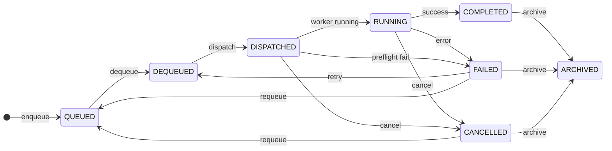

# Phase 10K-a — Operations Control Design Report

Generated: 2026-05-30  
Status: **Design only** (no implementation)  
Prerequisite: Phase 10J Provider Operations — **closed** (validation 23/23)  
Successor: Phase 10K-b — Operations Control implementation

---

## 1. Executive Summary

Phase 10K adds an **Operations Control** layer on top of the existing Execution Center stack. Operators gain gated, auditable control over execution sessions through four actions:

| Action | Primary intent |
|--------|----------------|
| **Retry** | Prepare a terminal session for another execution attempt (same session ID, preserved history) |
| **Cancel** | Stop an in-flight runtime job cooperatively |
| **Archive** | Soft-hide terminal sessions from default views (no data deletion) |
| **Requeue** | Return a terminal session to the execution queue for re-processing |

This design **does not** modify `VideoProviderRouter`, `providers/*`, `BrowserManager`, orchestrators, `full_video_pipeline.py`, or `ui/app.py`. All mutations flow through existing stores and services (`ExecutionSessionStore`, `ExecutionQueueEngine`, `RuntimeWorkerEngine`, `RuntimeJobRegistry`) plus a thin new **Operations Control** coordinator.

**Critical safety principle:** No action button triggers real provider execution automatically. Retry and Requeue only change session/queue state. Dispatch remains a separate explicit operator action via existing `POST /runtime/dispatch`.

---

## 2. Current Architecture Summary

### 2.1 API layer (`ui/api/` — v0.5.0)

| Route | Service | Purpose |
|-------|---------|---------|
| `GET /sessions`, `/sessions/{id}`, `/sessions/summary` | `SessionService` | Read-only session list/detail/overview |
| `POST /sessions/{id}/queue/enqueue`, `/queue/cancel` | `QueueService` | Queue lifecycle (10H) |
| `GET /queue/peek`, `/queue/status`, `POST /queue/dequeue` | `QueueService` | Queue inspection |
| `POST /sessions/{id}/runtime/dispatch` | `RuntimeService` | Sync dry-run (200) or async worker (202) |
| `GET /sessions/{id}/runtime/status` | `RuntimeService` | Enriched runtime poll payload |

`SessionService` is intentionally thin: loads from `ExecutionSessionStore`, extracts panels, builds timeline. No write paths except via queue/runtime services.

### 2.2 Frontend (`ui/web/src/`)

| Component | Role |
|-----------|------|
| `ExecutionCenterPage.tsx` | Dashboard, filters, runtime poll map, drawer host |
| `SessionTable.tsx` | Session list with runtime phase chip |
| `SessionDrawer.tsx` | Detail panels: overview, timeline, simulation, raw JSON |
| `RuntimeObservability.tsx` | Live job/heartbeat/telemetry (10J-f) |
| `client.ts` | GET session APIs + `dispatchRuntime` / `fetchRuntimeStatus` |

**Gap:** No operator action buttons, no POST helpers for control actions, no confirmation flows, no toast feedback, no dedicated action history panel (timeline merges queue + provider audit only).

### 2.3 Storage (`content_brain/execution/`)

```
storage/content_brain/execution/
  sessions/{execution_session_id}.json     # canonical session document
  queue/active_index.json
  queue/audit.jsonl                        # global queue audit
  runtime/active_jobs.json
  runtime/jobs/{dispatch_id}.json
  runtime/audit.jsonl                      # global provider audit
  runtime/locks/*.lock
```

**Session document fields relevant to 10K:**

| Field | Source | Notes |
|-------|--------|-------|
| `state` | 10A–10J lifecycle | Top-level status (QUEUED, DEQUEUED, DISPATCHED, RUNNING, COMPLETED, FAILED, CANCELLED, …) |
| `state_history[]` | Queue + runtime engines | `{ at, state, reason }` transitions |
| `queue_item`, `queue_audit_log[]` | `ExecutionQueueEngine` | Queue cancel already implemented |
| `execution_runtime`, `provider_audit_log[]` | `ProviderRuntimeEngine` / worker | Dispatch/run/complete/fail events |
| `operations` block | 10J worker | Preflight, worker phase, cost telemetry, validation |
| `timeline_events[]`, `execution_log[]` | Various | Optional manual entries |

**Existing cancel overlap:** `POST /sessions/{id}/queue/cancel` cancels **QUEUED** items only. It does **not** cancel DISPATCHED/RUNNING runtime jobs. Operations Control **Cancel** is a distinct runtime-level action.

### 2.4 Phase 10J closed capabilities (baseline)

- Preflight → worker → provider dispatch → artifact validation → COMPLETED/FAILED
- Async 202 dispatch with job registry + heartbeat stale detection
- UI polls `GET /runtime/status` every 5s for DISPATCHED/RUNNING
- No worker cancel hook, no archive flag, no operator retry/requeue API

---

## 3. Proposed Action Model

### 3.1 Session state groups

```
PRE_QUEUE     = { SIMULATED, PLANNED, GOVERNED, AWAITING_APPROVAL, NOT_READY, BUDGET_BLOCKED, … }
QUEUE_ACTIVE  = { QUEUED }
QUEUE_READY   = { DEQUEUED, READY, READY_WITH_WARNINGS, APPROVED_FOR_EXECUTION }
RUNTIME_ACTIVE = { DISPATCHED, RUNNING, EXECUTING }
TERMINAL      = { COMPLETED, FAILED, CANCELLED, EXPIRED }
ARCHIVED      = { archived flag true OR state ARCHIVED }   # new overlay
```

### 3.2 Action eligibility matrix

| Session `state` | Retry | Cancel | Archive | Requeue |
|-----------------|-------|--------|---------|---------|
| QUEUED | ❌ | ⚠️ use queue cancel | ❌ | ❌ |
| DEQUEUED | ❌ | ❌ | ❌ | ❌ |
| DISPATCHED | ❌ | ✅ | ❌ | ❌ |
| RUNNING / EXECUTING | ❌ | ✅ | ❌ | ❌ |
| FAILED | ✅ | ❌ | ✅ | ✅ |
| COMPLETED | ⚠️ future duplicate-run | ❌ | ✅ | ❌ |
| CANCELLED | ❌ | ❌ | ✅ | ✅ |
| EXPIRED | ❌ | ❌ | ✅ | ⚠️ optional later |
| ARCHIVED (flag) | ❌ | ❌ | ❌ (already) | ❌ |
| Active job in registry | ❌ all except Cancel | ✅ | ❌ | ❌ |

**Additional gates (all actions):**

| Gate | Rule |
|------|------|
| Session exists | 404 if missing |
| Not archived | Block mutating actions except unarchive (future) |
| File mutex | Acquire `session_store.file_mutex(session_id)` before read-modify-write |
| Active job guard | `RuntimeJobRegistry.get_active_for_session()` blocks Retry/Requeue/Archive |
| Idempotency | Same action within 5s with same payload → return prior result (optional 10K-b) |

### 3.3 Action semantics (detailed)

#### Retry

**Purpose:** Reset a **FAILED** session so an operator can dispatch again manually.

**Allowed:** `state == FAILED`, no active job, not archived.

**Blocked:** RUNNING, DISPATCHED, COMPLETED (phase 10K-b), QUEUED, ARCHIVED.

**Behavior (10K-b):**

1. Append `state_history` entry: `FAILED → RETRY_PREPARED` (internal) → `DEQUEUED`
2. Set `session.state = DEQUEUED`
3. Preserve `execution_runtime` history under `execution_runtime.attempts[]` (append snapshot of failed attempt)
4. Clear active failure markers on runtime block but **do not delete** artifacts, audit logs, or operations telemetry
5. Set `operations_control.retry_count += 1`, `last_retry_at`, `last_retry_reason`
6. **Do not** call `RuntimeWorkerEngine.submit()` or `ProviderRuntimeEngine.dispatch()`

**Future (10K-c+):** COMPLETED retry as **duplicate run** → creates new `dispatch_id`, optionally forks session UUID; requires explicit `mode: "duplicate_run"` flag.

#### Cancel

**Purpose:** Request cooperative stop of an in-flight runtime job.

**Allowed:** `state in {DISPATCHED, RUNNING, EXECUTING}` OR active job in registry (including PREFLIGHT_RUNNING).

**Blocked:** COMPLETED, FAILED, CANCELLED, QUEUED (use queue cancel), ARCHIVED.

**Behavior (10K-b design; full worker hook in 10K-d):**

1. Set `operations_control.cancel_requested = true`, `cancel_requested_at`, `cancel_reason`
2. Signal worker via shared session flag (worker checks between phases)
3. On acknowledgment: `state → CANCELLED`, runtime `state → CANCELLED`, job registry entry → terminal
4. Finalize cost telemetry with `outcome: CANCELLED`
5. If worker unresponsive (stale + cancel requested > 120s): mark `CANCELLED` with `cancel_mode: "forced_registry_cleanup"` — **does not kill browser thread** (document as known limit)

**Rollback expectation:** If cancel fails mid-write, mutex release + session reload; no partial delete. Operator may retry cancel.

#### Archive

**Purpose:** Soft-hide terminal sessions from default Execution Center list.

**Allowed:** `state in {COMPLETED, FAILED, CANCELLED, EXPIRED}`, no active job.

**Blocked:** RUNTIME_ACTIVE, QUEUED, DEQUEUED, ARCHIVED.

**Behavior:**

1. Set `operations_control.archived = true`, `archived_at`, `archived_by`, `archive_reason`
2. Optionally set `state = ARCHIVED` **or** keep original terminal state + archived flag (recommended: **keep terminal state**, use flag for filtering — avoids breaking status-based analytics)
3. Remove from `active_jobs.json` if stale orphan entry exists
4. **Never** delete session JSON, artifacts, audit logs, or job snapshots

**Rollback:** `unarchive` action (future 10K-e) clears flag only.

#### Requeue

**Purpose:** Return FAILED/CANCELLED session to execution queue preserving full history.

**Allowed:** `state in {FAILED, CANCELLED}`, not archived, no active job, readiness re-validated.

**Blocked:** RUNNING, DISPATCHED, COMPLETED, QUEUED (already queued), ARCHIVED.

**Behavior:**

1. Validate readiness via existing `ExecutionReadinessGate` rules (or delegate to `ExecutionQueueEngine` eligibility)
2. Call `ExecutionQueueEngine.enqueue_by_id()` — reuse 10H path
3. Append `operations_control.requeue_count += 1`, preserve prior `execution_runtime` and audit logs
4. Append `state_history`: `{previous} → QUEUED (requeue)`
5. **Do not** auto-dequeue or auto-dispatch

**Difference from Retry:**

| | Retry | Requeue |
|---|-------|---------|
| Target state | DEQUEUED (ready for dispatch) | QUEUED (waits in queue) |
| Uses queue engine | No | Yes |
| Typical use | Re-run same session immediately after fix | Return to pipeline scheduling |

---

## 4. State Transition Rules



**Invariants:**

1. Terminal states never transition to RUNNING without explicit dispatch
2. Archive is orthogonal (flag overlay); does not erase history
3. Queue cancel (10H) and runtime cancel (10K) are separate code paths
4. Every transition writes audit + `state_history` entry

---

## 5. API Design (proposed — not implemented)

**API version bump:** `0.6.0` (10K-b)

**New service:** `OperationsControlService`  
**New engine:** `OperationsControlEngine` (coordinates store, queue, worker registry)

**Shared response schema:** `OperationsActionResponse`

```python
class OperationsActionResponse(BaseModel):
    success: bool
    action: str                          # retry | cancel | archive | requeue
    session_id: str
    previous_state: str | None
    next_state: str | None
    event_id: str | None                 # audit event_id
    reject_code: str | None
    reject_reasons: list[str]
    warnings: list[str]                  # e.g. legacy session missing operations block
    session: dict | None                 # optional updated session summary
    api_version: str = "0.6.0"
```

**Shared request base:**

```python
class OperationsActionRequest(BaseModel):
    reason: str = ""                     # required for cancel/archive/requeue (min 3 chars)
    actor: str = "operator"              # overridden by API auth later
    confirm: bool = False                # must true for cancel/archive
    dry_run: bool = False                # eligibility check only, no mutation
```

---

### 5.1 POST `/sessions/{session_id}/actions/retry`

| Field | Value |
|-------|-------|
| **Input** | `{ "reason": "optional note", "actor": "operator" }` |
| **Output** | `OperationsActionResponse` |
| **Allowed states** | `FAILED` |
| **Blocked states** | RUNNING, DISPATCHED, COMPLETED*, QUEUED, ARCHIVED, active job |
| **HTTP success** | 200 |
| **HTTP errors** | 404 NOT_FOUND, 409 ACTION_NOT_ALLOWED, 409 JOB_ALREADY_ACTIVE |
| **Audit event** | `OPERATOR_RETRY` |
| **Rollback** | None auto; operator may dispatch or re-fail |

\* COMPLETED retry deferred to 10K-c with `mode: "duplicate_run"`.

**Error codes:**

| Code | Meaning |
|------|---------|
| `ACTION_NOT_ALLOWED` | State not in retry allowlist |
| `JOB_ALREADY_ACTIVE` | Registry has active job for session |
| `SESSION_ARCHIVED` | Archived sessions are read-only |
| `OPERATIONS_METADATA_MISSING` | Warning only — proceed if state matches |

---

### 5.2 POST `/sessions/{session_id}/actions/cancel`

| Field | Value |
|-------|-------|
| **Input** | `{ "reason": "required", "confirm": true, "actor": "operator" }` |
| **Output** | `OperationsActionResponse` with `cancel_requested: true` in metadata |
| **Allowed states** | DISPATCHED, RUNNING, EXECUTING (+ active job) |
| **Blocked states** | COMPLETED, FAILED, CANCELLED, QUEUED, ARCHIVED |
| **HTTP success** | 202 Accepted (async cooperative cancel) or 200 if already terminal-cancelled |
| **HTTP errors** | 404, 409 ACTION_NOT_ALLOWED, 409 CANCEL_ALREADY_REQUESTED |
| **Audit event** | `OPERATOR_CANCEL_REQUESTED`, then `OPERATOR_CANCELLED` on finalize |
| **Rollback** | If worker never ack: registry cleanup after stale timeout; session marked CANCELLED with warning |

**Error codes:**

| Code | Meaning |
|------|---------|
| `ACTION_NOT_ALLOWED` | Not in-flight |
| `CONFIRMATION_REQUIRED` | `confirm != true` |
| `REASON_REQUIRED` | Empty reason |
| `CANCEL_ALREADY_REQUESTED` | Idempotent re-post |
| `QUEUE_CANCEL_REQUIRED` | Session is QUEUED — use `/queue/cancel` |

---

### 5.3 POST `/sessions/{session_id}/actions/archive`

| Field | Value |
|-------|-------|
| **Input** | `{ "reason": "required", "confirm": true, "actor": "operator" }` |
| **Output** | `OperationsActionResponse` |
| **Allowed states** | COMPLETED, FAILED, CANCELLED, EXPIRED |
| **Blocked states** | RUNTIME_ACTIVE, QUEUED, DEQUEUED, already archived |
| **HTTP success** | 200 |
| **HTTP errors** | 404, 409 ACTION_NOT_ALLOWED, 409 ACTIVE_JOB_BLOCKS_ARCHIVE |
| **Audit event** | `OPERATOR_ARCHIVED` |
| **Rollback** | Unarchive (future) clears flag; no data loss |

**Error codes:**

| Code | Meaning |
|------|---------|
| `ACTION_NOT_ALLOWED` | Non-terminal state |
| `CONFIRMATION_REQUIRED` | Missing confirm |
| `REASON_REQUIRED` | Missing reason |
| `ALREADY_ARCHIVED` | Idempotent success |
| `ACTIVE_JOB_BLOCKS_ARCHIVE` | Registry conflict |

---

### 5.4 POST `/sessions/{session_id}/actions/requeue`

| Field | Value |
|-------|-------|
| **Input** | `{ "reason": "required", "actor": "operator", "confirm": true }` |
| **Output** | `OperationsActionResponse` + `queue_item` |
| **Allowed states** | FAILED, CANCELLED |
| **Blocked states** | RUNTIME_ACTIVE, COMPLETED, QUEUED, ARCHIVED, readiness fail |
| **HTTP success** | 200 |
| **HTTP errors** | 404, 409 ACTION_NOT_ALLOWED, 409 READINESS_NOT_READY, 409 BUDGET_BLOCKED |
| **Audit event** | `OPERATOR_REQUEUED` |
| **Rollback** | Delegate to queue engine; if enqueue fails, state unchanged |

**Error codes:**

| Code | Meaning |
|------|---------|
| `ACTION_NOT_ALLOWED` | State not FAILED/CANCELLED |
| `READINESS_NOT_READY` | Readiness gate failed |
| `BUDGET_BLOCKED` | Budget gate failed |
| `ALREADY_QUEUED` | Queue item active |

---

### 5.5 Supporting read endpoints (10K-b)

| Route | Purpose |
|-------|---------|
| `GET /sessions/{id}/actions/eligibility` | Returns `{ retry, cancel, archive, requeue }` each with `{ allowed, blocked_reasons[] }` |
| `GET /sessions/{id}/actions/history` | Returns `operations_audit_log[]` merged view |

---

## 6. UI Design

### 6.1 Placement

| Location | Content |
|----------|---------|
| **Session Drawer** — new tab **"Actions"** | Primary action panel + history |
| **Session Drawer** — header action bar | Compact buttons (icon + label) with disabled tooltips |
| **Session Table** — row overflow menu** | Optional secondary entry (10K-c) |
| **Execution Center** — bulk actions | Out of scope for 10K-b |

### 6.2 Action buttons

| Button | Style | Enabled when | Confirmation |
|--------|-------|--------------|--------------|
| Retry | Primary outline | eligibility.retry.allowed | Simple confirm: "Prepare session for re-dispatch?" |
| Cancel | **Danger** red | eligibility.cancel.allowed | Modal + **reason required** + checkbox confirm |
| Archive | Neutral | eligibility.archive.allowed | Modal + reason + confirm |
| Requeue | Primary | eligibility.requeue.allowed | Modal + reason + confirm |

**Disabled states:** Greyed button + tooltip with `blocked_reasons[0]`. Poll eligibility on drawer open and after each action.

**Loading:** Disable all action buttons while mutation in flight; show spinner on clicked button.

### 6.3 Confirmation dialog spec

```
┌─────────────────────────────────────────────┐
│  Cancel runtime job?                   [×]  │
│─────────────────────────────────────────────│
│  Session: exec_10j_ops_worker_completed     │
│  State: RUNNING · Phase: RUNNING            │
│                                             │
│  Reason (required):                         │
│  ┌─────────────────────────────────────┐   │
│  │ Operator stopped run — budget cap    │   │
│  └─────────────────────────────────────┘   │
│                                             │
│  ☐ I understand this requests cooperative  │
│    cancel; browser jobs may take time.      │
│                                             │
│         [ Cancel ]  [ Confirm Cancel ]      │
└─────────────────────────────────────────────┘
```

- **Cancel / Archive / Requeue:** reason min 3 chars, confirm checkbox required
- **Retry:** lighter dialog (reason optional in 10K-b)

### 6.4 Toast notifications

| Outcome | Toast |
|---------|-------|
| Success | Green: "Session archived" / "Cancel requested" |
| 409 blocked | Amber: show `reject_code` + first reason |
| Network error | Red: retry hint |

Implement `ToastProvider` + `useToast()` in `ui/web/src/` (10K-c). No external dependency required.

### 6.5 Action history panel

New section in Actions tab:

| Column | Source |
|--------|--------|
| Timestamp | `event.at` |
| Action | `event.action` |
| Actor | `event.actor` |
| State change | `previous_state → next_state` |
| Reason | `event.reason` |
| Event ID | `event.event_id` (mono, copy) |

Merge with existing timeline tab later; Actions tab shows **operations_audit_log** only for operator clarity.

### 6.6 Stale UI mitigation

After any successful action:

1. Re-fetch `GET /sessions/{id}`
2. Re-fetch `GET /sessions/{id}/actions/eligibility`
3. If was RUNNING/DISPATCHED, stop runtime poll when state terminal
4. Refresh session list (`load()` on ExecutionCenterPage)

### 6.7 Legacy sessions (`exec_test_001`)

- Eligibility derived from `state` even if `execution_runtime.operations` missing
- UI shows warning chip: "Legacy session — limited operations metadata"
- Cancel may be blocked if no active job and state is stale COMPLETED/FAILED

---

## 7. Audit Trail Design

### 7.1 Event schema

Stored in session `operations_audit_log[]` and appended to global `runtime/operations_audit.jsonl`.

```json
{
  "event_id": "ops_evt_20260530_143022_a1b2c3",
  "session_id": "exec_10j_ops_preflight_fail",
  "action": "archive",
  "actor": "operator",
  "timestamp": "2026-05-30 14:30:22",
  "previous_state": "FAILED",
  "next_state": "FAILED",
  "reason": "Demo session cleanup",
  "metadata": {
    "api_version": "0.6.0",
    "dispatch_id": "disp_abc123",
    "job_phase": "FAILED",
    "confirm": true,
    "dry_run": false,
    "reject_code": null,
    "warnings": [],
    "archive_flag": true,
    "cancel_requested": false,
    "retry_count": 0,
    "requeue_count": 0,
    "source": "operations_control_engine"
  }
}
```

### 7.2 ID generation

Reuse pattern from `generate_audit_event_id()` in `provider_runtime_engine.py` with prefix `ops_evt_`.

### 7.3 Timeline integration

Extend `ExecutionSessionStore.build_timeline_events()` to include `operations_audit_log` entries as `event_type: "OPERATIONS"`. No change to existing queue/provider entries.

### 7.4 Session document extensions

```json
{
  "operations_control": {
    "schema_version": "10k_v1",
    "archived": false,
    "archived_at": null,
    "archived_by": null,
    "archive_reason": null,
    "cancel_requested": false,
    "cancel_requested_at": null,
    "cancel_reason": null,
    "cancelled_at": null,
    "retry_count": 0,
    "last_retry_at": null,
    "requeue_count": 0,
    "last_requeue_at": null
  },
  "operations_audit_log": []
}
```

---

## 8. Backend Module Design (10K-b)

### 8.1 New modules

| Module | Responsibility |
|--------|----------------|
| `content_brain/execution/operations_action_policy.py` | Pure eligibility rules per action/state |
| `content_brain/execution/operations_control_engine.py` | Mutations, audit, coordinates queue + registry |
| `ui/api/services/operations_control_service.py` | Thin API adapter |
| `ui/api/schemas/operations.py` | Pydantic request/response models |

### 8.2 Engine coordination (no provider calls)

```
OperationsControlEngine
  ├── ExecutionSessionStore      (load/save/mutex/audit append)
  ├── ExecutionQueueEngine       (requeue → enqueue_by_id)
  ├── RuntimeJobRegistry         (active job checks, cancel cleanup)
  └── RuntimeWorkerEngine        (cancel flag read — 10K-d hook only)
```

**Explicit non-calls:** `ProviderRuntimeEngine.dispatch()`, `VideoProviderRouter`, orchestrators.

### 8.3 Store extensions

| Method | Purpose |
|--------|---------|
| `append_global_operations_audit(event)` | Mirror queue/provider global audit pattern |
| `operations_audit_path` | `runtime/operations_audit.jsonl` |

---

## 9. Risk Analysis

| ID | Risk | Severity | Mitigation |
|----|------|----------|------------|
| R1 | Accidental retry on wrong session | Medium | Confirmation dialog; no auto-dispatch; audit trail |
| R2 | Duplicate provider cost on retry + manual dispatch | **High** | Retry never calls dispatch; operator must explicitly dispatch; show cost telemetry in confirm |
| R3 | Cancelling completed jobs | Medium | Strict state gate; eligibility endpoint; UI disabled state |
| R4 | Archiving active jobs | **High** | Block when registry active; double-check mutex + job phase |
| R5 | Requeue loop (fail → requeue → dequeue → fail → requeue) | Medium | Optional `requeue_count` cap (default 5) with `REQUEUE_LIMIT_EXCEEDED`; surface in UI |
| R6 | Stale UI after action | Medium | Mandatory refetch + list refresh; stop poll on terminal |
| R7 | Legacy sessions without operations metadata | Low | Warn but allow state-based eligibility; document limits |
| R8 | Cancel cannot kill blocked browser thread | **High** | Document known 10J limit; cooperative cancel + stale forced registry cleanup; danger copy in UI |
| R9 | Race: poll + action concurrent save | Medium | Reuse `file_mutex`; worker already uses locks |
| R10 | Confusion with queue cancel | Medium | Distinct routes, labels, error `QUEUE_CANCEL_REQUIRED` |
| R11 | Archive hides session but artifacts remain | Low | By design; document retention policy |
| R12 | Reason injection / audit tampering | Low | Sanitize reason length (500 chars); server-side actor default |

---

## 10. Implementation Plan — Phase 10K-b

Recommended incremental slices:

| Slice | Scope | Exit gate |
|-------|-------|-----------|
| **10K-b** | `operations_action_policy.py`, `operations_control_engine.py` (retry, archive, requeue); audit schema; store extensions; API routes + schemas; eligibility GET | Unit tests + API tests; no UI |
| **10K-c** | UI Actions tab, buttons, confirm modals, toasts, client.ts POST helpers | Manual smoke on demo sessions |
| **10K-d** | Worker cooperative cancel hook + cancel finalize path | Cancel RUNNING dry-run worker test |
| **10K-e** | Unarchive, list filter `?include_archived=`, overview archived count | Filter UX complete |
| **10K-f** | Validation matrix + seeds + handoff report | Automated green |

**10K-b task list:**

1. Add `operations_action_policy.py` with pure `evaluate_eligibility(session, registry)`
2. Add `operations_control_engine.py` with `retry()`, `archive()`, `requeue()` (+ cancel stub → 10K-d)
3. Extend `session_store.py`: `operations_audit_path`, `append_global_operations_audit`, timeline merge
4. Add `operations_control_service.py` + `schemas/operations.py`
5. Wire routes in `ui/api/main.py`; bump version `0.6.0`
6. Add `project_brain/validate_10k_matrix.py` skeleton
7. Add `seed_operations_control_demo_sessions.py` (failed, cancelled, archived candidates)

---

## 11. Files to Change Later (not in 10K-a)

### Backend — new

| File |
|------|
| `content_brain/execution/operations_action_policy.py` |
| `content_brain/execution/operations_control_engine.py` |
| `content_brain/execution/seed_operations_control_demo_sessions.py` |
| `ui/api/services/operations_control_service.py` |
| `ui/api/schemas/operations.py` |
| `project_brain/validate_10k_matrix.py` |

### Backend — modify

| File | Change |
|------|--------|
| `content_brain/execution/session_store.py` | Operations audit path, timeline merge, optional archived filter in summaries |
| `content_brain/execution/__init__.py` | Lazy exports |
| `content_brain/execution/runtime_worker_engine.py` | Cancel flag check (10K-d) |
| `ui/api/main.py` | Action routes, dependency injection |
| `ui/api/dependencies.py` | `get_operations_control_service` |

### Frontend — new

| File |
|------|
| `ui/web/src/components/SessionActionsPanel.tsx` |
| `ui/web/src/components/ConfirmActionDialog.tsx` |
| `ui/web/src/components/ToastProvider.tsx` |
| `ui/web/src/hooks/useSessionActions.ts` |
| `ui/web/src/hooks/useSessionActionEligibility.ts` |

### Frontend — modify

| File | Change |
|------|--------|
| `ui/web/src/api/client.ts` | Action POST/GET types + fetchers |
| `ui/web/src/components/SessionDrawer.tsx` | Actions tab + header buttons |
| `ui/web/src/pages/ExecutionCenterPage.tsx` | Refresh after action, archived filter (10K-e) |
| `ui/web/src/components/SessionTable.tsx` | Archived badge, row menu (optional) |
| `ui/web/src/App.css` | Danger buttons, toast, action panel |

### Documentation

| File |
|------|
| `project_brain/PHASE_10K-b_IMPLEMENTATION_REPORT.md` |
| `project_brain/PHASE_10K_IMPLEMENTATION_REPORT.md` (final, after 10K-f) |
| `project_brain/current_state.md`, `CHAT_HANDOFF.md` |

### Explicitly unchanged

| File |
|------|
| `core/video_provider_router.py` |
| `providers/*` |
| `automation/browser_manager.py` |
| Runway/Hailuo orchestrators |
| `pipelines/full_video_pipeline.py` |
| `ui/app.py` |

---

## 12. Design Decisions Log

| Decision | Rationale |
|----------|-----------|
| Retry does not auto-dispatch | Prevents accidental provider cost; aligns with safety rules |
| Archive uses flag overlay | Preserves terminal state for analytics; simpler rollback |
| Separate from queue cancel | 10H cancel is QUEUED-only; runtime cancel is different semantics |
| Cancel returns 202 | Cooperative cancel is async; matches dispatch pattern |
| New `operations_audit_log` | Avoid overloading `provider_audit_log` with operator events |
| Eligibility GET endpoint | Enables UI disabled states without duplicating rules in frontend |
| API 0.6.0 bump | Signals new operator control surface |

---

## 13. Exit Gate (10K-a)

| Criterion | Status |
|-----------|--------|
| Action model defined | ✅ |
| API design per endpoint | ✅ |
| UI design documented | ✅ |
| Audit schema defined | ✅ |
| Risk analysis complete | ✅ |
| 10K-b implementation plan | ✅ |
| No code changes | ✅ |

**Phase 10K-a is complete. Ready for 10K-b implementation approval.**
