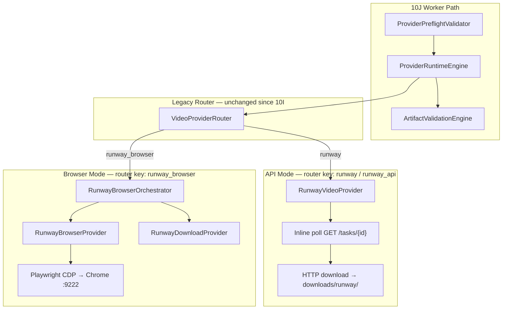

# Phase 11E — Runway Hardening Design / Audit

**Status:** Design / audit only — no implementation  
**Date:** 2026-05-28  
**Prerequisites:** Phase 11A–11D complete · Phase 10J Provider Operations closed  
**Scope:** Analyze existing Runway paths and design hardening before any code changes

---

## Executive Summary

Runway is the **primary video provider family** in ModirAgentOS with two runtime router keys (`runway` API, `runway_browser`) plus an internal download helper (`RunwayDownloadProvider`). The **active default** is browser mode (`config/active_providers.json` → `runway_browser`), while Phase 11C failover policies and 11D selection default to **API-first** (`runway` → `runway_browser` → cross-vendor). Metadata layers (11A–11D) describe capabilities and costs that **exceed what runtime actually implements** — most notably `image_to_video`, async job persistence, and structured failure mapping.

Hardening should proceed as **thin wrappers and orchestrator improvements** around existing providers, preserving `VideoProviderRouter` dispatch signatures and `ProviderRuntimeEngine` flow. The highest-risk gaps are **credit waste from duplicate generation**, **browser thread blocking on error**, **missing cancel checkpoints during long polls/waits**, and **generic `PROVIDER_RUNTIME_ERROR` masking** of recoverable failures.

---

## 1. Current Runway Paths

### 1.1 Architecture (as-built)



**Download mode** is **not a router path**. `RunwayDownloadProvider` is invoked internally by `RunwayBrowserOrchestrator` after detecting a generated video URL in the DOM. API mode performs its own download inside `RunwayVideoProvider.download_video()`.

### 1.2 API Mode (`runway` / `runway_api`)

| Aspect | Current behavior |
|--------|------------------|
| **Entry** | `VideoProviderRouter.generate_clips()` → `RunwayVideoProvider` when `provider_name in ["runway", "runway_api"]` |
| **Credentials** | `RUNWAY_API_KEY` from `.env` (required at init; raises if missing) |
| **Endpoint** | `https://api.dev.runwayml.com/v1/text_to_video` (hardcoded base; overridable via env only for version header, not base URL in provider) |
| **Model defaults** | `RUNWAY_VIDEO_MODEL=gen4.5`, ratio `1280:720`, duration `5` seconds |
| **Capability** | **Text-to-video only** — POST to `/text_to_video` |
| **Async model** | POST creates task → poll `GET /tasks/{task_id}` every 10s, max 60 attempts (~10 min) |
| **Output** | First URL in `output[]` → stream download to `downloads/runway/runway_clip_{ts}_{index}.mp4` |
| **Multi-clip** | Sequential loop; no parallelism; no shared session state |
| **Registry** | `config/provider_registry.json`: `runway` entry, `mode: api`, **`enabled: false`** |
| **Stubs** | `retry_generation()` and `timeout_wrapper()` are no-op/pass-through stubs |

**Preflight (10J-b):** API mode checks `RUNWAY_API_KEY`, endpoint from `provider_mode_catalog` (`RUNWAY_API_BASE_URL` or default), connectivity probe to base URL, `polling_supported: true`.

### 1.3 Browser Mode (`runway_browser`)

| Aspect | Current behavior |
|--------|------------------|
| **Entry** | `VideoProviderRouter` → `RunwayBrowserOrchestrator(wait_seconds=180)` |
| **Browser** | `RunwayBrowserProvider` → `BrowserManager.launch()` → CDP connect `http://127.0.0.1:9222` (hardcoded in `browser_manager.py`, not read from catalog at runtime) |
| **UI flow** | Open Runway dashboard → Generate Video → Gen-4.5 tab → Try it → fill prompt → 16:9 + 10s duration → Generate |
| **Generation wait** | Poll DOM `<video>` sources + page text state; max **900s** per clip; 10s sleep interval |
| **URL detection** | Primary: new `video.currentSrc` not in `before_sources`; fallback: stable visible video after queue/generating clears |
| **Download** | `RunwayDownloadProvider.download_video_url()` — HTTP GET, min **100_000 bytes** or fail |
| **Multi-clip** | Reuses same browser page; captures `before_sources` per clip |
| **Registry** | `runway_browser`, `mode: browser`, **`enabled: true`** |
| **Active default** | `config/active_providers.json` → `"video": "runway_browser"` |

**Preflight (10J-b):** Browser probes CDP, profile path, download dir writability, concurrency limit from `OperationsPolicy`.

### 1.4 Download Mode (internal)

| Aspect | Current behavior |
|--------|------------------|
| **Class** | `RunwayDownloadProvider` — not registered in router, 11A, or failover |
| **Used by** | `RunwayBrowserOrchestrator` only (shares browser instance; `start()` on download provider is unused) |
| **Validation** | Min file size 100_000 bytes after download |
| **Output dir** | `downloads/runway/` |
| **Browser lifecycle** | `close()` disconnects Playwright; orchestrator **does not call `close()` on success**; on error calls `time.sleep(999999)` and leaves browser open |

### 1.5 Router Behavior

```python
# core/video_provider_router.py — simplified
provider_name = provider_override or active["video"]  # default hailuo_browser if unset
# Aliases: hailuo → hailuo_browser, runway_api → runway
# Runway branches: runway_browser → RunwayBrowserOrchestrator; runway/runway_api → RunwayVideoProvider
```

- Router is **prompt-list only** — no capability parameter, no image input, no mode resolution.
- `ProviderModeRouter` (10J) resolves family/mode **before** dispatch but ultimately calls the same `VideoProviderRouter.generate_clips(prompts, provider_override=router_key)`.
- `config/provider_mode_catalog.json` (minimal) sets `"runway": { "preferred_mode": "browser" }` — aligns with active provider, **conflicts with 11C API-first failover**.

### 1.6 Artifact Behavior (Phase 10J-e)

After router returns paths, `ProviderRuntimeEngine._execute_clips()`:

1. Copies existing files from `downloads/runway/` → session `artifact_root/clip_{NN}.mp4`
2. Builds artifact records with `provider`, `clip_number`, metadata
3. `ArtifactValidationEngine.validate()` before `COMPLETED`:
   - Extensions: `.mp4`, `.webm`, `.mov` (`.mock` for dry-run)
   - Min size: **100_000 bytes** (from operations policy snapshot)
   - Count must match clip target
   - Optional sha256 enrichment

**Gap:** API download path has **no pre-copy size check**; a small corrupt file could pass router but fail artifact validation (acceptable terminal FAILED, but wastes generation credits).

### 1.7 Failure Behavior

| Layer | Behavior |
|-------|----------|
| **Runway API** | Raises `RuntimeError` for HTTP errors, missing task ID, FAILED/CANCELLED status; `TimeoutError` after max poll attempts |
| **Runway Browser** | Raises on prompt fill / click failures; `RuntimeError` if no video URL; on any exception: print debug message, **`time.sleep(999999)`** — blocks worker indefinitely |
| **Runway Download** | Raises on HTTP failure or file &lt; 100KB |
| **ProviderRuntimeEngine** | Catches **all** exceptions → `PROVIDER_RUNTIME_ERROR` with raw message string |
| **Artifact validation** | Specific codes: `ARTIFACT_TOO_SMALL`, `ARTIFACT_PATH_MISSING`, etc. |
| **Preflight** | Structured codes: `CREDENTIALS_MISSING`, `BROWSER_UNAVAILABLE`, `API_CONNECTIVITY_FAILED`, etc. |
| **Cooperative cancel** | Checked in runtime **before** clips, **after** clips, **before/after** artifact build — **not** during API poll or browser wait loops |

**Cost telemetry:** Initialized/finalized by worker; copies session estimates only (`snapshot_estimates`). **No Runway-specific actual cost** recorded. `cost_basis` from mode catalog: `subscription` (browser) vs `usage_api` (API).

---

## 2. Gaps

### 2.1 Missing image-to-video support

| Layer | Declares I2V? | Implements I2V? |
|-------|---------------|-----------------|
| 11A capability registry | ✅ `runway`, `runway_browser` | N/A (metadata) |
| 11B cost catalog | ❌ no `image_to_video` entries | N/A |
| 11C failover policy | ✅ `video_image_to_video_default` | N/A (planning) |
| RunwayVideoProvider | ❌ | ❌ only `/text_to_video` |
| RunwayBrowserProvider | ❌ | ❌ Gen-4.5 text prompt flow only |
| VideoProviderRouter | ❌ | ❌ no image/reference input parameter |
| SessionPromptAdapter | ❌ | ❌ text prompts only |

**Impact:** Selection/failover can rank Runway for `image_to_video`, but runtime would execute text-to-video or fail preflight with no reference frame.

### 2.2 Async job handling gaps

- **11A** marks `runway` as `supports_async_jobs: true`; `runway_browser` as `false`.
- **Runtime:** API uses async tasks but **blocking inline poll** — no job ID persisted to session, no resume-after-crash, no webhook support (11A correctly marks `supports_webhooks: false`).
- **Browser:** Fully synchronous DOM wait; no job abstraction.
- **Worker heartbeat:** Cannot reflect per-clip progress during 900s browser wait or 600s API poll window.

### 2.3 Polling gaps

| Mode | Issue |
|------|-------|
| API | Fixed 10s interval; no exponential backoff; no cancel check; no distinction between `QUEUED` vs `RUNNING`; max 60 attempts hardcoded |
| Browser | 10s interval; text heuristics (`"in queue"`, `"generating"`) fragile to UI changes; `already_downloaded_urls` parameter passed but **never used** in wait loop |
| Both | No integration with worker stale detection during long waits |

### 2.4 Artifact download / validation gaps

- API download: no minimum size check at provider level (browser download has 100KB gate).
- Copy step: no size integrity check between source and `artifact_root` copy (`ARTIFACT_COPY_FAILED` exists in taxonomy but unused).
- Browser may return CDN URL that expires before download completes on slow networks.
- Partial multi-clip success: runtime fails entire session on any exception mid-loop; valid earlier clips copied but session ends `PROVIDER_RUNTIME_ERROR`, not artifact partial policy.

### 2.5 Credential / config gaps

| Config | Issue |
|--------|-------|
| `RUNWAY_API_KEY` | Required at provider init — fails late if missing (preflight catches earlier in 10J path) |
| Base URL | Provider hardcodes `api.dev.runwayml.com`; catalog documents `RUNWAY_API_BASE_URL` but **provider does not read it** |
| `RUNWAY_API_VERSION` | Supported via header env |
| Browser CDP | Hardcoded `127.0.0.1:9222` in `BrowserManager`, not `provider_mode_catalog.browser_config.cdp_url` |
| Profile path | Catalog lists `storage/real_chrome_profile` — not enforced by browser manager |
| API disabled in registry | `runway` `enabled: false` while failover prefers API |

### 2.6 Error taxonomy gaps

Runway providers raise generic `RuntimeError` / `TimeoutError`. Runtime maps everything to `PROVIDER_RUNTIME_ERROR`. Unused or misaligned taxonomy codes:

- `PROVIDER_TIMEOUT` — not emitted from Runway paths
- `PROVIDER_TASK_FAILED` — not mapped from Runway FAILED/CANCELLED status
- `API_QUOTA_EXCEEDED` — not mapped from 402/429 responses
- `BROWSER_SESSION_INVALID` — not detected on stale Runway login
- `REFERENCE_FRAME_PATH_MISSING` — relevant for future I2V, no preflight hook today

### 2.7 Retry / cancel limitations

- `retry_generation()` is empty stub in API provider.
- Runtime `retry.max_dispatch_attempts` defaults to **1** — no automatic re-dispatch.
- Cooperative cancel: **no checkpoint** inside `wait_for_task`, `generate_clips` loop, or `wait_for_generated_video_url`.
- Browser error handler infinite sleep prevents cancel acknowledgment and holds browser concurrency slot.
- No idempotency key — retry risks duplicate generation/charges.

### 2.8 Cost telemetry gaps

- Telemetry stores session snapshot estimates only; **11B `ProviderCostEstimator` not wired** to runtime finalize.
- No `actual_cost`, `billing_units`, or `provider_task_ids` fields.
- Browser mode marked `COST_MODEL_FREE` in 11B (subscription/opportunity cost) — telemetry uses `cost_basis: subscription` but no credit tracking.
- API placeholder $0.05/sec in 11B not reflected in telemetry unless session simulation populated it.

---

## 3. Compatibility with 11A–11D

### 3.1 Provider ID alignment

| ID | Router | 11A Registry | 11B Cost | 11C Failover | 11D Selection | Runtime (10J) |
|----|--------|--------------|----------|--------------|---------------|---------------|
| `runway` | ✅ | ✅ canonical API | ✅ | ✅ preferred | ✅ | ✅ alias `runway_api` → `runway` |
| `runway_api` | ✅ alias | → `runway` | → `runway` | → `runway` | → `runway` | ✅ learning_key only |
| `runway_browser` | ✅ | ✅ | ✅ | ✅ fallback | ✅ | ✅ |
| `runway_download` | ❌ internal | ❌ | ❌ | ❌ | ❌ | ❌ (by design) |

**Verdict:** Runtime router IDs **match** 11A/11B/11C/11D for the two dispatchable keys. `runway_download` is correctly excluded from metadata layers.

### 3.2 Capability registry vs runtime

| Capability | 11A `runway` | 11A `runway_browser` | Runtime |
|------------|--------------|----------------------|---------|
| `text_to_video` | ✅ | ✅ | ✅ implemented |
| `image_to_video` | ✅ | ✅ | ❌ **not implemented** |
| `asset_download` | ✅ | ✅ | ✅ partial (download helpers) |

**Action required in 11E:** Either implement I2V or narrow 11A declarations until implemented (design recommends implement in 11E-e slice, not registry rollback).

### 3.3 Cost catalog vs provider IDs

- `runway` + `text_to_video`: `COST_MODEL_PER_SECOND`, $0.05/s, `CONFIDENCE_LOW` ✅
- `runway_browser` + `text_to_video`: `COST_MODEL_FREE`, `CONFIDENCE_MEDIUM` ✅
- **Missing:** `image_to_video` entries for both Runway IDs
- **Missing:** duration-aware estimation hook (provider uses 5s API / ~10s browser default)

### 3.4 Failover chain correctness

Default `text_to_video` policy:

```
runway → runway_browser → hailuo_browser → hailuo_api → minimax_api → luma → kling
```

IDs resolve correctly through `normalize_provider_id()`. **Semantic mismatch:** policy is API-first; active provider and mode catalog `preferred_mode` are **browser-first**.

11D selection with default balanced ranking for `text_to_video` returns `runway` (API) first when both are eligible — **consistent with 11C, inconsistent with runtime default**.

### 3.5 Selection engine ranking check

Validated in 11D (17/17 PASS):

- `select_best("text_to_video")` → `runway` (API)
- `mode_preference=browser` → all ranked candidates support browser mode
- `excluded_providers=("runway", "runway_browser")` → both blocked from active list
- Placeholder speed/quality profiles exist for both IDs

**Verdict:** 11D ranks Runway correctly against metadata. **Operational gap** is metadata preference vs runtime default, not ID bugs.

### 3.6 Phase 10J integration points

| 10J component | Runway integration | Hardening touchpoint |
|---------------|-------------------|----------------------|
| `ProviderPreflightValidator` | Mode-aware probes | 11E-a: Runway-specific preflight extensions |
| `ProviderModeCatalog` | Family `runway`, dual mode | 11E-a: config unification |
| `cost_telemetry` | Snapshot only | 11E-f: 11B bridge |
| `ArtifactValidationEngine` | Post-router | 11E-d: copy integrity |
| `failure_taxonomy` | Generic runtime catch | 11E-a: Runway error classifier |

---

## 4. Hardening Design

Design principle: **wrap, don't rewrite**. Add a thin `RunwayExecutionFacade` (or per-mode helpers) called from orchestrators/providers internally, keeping `VideoProviderRouter.generate_clips(prompts)` signature stable until an optional 11E-e router extension for I2V.

### 4.1 Safer preflight

**Goals:** Fail fast before credits spent; align config sources.

| Check | API mode | Browser mode |
|-------|----------|--------------|
| Credential present | ✅ exists | N/A (session login) |
| Endpoint from catalog | **Add:** provider reads `RUNWAY_API_BASE_URL` | — |
| API version header | **Add:** validate `RUNWAY_API_VERSION` format | — |
| Model/ratio/duration bounds | **Add:** validate env ints/chars | — |
| CDP reachable | — | ✅ exists; **wire catalog `cdp_url`** |
| Runway login session | — | **Add:** probe for authenticated dashboard (DOM/login redirect) |
| Download dir writable | partial | **Add:** explicit `downloads/runway` probe |
| Capability vs session | **Add:** if brief requires I2V, reject with `REFERENCE_FRAME_PATH_MISSING` or `CAPABILITY_UNSUPPORTED` | same |
| Cost estimation available | optional | optional |

**Output:** Extend preflight result with `runway_preflight` block (advisory metadata, no router change).

### 4.2 Clearer mode selection

**Problem:** Three sources disagree on preferred mode (active config, mode catalog, 11C failover).

**Design:**

1. **Single resolution order** (document, then implement in 11E-a):
   - Session explicit `execution_mode` override
   - Session `provider_selection.category_selections.video_generation`
   - 11D `SelectionResult.selected_provider` (when wired)
   - `ProviderModeCatalog.preferred_mode` (browser today)
   - Failover plan primary (API today in 11C)

2. **Do not change router** — mode resolution stays in `ProviderModeRouter`; harden by adding `ModeSelectionAudit` log entry to session operations block explaining which source won.

3. **11C policy alignment option:** Add `preferred_mode_hint: browser` to text_to_video policy notes, or change policy to browser-first — **decision deferred to operator**; document in 11E-a ADR.

### 4.3 API / browser fallback readiness

**Not executing failover in 11E** — prepare hooks:

| Hook | Purpose |
|------|---------|
| `RunwayAttemptContext` | Persist `attempted_providers[]`, `failure_codes[]`, `partial_clip_paths[]` on session |
| `FallbackTriggerEvaluator` | Read 11C plan + last failure code; recommend next provider (advisory) |
| `PartialArtifactPreserver` | On clip N failure, keep clips 1..N-1 with metadata (aligns with 11C `preserve_partial_artifacts`) |
| Normalized failure codes | Enable 11C/11D to reason about retry vs fallback |

**Fallback boundary:** Browser fallback after API should only trigger on retriable codes (`PROVIDER_TIMEOUT`, `API_QUOTA_EXCEEDED`, `API_CONNECTIVITY_FAILED`) — not on `ARTIFACT_TOO_SMALL` from bad download.

### 4.4 Artifact validation continuity

| Improvement | Description |
|-------------|-------------|
| Unified min-size gate | Shared constant (100_000) in download helper used by API + browser + validation engine |
| Pre-copy validation | Validate source file before `shutil.copy2` to artifact_root |
| Copy integrity | Compare sizes source vs dest; emit `ARTIFACT_COPY_FAILED` |
| Content sniff | Optional: check MP4 magic bytes (`ftyp`) before accept |
| Metadata enrichment | Add `source_provider_path`, `download_bytes`, `provider_task_id` (API), `source_url_host` (browser) |

### 4.5 Cost telemetry continuity

Extend `cost_telemetry` finalize (worker layer, not provider):

```json
{
  "estimated_cost": 0.25,
  "estimated_cost_source": "11b_provider_cost_estimator",
  "estimated_cost_confidence": "low",
  "billing_units": { "seconds": 5, "clips": 1 },
  "provider_task_ids": ["task_abc123"],
  "cost_basis": "usage_api",
  "actual_cost": null,
  "actual_cost_source": null
}
```

- Pull estimate from `ProviderCostEstimator.estimate(router_key, capability, quantity)` at worker start.
- Record API task IDs when available.
- **`actual_cost` remains null** until official billing API — never fabricate.

### 4.6 Cooperative cancel boundaries

Insert cancel checkpoints at:

| Location | Frequency |
|----------|-----------|
| API `wait_for_task` loop | Every poll iteration |
| API `generate_clips` between clips | Before each POST |
| Browser `wait_for_generated_video_url` | Every 10s sleep |
| Browser orchestrator between clips | Before fill_prompt |
| Download stream | Between chunks (optional, low priority) |

On cancel: stop cleanly, close browser session, return partial paths to runtime (existing `_mark_cooperative_cancelled` supports partial clips).

**Remove** `time.sleep(999999)` error trap — replace with structured error re-raise + optional screenshot path in failure details.

### 4.7 Failure taxonomy mapping

Proposed `RunwayErrorClassifier.classify(exception, context) → FailureCode`:

| Condition | Code |
|-----------|------|
| HTTP 401/403 | `CREDENTIALS_MISSING` |
| HTTP 402/429 | `API_QUOTA_EXCEEDED` |
| HTTP 5xx / connectivity | `API_CONNECTIVITY_FAILED` |
| Poll timeout | `PROVIDER_TIMEOUT` |
| Task FAILED/CANCELLED | `PROVIDER_TASK_FAILED` |
| Download &lt; min bytes | `ARTIFACT_TOO_SMALL` |
| No video URL (browser) | `PROVIDER_TASK_FAILED` |
| Prompt/UI element not found | `BROWSER_AUTOMATION_NOT_READY` |
| Login redirect detected | `BROWSER_SESSION_INVALID` |
| Default | `PROVIDER_RUNTIME_ERROR` |

Wire in **orchestrator/provider layer** so `ProviderRuntimeEngine` receives typed exceptions or error codes without modifying its dispatch structure.

---

## 5. Implementation Slices (Recommended Build Order)

### 11E-a — Preflight, Config Unification & Error Taxonomy

**Goal:** Fail fast with correct codes; single config source of truth.

| Task | Target files |
|------|--------------|
| Runway error classifier | **New:** `providers/runway_error_classifier.py` |
| Read base URL from catalog/env in API provider | `providers/runway_video_provider.py` |
| Wire CDP URL from catalog in browser manager | `automation/browser_manager.py` |
| Runway-specific preflight probes (login, download dir) | `content_brain/execution/provider_preflight_validator.py` or **New:** `content_brain/execution/runway_preflight_probes.py` |
| Mode selection audit logging | `content_brain/execution/provider_mode_router.py` |
| Document ADR for API-first vs browser-first | `project_brain/` |

**Exit gate:** Preflight rejects missing API key and stale browser session with correct taxonomy codes; unit tests for classifier.

---

### 11E-b — API Mode Hardening

**Goal:** Safer async polling, download validation, cancel support.

| Task | Target files |
|------|--------------|
| Cancel-aware poll loop | `providers/runway_video_provider.py` |
| Min-size check on API download | `providers/runway_video_provider.py` |
| Map HTTP/task errors via classifier | `providers/runway_video_provider.py` |
| Implement or remove `retry_generation` stub | `providers/runway_video_provider.py` |
| Persist task ID to session operations (via callback/context) | Orchestration wrapper or runtime hook design |
| Env validation for model/duration/ratio | `providers/runway_video_provider.py` |

**Exit gate:** API dry-run against mock server tests; cancel during poll returns within one interval; small download rejected before artifact copy.

---

### 11E-c — Browser Mode Hardening

**Goal:** Reliable automation, no thread deadlock, cancel support.

| Task | Target files |
|------|--------------|
| Remove infinite sleep on error | `orchestrators/runway_browser_orchestrator.py` |
| Cancel checkpoints in wait loop | `orchestrators/runway_browser_orchestrator.py` |
| Fix/remove dead `already_downloaded_urls` param | `orchestrators/runway_browser_orchestrator.py` |
| Session staleness detection (login wall) | `providers/runway_browser_provider.py` |
| Robust URL detection (data attrs, network idle) | `orchestrators/runway_browser_orchestrator.py` |
| Ensure browser cleanup on success/failure | `orchestrators/runway_browser_orchestrator.py` |
| Optional screenshot on failure | `providers/runway_browser_provider.py` |

**Exit gate:** Multi-clip browser run completes or fails within bounded time; cancel during wait exits cleanly; concurrency slot released.

---

### 11E-d — Download & Artifact Continuity

**Goal:** Unified download path and validation alignment.

| Task | Target files |
|------|--------------|
| Shared download helper (min size, streaming, headers) | **New:** `providers/runway_asset_downloader.py` |
| Refactor API + download provider to use helper | `runway_video_provider.py`, `runway_download_provider.py` |
| Pre-copy + copy integrity in runtime | `content_brain/execution/provider_runtime_engine.py` (minimal addition to `_execute_clips`) |
| Optional MP4 header sniff | `content_brain/execution/artifact_validation_engine.py` |

**Exit gate:** Same min-size behavior across API/browser; copy mismatch emits `ARTIFACT_COPY_FAILED`.

---

### 11E-e — Image-to-Video Capability Path

**Goal:** Close 11A/runtime gap for I2V.

| Task | Target files |
|------|--------------|
| API `image_to_video` endpoint support | `providers/runway_video_provider.py` |
| Browser I2V UI flow (First Video Frame upload) | `providers/runway_browser_provider.py` |
| Reference frame input from session/brief | `content_brain/execution/session_prompt_adapter.py` |
| Router capability dispatch (optional kwargs or separate method) | **Design decision:** extend router with backward-compatible optional `reference_images` param |
| 11B cost entries for I2V | `content_brain/providers/provider_cost_catalog.py` |
| 11E validation for I2V metadata | **New:** `project_brain/validate_11e_runway_hardening.py` |

**Exit gate:** I2V session with reference frame generates clip; registry/cost/failover consistent.

---

### 11E-f — Cost Telemetry & 11B Bridge

**Goal:** Telemetry reflects 11B estimates and provider task metadata.

| Task | Target files |
|------|--------------|
| Call `ProviderCostEstimator` at worker init | `content_brain/execution/runtime_worker_engine.py` |
| Record task IDs + billing units on finalize | `content_brain/execution/cost_telemetry.py` |
| Mode-aware quantity (duration × clips) | Worker + estimator integration |

**Exit gate:** Completed session JSON shows `estimated_cost_source: 11b_provider_cost_estimator`; 11B/11D regressions pass.

---

### 11E-g — Failover Readiness (Advisory Only)

**Goal:** Prepare 11C → runtime fallback without executing it.

| Task | Target files |
|------|--------------|
| `FallbackTriggerEvaluator` (reads 11C plan) | **New:** `content_brain/providers/fallback_trigger_evaluator.py` |
| Partial artifact preservation policy | `content_brain/execution/provider_runtime_engine.py` |
| Session operations `fallback_recommendation` block | Worker finalize path |
| Validation: advisory output only, no auto re-dispatch | **New:** validation cases in `validate_11e_runway_hardening.py` |

**Exit gate:** Failed API attempt produces advisory next-provider; no automatic router re-call.

---

## 6. Risks

| Risk | Severity | Mitigation |
|------|----------|------------|
| **Credit waste** | High | Preflight + cancel checkpoints; idempotency keys; min-size before accepting task complete |
| **Duplicate generation** | High | Retry only with explicit dispatch attempt; dedupe by session+clip index; avoid blind re-POST on timeout |
| **Stale browser session** | High | Login probe in preflight; `BROWSER_SESSION_INVALID` mapping; operator re-auth flow |
| **Failed download** | Medium | Min-size gate both paths; retry download once before failing task |
| **Partial artifacts** | Medium | Preserve valid clips; structured partial metadata; strict COMPLETED gate unchanged |
| **Provider API changes** | Medium | Version header env; endpoint from config; classifier for new HTTP codes |
| **Credential leakage** | High | Never log API key; redact URLs with tokens; audit print statements in providers |
| **UI selector drift** | High (browser) | Region-based clicks already used; add fallback selectors; failure screenshots |
| **Thread blocking** | High | Remove `sleep(999999)`; bounded waits; worker stale detection |
| **Metadata/runtime drift** | Medium | 11E-e closes I2V gap; document API-first vs browser-first ADR |

---

## 7. Files Likely to Change (Implementation Phase)

| File | Slices |
|------|--------|
| `providers/runway_video_provider.py` | 11E-a,b,e |
| `providers/runway_browser_provider.py` | 11E-c,e |
| `providers/runway_download_provider.py` | 11E-d |
| `orchestrators/runway_browser_orchestrator.py` | 11E-c |
| `automation/browser_manager.py` | 11E-a |
| `content_brain/execution/provider_preflight_validator.py` | 11E-a |
| `content_brain/execution/provider_runtime_engine.py` | 11E-d,g (minimal) |
| `content_brain/execution/artifact_validation_engine.py` | 11E-d |
| `content_brain/execution/cost_telemetry.py` | 11E-f |
| `content_brain/execution/runtime_worker_engine.py` | 11E-f |
| `content_brain/execution/session_prompt_adapter.py` | 11E-e |
| `content_brain/providers/provider_cost_catalog.py` | 11E-e |
| **New** `providers/runway_error_classifier.py` | 11E-a |
| **New** `providers/runway_asset_downloader.py` | 11E-d |
| **New** `project_brain/validate_11e_runway_hardening.py` | 11E-g |

**Optional later (11E-e):** `core/video_provider_router.py` — backward-compatible I2V parameter only if approved.

---

## 8. Files That Must Not Change (Initial Slices)

Per Phase 11 constraints and 10J/10K stability:

| File / system | Reason |
|---------------|--------|
| `ui/app.py`, Execution Center components | Explicit out-of-scope |
| `full_video_pipeline.py` | Legacy path; separate integration |
| `VideoProviderRouter` | **Frozen for 11E-a–d,f,g**; optional 11E-e extension only with ADR |
| `ProviderRuntimeEngine.dispatch()` structure | Wrap at provider layer; no dispatch rewrite |
| 11A–11D module behavior | Regressions must pass; extend metadata only in 11E-e |
| `content_brain/providers/provider_selection_engine.py` | No dispatch wiring in 11E |
| Hailuo / MiniMax providers | Out of scope |

---

## 9. Validation Plan (For Implementation Phase)

**New script:** `project_brain/validate_11e_runway_hardening.py`

| Category | Tests |
|----------|-------|
| Error taxonomy | Classifier maps fixture exceptions → expected codes |
| API provider | Mock HTTP: task lifecycle, timeout, small download rejected |
| Browser orchestrator | Wait loop respects max wait; no infinite sleep path |
| Cancel | Mock cancel flag during poll/wait → clean exit |
| Download helper | Min size, stream integrity |
| Artifact continuity | Copy mismatch → `ARTIFACT_COPY_FAILED` |
| Preflight | Missing key, CDP down, stale session probes |
| Cost telemetry | 11B estimate present in finalized block |
| Fallback advisory | 11E-g recommendation generated; **no router call** |
| Regression | 11A, 11B, 11C, 11D, 10K matrix still pass |

**Manual smoke (operator):**

1. Browser mode: 1-clip generation with live Chrome CDP
2. API mode: 1-clip with valid `RUNWAY_API_KEY`
3. Cancel mid-generation via Operations Console
4. Confirm artifact validation rejects corrupt file

---

## 10. Open Decisions (Require Operator Input Before Implementation)

1. **Mode preference authority:** Should runtime default follow 11C (API-first) or current active config (browser-first)?
2. **I2V router extension:** Add optional `reference_images` to `generate_clips()` vs separate `generate_clips_from_image()` method?
3. **Partial success terminal state:** Keep strict FAILED (10J) vs introduce `COMPLETED_WITH_PARTIAL` (deferred from 10K)?
4. **Retry policy:** Enable `max_dispatch_attempts > 1` for Runway retriable codes only?

---

## 11. Summary

Runway hardening is **not a router rewrite** — it is a sequence of provider/orchestrator/preflight improvements that close gaps between **rich 11A–11D metadata** and **narrow runtime implementation**. The critical path is **11E-a → 11E-b → 11E-c → 11E-d** (safety, both modes, artifacts), followed by **11E-e** (I2V parity) and **11E-f/g** (telemetry and failover readiness). Highest immediate risk is browser mode's **unbounded error sleep** and the absence of **cancel checkpoints** during long generation waits — both should be addressed before enabling automatic API→browser fallback.

**Next step:** Operator approval on open decisions → begin **11E-a** implementation.
