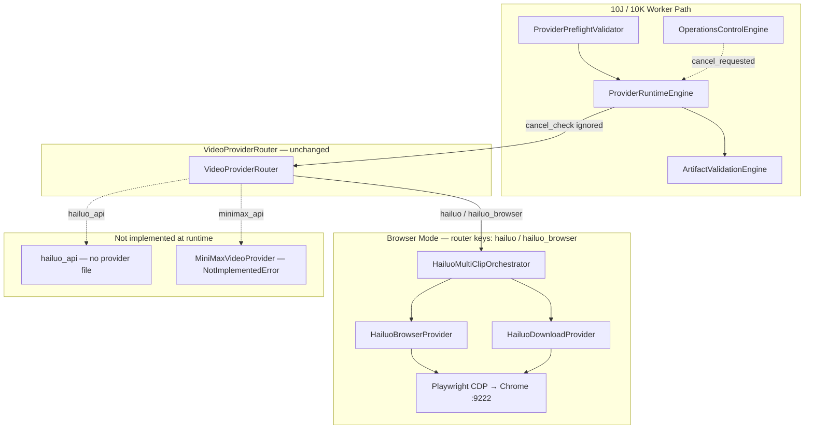

# Phase 11F — Hailuo Hardening Design / Audit

**Status:** Design / audit only — no implementation  
**Date:** 2026-05-30  
**Prerequisites:** Phase 11E Runway Hardening closed · Phase 11A–11D metadata complete · Phase 10J/10K operations validated  
**Scope:** Analyze Hailuo browser/API/MiniMax-adjacent paths and design hardening before any code changes

---

## Executive Summary

Hailuo is the **legacy default video family** in config and demo sessions (`hailuo` → `hailuo_browser`), but the **active runtime default** is now `runway_browser` (`config/active_providers.json`). The only **implemented** Hailuo execution path is **browser automation** via `HailuoMultiClipOrchestrator`, which launches **separate Chrome CDP sessions per generation and per download**, uses **fixed unbounded sleeps** (150s wait + 8–10s page settles), returns **`None` entries** in clip path lists, and raises **untyped `RuntimeError`** on UI failures.

There is **no `hailuo_api` provider module** despite 11A/11C/11D metadata and mode catalog declaring `hailuo_api` with `implementation_status: planned`. **MiniMax** (`minimax_api`) is a **router stub** that raises `NotImplementedError` after key validation.

Hardening should mirror the **11E pattern** (preflight → browser/API hardening → artifact continuity → cancel wiring → failover advisory) while fixing Hailuo-specific risks: **credit waste from duplicate browser launches**, **wrong clip downloaded** (always `video.nth(0)`), **no cooperative cancel**, and **ID drift** between `hailuo`, `hailuo_browser`, and `hailuo_api`.

---

## 1. Current Hailuo Paths

### 1.1 Architecture (as-built)



### 1.2 Browser mode

| Component | Role | Behavior today |
|-----------|------|----------------|
| `HailuoBrowserProvider` | DOM automation | Opens `hailuoai.video`, fills contenteditable prompt, applies settings (10s/768p), clicks Create |
| `HailuoDownloadProvider` | Asset extraction | Opens `/mine`, clicks first `<video>`, fetches blob via page JS, saves to `downloads/` |
| `HailuoMultiClipOrchestrator` | Multi-clip loop | Per clip: **new** browser for generate → sleep `wait_seconds` (150) → **new** browser for download |
| `BrowserManager` | CDP attach | Connects to `127.0.0.1:9222`; download path `downloads/` (not catalog `downloads/runway`) |

**Session model:** No login-state probe; assumes authenticated Chrome profile. No reuse of browser context between generate and download within a clip.

### 1.3 API mode / MiniMax

| Router key | Registry | Mode catalog | Runtime |
|------------|----------|--------------|---------|
| `hailuo_api` | ❌ not in `provider_registry.json` | ✅ `implementation_status: planned` | ❌ not in `VIDEO_ROUTER_KEYS_IMPLEMENTED`; no provider file |
| `minimax_api` | ✅ enabled=false | ✅ `implementation_status: stub` | ✅ in router; raises `NotImplementedError` |

**MiniMax/Hailuo ID drift:** MiniMax is a **separate vendor** in 11A (`minimax_api`) but appears in failover chain as cross-vendor fallback after Hailuo. No `hailuo_api` registry row — metadata references a provider with no registry entry.

### 1.4 Download mode

Download is **not a separate router key** — it is embedded in `HailuoDownloadProvider` called from orchestrator after each generation wait.

| Step | Mechanism | Output |
|------|-----------|--------|
| Navigate assets | `goto(/mine)` + `sleep(10)` | — |
| Select clip | `video.nth(0).click()` | Always latest/first video in DOM order |
| Extract | In-page `fetch` + base64 transfer | `downloads/hailuo_clip_{timestamp}.mp4` |
| Validation | None in provider | No min-size gate; no sha256 |

### 1.5 Router behavior

```python
# core/video_provider_router.py (summary)
if provider_name in ["hailuo", "hailuo_browser"]:
    orchestrator = HailuoMultiClipOrchestrator(wait_seconds=150)
    return call_with_optional_cancel_check(orchestrator.run, prompts, cancel_check=cancel_check)
```

- Alias `hailuo` → `hailuo_browser` in runtime resolution (`provider_categories`, `ProviderRuntimeEngine`).
- `cancel_check` is passed via `call_with_optional_cancel_check`, but **`HailuoMultiClipOrchestrator.run` does not accept `cancel_check`** — runtime cancel from 11E-e is **silently ignored** for Hailuo.
- `ROUTER_SUPPORTED` in `ProviderRuntimeEngine`: includes `hailuo`, `hailuo_browser` — **not** `hailuo_api`.

### 1.6 Artifact behavior

| Stage | Behavior |
|-------|----------|
| Provider output | `list` with `str` paths or **`None`** per clip |
| Runtime canonicalization | `ProviderRuntimeEngine._canonicalize_clip_paths` skips falsy paths; may raise **"Provider returned no clip paths"** if all `None` |
| Post-validation | `ArtifactValidationEngine` (10J-e): min 100KB, extension check, sha256 enrichment |
| Partial artifacts | No partial bundle on mid-run failure; failed clip may leave prior clips on disk under `downloads/` but not in session artifact root |
| Normalized metadata | **No** Hailuo equivalent of `runway_artifact_utils` — runtime builds generic 10J artifacts only |

### 1.7 Failure behavior

| Failure type | Current handling |
|--------------|------------------|
| Create button not found | `RuntimeError` → `PROVIDER_RUNTIME_ERROR` in runtime |
| Download extract failed | Returns `None`; appended to list; may fail later at validation or "no clip paths" |
| CDP not running | `BrowserManager` re-raises connection error |
| Settings UI drift | Swallowed in try/except (`Duration setting skipped`) |
| Cancel (10K) | Pre/post checkpoints in runtime only; **no mid-orchestrator cancel** |
| Taxonomy codes | Generic catch-all; no Hailuo-specific classifier |

---

## 2. Gaps

### 2.1 Hailuo API implementation gaps

- No `providers/hailuo_video_provider.py` (or equivalent).
- `hailuo_api` absent from `provider_registry.json` and `VIDEO_ROUTER_KEYS_IMPLEMENTED`.
- Mode catalog sets `polling_supported: false`, `implementation_status: planned`.
- Preflight correctly blocks API mode via `router_implementation_status` when status is `planned` — but **no path to enable** without new provider + registry row.

### 2.2 MiniMax / Hailuo ID drift

| Issue | Detail |
|-------|--------|
| Vendor conflation in ops | Demo sessions use `provider: "hailuo"`; failover lists `minimax_api` after `hailuo_api` |
| Registry asymmetry | `minimax_api` in registry; `hailuo_api` missing |
| Router vs metadata | 11A declares `hailuo_api` capabilities; runtime cannot dispatch |
| `config/config.yaml` | Still `video_provider: "hailuo"` while `active_providers.json` uses `runway_browser` |

### 2.3 Async task handling gaps

- Browser path: **no task IDs**, no async job polling — fixed sleep only.
- API path: N/A until implemented.
- No persistence of generation state between clips for recovery.

### 2.4 Polling / wait gaps

- Fixed `wait_seconds=150` in orchestrator constructor; router hardcodes 150.
- No DOM/state polling for "generation complete" (contrast Runway browser URL wait loop).
- Hard sleeps: 8s after open, 10s on assets page, 5s after video click, 1s between UI steps.
- No monotonic deadline or max wait cap env vars (Runway 11E-c pattern).

### 2.5 Download / artifact validation gaps

- No minimum file size check before accept (Runway 100KB gate).
- No sha256 at download time.
- `None` paths in return list break clip index alignment.
- Download always picks **first** video — wrong clip if multiple pending or order changed.
- Saves to global `downloads/` not session `artifact_root` until runtime copy.
- Base64 in-page transfer may fail on large files / CORS edge cases.

### 2.6 Browser automation gaps

- **Dual browser launch per clip** (generate + download) — doubles CDP attach overhead and risks stale session.
- No login-wall / session-expired detection.
- Fragile selectors (`contenteditable`, text "Create", "6s", "768p").
- No screenshot-on-failure.
- No cooperative cancel checkpoints.
- `Start/End Frame` detected but not managed (I2V-related UI).

### 2.7 Credential / config gaps

- No unified `HailuoConfigResolver` (Runway has `runway_config.py`).
- Browser relies on external Chrome; catalog defines `HAILUO_API_KEY` for planned API but unused.
- `hailuo_browser` registry entry: `enabled: false` — preflight/registry checks may block if enforced.
- CDP URL and download dir duplicated in mode catalog vs hardcoded in providers.

### 2.8 Error taxonomy gaps

- No `HailuoErrorClassifier` / structured `HailuoProviderError`.
- Failures map to generic `PROVIDER_RUNTIME_ERROR`.
- Missing mappings: `BROWSER_SESSION_INVALID`, `BROWSER_AUTOMATION_NOT_READY`, `DOWNLOAD_FAILED`, `ARTIFACT_TOO_SMALL`, `PROVIDER_TIMEOUT`.
- `RunwayCancelledError` handling in runtime **does not** cover Hailuo cancel exceptions.

### 2.9 Retry / cancel limitations

- No `cancel_check` parameter on orchestrator or providers.
- `provider_cancel_wiring.RUNWAY_CANCEL_AWARE_PROVIDERS` excludes Hailuo.
- Runtime builds `cancel_check` but Hailuo ignores it during long sleeps.
- 10K cooperative cancel works only at runtime checkpoints **before/after** full orchestrator call, not mid-clip.
- No idempotency — retry risks duplicate Hailuo generations (credit waste).

### 2.10 Cost telemetry gaps

- 11B: `hailuo_browser` has `COST_MODEL_PER_CLIP`, 1 credit, `CONFIDENCE_LOW`.
- 11B: `hailuo_api` has `COST_MODEL_UNKNOWN`.
- Runtime `cost_telemetry` does not record per-clip browser attempts or failed downloads.
- No bridge from 11B estimator at worker finalize (same gap Runway had pre-11E-f).

### 2.11 Failover advisory gap

- `runway_failover_advisory.py` is **Runway-only** (`is_runway_provider`).
- Hailuo failures do not populate `operations.failover_advisory`.
- 11C chain includes `hailuo_browser` / `hailuo_api` as fallbacks **from Runway** — reverse advisory (Hailuo failed → suggest Runway) not implemented.

---

## 3. Compatibility with 11A–11E

### 3.1 Provider ID alignment

| ID | Router | 11A Registry | 11B Cost | 11C Failover | 11D Selection | Runtime 10J |
|----|--------|--------------|----------|--------------|---------------|-------------|
| `hailuo` | ✅ alias → browser | → `hailuo_browser` | → browser | → browser | → browser | ✅ |
| `hailuo_browser` | ✅ | ✅ | ✅ | ✅ fallback | ✅ | ✅ |
| `hailuo_api` | ❌ | ✅ | ✅ | ✅ fallback | ✅ ranked | ❌ not routed |
| `minimax_api` | ✅ stub | ✅ | ✅ unknown | ✅ fallback | ✅ | ✅ raises NIE |

**Verdict:** Browser IDs align across metadata and runtime. **`hailuo_api` is metadata-only** — preflight blocks via implementation status if mode resolved, but registry omission is an inconsistency.

### 3.2 Capability registry vs runtime

| Capability | 11A `hailuo_browser` | 11A `hailuo_api` | Runtime |
|------------|----------------------|------------------|---------|
| `text_to_video` | ✅ | ✅ | ✅ browser only |
| `image_to_video` | ✅ | ✅ | ❌ not implemented (Start/End Frame UI detected only) |
| `asset_download` | ✅ | ✅ | ✅ partial (download provider) |
| `supports_async_jobs` | false | true | N/A browser / N/A API |

### 3.3 Cost catalog vs provider IDs

- `hailuo_browser` + `text_to_video`: per-clip credit placeholder — usable for simulation.
- `hailuo_api` + `text_to_video`: unknown cost — failover warnings expected (11C/11D).
- **Missing:** I2V cost entries; duration/resolution-aware estimates.

### 3.4 Failover chain correctness

Default `text_to_video` policy (11C):

```
runway → runway_browser → hailuo_browser → hailuo_api → minimax_api → luma → kling
```

IDs normalize correctly. **`hailuo_api` and `minimax_api` steps are not executable** at runtime today — planner marks blocked with `PROVIDER_NOT_IN_REGISTRY` / implementation status where applicable.

### 3.5 Selection engine

11D can rank `hailuo_browser` when Runway excluded (validated in 11C/11D matrices). With default preferences, Runway API ranks first — Hailuo is fallback metadata only unless session selects `hailuo`.

### 3.6 Runway 11E patterns reusable for Hailuo

| 11E artifact | Hailuo reuse |
|--------------|--------------|
| `runway_config.py` | **Template:** `hailuo_config.py` (catalog + env + registry) |
| `runway_preflight.py` | **Template:** `hailuo_preflight.py` (CDP, login, download dir, disabled flag) |
| `runway_error_classifier.py` | **Template:** `hailuo_error_classifier.py` |
| `runway_artifact_utils.py` | **Template:** `hailuo_artifact_utils.py` (normalized clip records) |
| `runway_browser_support.py` | **Template:** bounded waits, cancel checkpoints |
| `provider_cancel_wiring.py` | **Extend:** `HAILUO_CANCEL_AWARE_PROVIDERS` |
| `runway_failover_advisory.py` | **Generalize or parallel:** `hailuo_failover_advisory.py` |
| `validate_11e_*` matrix | **Template:** `validate_11f_*` mock-only gates |

### 3.7 Phase 10J / 10K integration

| Component | Hailuo today | Hardening touchpoint |
|-----------|--------------|----------------------|
| `ProviderPreflightValidator` | Generic browser/CDP probes only | 11F-a: Hailuo-specific block |
| `ProviderRuntimeEngine` | Generic artifacts; cancel pre/post | 11F-d: Hailuo cancel + partial |
| `ArtifactValidationEngine` | Works if files copied | 11F-c: pre-copy normalization |
| `OperationsControlEngine` | Cancel flag on session | 11F-d: mid-run acknowledgment |
| `failure_taxonomy` | Shared codes | 11F-a: classifier mapping |

---

## 4. Hardening Design

Design principle: **mirror 11E, wrap don't rewrite**. Keep `VideoProviderRouter.generate_clips(prompts, *, provider_override, cancel_check)` stable.

### 4.1 Safer preflight

**New:** `HailuoPreflightEngine` + config resolver.

| Check | Browser | API (when built) |
|-------|---------|------------------|
| Registry enabled flag | ✅ | ✅ |
| CDP reachable (`browser_config.cdp_url`) | ✅ extend catalog wiring | — |
| Chrome profile / login state | **Add:** DOM probe or cookie check | — |
| Download dir writable | **Add:** `downloads` or catalog path | — |
| Capability vs brief (I2V) | **Add:** reject with `CAPABILITY_RUNTIME_UNSUPPORTED` | same |
| `HAILUO_API_KEY` present | — | when API implemented |
| Implementation status | blocks `planned` API today | ✅ existing |

**Output:** `operations.preflight.hailuo_preflight` block (parallel to `runway_preflight`).

### 4.2 Config unification

**New:** `content_brain/execution/hailuo_config.py`

Sources:

- `config/provider_mode_catalog.json` → `hailuo.browser_config`, `api_config`
- `config/provider_registry.json` → `hailuo_browser` enabled flag
- Environment → `HAILUO_API_KEY`, `HAILUO_BROWSER_MAX_WAIT_SECONDS`, etc.

Normalize IDs: `hailuo` → `hailuo_browser` at resolver boundary (match 11A aliases).

### 4.3 API / browser mode separation

| Mode | Phase | Notes |
|------|-------|-------|
| Browser | 11F-b/c | Harden existing orchestrator |
| API | 11F-g (later) | New provider; add registry row; implement polling |
| MiniMax | Out of 11F scope | Keep stub; preflight already blocks stub status |

Do **not** conflate MiniMax implementation with Hailuo API — separate vendor modules.

### 4.4 Bounded polling / waits

Replace fixed `sleep(150)` with:

- Env-configurable max wait (default 900s cap, matching Runway browser pattern).
- Poll loop on assets page or generation status indicators (when DOM stable selectors identified).
- Monotonic deadline; log elapsed time each iteration.
- Page settle timeouts capped (e.g. 30s max).

### 4.5 Cooperative cancel checkpoints

Insert `cancel_check` at:

| Phase | Location |
|-------|----------|
| `between_clips` | Orchestrator loop |
| `before_browser_launch` / `after_browser_launch` | Orchestrator |
| `before_prompt_submit` | Browser provider |
| `generation_wait` | Each wait iteration |
| `before_download` / `download_stream` | Download provider |

On cancel: raise `HailuoCancelledError` (`OPERATIONS_CANCELLED`) with partial paths — wire into existing runtime `_mark_cooperative_cancelled` (extend beyond Runway-only exception handling).

### 4.6 Artifact validation continuity

**New:** `providers/hailuo_artifact_utils.py` (or shared `provider_artifact_utils` if dedup approved later)

Standard fields (mirror 11E-d):

- `file_path`, `provider_id`, `mode`, `clip_index`, `size_bytes`, `sha256`, `validation_status`, `partial`, `source_url`

Rules:

- Min size 100KB (`MIN_ARTIFACT_BYTES` shared constant).
- **Never delete** on validation failure.
- Reject `None` paths at orchestrator — do not append to return list; raise typed error instead.
- Copy to session artifact root via existing runtime canonicalization.

### 4.7 Partial artifact preservation

- Track `partial_paths` / `clip_results` on orchestrator.
- On cancel/failure: attach bundle to error details (11E-d pattern).
- Runtime: extend `extract_cancel_partial_artifacts` for `HailuoCancelledError`.
- Default `partial_artifacts_safe_to_reuse: false` in advisory.

### 4.8 Error taxonomy mapping

**New:** `providers/hailuo_error_classifier.py`

| Condition | Code |
|-----------|------|
| CDP connection failed | `BROWSER_UNAVAILABLE` |
| Login redirect / auth wall | `BROWSER_SESSION_INVALID` |
| Create button not found | `BROWSER_AUTOMATION_NOT_READY` |
| Generation wait exceeded | `PROVIDER_TIMEOUT` |
| Download extract failed | `DOWNLOAD_FAILED` |
| File too small | `ARTIFACT_TOO_SMALL` |
| I2V requested | `CAPABILITY_RUNTIME_UNSUPPORTED` |
| Registry disabled | `PROVIDER_DISABLED` |
| Cooperative cancel | `OPERATIONS_CANCELLED` |
| Default | `PROVIDER_RUNTIME_ERROR` |

### 4.9 Failover advisory readiness

**New:** `content_brain/execution/hailuo_failover_advisory.py` (or generalize `provider_failover_advisory.py`)

- Attach to `operations.failover_advisory` on Hailuo terminal FAILED/CANCELLED.
- Use 11C planner + 11D selection (advisory only).
- Operator cancel → `failover_recommended=false`.
- Suggest `runway_browser` / `runway` as next candidates when Hailuo fails.

---

## 5. Implementation Slices (Recommended Build Order)

### 11F-a — Preflight, Config Unification & Error Taxonomy

**Goal:** Fail fast; single config source; typed errors.

| Task | Target |
|------|--------|
| `hailuo_config.py` | **New** |
| `hailuo_preflight.py` | **New** |
| `hailuo_error_classifier.py` | **New** |
| Preflight hook in `provider_preflight_validator.py` | **Modify** |
| Taxonomy codes if missing | `failure_taxonomy.py` (only if gaps) |
| `validate_11f_a_hailuo_preflight.py` | **New** |

**Exit gate:** Mock-only validation; browser preflight blocks CDP down + disabled registry; classifier maps timeout/download failures.

---

### 11F-b — Browser Mode Hardening

**Goal:** Single browser session per clip (or per batch); bounded waits; cancel checkpoints.

| Task | Target |
|------|--------|
| Refactor orchestrator to reuse browser context generate→download | `hailuo_multi_clip_orchestrator.py` |
| Bounded wait loop (env max wait) | orchestrator + **New** `hailuo_browser_support.py` |
| Cancel checkpoints | orchestrator, browser provider, download provider |
| Remove/replace blind sleeps with capped settles | `hailuo_browser_provider.py`, `hailuo_download_provider.py` |
| Session/login detection | browser provider |
| Structured errors (`HailuoProviderError`, `HailuoCancelledError`) | **New** `hailuo_api_errors.py` |
| `validate_11f_b_hailuo_browser_hardening.py` | **New** |

**Exit gate:** Mock/fake DOM tests only; no infinite sleep; cancel during wait exits cleanly.

---

### 11F-c — Download & Artifact Continuity

**Goal:** Normalized artifacts; min size; no `None` paths; partial bundles.

| Task | Target |
|------|--------|
| `hailuo_artifact_utils.py` | **New** |
| Integrate finalize gate in download provider | `hailuo_download_provider.py` |
| Clip index + metadata on orchestrator | `hailuo_multi_clip_orchestrator.py` |
| Partial bundle on cancel | orchestrator |
| `validate_11f_c_hailuo_artifacts.py` | **New** |

**Exit gate:** 10J-e `ArtifactValidationEngine` passes on mock clips; too-small files preserved not deleted.

---

### 11F-d — Runtime Cancel Wiring

**Goal:** Live `cancel_check` reaches Hailuo during execution.

| Task | Target |
|------|--------|
| Extend `provider_cancel_wiring` for Hailuo IDs | `provider_cancel_wiring.py` |
| `cancel_check` on orchestrator.run | `hailuo_multi_clip_orchestrator.py` |
| Handle `HailuoCancelledError` in runtime | `provider_runtime_engine.py` |
| `validate_11f_d_runtime_cancel_wiring.py` | **New** |

**Exit gate:** Mock cancel during orchestrator → session `CANCELLED`, partial artifacts preserved.

---

### 11F-e — Failover Readiness Advisory

**Goal:** Hailuo sessions get `operations.failover_advisory` (advisory only).

| Task | Target |
|------|--------|
| `hailuo_failover_advisory.py` | **New** |
| Attach on failed/cancelled Hailuo paths | `provider_runtime_engine.py` |
| `validate_11f_e_hailuo_failover_advisory.py` | **New** |

**Exit gate:** Failed Hailuo recommends Runway fallback in metadata; cancel blocks recommendation.

---

### 11F-f — Final Validation Matrix & Handoff

**Goal:** Close Hailuo hardening (mirror 11E-g).

| Task | Target |
|------|--------|
| `validate_11f_matrix.py` | **New** |
| `PHASE_11F_HAILUO_HARDENING_REPORT.md` | **New** |
| Update Project Brain handoff | `current_state.md`, `CHAT_HANDOFF.md`, `next_steps.md` |

---

### 11F-g — Hailuo API Mode (Deferred / Separate Approval)

**Not in initial 11F browser hardening scope.**

| Task | Notes |
|------|-------|
| Add `hailuo_api` to `provider_registry.json` | enabled=false until ready |
| Implement `providers/hailuo_video_provider.py` | async task + polling |
| Register in router + `VIDEO_ROUTER_KEYS_IMPLEMENTED` | |
| Update mode catalog `implementation_status` | planned → implemented |

---

### MiniMax stub hardening (Optional 11F-h or Phase 11G)

- Align preflight message for `minimax_api`.
- Do not implement generation until product approval.
- Keep `NotImplementedError` or replace with typed `PROVIDER_NOT_IMPLEMENTED`.

---

## 6. Risks

| Risk | Severity | Mitigation in design |
|------|----------|----------------------|
| **Credit waste** | High | Single browser per clip; cancel checkpoints; no blind retry; idempotency keys (future) |
| **Duplicate generation** | High | Avoid re-click Create on retry; track clip generation fingerprint |
| **Stale browser session** | High | Login-wall detection; preflight CDP + auth probe |
| **Failed download** | High | Typed `DOWNLOAD_FAILED`; min size gate; do not append `None` |
| **Wrong clip downloaded** | High | Select by clip index / timestamp / prompt hash, not always `nth(0)` |
| **Partial artifacts lost** | Medium | Partial bundles + runtime cancel path (11F-c/d) |
| **MiniMax/Hailuo API changes** | Medium | Classifier + config version fields; no hardcoded endpoints in orchestrator |
| **Credential leakage** | Medium | Never log API keys; env-only credentials; audit download URLs |
| **Provider ID drift** | Medium | Single normalizer in `hailuo_config`; document alias table |
| **UI selector breakage** | High | Centralize selectors; validation mocks; optional screenshot capture |
| **Large video base64 transfer** | Medium | Prefer direct download API or Playwright download event over in-page fetch |
| **10K cancel stale worker** | Medium | Mid-run checkpoints (11F-d) |
| **False failover recommendations** | Low | Advisory only; operator cancel blocks (11F-e) |

---

## 7. Files Likely to Change (Implementation Phase)

### New (expected)

| File | Slice |
|------|-------|
| `content_brain/execution/hailuo_config.py` | 11F-a |
| `content_brain/execution/hailuo_preflight.py` | 11F-a |
| `providers/hailuo_error_classifier.py` | 11F-a |
| `providers/hailuo_api_errors.py` | 11F-b |
| `providers/hailuo_browser_support.py` | 11F-b |
| `providers/hailuo_artifact_utils.py` | 11F-c |
| `content_brain/execution/hailuo_failover_advisory.py` | 11F-e |
| `project_brain/validate_11f_*.py` | All |

### Modify (expected)

| File | Slice |
|------|-------|
| `orchestrators/hailuo_multi_clip_orchestrator.py` | 11F-b/c/d |
| `providers/hailuo_browser_provider.py` | 11F-b |
| `providers/hailuo_download_provider.py` | 11F-b/c |
| `content_brain/execution/provider_preflight_validator.py` | 11F-a |
| `content_brain/execution/provider_cancel_wiring.py` | 11F-d |
| `content_brain/execution/provider_runtime_engine.py` | 11F-d/e |
| `config/provider_registry.json` | 11F-a (optional enable flag docs) |

### Must NOT change (without explicit approval)

| File / behavior | Reason |
|-----------------|--------|
| `ui/*` | Scope exclusion |
| `VideoProviderRouter` dispatch contract | Backward compatibility |
| Automatic failover execution | 11C planning only |
| `active_providers.json` default | Do not switch defaults in hardening |
| 10K operations semantics (retry/requeue/cancel API) | Preserve behavior |
| Runway providers (11E complete) | No regressions |

---

## 8. Validation Plan (Post-Implementation)

Mirror Phase 11E validation strategy — **mocks/fakes only**, no Hailuo API, no browser automation in CI validators.

| Script | Purpose |
|--------|---------|
| `validate_11f_a_hailuo_preflight` | Config, preflight, taxonomy, registry |
| `validate_11f_b_hailuo_browser_hardening` | Bounded waits, cancel, errors (mocked orchestrator) |
| `validate_11f_c_hailuo_artifacts` | Normalization, min size, partial preservation |
| `validate_11f_d_runtime_cancel_wiring` | Runtime passes `cancel_check`; CANCELLED state |
| `validate_11f_e_hailuo_failover_advisory` | Advisory metadata, no dispatch |
| `validate_11f_matrix` | Orchestrates all + 11A–11D + 10K + 11E regression gates |

**Regression requirements:**

- `validate_11e_matrix` still passes (Runway unchanged).
- `validate_10k_matrix` still passes.
- `validate_11a`–`validate_11d` still pass.

---

## 9. Open Decisions (Operator / Product)

1. **Enable `hailuo_browser` in registry** when hardening complete, or keep disabled until explicit cutover?
2. **Implement `hailuo_api`** in 11F-g vs defer to separate vendor integration phase?
3. **I2V:** Narrow 11A capabilities for Hailuo until implemented, or block at preflight only?
4. **Browser session reuse:** Single CDP session for entire multi-clip batch vs per-clip (design recommends per-batch with one generate+download cycle per clip)?
5. **MiniMax relationship:** Keep in failover chain or mark blocked until implementation?

---

## 10. Next Recommended Phase After 11F Design Approval

1. **11F-a** — Preflight + config + error taxonomy (lowest risk, highest fail-fast value).
2. **11F-b** — Browser orchestrator hardening (addresses credit waste and cancel gap).
3. Continue through **11F-f** before any **11F-g API** work.

Alternative parallel track: **Image-to-Video planning** (design-only) if product priority exceeds Hailuo API.

---

## References

- Runway hardening baseline: `project_brain/PHASE_11E_RUNWAY_HARDENING_REPORT.md`
- Runway design template: `project_brain/PHASE_11E_RUNWAY_HARDENING_DESIGN_REPORT.md`
- Provider metadata: `content_brain/providers/provider_capability_registry.py`, `provider_cost_catalog.py`, `provider_failover_policy.py`
- Runtime operations: `content_brain/execution/provider_runtime_engine.py`, `artifact_validation_engine.py`
- Operations console: Phase 10K reports
