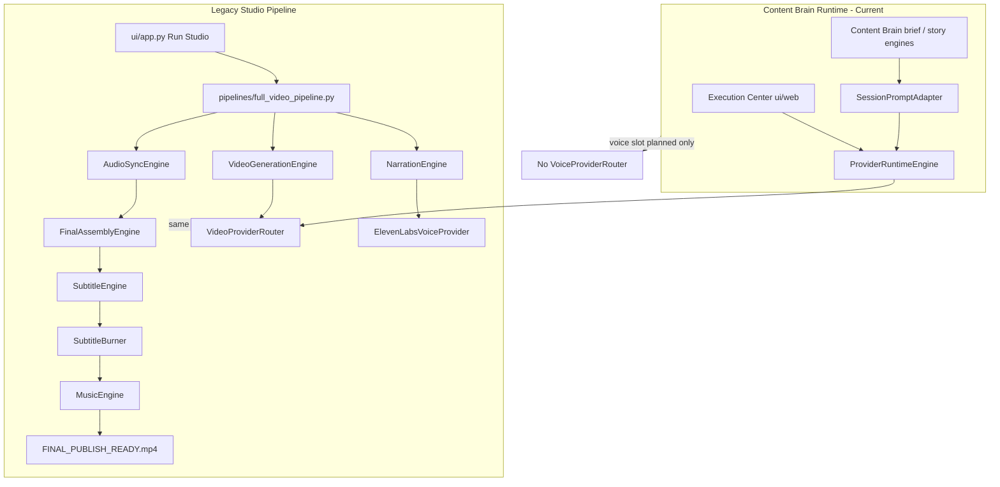

# Phase 11H-0 — Existing Audio / Subtitle / Assembly Pipeline Audit

**Status:** Audit only — no code changes  
**Date:** 2026-05-31  
**Purpose:** Inventory what already exists before building Phase 11H voice runtime  
**Scope:** ElevenLabs, narration, subtitles, burn-in, timeline sync, A/V sync, final assembly, `FINAL_PUBLISH_READY.mp4`

---

## Executive Summary

ModirAgentOS currently has **two parallel worlds**:

| World | Entry point | Media scope |
|-------|-------------|-------------|
| **Legacy studio pipeline** | `pipelines/full_video_pipeline.py` (Streamlit Run Studio via `ui/app.py`) | End-to-end: narration → video → sync → assembly → subtitles → music → overlays → `FINAL_PUBLISH_READY.mp4` |
| **Content Brain + Provider Runtime** | `ProviderRuntimeEngine` / Execution Center (`ui/web`) | **Video generation only** (Phase 10I–11F); voice/music slots exist in session schema but are **not executed** |

**ElevenLabs works today** as a standalone REST provider and inside the legacy pipeline. It is **not wired** into `ProviderRuntimeEngine`, session dispatch, artifact validation, or the Execution Center runtime path.

Subtitle and assembly tooling **exists and runs offline** in the legacy pipeline, but uses **simplified timing** (equal text chunks over a fixed duration) rather than true audio-aligned captions.

---

## Architecture Map



---

## Component Inventory

### 1. ElevenLabs Integration

| Location | Role |
|----------|------|
| `providers/elevenlabs_voice_provider.py` | Direct REST client: `POST /v1/text-to-speech/{voice_id}`, saves MP3 |
| `config/provider_registry.json` | Registered under `voice`; `api_key_env`: `ELEVENLABS_API_KEY` |
| `config/active_providers.json` | `"voice": "elevenlabs"` |
| `content_brain/providers/provider_capability_registry.py` | Capabilities: `narration`, `voice_clone`, `asset_download` |
| `content_brain/providers/provider_cost_catalog.py` | Placeholder per-character cost |
| `content_brain/providers/provider_failover_policy.py` | `voice_narration_default`: elevenlabs → openai_tts |
| `content_brain/providers/provider_selection_engine.py` | Ranking weights for `elevenlabs` |
| `test_elevenlabs_voice.py` | Standalone smoke script |

**Behavior:** Requires `ELEVENLABS_API_KEY` in environment. Raises if missing. No preflight, retry, cancel, or artifact schema integration.

**Missing for runtime:** `VoiceProviderRouter`, `ProviderRuntimeEngine` voice dispatch, audio artifact validation, Execution Center voice panel.

---

### 2. Narration Generation

| Location | Role |
|----------|------|
| `engines/narration_engine.py` | Iterates `timeline.segments`, calls `ElevenLabsVoiceProvider.generate_voice()` per clip |
| `pipelines/full_video_pipeline.py` | Step 1 (logged as `[1]`) — after `TimelineEngine.build_selfcare_timeline()` |
| `test_timeline_voice.py` | Direct timeline + ElevenLabs test |
| `test_selfcare_voice.py` | (listed in DEAD_FILES as low-priority test) |

**Text source (legacy):** Hardcoded `TimelineSegment.narration` from `core/timeline_engine.py` (selfcare skincare script, ~30s / 3 clips). Viral hook prepended to segment 1 only.

**Text source (Content Brain — not consumed for TTS):**

- `content_brain/engines/story_architecture_engine.py` — beat-level `narration` strings
- `content_brain/engines/retention_map_engine.py` — `narration`, `audio_instruction`, `caption_instruction` per retention segment
- `content_brain/engines/story_intelligence_engine.py` — `voiceover_intent`, `schema_director_shots` (visual prompts only)

**Gap:** `SessionPromptAdapter` (`content_brain/execution/session_prompt_adapter.py`) builds **video prompts only** from director shots. Narration text in brief snapshots is **not adapted** for voice runtime.

---

### 3. Subtitle Generation

| Location | Role |
|----------|------|
| `engines/subtitle_engine.py` | Splits narration text into word chunks; generates `.srt` and styled `.ass` (TikTok-style highlights) |
| `postprocess_existing_video.py` | Standalone subtitle pass on existing video |
| `rebuild_existing_project.py` | Rebuild flow includes subtitles |

**Method:**

- `split_text(text, max_words=4)` → equal-count chunks
- `duration / len(chunks)` → uniform segment timing (**not** tied to actual TTS audio length or word timing)
- ASS styling: Arial 78pt, highlight keywords, fade, bottom alignment

**Capability registry:** `subtitle_generation` exists as a capability ID but **no providers registered** (11A validator treats empty list as OK).

**Classification:** **Partially working** — produces valid subtitle files and burn-in input, but **not** true speech-synced captions.

---

### 4. Subtitle Burn-In

| Location | Role |
|----------|------|
| `engines/subtitle_burner.py` | FFmpeg `-vf ass='...'` burn-in; copies audio stream |

**Constraints:**

- Hardcoded `C:\ffmpeg\ffmpeg-8.1.1-essentials_build\bin\ffmpeg.exe`
- Windows path escaping for ASS filter
- No integration with runtime sessions or artifact store

**Classification:** **Working** in legacy/local context; **not portable** without env-based ffmpeg path (legacy pipeline uses same hardcoded path).

---

### 5. Timeline Sync

| System | File | What it syncs |
|--------|------|---------------|
| **Legacy timeline** | `core/timeline_engine.py` | Fixed 3-segment selfcare timeline: `start_time`, `end_time`, `narration`, `pause_after` per clip |
| **Content Brain retention map** | `content_brain/engines/retention_map_engine.py` | Story beats with `time_window_hint`, audio/caption instructions — **planning metadata only** |
| **Content Brain story architecture** | `content_brain/engines/story_architecture_engine.py` | Beat plans with narration — **no execution timestamps** |
| **Session runtime** | `execution_runtime.prompt_bundle.clip_metadata` | Per-clip `duration_seconds` from director shots — **video-side only** |

**No shared timeline builder** connects Content Brain narration beats → ElevenLabs clip files → subtitle timestamps.

**Classification:** **Duplicated / partial** — two timeline concepts; neither feeds the other; no audio-aligned timeline sync service exists.

---

### 6. Audio / Video Synchronization

| Location | Role |
|----------|------|
| `engines/audio_sync_engine.py` | Pairs `downloaded_clips[i]` with `voice_files[i]`, writes synced MP4s |
| `utils/ffmpeg_clip_audio_merger.py` | Core logic: ffprobe durations, `atempo` speed-up if narration longer than video, fade-out, pad, map video + adjusted audio |
| `test_clip_audio_sync.py` | Manual test: latest 3 downloads + timeline voices |
| `utils/ffmpeg_audio_merger.py` | (DEAD_FILES) alternate merger — likely superseded |

**Behavior:** Per-clip 1:1 pairing; sophisticated duration matching. Assumes clip count equals voice file count.

**Not used by:** `ProviderRuntimeEngine`, Content Brain orchestrators, Execution Center.

**Classification:** **Working** for legacy pipeline; **orphaned** from new runtime architecture.

---

### 7. Final Assembly

| Location | Role |
|----------|------|
| `engines/final_assembly_engine.py` | Wrapper around cinematic assembler |
| `utils/final_cinematic_assembler.py` | FFmpeg concat demuxer (`concat` list file, stream copy) |
| `test_final_cinematic_assembly.py` | Test script |

**Output (legacy):** `outputs/full_test/{episode_folder}/assembled_video.mp4` → then post-processed downstream.

**Downstream post-assembly steps in `full_video_pipeline.py`:**

| Step | Engine | Output artifact |
|------|--------|-----------------|
| Subtitles | `SubtitleEngine` + `SubtitleBurner` | `with_subtitles.mp4` |
| Music | `MusicEngine` (+ optional missing `SunoMusicProvider`) | `with_music.mp4` |
| Audio finish | `AudioFinishEngine` | `smooth_audio.mp4` |
| Ingredient overlay | `IngredientOverlayEngine` | `with_ingredients.mp4` |
| Hook overlay | `HookOverlayEngine` | **`FINAL_PUBLISH_READY.mp4`** |
| Thumbnail / SEO / publish | `ThumbnailEngine`, `SEOPackageEngine`, `AutoPublishingEngine` | sidecar files |

**Classification:** **Working** as a **monolithic offline chain**; **not modularized** into category runtime or session artifacts.

---

### 8. `FINAL_PUBLISH_READY.mp4` Pipeline

**Canonical path:**

```
outputs/full_test/{episode_folder}/FINAL_PUBLISH_READY.mp4
```

**Trigger:** Streamlit **Run Studio** → `subprocess` → `python -m pipelines.full_video_pipeline` (`ui/app.py` ~L928).

**Also referenced in:**

- `test_full_ai_video_pipeline.py` (parallel/alternate full test script)
- `rebuild_existing_project.py`, `postprocess_existing_video.py` (variant publish-ready names)
- Historical outputs under `outputs/full_test/` and `outputs/subtitles/`

**Not connected to:**

- Execution session lifecycle (`DEQUEUED` → `COMPLETED`)
- `ProviderRuntimeEngine` artifact canonicalization
- `ui/web` Execution Center dispatch
- Content Brain queue / worker

**Classification:** **Working legacy deliverable**; **obsolete as the target architecture** for Content Brain sessions (Phase 11 plan explicitly keeps `full_video_pipeline.py` unchanged and builds category runtime separately).

---

## Classification Summary

| Area | Working | Partially working | Obsolete / legacy-only | Duplicated by new runtime |
|------|---------|-------------------|------------------------|---------------------------|
| **ElevenLabs provider** | ✅ REST TTS, registry, 11A–11D metadata | — | — | Metadata duplicated; execution path not in runtime |
| **NarrationEngine** | ✅ In legacy pipeline | — | Selfcare timeline only | Brief narration exists separately in Content Brain |
| **SubtitleEngine** | ✅ SRT/ASS generation | ⚠️ Equal-chunk timing, not audio-aligned | — | Caption text in retention map not wired |
| **SubtitleBurner** | ✅ ASS burn-in | ⚠️ Hardcoded ffmpeg path | — | Not in runtime |
| **TimelineEngine** | ✅ Fixed 3-clip model | — | Selfcare-specific | Content Brain beats / retention map |
| **AudioSyncEngine** | ✅ Per-clip ffmpeg sync | — | Legacy pipeline only | No runtime equivalent |
| **FinalAssemblyEngine** | ✅ Concat assembly | — | Legacy pipeline only | Video clips only validated in 10J-e |
| **FINAL_PUBLISH_READY** | ✅ Via Run Studio | — | Entire chain legacy | Session artifacts stop at video clips |
| **Suno music** | ✅ Local MP3 via MusicEngine | ⚠️ `SunoMusicProvider` **missing** | Import fallback in pipeline | `music_generation` slot planned only |
| **openai_tts** | — | Registry/failover metadata only | No provider module | — |
| **VoiceProviderRouter** | — | — | Does not exist | Planned 11H |
| **ProviderRuntimeEngine voice** | — | Category slot `planned` | — | Video path replaces old dispatch for CB sessions |
| **ArtifactValidationEngine** | ✅ Video clips | — | No audio/subtitle rules | — |
| **Execution Center UI** | ✅ Video observability | — | No voice/subtitle/assembly UI | Failover advisory UI (11F-f) video-only |

---

## What Content Brain Already Produces (Reusable for 11H)

These are **inputs** voice runtime could consume without rewriting content engines:

| Artifact | Location in brief / session | Notes |
|----------|------------------------------|-------|
| Beat narration text | `story_intelligence`, `story_architecture` beat plans | Rich copy; not passed to TTS today |
| Retention segment narration | `retention_map` segments | Includes audio/caption hints |
| Director shots | `brief_snapshot.run_context.story_intelligence.schema_director_shots` | Video prompts via `SessionPromptAdapter`; may include duration hints |
| Clip count / format | `video_format_plan.clip_count` | Alignment constraint for voice clip count |
| Voice category selection | `provider_selection.category_selections.voice_generation` | Demo sessions: `elevenlabs`, `status: planned` |
| Category runtime slot | `execution_runtime.category_runtime.voice_generation` | Schema ready; `state: not_started` |
| Artifacts slot | `execution_runtime.artifacts_by_category.voice_generation` | Empty list in demos |

---

## Duplication & Conflict Risks for Phase 11H

1. **Two text pipelines:** Legacy `TimelineEngine.narration` vs Content Brain beat narration — 11H must pick **brief/session adapter**, not selfcare timeline.
2. **Two video paths:** Legacy `VideoGenerationEngine` and runtime `ProviderRuntimeEngine` both call `VideoProviderRouter` — voice should follow **runtime pattern**, not inline pipeline imports.
3. **Two UIs:** Streamlit Run Studio runs full legacy chain; Execution Center runs video-only — voice UI belongs on **Execution Center** category panel (11L), not extending Run Studio blindly.
4. **Subtitle timing:** Reusing `SubtitleEngine` as-is will **not** produce broadcast-quality sync; needs audio duration input or alignment pass.
5. **Assembly scope:** `FinalAssemblyEngine` + post steps are **publish pipeline**, not provider category — Phase 11 plan defers publishing; 11H should scope to **voice artifacts**, not re-home entire `FINAL_PUBLISH_READY` chain.
6. **Registry vs runtime:** ElevenLabs already in 11A–11D — 11H implementation should **extend** existing metadata, not duplicate catalogs.

---

## Obsolete / Low-Priority (per `DEAD_FILES_REPORT.md`)

Still present but not part of active Content Brain runtime:

- `pipelines/full_video_pipeline.py` — **active for Run Studio**, listed as low-priority / legacy
- `core/timeline_engine.py` — niche selfcare template
- `core/master_orchestrator_engine.py` — engine name registry; not executed
- Numerous `test_*.py` scripts for clip sync, timeline voice, assembly
- `engines/subtitle_burner.py` — flagged low-priority though still used by pipeline

---

## Gaps Before Phase 11H Voice Runtime

| Gap | Priority | Notes |
|-----|----------|-------|
| `VoiceProviderRouter` | Blocker | Planned in Phase 11 expansion plan §11H |
| `ProviderRuntimeEngine` multi-category dispatch (11G) | Blocker | Voice category currently returns `CATEGORY_NOT_SUPPORTED` |
| Voice `SessionPromptAdapter` (narration text extraction) | High | Mirror video adapter from story beats / retention map |
| Audio artifact schema + validation | High | No 10J-e equivalent for MP3/WAV |
| ElevenLabs preflight / error taxonomy | Medium | Video providers have 11E/11F patterns |
| Subtitle provider / sync strategy | Out of 11H core | Phase 11 plan: subtitle providers explicitly out of scope |
| Assembly / publish integration | Deferred | Keep in legacy pipeline until dedicated phase |
| ffmpeg path configuration | Medium | Hardcoded Windows paths across engines |

---

## Recommended 11H Build Order (Audit Recommendation Only)

1. **11G prerequisite check** — confirm multi-category runtime shell or minimal voice-only dispatch extension.
2. **Voice narration adapter** — brief → per-clip narration strings (reuse story/retention sources, not `TimelineEngine`).
3. **`VoiceProviderRouter`** — wrap existing `ElevenLabsVoiceProvider`; optional openai_tts stub.
4. **Runtime integration** — `voice_generation` category dispatch, artifact storage under `artifacts_by_category.voice_generation`.
5. **Validation** — mock-only matrix (pattern from 11F); do not auto-run full legacy pipeline.
6. **Defer** — subtitle burn-in, final assembly, `FINAL_PUBLISH_READY` migration (separate assembly/publish phase).

---

## File Reference Index

| Concern | Primary files |
|---------|---------------|
| ElevenLabs | `providers/elevenlabs_voice_provider.py` |
| Narration | `engines/narration_engine.py` |
| Subtitles | `engines/subtitle_engine.py`, `engines/subtitle_burner.py` |
| A/V sync | `engines/audio_sync_engine.py`, `utils/ffmpeg_clip_audio_merger.py` |
| Assembly | `engines/final_assembly_engine.py`, `utils/final_cinematic_assembler.py` |
| Legacy timeline | `core/timeline_engine.py` |
| Full publish pipeline | `pipelines/full_video_pipeline.py` |
| Run Studio entry | `ui/app.py` |
| Video runtime (reference) | `content_brain/execution/provider_runtime_engine.py`, `content_brain/execution/session_prompt_adapter.py` |
| Category schema | `content_brain/execution/provider_categories.py` |
| Provider metadata | `content_brain/providers/provider_capability_registry.py`, `provider_failover_policy.py`, `provider_selection_engine.py` |
| Content narration sources | `content_brain/engines/story_architecture_engine.py`, `retention_map_engine.py` |

---

## Scope Compliance

| Rule | Status |
|------|--------|
| Audit only | ✅ |
| No code changes | ✅ |
| No implementation | ✅ |

---

## Next Step

**Phase 11G** (multi-category runtime shell) or scoped 11H voice slice design — using this audit to avoid re-implementing ElevenLabs, subtitle, or assembly logic that already exists in the legacy pipeline while not coupling voice runtime to `full_video_pipeline.py`.
