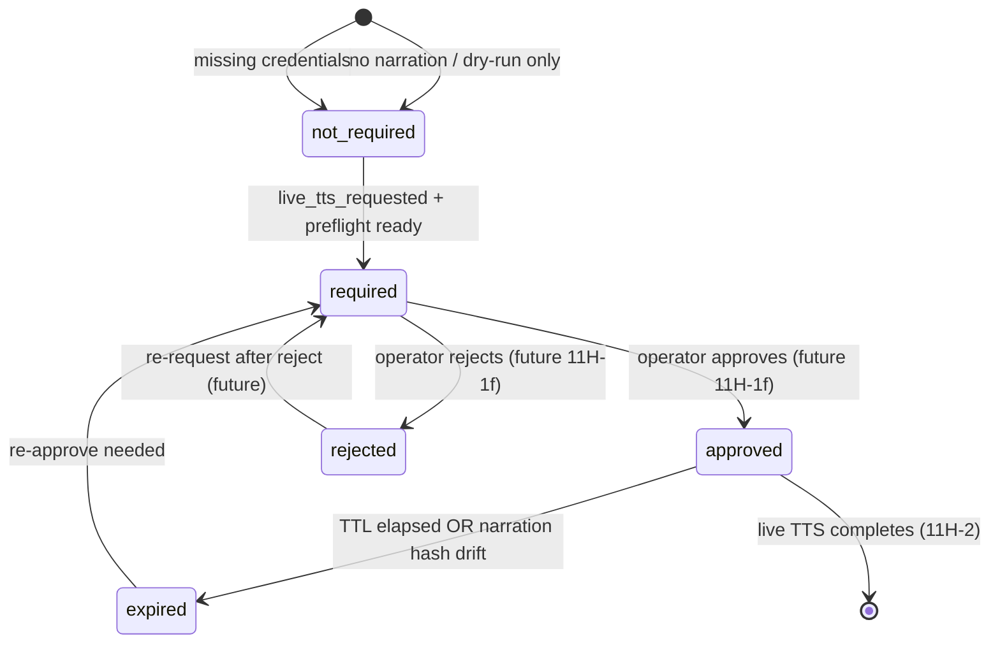

# Phase 11H-1d — Voice Runtime Approval Gate Design

**Status:** Design only — no implementation, no live TTS, no approval write actions  
**Date:** 2026-05-28  
**Prerequisites:** Phase 11G (multi-category shell), 11H-1a (voice foundation), 11H-1b (preflight slot), 11H-1c (UI observability)  
**Goal:** Define an explicit approval gate that must pass before any live ElevenLabs TTS call in Phase 11H-2+

---

## Executive Summary

Content Brain already has **session-level** approval and budget governance (`ApprovalBudgetGovernanceEngine`, Phase 10F) for queueing and video provider dispatch. That approval covers **video execution readiness**, not **voice credit spend**.

Phase 11H-1d introduces a **category-scoped voice approval gate** on `execution_runtime.category_runtime.voice_generation`. It prevents accidental ElevenLabs credit usage by requiring explicit operator approval when `live_tts_requested=true`, while leaving dry-run preflight (11H-1b) and video dispatch completely unaffected.

**Key principle:** Session `APPROVED_FOR_EXECUTION` ≠ voice live TTS approved.

---

## Current Architecture Summary

### Session-level governance (existing — unchanged)

| System | Location | Scope |
|--------|----------|-------|
| `ApprovalBudgetGovernanceEngine` | `content_brain/execution/approval_budget_governance_engine.py` | Session `approval_decision`, `budget_decision`, `approval_state` |
| `ExecutionReadinessGate` | `content_brain/execution/execution_readiness_gate.py` | Requires `APPROVED_FOR_EXECUTION` + budget allowed before queue |
| `ExecutionQueueEngine` | `content_brain/execution/execution_queue_engine.py` | Blocks enqueue on `AWAITING_APPROVAL`, `BUDGET_BLOCKED` |
| `ProviderRuntimeEngine` | `content_brain/execution/provider_runtime_engine.py` | Video-only dispatch; no voice TTS |
| `OperationsControlEngine` | `content_brain/execution/operations_control_engine.py` | Retry, cancel, archive, requeue — no voice approve action today |
| `operations_action_policy` | `content_brain/execution/operations_action_policy.py` | Eligibility for operator actions |

Session approval fields (representative):

```json
{
  "approval_state": "approved",
  "approval_decision": {
    "status": "APPROVED_FOR_EXECUTION",
    "evaluated_at": "...",
    "evaluated_by": { "engine": "ApprovalBudgetGovernanceEngine" }
  },
  "budget_decision": {
    "budget_status": "WITHIN_LIMIT",
    "budget_allowed": true,
    "estimated_credits": 2.0
  }
}
```

Video estimated credits use per-clip models (`session_population_builder.PROVIDER_CREDIT_PER_CLIP`). Voice has a separate **per-character** placeholder in `provider_cost_catalog.py` (ElevenLabs `CAPABILITY_NARRATION`, `CONFIDENCE_LOW`).

### Voice runtime foundation (11H-1a/b/c — existing)

| Component | Role |
|-----------|------|
| `SessionNarrationAdapter` | Extracts narration from brief (`beat_plans`) |
| `ElevenLabsPreflight` | Probe-only; `CREDENTIALS_MISSING` if no key |
| `apply_voice_preflight_dry_run()` | Updates `voice_generation` slot on video dispatch |
| `VoiceRuntimeObservabilityPanel` | Read-only UI: status, executed, dry_run, preflight |

Current voice slot states (11H-1b):

| Condition | `status` | `executed` | `live_tts` |
|-----------|----------|------------|------------|
| No narration | `skipped` | `false` | `false` |
| Missing API key | `failed` | `false` | `false` |
| Preflight ready | `pending` | `false` | `false` |

**No approval fields exist today.** `live_tts` is always `false`.

### Operations Console patterns (reference)

- Actions: `POST /sessions/{id}/actions/cancel`, retry, archive, requeue via `OperationsControlEngine`
- Eligibility endpoint returns `{ actions: { retry: { allowed, reason }, ... } }`
- Audit: `operations_control` block on session + global audit log
- Cooperative cancel: `operations_control.cancel_requested` checked before provider calls

Voice approval should follow the same **eligibility + audit + no silent side effects** pattern when write actions are implemented (post-11H-1d).

---

## Proposed Schema

### Voice approval block (nested under `voice_generation` slot)

Add an `approval` object to `execution_runtime.category_runtime.voice_generation`:

```json
{
  "category_name": "voice",
  "status": "pending",
  "provider": "elevenlabs",
  "executed": false,
  "dry_run": true,
  "live_tts": false,
  "live_tts_requested": false,
  "segment_count": 3,
  "narration_adapter": {
    "segment_count": 3,
    "total_text_length": 420,
    "source_path": "run_context.story_intelligence.story_architecture.beat_plans"
  },
  "approval": {
    "gate_version": "11h1d_v1",
    "approval_required": false,
    "approval_state": "not_required",
    "approved_by": null,
    "approved_at": null,
    "approval_reason": null,
    "estimated_voice_cost": null,
    "estimated_voice_cost_currency": "USD",
    "estimated_voice_cost_confidence": "low",
    "estimated_character_count": 420,
    "estimated_segment_count": 3,
    "approval_expires_at": null,
    "live_tts_eligible": false,
    "live_tts_blocked_reasons": ["live_tts_not_requested"]
  }
}
```

### Field definitions

| Field | Type | Description |
|-------|------|-------------|
| `approval_required` | bool | Whether live TTS needs explicit approval before execution |
| `approval_state` | enum | `not_required` \| `required` \| `approved` \| `rejected` \| `expired` |
| `approved_by` | string \| null | Actor id (e.g. `operator`, `api:user@host`) |
| `approved_at` | timestamp \| null | When approval was granted |
| `approval_reason` | string \| null | Operator note or system reason |
| `estimated_voice_cost` | float \| null | Placeholder from 11B catalog (not billing truth) |
| `estimated_character_count` | int | From `NarrationBundle.total_text_length` |
| `estimated_segment_count` | int | From `NarrationBundle.segment_count` |
| `approval_expires_at` | timestamp \| null | Approval invalid after this time |
| `live_tts_eligible` | bool | Computed: all guards pass (read-only summary) |
| `live_tts_blocked_reasons` | string[] | Human-readable block reasons for UI |

### Operations mirror (audit-friendly)

```json
"execution_runtime": {
  "operations": {
    "voice_preflight_dry_run": { "...": "11H-1b existing" },
    "voice_approval_gate": {
      "gate_version": "11h1d_v1",
      "evaluated_at": "2026-05-28 12:00:00",
      "approval_required": true,
      "approval_state": "required",
      "live_tts_requested": false,
      "live_tts_eligible": false,
      "blocked_reasons": ["approval_state=required"],
      "policy_snapshot": {
        "max_characters_per_run": 5000,
        "max_estimated_voice_cost_usd": 5.0,
        "approval_ttl_hours": 4
      }
    }
  }
}
```

### Relationship to session-level approval

| Gate | Question answered |
|------|-------------------|
| Session `approval_decision` | May this session enter queue / dispatch **video**? |
| Session `budget_decision` | Is total run within budget cap? |
| Voice `approval` block | May this session spend ElevenLabs credits on **live TTS**? |

Voice approval is **additive**. Video dispatch proceeds without voice approval. Live TTS in 11H-2 requires voice approval in addition to voice preflight ready.

---

## Approval Rules

### When approval is **required**

All of the following must be true:

1. `provider` resolves to `elevenlabs` (or future paid TTS providers in an allowlist)
2. Narration exists (`narration_adapter.skipped` is false, `segment_count > 0`)
3. ElevenLabs preflight is ready (`voice_preflight.ready === true`)
4. `live_tts_requested === true` (explicit operator/API intent — **never** set by dry-run path)

When required and not yet approved:

- `approval_required: true`
- `approval_state: "required"`
- `live_tts_eligible: false`

### When approval is **not required**

| Scenario | `approval_state` | Rationale |
|----------|------------------|-----------|
| No narration | `not_required` | Slot `skipped`; nothing to generate |
| Dry-run only (`live_tts_requested=false`) | `not_required` | 11H-1b path; no credits at risk |
| Missing credentials | `not_required` | Preflight blocks before approval matters |
| Voice slot `skipped` / `failed` (non-ready preflight) | `not_required` | Cannot reach live TTS |
| Stub provider (`openai_tts` not implemented) | `not_required` | No execution path |

**Important:** `not_required` does not mean "approved for TTS". It means the approval gate does not apply. Live TTS remains blocked because `live_tts_requested` is false or preflight failed.

### Auto-estimate on evaluation

When narration exists and provider is `elevenlabs`:

```python
catalog.estimate("elevenlabs", CAPABILITY_NARRATION, characters=total_text_length)
# → estimated_voice_cost, confidence from provider_cost_catalog (11B)
```

Populate `estimated_character_count`, `estimated_segment_count`, `estimated_voice_cost` on every gate evaluation (read-only in 11H-1e).

### Expiration policy (proposed defaults)

| Event | TTL |
|-------|-----|
| Approval granted | `approval_expires_at = approved_at + 4 hours` |
| Preflight re-evaluated after approval | Invalidate if narration text hash changes |
| Session cancelled | `approval_state → expired` |

Expired approval:

- `approval_state: "expired"`
- `live_tts_eligible: false`
- Block code: `VOICE_APPROVAL_EXPIRED`

### Budget coupling (proposed)

Reuse `GovernancePolicy` limits with voice-specific interpretation:

| Check | Source | Block code |
|-------|--------|------------|
| Character cap | `voice_approval_policy.max_characters_per_run` (default 5000) | `VOICE_CHARACTER_LIMIT_EXCEEDED` |
| Cost cap | `min(per_run_credit_cap, max_estimated_voice_cost_usd)` vs estimate | `VOICE_COST_LIMIT_EXCEEDED` |
| Session budget | `budget_decision.budget_allowed` | `BUDGET_BLOCKED` |

Budget block applies at live TTS execution time, not at dry-run preflight.

---

## Approval Lifecycle



### State transition table (future write paths)

| From | Event | To | Writer |
|------|-------|-----|--------|
| `not_required` | `live_tts_requested` + preflight ready | `required` | `VoiceApprovalGateEngine.evaluate()` |
| `required` | `approve_voice` action | `approved` | Operations API (11H-1f+) |
| `required` | `reject_voice` action | `rejected` | Operations API (11H-1f+) |
| `approved` | TTL exceeded | `expired` | Guard on read or scheduled evaluate |
| `approved` | Narration bundle hash change | `required` | Re-evaluate on dispatch |
| `*` | Session cancel | `expired` or unchanged | `operations_control.cancel_requested` |

---

## Runtime Guard Logic

### Module (proposed)

`content_brain/execution/voice_live_tts_guard.py`

Single entry point for 11H-2+ (not invoked in 11H-1d/e dry-run):

```python
@dataclass
class VoiceLiveTtsGuardResult:
    allowed: bool
    blocked: bool
    block_codes: list[str]
    block_reasons: list[str]
    approval_state: str
    live_tts_eligible: bool

def evaluate_live_tts_guard(session: dict, *, live_tts_requested: bool) -> VoiceLiveTtsGuardResult: ...

def assert_live_tts_allowed(session: dict, *, live_tts_requested: bool) -> None:
    """Raises VoiceLiveTtsBlockedError if not allowed."""
```

### Guard checklist (ordered, short-circuit)

| # | Check | Pass condition | Block code |
|---|-------|----------------|------------|
| 1 | Live TTS intent | `live_tts_requested is True` | (if false → not_required path, no block for dry-run) |
| 2 | Narration | `segment_count > 0`, not skipped | `NARRATION_SKIPPED` |
| 3 | Preflight | `voice_preflight.ready === true` | `PREFLIGHT_FAILED` / `CREDENTIALS_MISSING` |
| 4 | Provider | `elevenlabs` in implemented set | `PROVIDER_NOT_IMPLEMENTED` |
| 5 | Approval | `approval_state === "approved"` | `VOICE_APPROVAL_REQUIRED` |
| 6 | Expiration | `now < approval_expires_at` | `VOICE_APPROVAL_EXPIRED` |
| 7 | Rejection | `approval_state !== "rejected"` | `VOICE_APPROVAL_REJECTED` |
| 8 | Character limit | `estimated_character_count <= max` | `VOICE_CHARACTER_LIMIT_EXCEEDED` |
| 9 | Cost limit | `estimated_voice_cost <= cap` | `VOICE_COST_LIMIT_EXCEEDED` |
| 10 | Session budget | `budget_decision.budget_allowed` | `BUDGET_BLOCKED` |
| 11 | Cancellation | `not operations_control.cancel_requested` | `OPERATIONS_CANCELLED` |

**11H-1b dry-run path:** Steps 1–4 only (no approval check); never calls `ElevenLabsVoiceProvider`.

**11H-2 live path:** Full checklist before first HTTP POST.

### Failure taxonomy additions (proposed)

| Code | Category | Retriable |
|------|----------|-----------|
| `VOICE_APPROVAL_REQUIRED` | PREFLIGHT_REJECT | false |
| `VOICE_APPROVAL_REJECTED` | PREFLIGHT_REJECT | false |
| `VOICE_APPROVAL_EXPIRED` | PREFLIGHT_REJECT | true (re-approve) |
| `VOICE_CHARACTER_LIMIT_EXCEEDED` | DISPATCH_REJECT | false |
| `VOICE_COST_LIMIT_EXCEEDED` | DISPATCH_REJECT | false |
| `LIVE_TTS_BLOCKED` | DISPATCH_REJECT | varies |

### Integration point (11H-2 only — not in 11H-1d)

```
VoiceProviderRouter.generate_narration(..., live_tts=True)
  → evaluate_live_tts_guard(session, live_tts_requested=True)
  → if blocked: return VoiceRouterResult(reject_code=...)
  → ElevenLabsRuntimeAdapter.generate_segments(...)  # first live call
```

Video path (`ProviderRuntimeEngine._execute_clips`) **must not** call this guard.

---

## UI Display Plan (Read-Only — 11H-1e)

Extend `VoiceRuntimeObservabilityPanel` and `resolveVoiceRuntimeObservability()` — **no buttons**.

### New fields to display

| Label | Source | Fallback |
|-------|--------|----------|
| Approval required? | `approval.approval_required` | `—` |
| Approval state | `approval.approval_state` | `—` |
| Est. characters | `approval.estimated_character_count` | narration_adapter |
| Est. segments | `approval.estimated_segment_count` | segment_count |
| Est. voice cost | `approval.estimated_voice_cost` + currency | `—` |
| Expires at | `approval.approval_expires_at` | `—` |
| Live TTS eligible? | `approval.live_tts_eligible` | `false` |
| Blocked because | `approval.live_tts_blocked_reasons[]` | `—` |

### Status badge extensions

| State | Badge | Notes |
|-------|-------|-------|
| `approval_state=required` | **Approval required** | Amber / unknown gate |
| `approval_state=approved` + not expired | **Approved for TTS** | Pass gate (still no button) |
| `approval_state=expired` | **Approval expired** | Fail gate |
| `approval_state=rejected` | **Voice rejected** | Fail gate |
| `live_tts_eligible=false` | Show blocked reasons list | Always visible when blocked |

### Section copy (read-only)

```
Voice approval gate
Read-only — approval actions are not available in this phase.
Live TTS is blocked until explicit approval is granted in a future phase.
```

### Why live TTS is blocked (computed display)

Priority-ordered messages for UI:

1. `Dry-run mode — live TTS not requested`
2. `No narration text available`
3. `ElevenLabs API key missing`
4. `Voice preflight not ready`
5. `Operator approval required`
6. `Approval expired — re-approval needed`
7. `Voice generation rejected`
8. `Estimated character count exceeds limit`
9. `Estimated cost exceeds budget cap`
10. `Session cancellation requested`

### No write actions in UI

Explicitly **exclude** from components:

- Approve voice generation
- Reject voice generation
- Generate voice / Run TTS
- Retry voice

Validator (11H-1e) will grep UI bundle for forbidden button labels.

---

## Future API / Write Action Plan (Design Only)

### Endpoints (11H-1f+ — not implemented in 11H-1d/e)

| Method | Path | Action |
|--------|------|--------|
| `GET` | `/sessions/{id}/voice/approval` | Read gate status + eligibility |
| `POST` | `/sessions/{id}/voice/approval/approve` | Grant approval (requires reason) |
| `POST` | `/sessions/{id}/voice/approval/reject` | Reject with reason |
| `POST` | `/sessions/{id}/voice/approval/expire` | Force expire (operator) |
| `POST` | `/sessions/{id}/voice/live-tts/request` | Set `live_tts_requested=true` (does not execute) |

### Approve action rules

- Allowed when: `approval_state === "required"`, preflight ready, not archived, not cancelled
- Writes: `approved_by`, `approved_at`, `approval_reason`, `approval_expires_at`
- Audit: `operations_control.voice_approval_history[]` append entry
- Does **not** call ElevenLabs (approval ≠ execution)

### Reject action rules

- Sets `approval_state: "rejected"`, clears `approved_at`
- Live TTS blocked until re-request + re-approve

### Request voice regeneration (11H-3+)

- Invalidates prior approval if narration hash changes
- Sets `live_tts_requested: true`, re-runs gate evaluate

### Operations eligibility extension

Add to `operations_action_policy.evaluate_eligibility()` (future):

```python
"approve_voice": ActionEligibility(allowed, reason),
"reject_voice": ActionEligibility(allowed, reason),
"request_live_tts": ActionEligibility(allowed, reason),
```

Separate from session `retry` / `cancel` — voice actions allowed when video is `COMPLETED` but voice never executed.

---

## Validation Plan

### Phase 11H-1e validator (`validate_11h1e_voice_approval_gate_readonly.py`)

| # | Test | Expected |
|---|------|----------|
| 1 | Dry-run preflight evaluate | `approval_required=false`, `approval_state=not_required` |
| 2 | `live_tts_requested=true`, no approval | `live_tts_eligible=false`, `VOICE_APPROVAL_REQUIRED` |
| 3 | Approved but `approval_expires_at` in past | `live_tts_eligible=false`, `VOICE_APPROVAL_EXPIRED` |
| 4 | Approved + preflight ready + not expired + within limits | `live_tts_eligible=true` (guard only; no HTTP) |
| 5 | Missing API key | Block before approval (`CREDENTIALS_MISSING`), `approval_state=not_required` |
| 6 | No narration | `skipped`, `approval_state=not_required` |
| 7 | Legacy session without approval block | Safe defaults, no crash |
| 8 | Video dispatch unchanged | No approval fields on `video_generation` |
| 9 | UI shows approval fields read-only | Static grep / fixture |
| 10 | No approve/generate buttons in UI | Static grep |
| 11 | Nested `validate_11h1b`, `validate_11h1c` pass | Regression |

### Phase 11H-2 validator (future — explicit user approval gate)

| Test | Expected |
|------|----------|
| Mock ElevenLabs | Guard called before `generate_voice` |
| Guard fail | No HTTP POST to ElevenLabs |
| Guard pass + mock | POST allowed in test env only |

---

## Risks

| Risk | Severity | Mitigation |
|------|----------|------------|
| Confusion between session approval and voice approval | **High** | Clear UI labels; separate `approval` block on voice slot |
| Stale approval after brief edit | **Medium** | Invalidate on narration `text_hash` change |
| Placeholder cost estimate trusted as billing | **Medium** | Show `confidence: low`; never auto-approve on cost alone |
| Accidental `live_tts_requested` in dry-run | **High** | Default `false`; only explicit API sets true |
| Video regression | **High** | Guard module never imported by `ProviderRuntimeEngine` video path |
| Operator fatigue (double approval) | **Low** | Session approval once; voice approval only when TTS requested |
| Expired approval mid-run | **Low** | Check guard before each segment in 11H-2 |

---

## Implementation Slices

### Phase 11H-1e — Voice Approval Gate Read-Only Guard (next)

1. Create `voice_approval_gate.py` — `evaluate_voice_approval_gate(session, execution_runtime, *, live_tts_requested=False)`
2. Extend `apply_voice_preflight_dry_run()` to call gate evaluate with `live_tts_requested=false`
3. Populate `voice_generation.approval` + `operations.voice_approval_gate` (metadata only)
4. Extend `category_runtime_compat.normalize_category_slot()` to preserve `approval`
5. Extend UI: approval fields + blocked reasons (read-only)
6. Validator: `validate_11h1e_voice_approval_gate_readonly.py`
7. **No write actions, no live TTS, no video changes**

### Phase 11H-1f — Voice Approval Write Actions (optional, post-1e)

1. `VoiceApprovalOperationsEngine` + API routes approve/reject/expire
2. Extend `operations_action_policy` + Operations Console eligibility display
3. Audit trail in `operations_control.voice_approval_history`
4. Still no live TTS until 11H-2

### Phase 11H-2 — Live TTS Execution (explicit user approval required)

1. `voice_live_tts_guard.assert_live_tts_allowed()` before `ElevenLabsVoiceProvider`
2. `live_tts_requested=true` + `approval_state=approved` required
3. `VoiceProviderRouter` live path + artifact validation
4. Separate validator matrix with mock HTTP only

**Do not start Phase 11H-2 without explicit user approval.**

---

## Files Analyzed

| File | Relevance |
|------|-----------|
| `content_brain/execution/approval_budget_governance_engine.py` | Session approval/budget model |
| `content_brain/execution/execution_readiness_gate.py` | Queue readiness checks |
| `content_brain/execution/execution_queue_engine.py` | Enqueue eligibility |
| `content_brain/execution/operations_control_engine.py` | Operator action patterns |
| `content_brain/execution/operations_action_policy.py` | Action eligibility |
| `content_brain/execution/voice_preflight_runtime_slot.py` | Current voice slot writer |
| `content_brain/execution/category_runtime_compat.py` | Slot normalization |
| `content_brain/execution/provider_runtime_engine.py` | Video dispatch (must stay unchanged) |
| `content_brain/providers/provider_cost_catalog.py` | ElevenLabs per-character estimate |
| `ui/web/src/components/VoiceRuntimeObservabilityPanel.tsx` | Voice UI extension target |
| `ui/web/src/utils/categoryRuntimeShell.ts` | Voice observability resolver |
| `ui/api/services/panel_extractor.py` | Panel DTO passthrough |
| `project_brain/PHASE_11H1B_*`, `PHASE_11H1C_*` | Prior voice phase reports |

---

## Confirmation Checklist (Design Phase)

| Requirement | Design status |
|-------------|---------------|
| Voice approval state model defined | Yes — `approval` block with all required fields |
| Approval rules documented | Yes — required vs not_required matrix |
| Runtime guard logic specified | Yes — ordered checklist + taxonomy codes |
| UI read-only plan | Yes — extend VoiceRuntimeObservabilityPanel |
| Future write actions designed | Yes — API sketch only |
| Validation plan defined | Yes — 11H-1e + 11H-2 tests |
| No live TTS in this phase | Yes — design only |
| No video changes | Yes — guard isolated from video path |
| Legacy sessions safe | Yes — defaults to `not_required`, missing fields → `—` |

---

## Next Recommended Slice

**Phase 11H-1e — Implement Voice Approval Gate Read-Only Guard**

- Populate `approval` metadata on voice slot during preflight evaluate
- Compute `live_tts_eligible` and `live_tts_blocked_reasons` without enabling TTS
- Extend UI with approval read-only fields
- Validator confirms dry-run never requires approval; simulated `live_tts_requested=true` shows blocks

**Do not start Phase 11H-2.** Live ElevenLabs TTS requires explicit user approval in a separate phase.
