# Phase 11H-1 — Voice Provider Router + ElevenLabs Hardening Design

**Status:** Design only — no voice execution, no provider API calls  
**Date:** 2026-05-28  
**Prerequisites:** Phase 11G multi-category runtime shell (`category_runtime_compat.py`)  
**Goal:** Prepare voice runtime architecture safely before execution in Phase 11H-2+

---

## Executive Summary

Phase 11H-1 defines a **voice-only routing and preflight layer** modeled after the hardened video path (10J / 11E / 11F), without wiring voice dispatch into `ProviderRuntimeEngine` yet and **without calling ElevenLabs TTS**.

The legacy `ElevenLabsVoiceProvider` is a workable REST primitive but lacks router abstraction, structured errors, preflight, artifact records, and Content Brain brief integration. The legacy `NarrationEngine` depends on SelfCare `TimelineEngine` segments and must **not** be reused for runtime.

**Recommendation:** Implement router + preflight + narration adapter as isolated modules in `content_brain/execution/`; harden ElevenLabs via a thin runtime wrapper around the existing provider class; defer actual TTS execution to Phase 11H-2 after validator approval.

---

## Files Analyzed

| File | Relevance |
|------|-----------|
| `providers/elevenlabs_voice_provider.py` | Current ElevenLabs REST client; `load_dotenv()`, `ELEVENLABS_API_KEY`, fixed timeout/retry |
| `engines/narration_engine.py` | Legacy per-clip narration; **TimelineEngine-dependent — excluded from runtime** |
| `pipelines/full_video_pipeline.py` | Monolithic legacy path — **must not import** |
| `core/video_provider_router.py` | Reference router pattern; provider override + cancel_check wiring |
| `content_brain/execution/provider_runtime_engine.py` | Video-only dispatch; `CATEGORY_NOT_SUPPORTED` for voice |
| `content_brain/execution/provider_preflight_validator.py` | Mode-aware preflight orchestration (video) |
| `content_brain/execution/runway_preflight.py` | Provider-specific preflight pattern (11E-a) |
| `content_brain/execution/hailuo_preflight.py` | Provider-specific preflight pattern (11F-a) |
| `content_brain/execution/api_connectivity_probe.py` | `probe_api_key`, `run_api_probes` — reusable for ElevenLabs |
| `content_brain/execution/failure_taxonomy.py` | Unified failure codes; `CREDENTIALS_MISSING`, `PROVIDER_TIMEOUT`, etc. |
| `content_brain/execution/artifact_validation_engine.py` | Video clip validation — template for audio validation |
| `content_brain/execution/session_prompt_adapter.py` | Video `PromptBundle` from `brief_snapshot` — template for voice adapter |
| `content_brain/execution/category_runtime_compat.py` | 11G slot schema + `FUTURE_CATEGORY_ROUTERS` hook |
| `content_brain/execution/provider_cancel_wiring.py` | `cancel_check` pattern for Runway/Hailuo |
| `content_brain/execution/cost_telemetry.py` | Telemetry block init/finalize (video-centric today) |
| `content_brain/providers/provider_capability_registry.py` | `elevenlabs` → `CAPABILITY_NARRATION`; `openai_tts` declared, no module |
| `content_brain/providers/provider_failover_policy.py` | `voice_narration_default`: elevenlabs → openai_tts |
| `content_brain/providers/provider_selection_engine.py` | Capability-based provider ranking |
| `content_brain/engines/story_architecture_engine.py` | `StoryBeatPlan.narration` — primary narration source |
| `content_brain/engines/retention_map_engine.py` | Clip-aligned retention beats; caption/audio hints |
| `content_brain/engines/story_intelligence_engine.py` | `schema_director_shots` — video prompts, not narration |
| `content_brain/schemas/content_brief.py` | `StoryBlueprint`, `StoryBeat`, `RetentionMap` |
| `content_brain/execution/session_population_builder.py` | Full `brief_snapshot` persisted on session |
| `content_brain/orchestrators/content_brief_orchestrator.py` | Produces `story_blueprint`, `retention_map`, `run_context` |
| `config/provider_registry.json` | ElevenLabs: `api_key_env: ELEVENLABS_API_KEY`, `enabled: true` |
| `config/active_providers.json` | `"voice": "elevenlabs"` |
| `project_brain/PHASE_11H0A_MEDIA_PIPELINE_ARCHITECTURE_REVIEW.md` | Prior audit; ElevenLabs score 4.0/10 |
| `project_brain/PHASE_11G_MULTI_CATEGORY_RUNTIME_SHELL_REPORT.md` | Shell slots + future router path |

---

## Proposed Files to Create / Modify

### Create (11H-1 implementation slice — router/preflight only, no TTS)

| Module | Responsibility |
|--------|----------------|
| `content_brain/execution/voice_provider_router.py` | Voice-only router; provider dispatch table; **dry-run / not-implemented stubs** |
| `content_brain/execution/elevenlabs_config.py` | Env resolution, defaults, registry merge (mirror `runway_config.py`) |
| `content_brain/execution/elevenlabs_preflight.py` | ElevenLabs-specific preflight checks |
| `content_brain/execution/elevenlabs_api_errors.py` | Structured errors + taxonomy mapping (mirror Runway/Hailuo) |
| `content_brain/execution/session_narration_adapter.py` | Brief → `NarrationBundle` (segments, metadata) |
| `content_brain/execution/voice_artifact_validation_engine.py` | Audio artifact validation (design in 11H-1; implement in 11H-2) |
| `content_brain/execution/voice_cost_telemetry.py` | Voice-specific telemetry helpers (placeholder credits) |
| `project_brain/validate_11h1_voice_router_preflight.py` | Mock-only validator; no live API calls |

### Modify (minimal, later slices)

| Module | Change |
|--------|--------|
| `content_brain/execution/provider_preflight_validator.py` | Optional branch: when `provider_category == voice_generation`, delegate to voice preflight |
| `content_brain/execution/failure_taxonomy.py` | Add voice-specific codes if needed (see below) |
| `content_brain/execution/provider_cancel_wiring.py` | Register `VOICE_CANCEL_AWARE_PROVIDERS` (empty until provider supports cancel) |
| `content_brain/execution/category_runtime_compat.py` | No change in 11H-1; slot updates in 11H-2 dispatch |
| `providers/elevenlabs_voice_provider.py` | **Defer heavy refactor** — wrap from runtime layer in 11H-2; optional: accept injected config, no constructor raise |

### Do NOT modify (safety)

- `ProviderRuntimeEngine` video dispatch path
- Runway/Hailuo providers and preflight modules
- `core/video_provider_router.py`
- Browser automation modules
- `pipelines/full_video_pipeline.py`, `engines/narration_engine.py`
- Credential storage (no new env files committed)

---

## 1. VoiceProviderRouter Design

### Location

`content_brain/execution/voice_provider_router.py` — matches 11G `FUTURE_CATEGORY_ROUTERS` hook.

### Spirit comparison with VideoProviderRouter

| Aspect | VideoProviderRouter | VoiceProviderRouter (proposed) |
|--------|---------------------|--------------------------------|
| Entry method | `generate_clips(prompts, provider_override, cancel_check)` | `generate_narration(bundle, provider_override, cancel_check)` |
| Input | `list[str]` video prompts | `NarrationBundle` (segments + metadata) |
| Output | `list[str \| None]` clip paths | `list[VoiceArtifactResult]` or paths + metadata dicts |
| Registry | `ProviderRegistryEngine.load_active()["video"]` | `load_active()["voice"]` + session `category_selections.voice_generation` |
| Routing | if/elif per provider key | Same pattern — explicit, no dynamic import magic |
| Cancel | `call_with_optional_cancel_check` | Same helper when provider supports `cancel_check` |

### Supported provider keys (11H-1 design)

| Router key | Implementation status | 11H-1 behavior |
|------------|----------------------|----------------|
| `elevenlabs` | Existing provider class | Route registered; **preflight only** — `generate_narration` raises `VoiceProviderNotExecutedError` or returns dry-run mock when `dry_run=True` |
| `openai_tts` | Registry + failover only | `PROVIDER_NOT_IMPLEMENTED` at preflight; router stub raises structured not-implemented |
| `minimax_tts` | Not in registry yet | Reserved alias; `PROVIDER_UNSUPPORTED` until 11A registry entry added |

### Router interface (proposed)

```python
@dataclass
class VoiceGenerationRequest:
    segments: list[NarrationSegment]   # from SessionNarrationAdapter
    artifact_root: Path
    provider: str
    voice_id: str | None = None
    model_id: str | None = None
    dry_run: bool = False

@dataclass
class VoiceGenerationResult:
    segment_results: list[dict[str, Any]]  # paths + metadata per segment
    provider: str
    partial: bool = False

class VoiceProviderRouter:
    ROUTER_SUPPORTED = frozenset({"elevenlabs", "openai_tts"})  # minimax_tts later

    def resolve_provider(self, session: dict) -> tuple[str | None, str | None]: ...

    def generate_narration(
        self,
        request: VoiceGenerationRequest,
        *,
        provider_override: str | None = None,
        cancel_check: CancelCheck | None = None,
    ) -> VoiceGenerationResult: ...
```

### Provider resolution order

1. `session.provider_selection.category_selections.voice_generation.provider`
2. `session.provider_selection.primary_provider` (only if capability registry confirms narration)
3. `ProviderRegistryEngine.load_active()["voice"]`
4. Normalize aliases: none required initially (`elevenlabs` canonical)

### ElevenLabs route (future execution — 11H-2)

```python
if provider_name == "elevenlabs":
    from content_brain.execution.elevenlabs_runtime_adapter import ElevenLabsRuntimeAdapter
    adapter = ElevenLabsRuntimeAdapter(config=ElevenLabsConfigResolver.resolve(session))
    return call_with_optional_cancel_check(
        adapter.generate_segments,
        request,
        cancel_check=cancel_check,
    )
```

`ElevenLabsRuntimeAdapter` wraps `providers.elevenlabs_voice_provider.ElevenLabsVoiceProvider` — **does not** import `NarrationEngine`.

---

## 2. ElevenLabs Hardening Plan

### Current state assessment

| Dimension | Current (`elevenlabs_voice_provider.py`) | Target (11H-2+) |
|-----------|------------------------------------------|-----------------|
| API key | `load_dotenv()` + `os.getenv("ELEVENLABS_API_KEY")`; **raises in `__init__`** if missing | Lazy probe in preflight; structured `CREDENTIALS_MISSING` |
| Timeout | Single `timeout=120` on POST | Connect 10s / read 120s; configurable via `elevenlabs_config` |
| Retry | None | 2 retries on 429/502/503/504 with exponential backoff (mirror Runway API pattern) |
| Errors | Generic `RuntimeError` | `ElevenLabsProviderError` + classifier → `failure_taxonomy` |
| Cancel | Not supported | Cooperative cancel between segments via `cancel_check` |
| Artifacts | Path string only | Session artifact dict: `artifact_type: narration_audio`, size, sha256, duration |
| Voice ID | Hardcoded default in provider; **different** ID in `NarrationEngine` | Single source: session → channel profile → config default |
| Preflight | None | Dedicated `elevenlabs_preflight.py` |
| Cost telemetry | None | Placeholder block per segment character count |

### Preflight design (`elevenlabs_preflight.py`)

Mirror `runway_preflight.py` / `hailuo_preflight.py` structure:

```python
@dataclass
class ElevenLabsPreflightResult:
    ready: bool
    provider_id: str  # "elevenlabs"
    blocking_issues: list[dict[str, str]]
    warnings: list[dict[str, str]]
    checked_at: str
    config_snapshot: dict[str, Any]  # redacted — never include api_key value
```

#### Preflight checks (ordered)

| Check ID | Pass criteria | Failure code |
|----------|---------------|--------------|
| `PROVIDER_ENABLED` | Registry entry `enabled: true` | `PROVIDER_DISABLED` |
| `CAPABILITY_NARRATION` | 11A registry supports `narration` for elevenlabs | `CAPABILITY_RUNTIME_UNSUPPORTED` |
| `API_KEY_PRESENT` | `ELEVENLABS_API_KEY` non-empty (via `probe_api_key`) | `CREDENTIALS_MISSING` |
| `VOICE_ID_RESOLVED` | voice_id from session/profile/config non-empty | `API_ENDPOINT_NOT_CONFIGURED` |
| `ARTIFACT_DIR_WRITABLE` | `ExecutionSessionStore.artifact_dir(session_id, voice_generation)` writable | `ARTIFACT_DIR_NOT_WRITABLE` |
| `NARRATION_ADAPTER_READY` | `SessionNarrationAdapter.build()` succeeds | `PROMPT_ADAPTER_FAILED` |
| `SEGMENT_COUNT_VALID` | ≥1 segment, ≤ cap (e.g. 30) | `CLIP_COUNT_MISMATCH` (reuse) or new `SEGMENT_COUNT_MISMATCH` |
| `API_CONNECTIVITY` (optional) | HEAD/GET to `https://api.elevenlabs.io/v1/models` with key | `API_CONNECTIVITY_FAILED` |

**11H-1 scope:** Implement checks 1–7 only; connectivity probe optional behind policy flag `skip_api_connectivity`.

#### Missing API key handling

- **Never raise in provider `__init__` during preflight path.**
- Preflight returns `CREDENTIALS_MISSING` with message: `Missing environment variable: ELEVENLABS_API_KEY`
- Classified as **retriable: true** (existing taxonomy) — operator can add key and re-dispatch.
- UI: Execution Center preflight gate shows failed check; no stack trace.

#### Timeout strategy

| Phase | Timeout |
|-------|---------|
| Preflight connectivity | 5s (reuse `api_connectivity_probe`) |
| Per-segment TTS POST | 120s default; scale with text length: `min(120, 30 + len(text) // 20)` |
| Total voice job | Worker-level cap: `OperationsPolicy.voice_max_duration_seconds` (new, default 600) |

Use `requests` with tuple timeout `(connect, read)`.

#### Retry strategy

| Condition | Action |
|-----------|--------|
| HTTP 429 | Retry up to 2 times, backoff 2s / 4s |
| HTTP 502, 503, 504 | Same |
| HTTP 401, 403 | No retry → `CREDENTIALS_INVALID` |
| HTTP 400 | No retry → `PROVIDER_TASK_FAILED` |
| Connection timeout | Retry once → `PROVIDER_TIMEOUT` |
| Cancel requested between segments | Stop; preserve partial artifacts |

#### Cancellation compatibility

- ElevenLabs REST TTS is **synchronous per request** — cancel is **cooperative between segments**.
- Pattern: loop segments; call `cancel_check()` before each POST; on cancel raise `ElevenLabsCancelledError` (mirror Runway).
- Register `elevenlabs` in `VOICE_CANCEL_AWARE_PROVIDERS` once adapter implements segment loop.
- Partial artifacts: completed segment MP3s remain in `artifacts_by_category.voice_generation`; slot → `failed` with `OPERATIONS_CANCELLED`.

#### Failure taxonomy additions (optional codes for 11H-2)

| Code | Category | Retriable | Notes |
|------|----------|-----------|-------|
| `SEGMENT_COUNT_MISMATCH` | DISPATCH_REJECT | false | Adapter vs policy cap |
| `NARRATION_ADAPTER_FAILED` | DISPATCH_REJECT | false | Alias clarity for voice (or reuse `PROMPT_ADAPTER_FAILED`) |
| `VOICE_ID_INVALID` | PREFLIGHT_REJECT | false | Unknown voice_id format |
| `AUDIO_ARTIFACT_VALIDATION_FAILED` | ARTIFACT_REJECT | true | Post-generation |
| `NARRATION_TEXT_EMPTY` | DISPATCH_REJECT | false | Segment text blank |

Existing codes sufficient for most cases: `CREDENTIALS_MISSING`, `PROVIDER_TIMEOUT`, `PROVIDER_RUNTIME_ERROR`, `OPERATIONS_CANCELLED`, `ARTIFACT_TOO_SMALL`, `ARTIFACT_INVALID_TYPE`.

#### Artifact validation plan

New `VoiceArtifactValidationEngine` (parallel to `ArtifactValidationEngine`):

| Check | Rule |
|-------|------|
| Path exists | Each artifact `file_path` on disk |
| Extension | `.mp3`, `.wav`, `.m4a` (configurable) |
| Min size | Default 1_000 bytes (MP3 silence floor); dry-run `.mock` allowed |
| Count | `segment_count` matches `NarrationBundle.segment_count` |
| Metadata | `segment_index`, `text_hash`, `provider`, `duration_seconds` optional (ffprobe later) |
| Enrichment | `sha256`, `size_bytes`, `validated_at`, `validation_status` |

Artifact record shape:

```json
{
  "artifact_id": "art_...",
  "provider_category": "voice_generation",
  "artifact_type": "narration_audio",
  "provider": "elevenlabs",
  "file_path": ".../voice_generation/segment_01.mp3",
  "segment_index": 1,
  "clip_number": 1,
  "metadata": {
    "text_hash": "sha256:...",
    "voice_id": "JBFqnCBsd6RMkjVDRZzb",
    "model_id": "eleven_multilingual_v2",
    "character_count": 142
  }
}
```

#### Cost telemetry placeholder

Extend pattern from `cost_telemetry.py`:

```json
{
  "telemetry_version": "11h_v1",
  "provider_category": "voice_generation",
  "provider_family": "elevenlabs",
  "segment_count": 3,
  "total_characters": 420,
  "estimated_credits": null,
  "estimate_source": "11b_catalog_placeholder",
  "duration_seconds": null,
  "outcome": null
}
```

Use 11B cost catalog when available; **no billing math in 11H-1**. Store `cost_estimate` on voice slot from telemetry on finalize.

---

## 3. Brief-Based Narration Adapter Design

### Module

`content_brain/execution/session_narration_adapter.py`

### Principles

- **Content Brain generic** — works for any niche/profile in `brief_snapshot`
- **No TimelineEngine** — no `timeline.segments`, no SelfCare episode folders
- **No full_video_pipeline** — adapter reads session JSON only
- **Parallel to SessionPromptAdapter** — same session inputs, different output category

### NarrationBundle (proposed)

```python
@dataclass
class NarrationSegment:
    segment_index: int
    clip_number: int | None      # aligned to video clip when available
    beat_id: str | None
    text: str
    start_second: float | None
    end_second: float | None
    text_hash: str
    source: str                  # e.g. "story_architecture.beat_plans"

@dataclass
class NarrationBundle:
    adapter_version: str         # "11h_v1"
    adapter_source: str
    provider_category: str       # "voice_generation"
    segment_count: int
    segments: list[NarrationSegment]
    language: str | None
    metadata: dict[str, Any]
```

### Source priority (first non-empty wins)

| Priority | Path in `brief_snapshot` | Notes |
|----------|--------------------------|-------|
| 1 | `run_context.story_intelligence.story_architecture.beat_plans[].narration` | Richest narration text from Story Architecture Engine |
| 2 | `story_blueprint` beats — parse `description` field for `NARRATION:` prefix | Fallback when beat_plans absent |
| 3 | `retention_map.beats[].caption_instruction` | Weaker; caption-oriented, use only if flagged `allow_caption_fallback` |
| 4 | `run_context.story_intelligence.retention_map.beat_plans[].caption_instruction` | Last resort |

**Explicitly excluded:**

- `schema_director_shots[].prompt` — these are **visual** prompts (used by `SessionPromptAdapter`), not narration
- Legacy timeline / episode folder structures
- Hardcoded SelfCare story templates

### Clip alignment strategy

When `video_format_plan.clip_count` is known:

1. Prefer retention map beats with `clip_index` matching clip numbers
2. Else map `beat_plans` to clips by time window / beat order (1 segment per clip max for MVP)
3. If narration segments > clip_count → policy warning + trim
4. If narration segments < clip_count → **allowed** (some clips may be visual-only); log warning

### Language / voice selection

| Field source | Usage |
|--------------|-------|
| `brief_snapshot.run_context.channel_profile.narration_language` | TTS language hint |
| `provider_selection.category_selections.voice_generation.voice_id` | Override ElevenLabs voice |
| `elevenlabs_config.default_voice_id` | Fallback |
| Channel identity store (future) | Profile-level voice defaults |

### Adapter failure modes

| Condition | Reject code |
|-----------|-------------|
| No narration text found in any source | `PROMPT_ADAPTER_FAILED` |
| All segments empty after sanitize | `NARRATION_TEXT_EMPTY` |
| Segment count > policy cap | `SEGMENT_COUNT_MISMATCH` |

### Demo session note

Current demo sessions (`exec_10i_*`) store `schema_director_shots` only — **no beat_plans in brief_snapshot**. Adapter must fail gracefully with clear preflight message until sessions are populated from full `ContentBriefOrchestrator` output. Validator fixtures should include beat_plans.

---

## 4. Runtime Slot Update Plan

Voice slot lifecycle when voice dispatch is enabled (Phase 11H-2+):

```
planned → pending → running → completed | failed | skipped
```

### State transitions

| Trigger | Slot updates |
|---------|--------------|
| Session created (11G) | `status: planned`, `provider: elevenlabs` (from planned defaults) |
| Video dispatch starts (unchanged) | Voice slot **unchanged** — remains `planned` |
| Voice dispatch accepted | `status: pending` → `running`, `started_at`, `provider` resolved |
| Preflight pass | `runtime_notes` += preflight summary; operations.preflight attached |
| Each segment complete | Append artifact; optional `runtime_notes` progress |
| All segments validated | `status: completed`, `completed_at`, `duration_seconds`, `cost_estimate` |
| Preflight fail | `status: failed`, `error: {code, message}`, legacy `state: FAILED` |
| Runtime error | `status: failed`, partial artifacts preserved |
| Operator cancel | `status: failed` (or `skipped` if no segments started), `OPERATIONS_CANCELLED` |
| Video-only session / voice disabled | `status: skipped`, `runtime_notes: ["voice_not_requested"]` |
| Upstream video failed | Voice may remain `planned` or auto-`skipped` per policy (11H-3) |

### Storage locations (unchanged from 11G)

- Slot: `execution_runtime.category_runtime.voice_generation`
- Artifacts: `execution_runtime.artifacts_by_category.voice_generation`
- Bundle snapshot: `storage/content_brain/execution/artifacts/{session_id}/voice_generation/narration_bundle.json`
- Audio files: `.../voice_generation/segment_{nn}.mp3`

### Sync with legacy `state` field

Continue writing legacy `state` (`RUNNING`, `COMPLETED`, etc.) for compatibility with `normalize_category_runtime()` — same pattern as video.

---

## 5. Safety Rules (Phase 11H-1)

| Rule | Enforcement |
|------|-------------|
| Do not execute ElevenLabs | Router returns not-implemented / dry-run only; validator uses mocks |
| Do not change video runtime | No edits to `_execute_clips`, VideoProviderRouter, Runway/Hailuo |
| Do not touch legacy pipeline | No imports from `full_video_pipeline`, `NarrationEngine`, `TimelineEngine` |
| Do not store credentials | Preflight checks env only; config_snapshot redacts secrets |
| Preserve existing settings | No changes to `config.yaml`, `active_providers.json` defaults |

---

## Risk Assessment

| Risk | Severity | Mitigation |
|------|----------|------------|
| Accidental video regression | **High** | Separate router module; no ProviderRuntimeEngine changes in 11H-1 |
| Demo sessions lack narration fields | **Medium** | Adapter fails clearly; extend demo seed scripts with beat_plans |
| Dual voice_id defaults (provider vs NarrationEngine) | **Medium** | `elevenlabs_config.py` single resolver; document deprecation of engine override |
| ElevenLabs `__init__` raises before preflight | **Medium** | Runtime adapter lazy-instantiates provider only after preflight pass |
| openai_tts / minimax_tts scope creep | **Low** | Stub routes only; registry `implementation_status: planned` |
| Cancel mid-segment (HTTP in flight) | **Low** | Document as best-effort; cannot abort in-flight POST without thread kill |
| Character quota / billing unknown | **Low** | Cost telemetry placeholder; no hard budget enforcement in 11H |
| Multilingual text quality | **Low** | Use `eleven_multilingual_v2`; language from channel profile |

**Overall implementation risk:** **LOW** for 11H-1 (preflight/router stubs only)  
**Overall integration risk:** **MEDIUM** for 11H-2 (first real TTS in runtime)

---

## Minimal Implementation Plan

### Slice 11H-1a — Router + config + errors (no API calls)

1. Create `elevenlabs_config.py` — env, voice_id, model_id, timeout/retry defaults from registry
2. Create `elevenlabs_api_errors.py` — error classes + taxonomy classifier
3. Create `voice_provider_router.py` — resolution + route table; `generate_narration` dry-run only
4. Create `session_narration_adapter.py` — `NarrationBundle.build(session)`
5. Validator: `validate_11h1_voice_router_preflight.py` — adapter + router resolution tests

### Slice 11H-1b — Preflight layer

1. Create `elevenlabs_preflight.py`
2. Wire optional hook in `ProviderPreflightValidator` behind `provider_category=CATEGORY_VOICE` (returns result only; **does not dispatch**)
3. Validator: preflight pass/fail fixtures with mocked env

### Slice 11H-2 — Execution (explicit approval required)

1. `ElevenLabsRuntimeAdapter` — segment loop, retry, cancel_check, artifact records
2. Voice dispatch entry in new `VoiceRuntimeEngine` or extended worker category dispatch
3. `VoiceArtifactValidationEngine`
4. Update `executable_categories_11g` to include `voice_generation`
5. UI: voice slot shows running/completed states

### Slice 11H-3 — Integration polish

1. Failover advisory for voice (elevenlabs → openai_tts)
2. openai_tts stub provider
3. ffprobe duration enrichment
4. Channel profile voice_id wiring

---

## Architecture Diagram

```mermaid
flowchart TB
    subgraph session [Execution Session]
        BS[brief_snapshot]
        PS[provider_selection.category_selections.voice_generation]
        CR[category_runtime.voice_generation]
    end

    subgraph adapters [11H Adapters]
        SNA[SessionNarrationAdapter]
        NB[NarrationBundle]
    end

    subgraph preflight [11H-1 Preflight]
        EP[ElevenLabsPreflight]
        PF[ProviderPreflightValidator voice branch]
    end

    subgraph router [11H Router]
        VPR[VoiceProviderRouter]
        EL[ElevenLabsRuntimeAdapter]
        OAI[openai_tts stub]
    end

    subgraph legacy [Legacy - DO NOT USE]
        NE[NarrationEngine]
        TL[TimelineEngine]
        FVP[full_video_pipeline]
    end

    BS --> SNA --> NB
    PS --> VPR
    NB --> EP
    EP --> PF
    PF -->|ready| VPR
    VPR -->|elevenlabs| EL
    VPR -->|openai_tts| OAI
    EL -->|11H-2 only| CR

    NE -.-> TL
    NE -.-> FVP
    style legacy stroke-dasharray: 5 5
    style NE fill:#333
    style TL fill:#333
    style FVP fill:#333
```



---

## Confirmation Checklist

| Requirement | Design status |
|-------------|---------------|
| VoiceProviderRouter designed | Yes — voice-only, elevenlabs + future stubs |
| ElevenLabs hardening planned | Yes — preflight, timeout, retry, cancel, taxonomy, artifacts, telemetry |
| Brief-based narration adapter | Yes — beat_plans first; no TimelineEngine |
| Runtime slot lifecycle defined | Yes — planned through skipped |
| No ElevenLabs execution in 11H-1 | Yes — dry-run / preflight only |
| Video runtime unchanged | Yes — isolated modules |
| No legacy pipeline dependency | Yes — explicit exclusion |

---

## Next Recommended Slice

**Phase 11H-1a implementation:** `voice_provider_router.py` + `session_narration_adapter.py` + `elevenlabs_config.py` + `elevenlabs_preflight.py` + mock validator — still **no live TTS**.

**Phase 11H-2 (approval gate):** First real ElevenLabs segment generation inside runtime with artifact validation.
