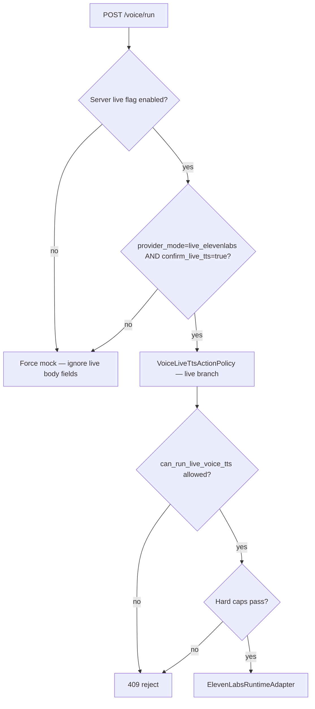

# Phase 11H-2b — Real ElevenLabs Runtime Adapter Design + Approval Request

**Status:** Design + approval request only — no implementation, no ElevenLabs API calls  
**Date:** 2026-05-31  
**Prerequisites:** Phase 11H-2a complete (mock `/voice/run` end-to-end)  
**Goal:** Define the real ElevenLabs runtime adapter and the exact approval boundary for enabling live voice generation in Phase 11H-2c+

---

## Executive summary

Phase 11H-2a proved the execution shell: policy gate, engine lifecycle, artifact validation, manifest writing, cooperative cancel structure, and video slot isolation — all with `provider_mode=mock` and `real_provider_called=false`.

Phase 11H-2b designs **`elevenlabs_runtime_adapter.py`** as the **single approved Content Brain import site** for live ElevenLabs HTTP, and defines how `/voice/run` may **later** accept `provider_mode=live_elevenlabs` behind multiple fail-closed gates.

**Nothing in this phase enables live mode.** The current endpoint remains mock-only until explicit user approval for 11H-2c.

---

## Current state (11H-2a baseline)

| Component | Status |
|---|---|
| `POST /sessions/{session_id}/voice/run` | ✅ Exists — mock only |
| `LiveVoiceTtsEngine` | ✅ Mock provider wired |
| `MockVoiceTtsProvider` | ✅ Fake MP3, no network |
| `voice_live_tts_action_policy.py` | ✅ Approval + guard checks |
| `VoiceRunService` | ✅ Hardcodes `provider_mode=mock` |
| `ElevenLabsConfigResolver` | ✅ Read-only config, `has_api_key` boolean |
| Legacy `ElevenLabsVoiceProvider` | ⚠️ Exists in `providers/` — **not used by Content Brain runtime** |

### Architecture today

```
POST /voice/run
  → VoiceRunService (mock forced)
  → LiveVoiceTtsEngine
       → evaluate_voice_live_tts_run()
       → can_run_live_voice_tts()
       → MockVoiceTtsProvider.synthesize_segment()
       → AudioArtifactValidator
       → voice_manifest.json
```

Video dispatch and Runway/Hailuo paths are unchanged.

---

## 1. Real adapter architecture

### Module

```
content_brain/execution/elevenlabs_runtime_adapter.py
```

**This is the only file in `content_brain/` permitted to perform live ElevenLabs HTTP** once 11H-2c+ is approved.

### Design principle: adapter, not legacy import

```
LiveVoiceTtsEngine
  → ProviderProtocol (abstract)
       ├── MockVoiceTtsProvider          (11H-2a — exists)
       └── ElevenLabsRuntimeAdapter        (11H-2c — new)
              → requests POST (injected http_client for tests)
              → ElevenLabsConfigResolver  (config only — no key in snapshot)
              → os.getenv(api_key_env)    (server-side only, never logged)
```

**Do not** import `providers.elevenlabs_voice_provider.ElevenLabsVoiceProvider` from Content Brain runtime code. That legacy class:

- Calls `load_dotenv()` in constructor
- Raises in `__init__` if key missing (bad for policy-first flow)
- Uses `print()` statements
- Embeds API key in exception messages via `response.text`

The runtime adapter reimplements the REST call with hardened behavior aligned to 11H-1a config and 11H-2a engine contracts.

### Class design

```python
PROVIDER_ID = "elevenlabs"
PROVIDER_MODE_LIVE = "live_elevenlabs"
ADAPTER_VERSION = "11h2b_v1"

@dataclass
class ElevenLabsSegmentResult:
    success: bool
    output_path: str
    segment_index: int
    character_count: int
    size_bytes: int = 0
    text_hash: str = ""
    voice_id: str = ""
    model_id: str = ""
    output_format: str = ""
    http_status: int | None = None
    latency_ms: int | None = None
    request_id: str | None = None       # from response headers if present
    reject_code: str | None = None
    reject_reasons: list[str] = field(default_factory=list)
    retried: bool = False
    retry_count: int = 0
    real_provider_called: bool = True

    def to_dict(self) -> dict[str, Any]: ...


class ElevenLabsRuntimeAdapter:
    DEFAULT_TIMEOUT_SECONDS = 120
    MAX_RETRY_ATTEMPTS = 3
    RETRYABLE_STATUS = frozenset({429, 500, 502, 503, 504})
    BACKOFF_BASE_SECONDS = 2.0

    def __init__(
        self,
        *,
        config: ElevenLabsConfigSnapshot,
        api_key: str,                    # injected by engine — never stored on session
        timeout_seconds: int = DEFAULT_TIMEOUT_SECONDS,
        max_retry_attempts: int = MAX_RETRY_ATTEMPTS,
        cancel_check: Callable[[], bool] | None = None,
        http_client: HttpClientProtocol | None = None,  # tests inject mock
    ): ...

    def synthesize_segment(
        self,
        segment: NarrationSegment,
        output_path: str | Path,
    ) -> ElevenLabsSegmentResult: ...
```

### Responsibilities

| Responsibility | Design |
|---|---|
| Single HTTP site | All `api.elevenlabs.io` calls go through this adapter |
| Config | Voice/model/format from `ElevenLabsConfigResolver.resolve(session)` |
| API key | Read via `os.getenv(config.api_key_env)` in engine; pass to adapter constructor; **never** in `to_dict()`, logs, manifest, or API responses |
| Input | Accept `NarrationSegment` (text, segment_index, text_hash, beat_id) |
| Output | Normalized `ElevenLabsSegmentResult` matching mock provider shape + live fields |
| Timeout | `timeout_seconds` per request (default 120) |
| Retry | Exponential backoff on 429/5xx; max 3 attempts; increment `retry_count` |
| Cancel | Call `cancel_check()` before each attempt and between retries; return `ELEVENLABS_CANCELLED` |
| Errors | Map HTTP/network to taxonomy codes (§5); strip response bodies from user-facing messages |
| Empty audio | After write, reject if `size_bytes == 0` → `ELEVENLABS_EMPTY_AUDIO` |
| Legacy isolation | No import of `NarrationEngine`, `TimelineEngine`, `full_video_pipeline` |

### HTTP contract (aligned with legacy provider)

```
POST https://api.elevenlabs.io/v1/text-to-speech/{voice_id}?output_format={output_format}

Headers:
  xi-api-key: <injected>
  Content-Type: application/json

Body:
  {
    "text": "<segment.text>",
    "model_id": "<config.model_id>",
    "voice_settings": {
      "stability": 0.45,
      "similarity_boost": 0.85,
      "style": 0.35,
      "use_speaker_boost": true
    }
  }
```

### Request ID capture

If ElevenLabs returns tracing headers (e.g. `x-request-id`, `request-id`), store on segment result and propagate to manifest. If absent, omit field — do not fabricate.

### Provider factory (engine extension — 11H-2c)

```python
def _build_provider(self, session, cancel_check, provider_mode: str):
    if provider_mode == PROVIDER_MODE_MOCK:
        return MockVoiceTtsProvider(cancel_check=cancel_check)
    if provider_mode == PROVIDER_MODE_LIVE:
        config = ElevenLabsConfigResolver(self.project_root).resolve(session)
        api_key = os.getenv(config.api_key_env, "").strip()
        if not api_key:
            raise VoiceRunPreconditionError("ELEVENLABS_KEY_MISSING")
        return ElevenLabsRuntimeAdapter(config=config, api_key=api_key, cancel_check=cancel_check)
    raise VoiceRunPreconditionError("INVALID_PROVIDER_MODE")
```

In **11H-2a/2b**, factory always returns mock. Live branch is dead code until 11H-2c approval + server flag.

---

## 2. `/voice/run` live mode gating

### Current request (11H-2a — unchanged until 11H-2c)

```json
{
  "triggered_by": "local_user",
  "reason": "",
  "force_retry": false
}
```

`provider_mode` is implicitly `mock`. Service hardcodes mock.

### Future request (11H-2c+ — design only)

```json
{
  "triggered_by": "local_user",
  "reason": "Operator confirmed live voice generation",
  "force_retry": false,
  "provider_mode": "live_elevenlabs",
  "confirm_live_tts": true
}
```

### Gating layers (all must pass for live)



### Layer 1: Server-side master switch (fail closed)

```python
# config or env — NOT client-controlled
VOICE_LIVE_TTS_ENABLED = os.getenv("MODIR_VOICE_LIVE_TTS_ENABLED", "false").lower() == "true"
```

| `MODIR_VOICE_LIVE_TTS_ENABLED` | Body requests live | Result |
|---|---|---|
| `false` (default) | any | **Mock only** — live fields ignored, optional warning in response metadata |
| `true` | missing/`mock` | Mock |
| `true` | `live_elevenlabs` + `confirm_live_tts=true` | Live path eligible for policy |

**11H-2b/2c default:** env unset → live impossible regardless of request body.

### Layer 2: Request body gates

| Field | Required for live | Rule |
|---|---|---|
| `provider_mode` | yes | Must be exactly `"live_elevenlabs"` |
| `confirm_live_tts` | yes | Must be `true` — explicit operator confirmation |
| `triggered_by` | recommended | Audit actor |

If `provider_mode=live_elevenlabs` but `confirm_live_tts=false` → `409 LIVE_TTS_NOT_CONFIRMED`.

Pydantic schema (future):

```python
class VoiceRunRequest(BaseModel):
    triggered_by: str = "local_user"
    reason: str = ""
    force_retry: bool = False
    provider_mode: Literal["mock", "live_elevenlabs"] = "mock"
    confirm_live_tts: bool = False

    @model_validator(mode="after")
    def live_requires_confirm(self):
        if self.provider_mode == "live_elevenlabs" and not self.confirm_live_tts:
            raise ValueError("confirm_live_tts must be true for live_elevenlabs")
        return self
```

### Layer 3: Existing policy + guard (unchanged semantics)

`evaluate_voice_live_tts_run()` extended for live branch:

| Check | Live-specific |
|---|---|
| Session not archived | ✅ |
| Not cancelled | ✅ |
| Narration exists | ✅ |
| Preflight ready | ✅ |
| Credentials (`has_api_key`) | ✅ → maps to `ELEVENLABS_KEY_MISSING` at adapter |
| `live_tts_requested=true` | ✅ |
| `approval_state=approved` (not expired/rejected) | ✅ |
| `can_run_live_voice_tts().allowed` | ✅ mandatory immediately before first HTTP |
| Hard caps (§3) | ✅ new live-only checks |
| Cost/character estimates present | ✅ fail closed if missing for live |

### Layer 4: Approve still does not auto-run

`POST /voice/approve` remains metadata-only. Live execution requires separate `POST /voice/run` with live body + server flag.

### Response differences (live vs mock)

| Field | Mock (11H-2a) | Live (future) |
|---|---|---|
| `provider_mode` | `"mock"` | `"live_elevenlabs"` |
| `real_provider_called` | `false` | `true` |
| `tts_executed` | `true` on success | `true` on success |
| `manifest.provider` | `mock_elevenlabs` | `elevenlabs` |

---

## 3. Hard caps

Initial safety caps for live mode. Stored as constants in adapter + policy (single source in `voice_live_tts_safety_caps.py` optional).

| Cap | Initial value | Enforced at | Fail code |
|---|---|---|---|
| `max_segments_per_run` | **20** | Policy (before run) | `PRECHECK_FAILED` |
| `max_characters_per_run` | **5000** | Policy + guard (existing `DEFAULT_MAX_CHARACTERS`) | `VOICE_CHARACTER_LIMIT_EXCEEDED` |
| `max_retry_attempts` | **3** | Adapter per segment | (internal; surfaced in manifest `retry_count`) |
| `timeout_seconds` | **120** | Adapter per HTTP call | `ELEVENLABS_TIMEOUT` |
| `max_estimated_cost_usd` | **5.00** | Policy + guard (existing `DEFAULT_MAX_COST_USD`) | `VOICE_COST_LIMIT_EXCEEDED` |
| `min_artifact_bytes` | **1** | `AudioArtifactValidator` | `ARTIFACT_VALIDATION_FAILED` |

### Fail-closed estimate rules (live only)

Before first HTTP call, policy must verify:

```python
approval = voice_slot["approval"]
character_count = approval.get("estimated_character_count")
segment_count = approval.get("estimated_segment_count")
estimated_cost = approval.get("estimated_voice_cost")

if any(v is None for v in (character_count, segment_count, estimated_cost)):
    block("ESTIMATES_MISSING")  # new code — live only

if segment_count > MAX_SEGMENTS_PER_RUN:
    block("PRECHECK_FAILED")

if character_count > MAX_CHARACTERS_PER_RUN:
    block("VOICE_CHARACTER_LIMIT_EXCEEDED")

if float(estimated_cost) > MAX_ESTIMATED_COST_USD:
    block("VOICE_COST_LIMIT_EXCEEDED")
```

Mock mode (11H-2a) may continue using adapter summary counts without requiring pre-approved estimates beyond existing guard — **no change to mock behavior**.

### Cap snapshot in manifest

```json
"safety_caps": {
  "max_segments_per_run": 20,
  "max_characters_per_run": 5000,
  "max_estimated_cost_usd": 5.0,
  "timeout_seconds": 120,
  "max_retry_attempts": 3
}
```

---

## 4. Manifest schema (live)

Extends 11H-2a manifest. Mock manifest unchanged.

### Live `voice_manifest.json`

```json
{
  "manifest_version": "11h2c_v1",
  "session_id": "exec_abc123",
  "category": "voice_generation",
  "provider": "elevenlabs",
  "provider_mode": "live_elevenlabs",
  "voice_id": "JBFqnCBsd6RMkjVDRZzb",
  "model_id": "eleven_multilingual_v2",
  "output_format": "mp3_44100_128",
  "segment_count": 2,
  "character_count": 428,
  "total_size_bytes": 294912,
  "files": [
    {
      "segment_index": 1,
      "file_name": "narration_001.mp3",
      "file_path": ".../narration_001.mp3",
      "size_bytes": 147456,
      "character_count": 214,
      "text_hash": "sha256:…",
      "beat_id": "HOOK",
      "validation_status": "valid",
      "request_id": "req_abc123",
      "retry_count": 0,
      "latency_ms": 2340
    }
  ],
  "created_at": "2026-05-31 14:30:05",
  "started_at": "2026-05-31 14:29:50",
  "completed_at": "2026-05-31 14:30:05",
  "duration_seconds": 15.0,
  "cost_estimate": {
    "amount": 0.0128,
    "currency": "USD",
    "confidence": "low",
    "source": "provider_cost_catalog"
  },
  "validation_status": "valid",
  "execution_status": "completed",
  "partial": false,
  "tts_executed": true,
  "real_provider_called": true,
  "retry_count": 0,
  "engine_version": "11h2c_v1",
  "adapter_version": "11h2b_v1",
  "safety_caps": { }
}
```

### Required live-only fields

| Field | Rule |
|---|---|
| `provider` | `"elevenlabs"` |
| `provider_mode` | `"live_elevenlabs"` |
| `voice_id` | From config snapshot |
| `model_id` | From config snapshot |
| `real_provider_called` | `true` |
| `tts_executed` | `true` only when validation passes |
| `request_id` | Per-file if provider returns; optional at manifest level for last segment |
| `retry_count` | Sum or max across segments |
| `validation_status` | `"valid"` \| `"partial"` \| `"invalid"` |

### Mock manifest (unchanged)

| Field | Value |
|---|---|
| `provider` | `mock_elevenlabs` |
| `provider_mode` | `mock` |
| `real_provider_called` | `false` |

---

## 5. Failure taxonomy

### Voice live TTS codes (11H-2c registry extension)

Add to `failure_taxonomy.py` in implementation phase:

| Code | Category | Retriable | HTTP | When |
|---|---|---|---|---|
| `ELEVENLABS_KEY_MISSING` | PREFLIGHT_REJECT | false | 409 | No API key at live run time |
| `ELEVENLABS_RATE_LIMIT` | RUNTIME_ERROR | true | 409 | HTTP 429 after retries exhausted |
| `ELEVENLABS_TIMEOUT` | RUNTIME_ERROR | true | 409 | Request timeout |
| `ELEVENLABS_HTTP_ERROR` | RUNTIME_ERROR | true/false | 409 | Other HTTP errors (4xx non-retryable) |
| `ELEVENLABS_EMPTY_AUDIO` | ARTIFACT_REJECT | false | 409 | Zero-byte response body |
| `ELEVENLABS_CANCELLED` | OPERATIONS | false | 200/409 | Cooperative cancel during live run |
| `ARTIFACT_VALIDATION_FAILED` | ARTIFACT_REJECT | false | 409 | Post-generation validator fail |
| `APPROVAL_REQUIRED` | DISPATCH_REJECT | false | 409 | Not approved / rejected |
| `APPROVAL_EXPIRED` | DISPATCH_REJECT | false | 409 | Approval TTL elapsed |
| `LIVE_TTS_NOT_CONFIRMED` | DISPATCH_REJECT | false | 409 | Live body without `confirm_live_tts` |
| `LIVE_TTS_DISABLED` | DISPATCH_REJECT | false | 409 | Server flag off but live requested |
| `ESTIMATES_MISSING` | PREFLIGHT_REJECT | false | 409 | Live run missing cost/char estimates |

### Mapping from existing guard codes

| Guard code (11H-1e) | Live run code |
|---|---|
| `CREDENTIALS_MISSING` | `ELEVENLABS_KEY_MISSING` |
| `VOICE_APPROVAL_REQUIRED` | `APPROVAL_REQUIRED` |
| `APPROVAL_EXPIRED` | `APPROVAL_EXPIRED` |
| `VOICE_CHARACTER_LIMIT_EXCEEDED` | (same, or `PRECHECK_FAILED`) |
| `VOICE_COST_LIMIT_EXCEEDED` | (same) |
| `OPERATIONS_CANCELLED` | `ELEVENLABS_CANCELLED` |

### HTTP status → adapter code

| Condition | Code |
|---|---|
| HTTP 429 (retries exhausted) | `ELEVENLABS_RATE_LIMIT` |
| Timeout / connection error | `ELEVENLABS_TIMEOUT` |
| HTTP 500–504 (retries exhausted) | `ELEVENLABS_HTTP_ERROR` |
| HTTP 401/403 | `ELEVENLABS_KEY_MISSING` or `ELEVENLABS_HTTP_ERROR` (no key in message) |
| HTTP 200, empty body | `ELEVENLABS_EMPTY_AUDIO` |
| Other 4xx | `ELEVENLABS_HTTP_ERROR` (non-retriable) |

---

## 6. Validation plan (future implementation)

### Module

```
project_brain/validate_11h2c_elevenlabs_runtime_adapter.py
```

(11H-2c implements adapter with **mocked HTTP only** — no real API calls in CI.)

### Test matrix (minimum)

| # | Test | Expected |
|---|---|---|
| 1 | Live mode blocked unless `confirm_live_tts=true` | `409 LIVE_TTS_NOT_CONFIRMED` |
| 2 | Live mode blocked when `MODIR_VOICE_LIVE_TTS_ENABLED=false` | `409 LIVE_TTS_DISABLED` or forced mock |
| 3 | Live mode blocked without approval | `409 APPROVAL_REQUIRED` |
| 4 | Live mode blocked with expired approval | `409 APPROVAL_EXPIRED` |
| 5 | Live mode blocked when estimates exceed cap | `409 VOICE_COST_LIMIT_EXCEEDED` |
| 6 | Live mode blocked when segment count exceeds cap | `409 PRECHECK_FAILED` |
| 7 | Mock mode still works (default, no body change) | `200`, `provider_mode=mock`, `real_provider_called=false` |
| 8 | Live adapter tested with mocked HTTP client | Synthetic 200 body → MP3 written |
| 9 | Mocked HTTP 429 → retry → success | `retry_count` incremented |
| 10 | Mocked HTTP 429 exhausted → fail | `ELEVENLABS_RATE_LIMIT` |
| 11 | Mocked timeout → fail | `ELEVENLABS_TIMEOUT` |
| 12 | Empty response body → fail | `ELEVENLABS_EMPTY_AUDIO` |
| 13 | No API key in any response/log/manifest | Static scan PASS |
| 14 | `real_provider_called=true` only in live mode | Mock=false, live=true |
| 15 | Artifact validation required for live success | No `tts_executed` without validator pass |
| 16 | Video slot unchanged after live run | Snapshot preserved |
| 17 | Cancel during live run → `ELEVENLABS_CANCELLED` | Partial manifest optional |
| 18 | `validate_11h2a` still passes (mock regression) | 20/20 |
| 19 | `validate_11h1i` still passes | 16/16 |
| 20 | No `elevenlabs_voice_provider` import outside adapter | Static grep |

### Mocked HTTP test pattern (11H-2c)

```python
class MockHttpClient:
    def post(self, url, *, headers, json, timeout):
        assert "xi-api-key" in headers
        assert headers["xi-api-key"] == "test-key"
        assert "test-key" not in str(json)
        return MockResponse(status_code=200, content=b"\xff\xfb" + b"\x00" * 128)

adapter = ElevenLabsRuntimeAdapter(
    config=config_snapshot,
    api_key="test-key",
    http_client=MockHttpClient(),
)
```

No real network in validator suite.

---

## 7. Files likely to change (implementation phases)

### Phase 11H-2c (adapter + mocked HTTP tests — after approval)

| File | Change |
|---|---|
| `content_brain/execution/elevenlabs_runtime_adapter.py` | **New** — live HTTP adapter |
| `content_brain/execution/live_voice_tts_engine.py` | Provider factory; live manifest fields |
| `content_brain/execution/voice_live_tts_action_policy.py` | Live caps; estimate fail-closed; live confirm checks |
| `content_brain/execution/failure_taxonomy.py` | New ElevenLabs codes |
| `ui/api/schemas/voice_run.py` | Add `provider_mode`, `confirm_live_tts` |
| `ui/api/voice_run_service.py` | Server flag gate; pass mode to engine |
| `ui/api/main.py` | Document live gating in route docstring |
| `project_brain/validate_11h2c_elevenlabs_runtime_adapter.py` | **New** validator |

### Phase 11H-2d (real execution — separate approval)

| Item | Notes |
|---|---|
| Enable `MODIR_VOICE_LIVE_TTS_ENABLED=true` in controlled env | Operator-controlled only |
| Manual smoke test with real key | Outside CI |
| Cost telemetry recording | Append `operations.voice_cost_events[]` |

### Must NOT change

| Area | Rule |
|---|---|
| `provider_runtime_engine.py` | No voice execution on video dispatch |
| Runway / Hailuo modules | Untouched |
| `engines/narration_engine.py` | Legacy — no Content Brain import |
| `pipelines/full_video_pipeline.py` | Untouched |
| `providers/elevenlabs_voice_provider.py` | Legacy — do not wire into runtime; optional doc-only deprecation note |

---

## 8. Exact implementation boundaries

### In scope for 11H-2c (after approval)

- Implement `ElevenLabsRuntimeAdapter` with injectable HTTP client
- Extend engine factory to select adapter when server flag + body gates pass
- Extend policy for live caps and estimate fail-closed
- Extend manifest for live fields
- Validator with **mocked HTTP only** — no real ElevenLabs in CI
- Mock mode remains default; 11H-2a validator continues to pass

### Out of scope for 11H-2c

- Enabling live mode by default
- Client-only live toggle (must require server flag)
- Real ElevenLabs calls in automated tests
- UI "Run Live Voice" button (separate phase)
- FFmpeg / duration validation
- Automatic artifact cleanup
- Video dispatch changes

### In scope for 11H-2d (separate approval)

- `MODIR_VOICE_LIVE_TTS_ENABLED=true` in operator environment
- First real paid TTS execution under manual supervision
- Production cost telemetry

---

## 9. Security checklist (live enablement)

| Control | Mechanism |
|---|---|
| No accidental live | Server env flag default `false` |
| Double confirm | `provider_mode=live_elevenlabs` + `confirm_live_tts=true` |
| Approval gate | Category-scoped voice approval + `can_run_live_voice_tts()` |
| Cost/char caps | Policy fail-closed before HTTP |
| Key secrecy | Inject at runtime; never in session JSON, API, manifest, logs |
| Audit trail | `operations.voice_tts_audit[]` records mode, actor, `real_provider_called` |
| Video isolation | Snapshot check after every run |
| Rollback | Set env flag `false` — immediate live disable |

---

## Phase gate

| Phase | Status |
|---|---|
| 11H-2a Mock live TTS engine | ✅ Complete |
| **11H-2b Design + approval request (this document)** | ✅ **Complete** |
| 11H-2c Implement adapter + mocked HTTP tests | 🔒 Blocked — requires explicit approval |
| 11H-2d Enable real live execution | 🔒 Blocked — requires separate approval |

---

## Approval request

> **Implementation of real ElevenLabs live TTS is NOT included in this phase.**
>
> To proceed to **Phase 11H-2c** (implement `ElevenLabsRuntimeAdapter` with mocked HTTP tests only), **explicit user approval is required**.
>
> Phase 11H-2c will:
> - Add the adapter module and wire it behind server flag + body gates
> - **Not** enable live mode by default
> - **Not** make real ElevenLabs API calls in validators or CI
>
> To proceed to **Phase 11H-2d** (first real paid TTS under controlled environment), a **second explicit approval** is required after 11H-2c passes.

### Approval checklist (for user)

- [ ] Approve 11H-2c: implement adapter + mocked HTTP tests (no real API)
- [ ] Approve 11H-2d separately: enable `MODIR_VOICE_LIVE_TTS_ENABLED` for real execution
- [ ] Confirm hard caps acceptable (20 segments / 5000 chars / $5 estimate / 120s timeout / 3 retries)
- [ ] Confirm live requires both server flag and `confirm_live_tts=true` in request body

---

## Next recommended slice (after approval)

**Phase 11H-2c — Implement Real ElevenLabs Adapter with Mocked HTTP Tests Only**

1. Create `elevenlabs_runtime_adapter.py`
2. Extend `LiveVoiceTtsEngine` provider factory (live branch dead unless flag set)
3. Extend `VoiceRunRequest` schema — live fields rejected when flag off
4. Add `validate_11h2c_elevenlabs_runtime_adapter.py`
5. Confirm `validate_11h2a` + 11H-1i + 11G still pass

**Do not start 11H-2c without explicit approval.**

---

*Design only. No ElevenLabs API calls. No live mode enabled. Video/Runway/Hailuo/legacy pipeline unchanged.*
