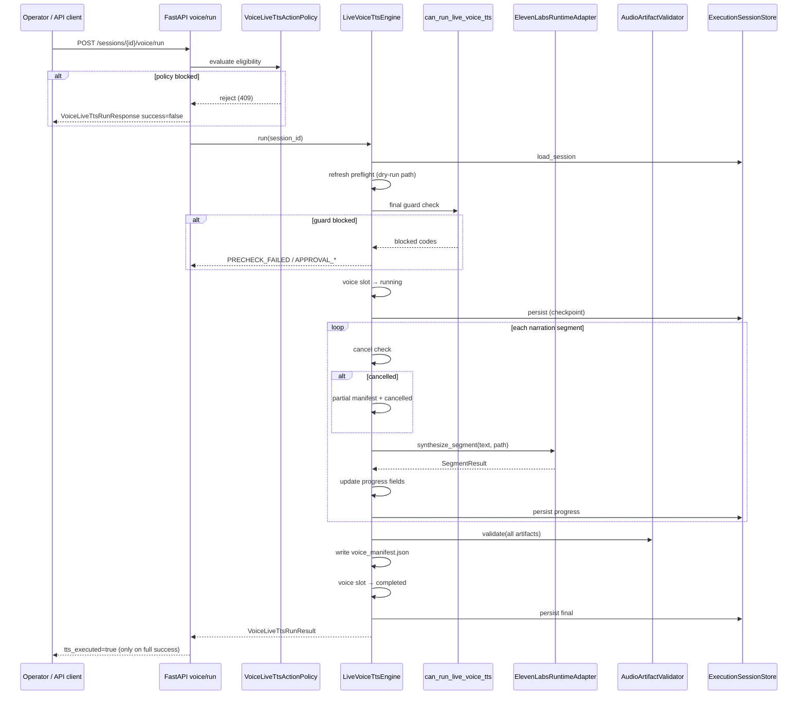
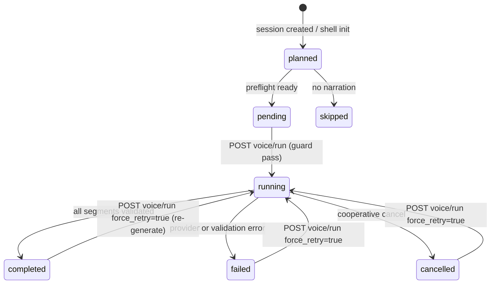

# Phase 11H-2 — Live ElevenLabs TTS Execution Design

**Status:** Design only — no implementation, no ElevenLabs API calls, no audio generation  
**Date:** 2026-05-28  
**Prerequisites:** Phase 11G, 11H-1a–1j complete (11H-1j PASS)  
**Goal:** Define the first safe, isolated, approval-gated live TTS execution path for Content Brain Runtime

---

## Executive summary

Phase 11H-2 introduces **one explicit execution trigger** — `POST /sessions/{session_id}/voice/run` — that runs live ElevenLabs TTS **only after** the existing `can_run_live_voice_tts()` guard passes. Approval (`POST …/voice/approve`) remains metadata-only and **never auto-runs** TTS.

Execution is handled by a new **`LiveVoiceTtsEngine`** that:

1. Refreshes preflight (read-only probe path)
2. Re-evaluates the full guard checklist
3. Generates one MP3 per narration segment via a hardened **runtime adapter** (not legacy `NarrationEngine`)
4. Validates artifacts with **`AudioArtifactValidator`**
5. Writes **`voice_manifest.json`**
6. Updates **`voice_generation` lifecycle only** — video slot untouched

**Implementation requires separate explicit user approval.** This document does not implement any of the above.

---

## Design principles

| Principle | Rule |
|---|---|
| Explicit trigger | No auto-run on approve, video dispatch, or queue dequeue |
| Guard-first | `can_run_live_voice_tts()` must pass immediately before first HTTP |
| Category isolation | Mutate only `voice_generation` + voice audit/telemetry blocks |
| Credential safety | API key injected server-side; never in responses, logs, or manifest |
| Cooperative cancel | Check session cancel flag before each segment |
| Artifact proof | No `executed=True` / `live_tts=True` until validation passes |
| Legacy isolation | Do not import `NarrationEngine`, `full_video_pipeline`, or wire into `ProviderRuntimeEngine.dispatch` |

---

## Execution architecture

### High-level flow



### Module map (proposed)

```
ui/api/main.py
  └── POST /sessions/{id}/voice/run
        └── VoiceLiveTtsService
              └── LiveVoiceTtsEngine
                    ├── voice_live_tts_action_policy (eligibility)
                    ├── apply_voice_preflight_dry_run (refresh)
                    ├── can_run_live_voice_tts (guard)
                    ├── SessionNarrationAdapter (segments)
                    ├── ElevenLabsConfigResolver (config, no secrets)
                    ├── ElevenLabsRuntimeAdapter (HTTP only)
                    ├── AudioArtifactValidator (post-gen)
                    └── voice_manifest_builder (manifest write)
```

### Isolation from video dispatch

```
ProviderRuntimeEngine.dispatch          LiveVoiceTtsEngine.run
  CATEGORY_VIDEO only                   CATEGORY_VOICE only
  Runway / Hailuo clips                 ElevenLabs TTS segments
  apply_voice_preflight_dry_run()       apply_voice_preflight_dry_run() (refresh only)
  (additive metadata hook)              (separate HTTP route — not called from dispatch)
```

Video dispatch continues to call `apply_voice_preflight_dry_run()` for observability. That hook **must be updated in implementation** to avoid clobbering a completed voice run (`executed=True`) — see [Preflight coexistence](#preflight-coexistence-with-completed-runs).

---

## 1. Live TTS execution trigger

### Route

```
POST /sessions/{session_id}/voice/run
```

**Purpose:** Sole entry point for live ElevenLabs TTS in Content Brain Runtime.

### Request body (`VoiceLiveTtsRunRequest`)

```json
{
  "triggered_by": "local_user",
  "reason": "Operator initiated live voice generation",
  "force_retry": false
}
```

| Field | Type | Default | Notes |
|---|---|---|---|
| `triggered_by` | string | `"local_user"` | Audit actor |
| `reason` | string | `""` | Optional operator note |
| `force_retry` | bool | `false` | Allow re-run when slot is `failed` or `cancelled` (still requires fresh guard pass) |

### Response body (`VoiceLiveTtsRunResponse`)

```json
{
  "success": true,
  "session_id": "exec_…",
  "tts_executed": true,
  "execution_status": "completed",
  "message": "Live voice TTS completed.",
  "code": null,
  "reject_reasons": [],
  "segment_count": 3,
  "artifacts_validated": true,
  "voice_slot": { },
  "guard_result": { },
  "manifest_path": "storage/content_brain/execution/artifacts/{session_id}/voice_generation/voice_manifest.json",
  "panel_excerpt": { },
  "audit_event": { },
  "api_version": "0.7.0"
}
```

| Field | Rule |
|---|---|
| `tts_executed` | `true` **only** when all segments generated, validated, and manifest written |
| `tts_executed` | `false` on reject, guard block, cancel, provider error, validation failure |
| `execution_status` | `completed` \| `failed` \| `cancelled` \| `rejected` (pre-run block) |

### Eligibility rules (`VoiceLiveTtsActionPolicy`)

Evaluated **before** engine starts. All must pass:

| # | Rule | Block code |
|---|---|---|
| 1 | Session exists, not archived | `SESSION_ARCHIVED` |
| 2 | `operations_control.cancel_requested` is false | `CANCELLED` |
| 3 | Narration not skipped (`SessionNarrationAdapter`) | `PRECHECK_FAILED` / `NO_NARRATION` |
| 4 | Preflight ready (`voice_preflight.ready == true`) | `PRECHECK_FAILED` |
| 5 | Credentials present (`has_api_key`) | `CREDENTIALS_MISSING` |
| 6 | `live_tts_requested == true` | `LIVE_TTS_NOT_REQUESTED` |
| 7 | Effective approval state == `approved` | `APPROVAL_REQUIRED` |
| 8 | Approval not expired | `APPROVAL_EXPIRED` |
| 9 | Approval not rejected | `APPROVAL_REQUIRED` |
| 10 | `can_run_live_voice_tts().allowed == true` | mapped block codes |
| 11 | Voice slot not already `running` | `JOB_ALREADY_ACTIVE` |
| 12 | Voice slot state allows run: `pending` or (`failed`/`cancelled` with `force_retry`) | `INVALID_VOICE_STATE` |

### Explicit non-triggers

| Event | Must NOT run TTS |
|---|---|
| `POST …/voice/approve` | ✅ Metadata only (11H-1g) |
| `ProviderRuntimeEngine.dispatch` | ✅ Video only |
| Queue dequeue / worker tick | ✅ No voice worker in 11H-2 |
| UI approval success callback | ✅ Refresh only |

### HTTP semantics

| Outcome | HTTP |
|---|---|
| Pre-run policy/guard reject | `409 Conflict` |
| Session not found | `404` |
| Success (full completion) | `200` |
| Cancelled mid-run (partial artifacts kept) | `200` with `success=false`, `execution_status=cancelled` |
| Provider/validation failure | `409` with `execution_status=failed` |

---

## 2. Execution engine

### Module

```
content_brain/execution/live_voice_tts_engine.py
```

### Class: `LiveVoiceTtsEngine`

```python
class LiveVoiceTtsEngine:
    ENGINE_VERSION = "11h2_v1"

    def __init__(self, store: ExecutionSessionStore, *, project_root: Path | None = None): ...

    def run(
        self,
        session_id: str,
        *,
        triggered_by: str = "local_user",
        reason: str = "",
        force_retry: bool = False,
    ) -> LiveVoiceTtsRunResult: ...
```

### Responsibilities

| Step | Action |
|---|---|
| 1 | Load session; `ensure_multi_category_shell()` |
| 2 | Snapshot video slot (before) |
| 3 | `apply_voice_preflight_dry_run()` — refresh narration + preflight metadata |
| 4 | `VoiceLiveTtsActionPolicy.evaluate()` — pre-run eligibility |
| 5 | `can_run_live_voice_tts()` — final guard (mandatory immediately before HTTP) |
| 6 | Acquire voice execution lock (session-level, voice category only) |
| 7 | Transition slot: `pending` → `running`; set progress block |
| 8 | Resolve config via `ElevenLabsConfigResolver` (no key in slot) |
| 9 | Build segments via `SessionNarrationAdapter` |
| 10 | For each segment: cancel check → adapter call → validate single file → update progress → persist |
| 11 | Run batch `AudioArtifactValidator` + manifest consistency check |
| 12 | Write `voice_manifest.json` |
| 13 | Transition: `running` → `completed` \| `failed` \| `cancelled` |
| 14 | Append `operations.voice_tts_audit[]` event |
| 15 | Append cost telemetry event |
| 16 | Verify video slot unchanged; release lock |

### Segment generation strategy

**Recommended: one MP3 per narration segment** (not combined).

| Approach | Pros | Cons |
|---|---|---|
| **Per-segment (chosen)** | Progress granularity, cancel between segments, matches `SessionNarrationAdapter`, partial manifest on cancel | More API calls |
| Combined single file | One API call | No partial progress, harder cancel, re-run all on failure |

File naming: `narration_{index:03d}.mp3` (e.g. `narration_001.mp3`).

Segment payload maps `NarrationSegment.text` → adapter; metadata (beat_id, clip_number, text_hash) stored in manifest per file.

### Voice slot fields updated by engine

```json
{
  "status": "running",
  "state": "running",
  "executed": false,
  "dry_run": false,
  "live_tts": false,
  "live_tts_executed": false,
  "provider": "elevenlabs",
  "artifact_root": "<resolved path>",
  "artifacts": [],
  "voice_manifest_path": null,
  "live_tts_progress": {
    "engine_version": "11h2_v1",
    "current_segment": 0,
    "total_segments": 0,
    "progress_percent": 0,
    "last_error": null,
    "retry_count": 0,
    "started_at": null,
    "completed_at": null,
    "duration_seconds": null,
    "cancelled_at": null,
    "partial_artifact_count": 0
  },
  "error": null
}
```

On **success**:

- `status` / `state` → `completed`
- `executed` → `true`
- `live_tts` → `true`
- `live_tts_executed` → `true`
- `artifacts` → validated artifact records
- `voice_manifest_path` → path to manifest
- `live_tts_progress.completed_at` / `duration_seconds` set

On **failure** / **cancel**:

- `status` / `state` → `failed` or `cancelled`
- `executed` remains `false` (or `true` only if policy allows partial success — **not in 11H-2**; partial = not executed)
- `live_tts_executed` → `false`
- `error` → structured `{ code, message, category }`

### Video slot preservation

Same pattern as `VoiceApprovalOperationsEngine`:

```python
keys = ("state", "provider", "started_at", "completed_at")
# Raise RuntimeError if video slot critical fields differ after run
```

---

## 3. Provider wrapper

### Module

```
content_brain/execution/elevenlabs_runtime_adapter.py
```

**Single approved import site** for live ElevenLabs HTTP in Content Brain Runtime.

### Design: adapter over legacy provider (not direct import from engine)

```
LiveVoiceTtsEngine
  → ElevenLabsRuntimeAdapter
       → (internal) requests POST or thin delegate to ElevenLabsVoiceProvider
```

Prefer **new adapter with injected config** rather than constructing legacy `ElevenLabsVoiceProvider` (which calls `load_dotenv()` and raises in `__init__`).

### Class: `ElevenLabsRuntimeAdapter`

```python
@dataclass
class ElevenLabsSegmentResult:
    success: bool
    output_path: str
    character_count: int
    provider_status_code: int | None
    latency_ms: int | None
    reject_code: str | None
    reject_reasons: list[str]
    retried: bool = False

class ElevenLabsRuntimeAdapter:
    DEFAULT_TIMEOUT_SECONDS = 120
    MAX_RETRIES = 3
    RETRYABLE_STATUS = frozenset({429, 500, 502, 503, 504})

    def __init__(
        self,
        *,
        api_key: str,           # injected — never stored on session
        voice_id: str,
        model_id: str,
        output_format: str,
        timeout_seconds: int = DEFAULT_TIMEOUT_SECONDS,
        cancel_check: Callable[[], bool] | None = None,
    ): ...

    def synthesize_segment(self, text: str, output_path: Path) -> ElevenLabsSegmentResult: ...
```

### Safety rules

| Rule | Implementation |
|---|---|
| No key exposure | `api_key` constructor param from `os.getenv` via resolver; never in `to_dict()`, logs, or errors |
| No key in exception messages | Strip response bodies; map to `PROVIDER_ERROR` |
| Timeout | `requests.post(..., timeout=timeout_seconds)` |
| Retry | Exponential backoff on 429/5xx; max 3; increment engine `retry_count` |
| Cancellation | Call `cancel_check()` before each attempt and between retries |
| Structured errors | Map HTTP status → taxonomy codes (see §8) |
| No print statements | Replace legacy `[ElevenLabs]` prints with structured audit only |

### Provider result normalization

```python
{
  "provider": "elevenlabs",
  "provider_category": "voice_generation",
  "voice_id": "...",
  "model_id": "...",
  "output_format": "mp3_44100_128",
  "segment_index": 1,
  "character_count": 142,
  "output_path": ".../narration_001.mp3",
  "size_bytes": 98304,
  "latency_ms": 2340,
  "http_status": 200,
  "retried": false
}
```

---

## 4. Artifact convention

### Physical path (aligned with `ExecutionSessionStore`)

```
storage/content_brain/execution/artifacts/{session_id}/voice_generation/
├── narration_001.mp3
├── narration_002.mp3
├── narration_003.mp3
└── voice_manifest.json
```

**Resolver:**

```python
artifact_root = store.artifact_dir(session_id, CATEGORY_VOICE)
# CATEGORY_VOICE == "voice_generation"
```

### Operator-facing alias

The logical convention requested for documentation:

```
outputs/content_brain/sessions/{session_id}/voice/
```

**Design decision:** Use the existing store path (`storage/.../artifacts/.../voice_generation/`) for implementation consistency with video artifacts. Document the `outputs/...` path as a **future symlink or UI display alias** only — do not introduce a parallel output root in 11H-2.

### Artifact record (per file, on voice slot)

```json
{
  "artifact_id": "voice_seg_001",
  "segment_index": 1,
  "file_path": "storage/content_brain/execution/artifacts/exec_abc/voice_generation/narration_001.mp3",
  "file_name": "narration_001.mp3",
  "extension": ".mp3",
  "size_bytes": 98304,
  "character_count": 142,
  "text_hash": "sha256:…",
  "beat_id": "beat_01",
  "validation_status": "valid",
  "validated_at": "2026-05-28 14:30:00"
}
```

---

## 5. Manifest schema

### File: `voice_manifest.json`

```json
{
  "manifest_version": "11h2_v1",
  "session_id": "exec_abc123",
  "provider": "elevenlabs",
  "provider_category": "voice_generation",
  "voice_id": "JBFqnCBsd6RMkjVDRZzb",
  "model_id": "eleven_multilingual_v2",
  "output_format": "mp3_44100_128",
  "segment_count": 3,
  "character_count": 428,
  "total_size_bytes": 294912,
  "files": [
    {
      "segment_index": 1,
      "file_name": "narration_001.mp3",
      "file_path": "…/narration_001.mp3",
      "size_bytes": 98304,
      "character_count": 142,
      "text_hash": "sha256:…",
      "beat_id": "beat_01",
      "validation_status": "valid"
    }
  ],
  "created_at": "2026-05-28 14:30:05",
  "started_at": "2026-05-28 14:29:50",
  "completed_at": "2026-05-28 14:30:05",
  "duration_seconds": 15,
  "cost_estimate": {
    "amount": 0.0128,
    "currency": "USD",
    "confidence": "low",
    "source": "provider_cost_catalog"
  },
  "validation_status": "valid",
  "execution_status": "completed",
  "partial": false,
  "engine_version": "11h2_v1"
}
```

### Partial / cancelled manifest

When cancelled mid-run:

```json
{
  "execution_status": "cancelled",
  "partial": true,
  "validation_status": "partial",
  "files": [ /* only completed segments */ ],
  "cancelled_at": "…",
  "last_completed_segment": 2
}
```

Partial artifacts **remain on disk** — no cleanup unless explicit future cleanup phase.

---

## 6. Artifact validation

### Engine integration

Use existing `AudioArtifactValidator` from `content_brain/execution/audio_artifact_validator.py`.

```python
validator = AudioArtifactValidator()
result = validator.validate(artifact_dicts, dry_run=False, min_artifact_bytes=1)
```

### Checks (11H-2)

| Check ID | Rule | Fail code |
|---|---|---|
| `PATH_PRESENT` | `file_path` non-empty | `ARTIFACT_VALIDATION_FAILED` |
| `PATH_EXISTS` | File on disk | `ARTIFACT_VALIDATION_FAILED` |
| `EXTENSION` | `.mp3` (or configured format) | `ARTIFACT_VALIDATION_FAILED` |
| `MIN_SIZE` | `size_bytes >= 1` | `ARTIFACT_VALIDATION_FAILED` |
| `MANIFEST_CONSISTENCY` | manifest.files matches slot.artifacts | `ARTIFACT_VALIDATION_FAILED` |
| `SEGMENT_COUNT_MATCH` | len(files) == narration segment_count (complete runs only) | `ARTIFACT_COUNT_MISMATCH` |

### Deferred (post-11H-2)

- Duration validation (requires FFmpeg or mutagen)
- Audio header magic-byte check
- Per-segment checksum verification against `text_hash`

### Validation gate

`live_tts_executed=True` and `tts_executed=True` in API response **only if**:

1. All segments validated
2. Manifest written and self-consistent
3. `validation_status == "valid"`

---

## 7. Runtime status / progress

### Progress block: `voice_generation.live_tts_progress`

| Field | Type | Description |
|---|---|---|
| `engine_version` | string | `"11h2_v1"` |
| `current_segment` | int | 1-based index of active/completed segment |
| `total_segments` | int | From narration adapter |
| `progress_percent` | int | `floor(current / total * 100)` |
| `last_error` | object \| null | `{ code, message }` on failure |
| `retry_count` | int | Cumulative adapter retries |
| `started_at` | string | Timestamp run began |
| `completed_at` | string \| null | Timestamp run ended |
| `duration_seconds` | float \| null | `completed_at - started_at` |
| `cancelled_at` | string \| null | Set on cooperative cancel |
| `partial_artifact_count` | int | Files written before cancel/fail |

### Operations mirror: `operations.voice_tts_execution`

```json
{
  "engine_version": "11h2_v1",
  "last_run_at": "…",
  "last_status": "completed",
  "last_triggered_by": "local_user",
  "segment_count": 3,
  "tts_executed": true
}
```

### Panel DTO extensions (future UI)

Extend `panel_extractor` / `resolveVoiceRuntimeObservability()`:

- `liveTtsProgressPercent`
- `liveTtsCurrentSegment` / `liveTtsTotalSegments`
- `liveTtsExecuted`
- `voiceManifestPath`
- `lastTtsError`

**No Run button in 11H-2 implementation** unless a separate UI phase is approved.

---

## 8. Cancellation

### Mechanism

Reuse existing cooperative cancel:

```python
from content_brain.execution.operations_cancel import is_cancellation_requested

if is_cancellation_requested(session):
    return self._mark_cancelled(...)
```

### Checkpoints

| When | Action |
|---|---|
| Before engine start | Policy blocks with `CANCELLED` |
| Before each segment | Exit loop, write partial manifest |
| Before each retry attempt | Abort retries |
| After segment N | Persist progress (already saved) |

### Cancelled slot state

| Field | Value |
|---|---|
| `status` / `state` | `cancelled` (new canonical status — add to voice slot docs; map to `failed` in 11G compat only if needed for legacy panel) |
| `live_tts_executed` | `false` |
| `executed` | `false` |
| `error.code` | `CANCELLED` |
| `live_tts_progress.cancelled_at` | timestamp |

### Partial artifacts

- Files already written: **kept**
- Manifest: `partial: true`, `validation_status: "partial"`
- No automatic cleanup (explicit future policy)

### Optional future route

```
POST /sessions/{session_id}/voice/cancel-run
```

Not required for 11H-2 if session-level `operations_control.cancel_requested` is sufficient. Design note: voice run should respect the **existing session cancel flag** first.

---

## 9. Failure taxonomy

### Voice live TTS codes

Extend `failure_taxonomy.py` (implementation phase):

| Code | Category | Retriable | HTTP | When |
|---|---|---|---|---|
| `CREDENTIALS_MISSING` | PREFLIGHT_REJECT | true | 409 | No API key |
| `APPROVAL_REQUIRED` | DISPATCH_REJECT | false | 409 | Not approved / rejected |
| `APPROVAL_EXPIRED` | DISPATCH_REJECT | false | 409 | TTL elapsed |
| `PRECHECK_FAILED` | PREFLIGHT_REJECT | false | 409 | Preflight not ready, no narration, guard pre-check |
| `LIVE_TTS_NOT_REQUESTED` | DISPATCH_REJECT | false | 409 | Approve never set request flag |
| `PROVIDER_RATE_LIMIT` | RUNTIME_ERROR | true | 409 | HTTP 429 after retries |
| `PROVIDER_TIMEOUT` | RUNTIME_ERROR | true | 409 | Timeout exhausted |
| `PROVIDER_ERROR` | RUNTIME_ERROR | true | 409 | Other HTTP / network errors |
| `ARTIFACT_VALIDATION_FAILED` | ARTIFACT_REJECT | false | 409 | Validator failed |
| `ARTIFACT_COUNT_MISMATCH` | ARTIFACT_REJECT | false | 409 | Segment/file count mismatch |
| `CANCELLED` | OPERATIONS | false | 200/409 | Cooperative cancel |
| `JOB_ALREADY_ACTIVE` | OPERATIONS | false | 409 | Voice run already in progress |
| `INVALID_VOICE_STATE` | OPERATIONS | false | 409 | e.g. running/completed without force_retry |

### Mapping from guard block codes

| Guard code (`11H-1e`) | Run API code |
|---|---|
| `CREDENTIALS_MISSING` | `CREDENTIALS_MISSING` |
| `VOICE_APPROVAL_REQUIRED` | `APPROVAL_REQUIRED` |
| `APPROVAL_EXPIRED` | `APPROVAL_EXPIRED` |
| `VOICE_APPROVAL_REJECTED` | `APPROVAL_REQUIRED` |
| `PREFLIGHT_NOT_READY` | `PRECHECK_FAILED` |
| `NO_NARRATION` | `PRECHECK_FAILED` |
| `LIVE_TTS_NOT_REQUESTED` | `LIVE_TTS_NOT_REQUESTED` |
| `OPERATIONS_CANCELLED` | `CANCELLED` |

### Mapping from provider HTTP

| HTTP | Code |
|---|---|
| 429 | `PROVIDER_RATE_LIMIT` |
| 408 / timeout | `PROVIDER_TIMEOUT` |
| 500–504 | `PROVIDER_ERROR` (retriable) |
| 401 / 403 | `CREDENTIALS_MISSING` or `PROVIDER_ERROR` (no key in message) |
| Other 4xx | `PROVIDER_ERROR` (non-retriable) |

---

## 10. UI impact (design only)

### 11H-2 implementation scope

| UI change | In 11H-2 impl? |
|---|---|
| "Run Voice" / "Generate Voice" button | **No** — separate UI phase |
| Approval controls (Approve/Reject/…) | Unchanged — metadata only |
| Live progress display | **Design only** — fields exposed via panel DTO |
| `tts_executed` assert on approval APIs | Unchanged (`false`) |
| New assert on run API | Future client: `assertLiveTtsRunSafety()` |

### Future Execution Center (11H-2b or later)

`VoiceRuntimeObservabilityPanel` additions (read-only):

- Progress bar from `progress_percent`
- Segment counter: `2 / 5 segments`
- Status badge: `running` | `completed` | `failed` | `cancelled`
- Manifest link (local path display)
- Last error code/message

Existing approve modal warning **unchanged**:

> This only approves future voice generation. It does not generate audio yet.

When a Run button phase is approved, it must:

1. Live on a **separate control** from Approve
2. Require confirmation modal with cost/segment summary
3. Call `POST …/voice/run` only on explicit click
4. Poll session status for progress (reuse existing refresh pattern)

---

## Lifecycle transitions



### State field mapping

| `status` | `state` | `executed` | `live_tts` | `live_tts_executed` |
|---|---|---|---|---|
| `pending` | `pending` | false | false | false |
| `running` | `running` | false | false | false |
| `completed` | `completed` | true | true | true |
| `failed` | `failed` | false | false | false |
| `cancelled` | `cancelled` | false | false | false |
| `skipped` | `skipped` | false | false | false |

---

## Preflight coexistence with completed runs

**Issue:** `apply_voice_preflight_dry_run()` currently always sets `executed=False`, `live_tts=False`.

**11H-2 implementation must:**

```python
if voice_slot.get("live_tts_executed") and voice_slot.get("status") == STATUS_COMPLETED:
    # Refresh preflight metadata only — do not clobber execution flags or artifacts
    ...
else:
    # Existing dry-run path
    ...
```

Video dispatch hook remains safe for in-progress and pre-run sessions.

---

## Validation plan (future implementation)

### Module

```
project_brain/validate_11h2_live_voice_tts_engine.py
```

### Test matrix

| # | Test | Expected |
|---|---|---|
| 1 | Run blocks without approval | `409`, `APPROVAL_REQUIRED`, `tts_executed=false` |
| 2 | Run blocks expired approval | `409`, `APPROVAL_EXPIRED` |
| 3 | Run blocks missing API key | `409`, `CREDENTIALS_MISSING` |
| 4 | Run blocks when `live_tts_requested=false` | `409`, `LIVE_TTS_NOT_REQUESTED` |
| 5 | Run blocks when narration skipped | `409`, `PRECHECK_FAILED` |
| 6 | Run blocks when session cancelled | `409`, `CANCELLED` |
| 7 | Run succeeds with mocked provider | `200`, `tts_executed=true`, slot `completed` |
| 8 | Artifacts saved to artifact_dir | `narration_001.mp3` exists |
| 9 | Manifest valid and consistent | `validation_status=valid` |
| 10 | Voice slot lifecycle correct | `pending→running→completed` |
| 11 | No video slot mutation | video snapshot unchanged |
| 12 | Cancel before segment 1 | `cancelled`, no artifacts |
| 13 | Cancel after segment 1 | partial manifest, `tts_executed=false` |
| 14 | Provider failure marks failed | slot `failed`, `PROVIDER_ERROR` |
| 15 | Approve does not auto-run | approve → slot approved, no artifacts |
| 16 | No `ElevenLabsVoiceProvider` import in engine except adapter | static grep |
| 17 | API key never in response | response JSON scan |
| 18 | `validate_11h1e` still passes | regression |
| 19 | `validate_11h1g` still passes | regression |
| 20 | `npm run build` passes | regression |

### Mock strategy

```python
class MockElevenLabsRuntimeAdapter:
    def synthesize_segment(self, text, output_path):
        output_path.write_bytes(b"\xff\xfb")  # minimal fake mp3 header
        return ElevenLabsSegmentResult(success=True, ...)
```

Inject via engine constructor `adapter_factory` for tests — no real HTTP.

---

## Files likely to change (implementation phase)

### New files

| File | Purpose |
|---|---|
| `content_brain/execution/live_voice_tts_engine.py` | Main execution orchestrator |
| `content_brain/execution/elevenlabs_runtime_adapter.py` | Hardened ElevenLabs HTTP bridge |
| `content_brain/execution/voice_live_tts_action_policy.py` | Run eligibility policy |
| `content_brain/execution/voice_manifest_builder.py` | Manifest read/write + consistency |
| `ui/api/voice_live_tts_service.py` | FastAPI service layer |
| `ui/api/schemas/voice_live_tts.py` | Request/response models |
| `project_brain/validate_11h2_live_voice_tts_engine.py` | Validator |
| `project_brain/PHASE_11H2_LIVE_ELEVENLABS_TTS_EXECUTION_REPORT.md` | Implementation report |

### Modified files

| File | Change |
|---|---|
| `ui/api/main.py` | Add `POST …/voice/run` route |
| `ui/api/dependencies.py` | Wire `VoiceLiveTtsService` |
| `content_brain/execution/failure_taxonomy.py` | Add voice live TTS codes |
| `content_brain/execution/voice_preflight_runtime_slot.py` | Coexistence guard for completed runs |
| `content_brain/execution/panel_extractor.py` | Progress + manifest DTO fields |
| `ui/web/src/utils/categoryRuntimeShell.ts` | Map new progress fields (read-only) |
| `ui/web/src/components/VoiceRuntimeObservabilityPanel.tsx` | Display progress (optional 11H-2b) |

### Must NOT change (implementation phase)

| Area | Rule |
|---|---|
| `provider_runtime_engine.py` video dispatch | No voice execution wiring |
| Runway / Hailuo modules | Untouched |
| `engines/narration_engine.py` | Legacy — no imports from Content Brain |
| `pipelines/full_video_pipeline.py` | Untouched |
| Approval endpoints | Remain metadata-only; `tts_executed=false` |

---

## Explicit safety boundaries

### In scope for 11H-2 implementation (after user approval)

- `POST /sessions/{session_id}/voice/run`
- `LiveVoiceTtsEngine` + `ElevenLabsRuntimeAdapter`
- Per-segment MP3 generation for ElevenLabs only
- Artifact validation + manifest
- Voice slot lifecycle + audit + cost estimate telemetry
- Cooperative cancel via existing session cancel flag
- Panel DTO fields for future progress UI

### Out of scope for 11H-2

- Auto-run on approve or video dispatch
- UI "Run Voice" button (separate phase)
- Music, subtitles, assembly categories
- Legacy pipeline refactor
- FFmpeg / duration validation
- Automatic artifact cleanup
- Voice execution worker / queue dequeue
- OpenAI TTS / Minimax live paths (stubs remain)
- Runway / Hailuo changes

### Mandatory implementation gates

Before merging 11H-2 implementation:

1. Explicit user approval received for live ElevenLabs execution
2. `validate_11h2_live_voice_tts_engine.py` — all tests PASS
3. All 11H-1 validators still PASS (107/107)
4. Static grep: `ElevenLabsVoiceProvider` imported only from `elevenlabs_runtime_adapter.py`
5. Manual review: no API key in logs/responses/manifests
6. Video slot preservation test PASS

---

## Phase gate

| Phase | Status |
|---|---|
| 11H-1j Pre-live safety review | ✅ PASS |
| **11H-2 Design (this document)** | ✅ **Complete** |
| 11H-2 Implementation | 🔒 **Blocked — requires explicit user approval** |
| 11H-2b UI Run button + live progress | 🔒 Separate approval |

---

*Design aligned with `ExecutionSessionStore.artifact_dir`, `can_run_live_voice_tts()`, `VoiceApprovalOperationsEngine` patterns, and Phase 11H-1j safety review. No code was implemented and no ElevenLabs API calls were made.*
