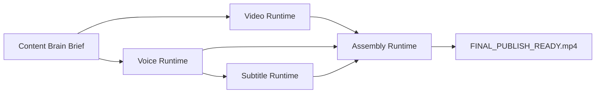
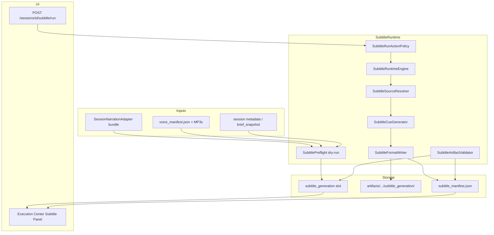
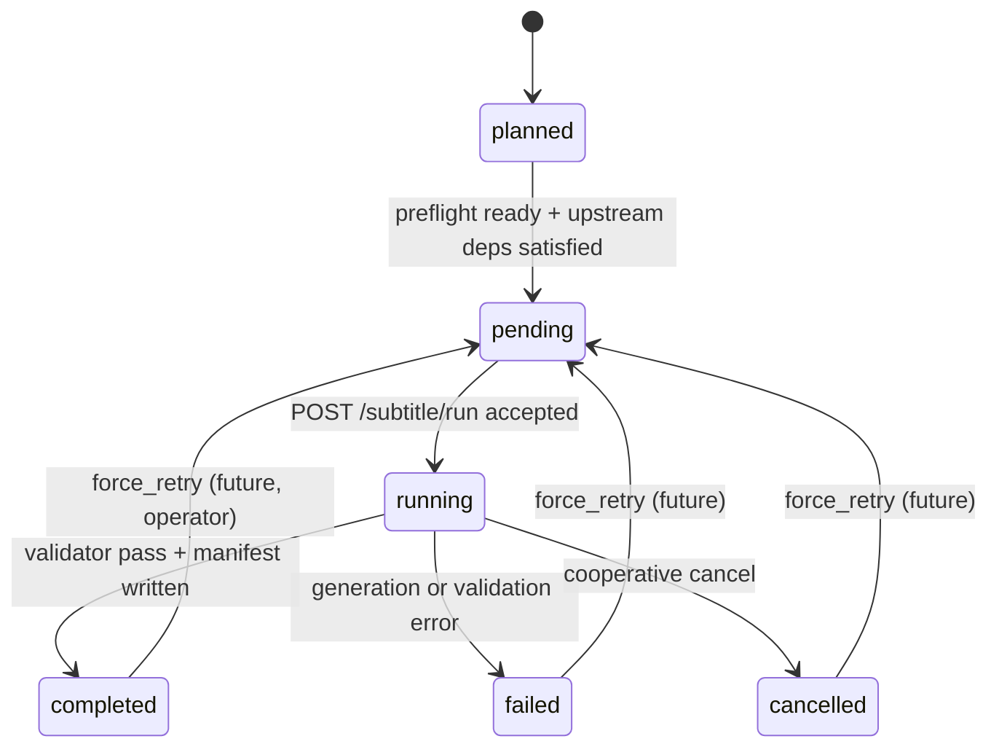
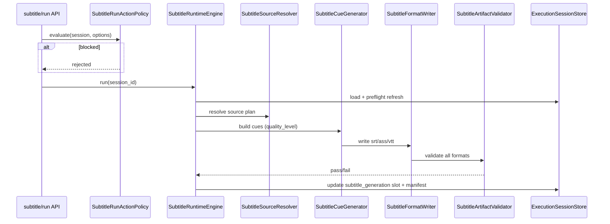

# Phase 11I-1 — Subtitle Runtime Architecture Design

**Status:** Design only — no implementation, no FFmpeg execution, no subtitle generation  
**Date:** 2026-05-31  
**Prerequisites:** Voice Runtime Production Ready V1 (11H complete, 11H-2e/2f PASS, operator audio 5/5)  
**Goal:** Define Subtitle Runtime as the next executable category in the Content Brain multi-category pipeline

---

## Executive summary

Subtitle Runtime produces **timed text artifacts** (SRT, ASS, WebVTT) from Content Brain narration and/or voice artifacts. It sits **after Voice Runtime** and **before Assembly Runtime** in the target publish chain.

This design mirrors Voice Runtime patterns (category slot, engine, manifest, validator, API, UI panel) while remaining **fully isolated** from video dispatch, Runway/Hailuo, and live TTS paths.

**Implementation requires Phase 11I-2+ approval.** This document does not implement any code.

---

## Target pipeline



Subtitle Runtime **does not** invoke Assembly or FFmpeg. Assembly consumes subtitle artifacts in a later phase.

---

## Architecture diagram



---

## 1. Subtitle Runtime Category

### Category key (canonical)

| Field | Value |
|-------|-------|
| **Runtime category key** | `subtitle_generation` |
| **Short name** | `subtitles` |
| **Provider** | `internal` (local cue generation — no external subtitle API in V1) |
| **Mode** | `local` |

### Naming migration (11I-2)

11G shell currently uses key `subtitles`. 11I-2 will:

- Add `subtitle_generation` as canonical key (aligned with `voice_generation`, `music_generation`)
- Keep read-only alias `subtitles` → `subtitle_generation` in `normalize_category_runtime()` for one release cycle
- Update `FUTURE_CATEGORY_ROUTERS` hook to `content_brain.execution.subtitle_runtime_engine.SubtitleRuntimeEngine`

**Do not rename or break** existing 11G validator sessions during migration.

### Lifecycle



| Status | Meaning |
|--------|---------|
| `planned` | Shell default; no subtitle work attempted |
| `pending` | Preflight passed; eligible for `/subtitle/run` |
| `running` | Cue generation + format write in progress |
| `completed` | All requested formats validated; manifest valid |
| `failed` | Error recorded on slot; partial files may exist |
| `cancelled` | Operator cancel mid-run; partial manifest optional |

Additional compat status: `skipped` — when narration absent and transcription disabled (same pattern as voice).

### Slot schema extension (`subtitle_generation`)

Extends 11G base slot fields:

```json
{
  "category_name": "subtitles",
  "status": "pending",
  "state": "pending",
  "provider": "internal",
  "executed": false,
  "dry_run": false,
  "artifacts": [],
  "subtitle_manifest_path": null,
  "error": null,
  "started_at": null,
  "completed_at": null,
  "segment_count": 0,
  "cue_count": 0,
  "source_type": null,
  "quality_level": 1,
  "language": "en",
  "format_list": [],
  "subtitle_preflight": null,
  "subtitle_progress": {
    "engine_version": "11i_v1",
    "current_step": null,
    "progress_percent": 0,
    "formats_completed": [],
    "last_error": null
  }
}
```

---

## 2. Subtitle Sources

### Source modes

| ID | Mode | Description | Primary inputs |
|----|------|-------------|----------------|
| **A** | `narration_text_only` | Equal-chunk or sentence-split timing from text | `SessionNarrationAdapter` segments |
| **B** | `narration_with_timing` | Segment boundaries from voice/narration metadata | Narration + `voice_manifest.json` per-segment timing |
| **C** | `audio_transcription_fallback` | ASR when narration missing | Voice MP3(s) via future transcription adapter |
| **D** | `hybrid` | Merge B + C gaps; prefer narration text, fill from ASR | Narration + voice artifacts + optional ASR |

### Preferred resolution order

```text
1. B  narration_with_timing     (if voice_manifest + segment durations available)
2. A  narration_text_only       (if narration segments exist)
3. D  hybrid                    (if partial narration + voice audio exists)
4. C  audio_transcription_fallback (only if narration missing but voice artifacts exist)
5. SKIP — no subtitle source
```

**11I-2 / 11I-3 default:** Mode **A** (Level 1 quality).  
**11I-4+:** Mode **B** when voice run completed with per-segment duration metadata.

### Source resolver (`SubtitleSourceResolver`)

Pure function — no I/O:

```python
resolve_subtitle_source(session) -> SubtitleSourcePlan
# returns: source_type, quality_level, segment_count, warnings, blocked_reasons
```

Hard dependency for Level 2+: `voice_generation.status == completed` (optional gate via policy flag `require_voice_for_timing`).

---

## 3. Subtitle Formats

| Format | Extension | Role | V1 generate |
|--------|-----------|------|-------------|
| **SRT** | `.srt` | Universal export, platform upload sidecar | Yes |
| **ASS** | `.ass` | Styled captions; **required for future burn-in** | Yes |
| **WebVTT** | `.vtt` | Web player / preview | Yes |

### Format writer responsibilities

- **SRT:** standard `HH:MM:SS,mmm` cues; UTF-8; CRLF or LF consistent per manifest
- **ASS:** minimal `[Script Info]` + `[V4+ Styles]` + `[Events]`; inherit highlight styling hooks from legacy `engines/subtitle_engine.py` **as reference only** (not imported in 11I-2)
- **WebVTT:** `WEBVTT` header + cue blocks; timestamps `HH:MM:SS.mmm`

### Burn-in policy (future Assembly)

- Assembly **must** prefer `subtitles.ass` when burn-in enabled
- Fallback: SRT → on-the-fly ASS conversion in Assembly phase (not Subtitle Runtime)

---

## 4. Artifact Structure

### Directory layout

```text
storage/content_brain/execution/artifacts/{session_id}/subtitle_generation/
├── subtitles.srt
├── subtitles.ass
├── subtitles.vtt
└── subtitle_manifest.json
```

Uses existing `ExecutionSessionStore.artifact_dir(session_id, CATEGORY_SUBTITLES)` with category key migration to `subtitle_generation` in 11I-2.

### Artifact records (slot + manifest)

Each format file gets a slot artifact entry:

```json
{
  "artifact_id": "subtitle_srt",
  "format": "srt",
  "file_name": "subtitles.srt",
  "file_path": "...",
  "size_bytes": 1234,
  "cue_count": 12,
  "validation_status": "valid"
}
```

---

## 5. Manifest Schema

**File:** `subtitle_manifest.json`  
**Version:** `11i_v1`

```json
{
  "manifest_version": "11i_v1",
  "session_id": "exec_...",
  "category": "subtitle_generation",
  "provider": "internal",
  "provider_mode": "local",
  "source_type": "narration_text_only",
  "quality_level": 1,
  "language": "en",
  "segment_count": 6,
  "cue_count": 24,
  "format_list": ["srt", "ass", "vtt"],
  "files": [
    {
      "format": "srt",
      "file_name": "subtitles.srt",
      "file_path": "...",
      "size_bytes": 2048,
      "cue_count": 24,
      "validation_status": "valid"
    }
  ],
  "timing_strategy": "equal_chunk",
  "voice_manifest_ref": "storage/.../voice_generation/voice_manifest.json",
  "narration_source_path": "story_blueprint.beats",
  "total_duration_seconds": 42.5,
  "validation_status": "valid",
  "execution_status": "completed",
  "partial": false,
  "generated_at": "2026-05-31 12:00:00",
  "started_at": "2026-05-31 11:59:58",
  "completed_at": "2026-05-31 12:00:00",
  "engine_version": "11i_v1",
  "real_provider_called": false
}
```

Required fields (validator):

- `source_type`, `segment_count`, `cue_count`, `format_list`, `language`, `generated_at`, `validation_status`

---

## 6. Runtime Integration — `SubtitleRuntimeEngine`

### Location (planned)

`content_brain/execution/subtitle_runtime_engine.py`

### Trigger

`POST /sessions/{session_id}/subtitle/run` (11I-6 — not in 11I-1)

### Engine flow



### Inputs

| Input | Source | Required |
|-------|--------|----------|
| Narration bundle | `SessionNarrationAdapter.build(session)` | Yes (modes A/B/D) |
| Voice manifest | `voice_generation` artifact dir | Optional (B/D Level 2+) |
| Voice MP3 paths | `voice_manifest.files[]` | Optional (C/D) |
| Session metadata | `brief_snapshot`, `language` hints | Optional |
| Total duration hint | voice total duration OR video target duration OR sum of segment estimates | Mode A fallback |

### Outputs

- Updated `subtitle_generation` slot (`executed=true` only after validation)
- `subtitle_manifest.json`
- `subtitles.{srt,ass,vtt}`

### Isolation rules

- **Never** mutate `video_generation` or `voice_generation` slots (except read)
- **Never** call `ProviderRuntimeEngine.dispatch`
- **Never** invoke FFmpeg, Runway, Hailuo, or ElevenLabs
- **Never** import legacy `full_video_pipeline`, `TimelineEngine`, or `engines/subtitle_engine` directly in 11I-2 (extract pure formatting helpers in 11I-3 if needed)

### Preflight (`SubtitlePreflightDryRun`)

Hook on video dispatch (optional, additive — same pattern as voice preflight):

- Resolve narration segment count
- Check write permissions on artifact dir
- Record `subtitle_preflight.ready` without generating files

---

## 7. Validation — `SubtitleArtifactValidator`

### Location (planned)

`content_brain/execution/subtitle_artifact_validator.py`

### Checks

| Check ID | Rule |
|----------|------|
| `FILE_EXISTS` | Each declared format file on disk |
| `SIZE_NONZERO` | `size_bytes > 0` |
| `CUE_COUNT_POSITIVE` | Parsed cue count > 0 |
| `TIMESTAMP_MONOTONIC` | End ≥ start; cues non-overlapping (configurable tolerance) |
| `TIMESTAMP_IN_RANGE` | `0 <= t <= total_duration + epsilon` |
| `FORMAT_CONSISTENT` | SRT/VTT/ASS cue counts match within tolerance (same source cues) |
| `ENCODING_UTF8` | Files decode as UTF-8 |
| `MANIFEST_MATCH` | Manifest `files[]` matches disk |

### Result shape (mirror voice)

```python
@dataclass
class SubtitleArtifactValidationResult:
    passed: bool
    cue_count: int
    format_results: dict[str, bool]
    reject_code: str | None
    reject_reasons: list[str]
```

Reject codes: `SUBTITLE_FILE_MISSING`, `SUBTITLE_CUE_EMPTY`, `SUBTITLE_TIMESTAMP_INVALID`, `SUBTITLE_FORMAT_MISMATCH`, `SUBTITLE_VALIDATION_FAILED`.

---

## 8. UI Observability — Execution Center

### Subtitle Runtime Panel (new component)

**Planned paths:**

- `ui/components/subtitle_runtime_panel.py` (Runtime Studio)
- `ui/web/src/components/SubtitleRuntimePanel.tsx` (Execution Center)
- Extend `panel_extractor.py` → `subtitle_runtime_excerpt`

### Display fields

| Field | Source |
|-------|--------|
| Status | `subtitle_generation.status` |
| Source type | `source_type` / manifest |
| Quality level | `quality_level` (1–4) |
| Cue count | `cue_count` |
| Segment count | `segment_count` |
| Generated formats | `format_list` chips: SRT / ASS / VTT |
| Validation state | `validation_status` + validator summary |
| Manifest path | link/copy path |
| Progress | `subtitle_progress.progress_percent` |
| Preflight | `subtitle_preflight.ready` |
| Error | `error.code` / message |

### API excerpt (panel DTO)

```json
{
  "subtitle_generation_status": "completed",
  "subtitle_generation_executed": true,
  "source_type": "narration_with_timing",
  "quality_level": 2,
  "cue_count": 18,
  "format_list": ["srt", "ass", "vtt"],
  "validation_status": "valid",
  "subtitle_manifest_path": "..."
}
```

Read-only in 11I-2; run trigger button gated behind approval in 11I-6+.

---

## 9. Future Assembly Dependency

### Assembly inputs (Phase 11J+ design)

| Asset | Path | Assembly use |
|-------|------|--------------|
| Video clips | `video_generation/clip_*.mp4` | Visual timeline |
| Voice audio | `voice_generation/narration_*.mp3` | Audio track / duration master |
| Subtitles SRT | `subtitle_generation/subtitles.srt` | Sidecar export |
| Subtitles ASS | `subtitle_generation/subtitles.ass` | **Burn-in** via FFmpeg in Assembly only |
| Subtitles VTT | `subtitle_generation/subtitles.vtt` | Preview player |

### Assembly manifest cross-refs

`assembly_manifest.json` (future) will include:

```json
{
  "inputs": {
    "video_manifest_ref": ".../video_generation/...",
    "voice_manifest_ref": ".../voice_generation/voice_manifest.json",
    "subtitle_manifest_ref": ".../subtitle_generation/subtitle_manifest.json",
    "burn_in_subtitle_format": "ass"
  }
}
```

### Gating

Assembly preflight (future):

- `video_generation.status == completed`
- `voice_generation.status == completed` (if audio required)
- `subtitle_generation.status == completed` (if subtitles enabled for session)
- All manifests `validation_status == valid`

Subtitle Runtime **does not** produce `FINAL_PUBLISH_READY.mp4`.

---

## 10. Subtitle Quality Levels

| Level | Name | Timing strategy | Inputs | Phase |
|-------|------|-----------------|--------|-------|
| **1** | Equal-chunk | Split narration into N chunks; divide total duration evenly | Narration text + estimated duration | 11I-3 |
| **2** | Audio-duration-aware | Cue boundaries from per-segment MP3 duration / voice manifest | Narration + voice artifacts | 11I-5 |
| **3** | Word-level | Proportional timing by word count within segment duration | Level 2 + tokenizer | 11I-7 |
| **4** | Karaoke / highlight | ASS `\k` tags or styled word highlights | Level 3 + style profile | 11I-8 |

Default session policy: **Level 1** until voice completed enables Level 2 auto-upgrade (operator override via `/subtitle/run` body `quality_level`).

### Duration estimation (Level 1)

Priority:

1. Sum of voice segment durations (if voice completed)
2. `brief_snapshot.video_format_plan.target_duration_seconds`
3. Heuristic: `chars / 14` seconds (conservative speech rate)

---

## Policy & safety (design)

Subtitle generation is **local-only** in V1 — no paid external APIs.

| Gate | Rule |
|------|------|
| Category isolation | Mutate only `subtitle_generation` |
| No FFmpeg in subtitle phase | Text artifacts only |
| Cancel | Cooperative `operations_control.cancel_requested` between format writes |
| Retry | `force_retry` clears failed state (future) |
| Approval | Lightweight `subtitle_run` approval optional in 11I-6 (less strict than live TTS) |
| Dependency | Configurable: `require_voice_completed` default **false** for Level 1, **true** for Level 2+ |

---

## Risks

| Risk | Impact | Mitigation |
|------|--------|------------|
| Category key mismatch (`subtitles` vs `subtitle_generation`) | Shell read failures | Alias normalization in 11I-2; validator coverage |
| Level 1 timing feels off vs audio | Bad UX | Document Level 1 as draft; promote Level 2 after voice |
| ASS/SRT cue count drift | Assembly burn-in desync | `FORMAT_CONSISTENT` validator check |
| Legacy `SubtitleEngine` coupling | Architecture violation | Extract pure format utils; do not import legacy pipeline |
| Transcription scope creep | Cost + complexity | Defer mode C to 11I-9+; explicit adapter boundary |
| FFmpeg invoked too early | Violates phase scope | Assembly-only burn-in; CI grep guard |
| Large narration sessions | Memory / cue explosion | Cap cues via policy (reuse voice smoke cap patterns) |

---

## Implementation slices (recommended)

| Phase | Scope | Deliverable |
|-------|-------|-------------|
| **11I-2** | Foundation | Category key migration shim, slot schema, `SubtitlePreflightDryRun`, validator stub, `validate_11i2` |
| **11I-3** | Engine Level 1 | `SubtitleRuntimeEngine`, cue generator A, SRT writer, manifest, dry-run only |
| **11I-4** | Multi-format | ASS + WebVTT writers, `SubtitleArtifactValidator` full |
| **11I-5** | Level 2 timing | Source B, voice manifest duration integration |
| **11I-6** | API | `POST /subtitle/run`, `SubtitleRunService`, action policy |
| **11I-7** | UI | Execution Center panel + panel_extractor |
| **11I-8** | Level 3–4 | Word-level + karaoke ASS (optional niche profiles) |
| **11I-9** | Transcription | Mode C adapter (Whisper/local) — separate approval |
| **11J-1** | Assembly design | Consumes subtitle + video + voice manifests |

Each slice: one validator module + phase report. No slice modifies Voice or Video runtime engines.

---

## Relationship to existing code (read-only reference)

| Existing module | Relationship |
|-----------------|--------------|
| `engines/subtitle_engine.py` | Legacy Run Studio; formatting reference only |
| `content_brain/execution/session_narration_adapter.py` | **Primary narration input** (reuse) |
| `content_brain/execution/audio_artifact_validator.py` | Pattern reference for subtitle validator |
| `content_brain/execution/live_voice_tts_engine.py` | Pattern reference for engine + manifest |
| `category_runtime_compat.py` | Extend slot defaults; router hook already documents `SubtitleRuntime` |

---

## Next recommended phase

**PHASE 11I-2 — Subtitle Runtime Foundation Implementation**

Scope:

- Category key `subtitle_generation` with `subtitles` alias
- Preflight dry-run hook (no file generation)
- Slot schema + manifest schema types
- `SubtitleArtifactValidator` skeleton
- Validator `validate_11i2_subtitle_runtime_foundation.py`
- **No** `/subtitle/run` execution, **no** FFmpeg, **no** legacy engine imports

---

## Design sign-off checklist

- [x] Category lifecycle defined
- [x] Source modes A–D with resolution order
- [x] SRT / ASS / WebVTT specified
- [x] Artifact paths and manifest schema
- [x] `SubtitleRuntimeEngine` + validator designed
- [x] UI panel fields defined
- [x] Assembly consumption documented
- [x] Quality levels 1–4 roadmap
- [x] Voice / Video / Runway / Hailuo untouched
- [x] Implementation slices for 11I-2+

**11I-1 status: DESIGN COMPLETE — ready for 11I-2 implementation approval.**
