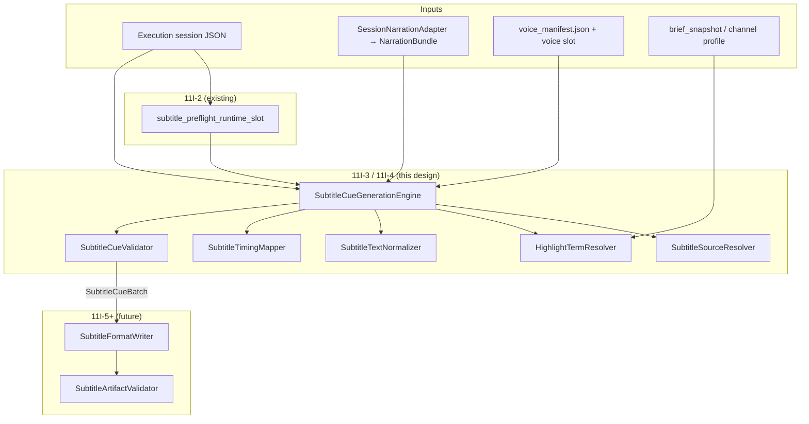

# Phase 11I-3 — Subtitle Cue Generation Engine Design

**Status:** Design only — no implementation, no FFmpeg, no file generation  
**Date:** 2026-05-28  
**Prerequisites:** 11I-2 foundation PASS, 11I-2A audit PASS, 11I-2B niche fixes PASS  
**Next phase:** **11I-4 — Implement Subtitle Cue Generation Engine**

---

## Executive Summary

The **Subtitle Cue Generation Engine** converts Content Brain narration and/or voice timing metadata into a normalized, validated **cue model** (`SubtitleCueBatch`). It is the core logic layer between 11I-2 preflight and 11I-4+ format writers.

**11I-3 scope:** cue model + timing strategies + highlight resolution + text normalization + cue validation **design only**.  
**11I-4 scope:** implement engine (cues only, no files).  
**11I-5+ scope:** SRT/ASS/VTT writers + manifest + runtime execution API.

This engine:

- Lives at `content_brain/execution/subtitle_cue_generation_engine.py`
- Reads session data via existing adapters (no Voice/Video runtime changes)
- Outputs **in-memory cues only** — no disk writes in 11I-4 first slice
- Uses **dynamic highlight terms only** (never fixed niche word lists)
- Does **not** import legacy `engines/subtitle_engine.py`

---

## Architecture

### Position in pipeline



### Module layout (planned)

| Module | Phase | Responsibility |
|--------|-------|----------------|
| `subtitle_preflight_runtime_slot.py` | 11I-2 ✅ | Source readiness, slot metadata |
| `subtitle_cue_generation_engine.py` | **11I-4** | Orchestrate cue generation |
| `subtitle_source_resolver.py` | 11I-4 | Pure source/timing plan (optional split) |
| `subtitle_highlight_resolver.py` | 11I-4 | Dynamic highlight term resolution |
| `subtitle_text_normalizer.py` | 11I-4 | Split/normalize text for cues |
| `subtitle_timing_mapper.py` | 11I-4 | Apply L1/L2 timing strategies |
| `subtitle_cue_validator.py` | 11I-4 | Validate cue batch in memory |
| `subtitle_format_writer.py` | 11I-5 | Write SRT/ASS/VTT from cues |
| `subtitle_artifact_validator.py` | 11I-2 ✅ | Validate files on disk |

**11I-4 minimal slice:** single file `subtitle_cue_generation_engine.py` with internal helpers; split modules when file exceeds ~400 lines.

### Engine public API (planned)

```python
ENGINE_VERSION = "11i4_v1"

@dataclass
class SubtitleCueGenerationRequest:
    session: dict[str, Any]
    execution_runtime: dict[str, Any] | None = None
    timing_strategy: str | None = None  # auto | equal_chunk | audio_duration
    quality_level: int | None = None    # 1 | 2 | 3 | 4
    language: str | None = None
    max_line_length: int = 42
    max_cue_duration_seconds: float = 6.0
    min_cue_duration_seconds: float = 0.8
    profile: dict[str, Any] | None = None
    channel_identity: dict[str, Any] | None = None

@dataclass
class SubtitleCueGenerationResult:
    passed: bool
    batch: SubtitleCueBatch | None
    reject_code: str | None
    reject_reasons: list[str]
    warnings: list[str]
    engine_version: str
    generated_at: str

class SubtitleCueGenerationEngine:
    def generate(self, request: SubtitleCueGenerationRequest) -> SubtitleCueGenerationResult: ...
    def generate_to_dict(self, request: SubtitleCueGenerationRequest) -> dict[str, Any]: ...
```

**Isolation rules (unchanged from 11I-1):**

- Read-only access to `voice_generation` / `video_generation` slots
- No FFmpeg, Runway, Hailuo, ElevenLabs, legacy pipeline imports
- No mutation of voice/video slots during cue generation

---

## Data Models

### `SubtitleCue`

One display line (or ASS dialogue event) with timing and styling metadata.

```python
@dataclass
class SubtitleCue:
    index: int                    # 1-based cue index in output files
    start_time: float             # seconds, float precision ≥ 3 decimals
    end_time: float               # seconds, exclusive upper bound for writers
    text: str                     # normalized display text (no ASS override codes)
    source_segment_id: str | None # beat_id | segment_index key | voice file segment_index
    confidence: float             # 0.0–1.0 timing/text confidence
    highlight_terms: list[str]    # subset of text tokens to emphasize in ASS
    style_tags: list[str]         # e.g. ["default"], ["emphasis"], ["hook"]
```

| Field | Rules |
|-------|-------|
| `index` | Monotonic 1..N after normalization |
| `start_time` / `end_time` | Float seconds; writers convert to format-specific timestamps |
| `text` | UTF-8, trimmed, no empty string post-validation |
| `source_segment_id` | `{segment_index}` or `{beat_id}` or `voice_file_{n}` for traceability |
| `confidence` | L1 ≈ 0.6, L2 ≈ 0.85, L3+ higher when word timestamps exist |
| `highlight_terms` | Lowercase tokens; must appear in `text` (validator checks) |
| `style_tags` | Writer maps to ASS styles; SRT/VTT ignore |

**JSON example:**

```json
{
  "index": 3,
  "start_time": 6.240,
  "end_time": 9.100,
  "text": "The replay angle changed everything.",
  "source_segment_id": "beat_ESCALATION_BEAT",
  "confidence": 0.85,
  "highlight_terms": ["replay", "angle"],
  "style_tags": ["default"]
}
```

### `SubtitleCueBatch`

Container returned by the engine; input to format writers in 11I-5.

```python
@dataclass
class SubtitleCueBatch:
    cues: list[SubtitleCue]
    language: str                 # BCP-47-ish, e.g. "en", "de"
    source_type: str              # narration_text_only | narration_with_timing | ...
    timing_strategy: str          # equal_chunk | audio_duration | word_level | karaoke
    total_duration: float         # seconds span covered by cues
    warnings: list[str]
    metadata: dict[str, Any]      # segment_count, voice_manifest_ref, quality_level, etc.
```

| Field | Source |
|-------|--------|
| `language` | Profile `language_rules.caption_language` → session → `"en"` fallback |
| `source_type` | Reuse 11I-2 constants from `subtitle_preflight_runtime_slot` |
| `timing_strategy` | Resolved from quality level + available inputs |
| `total_duration` | Last cue `end_time` or voice manifest `duration_seconds` |
| `warnings` | Non-fatal issues (split mid-sentence, estimated timing, etc.) |

**JSON example:**

```json
{
  "batch_version": "11i4_v1",
  "language": "en",
  "source_type": "narration_with_timing",
  "timing_strategy": "audio_duration",
  "total_duration": 28.4,
  "cue_count": 14,
  "quality_level": 2,
  "warnings": [],
  "cues": []
}
```

Both models must implement `to_dict()` / `from_dict()` for JSON-safe session storage and manifest embedding.

---

## Timing Strategies

### Strategy matrix

| Level | ID | Name | Inputs | Accuracy | Phase |
|-------|-----|------|--------|----------|-------|
| **1** | `equal_chunk` | Equal-chunk text timing | Narration text only | Low–medium | **11I-4 V1** |
| **2** | `audio_duration` | Audio-duration-aware | Voice manifest + MP3 metadata | Medium–high | **11I-4 V1** |
| **3** | `word_level` | Word-level proportional | Word count + segment duration | Medium | 11I-6+ |
| **4** | `karaoke` | Karaoke / highlight sync | Word timestamps (future ASR/alignment) | High | 11I-7+ |

### Auto-selection (engine default)

Reuse `resolve_subtitle_source_type()` from 11I-2:

```text
if voice_manifest usable (completed + files/duration):
    quality_level = 2
    timing_strategy = audio_duration
elif narration bundle has segments:
    quality_level = 1
    timing_strategy = equal_chunk
else:
    reject — SOURCE_UNAVAILABLE
```

Optional policy flag (future): `require_voice_for_timing=true` blocks L1 when voice exists but manifest invalid.

---

### Level 1 — `equal_chunk` (text-only)

**When:** `source_type = narration_text_only`

**Algorithm:**

1. Load `NarrationBundle.segments` via `SessionNarrationAdapter`.
2. Determine `total_duration`:
   - Prefer `brief_snapshot.content_format.default_duration_seconds`
   - Else `execution_runtime` video/voice duration hint
   - Else estimate: `max(15, sum(len(text.split()) * 0.35))` seconds
3. For each narration segment:
   - Normalize text → cue lines via `SubtitleTextNormalizer`
   - Allocate segment time window:
     - If segment has `start_second` / `end_second` from brief → use as bounds
     - Else divide `total_duration` proportionally by **character count** across segments
4. Within each segment window, distribute cue lines **equally** by line count.
5. Apply min/max cue duration clamps; borrow time from adjacent cues within same segment.

**Confidence:** `0.55` base + `0.05` if brief provides beat timing hints.

**Warnings:**

- `TIMING_ESTIMATED_EQUAL_CHUNK`
- `TOTAL_DURATION_INFERRED`

---

### Level 2 — `audio_duration` (voice-manifest-aware)

**When:** `source_type = narration_with_timing`

**Algorithm:**

1. Load `voice_manifest.json` from voice slot path (same helper as preflight).
2. For each manifest `files[]` entry (ordered by `segment_index`):
   - Resolve duration per file:
     - **Primary:** future `duration_seconds` field on manifest file record (11H extension)
     - **Fallback:** parse MP3 header via lightweight size/bitrate estimate (no FFmpeg)
     - **Fallback 2:** proportional split of manifest `duration_seconds` by character count vs total chars
   - Map manifest segment → narration segment by `segment_index` / `text_hash` / `beat_id`
   - Normalize narration text into cue lines
   - Distribute segment `[start, end)` across cue lines proportionally by **word count**
3. Chain segments: `cue[n].start = voice_segment_start + offset`.
4. Final cue `end_time` must not exceed manifest `duration_seconds` (+ 50 ms epsilon).

**Confidence:** `0.80` with MP3 duration; `0.70` with proportional fallback.

**Warnings:**

- `MP3_DURATION_ESTIMATED`
- `SEGMENT_ALIGNMENT_BY_INDEX_ONLY`
- `MANIFEST_MISSING_PER_FILE_DURATION`

---

### Level 3 — `word_level` (future)

**When:** Explicit request or policy enables quality_level 3.

**Algorithm sketch:**

- Split each cue line into words; allocate segment duration by word count weights.
- Respect punctuation pauses (+80 ms after `.?!`, +40 ms after `,`).
- Merge ultra-short word slots (< 120 ms) with neighbors.

**Not in 11I-4.** Design hook: `timing_strategy=word_level` returns `NOT_IMPLEMENTED` until 11I-6.

---

### Level 4 — `karaoke` / highlight sync (future)

**When:** Word-level timestamps available (forced alignment, ASR, provider metadata).

**Output extension:**

- `SubtitleCue.style_tags` includes `karaoke`
- Optional per-word timing array in `metadata` (not in V1 cue schema field — nested under cue metadata if needed later)

**Not in 11I-4.**

---

## Highlight Term Strategy

### Policy (mandatory)

**No fixed niche word lists.** Never import or copy legacy `engines/subtitle_engine.py` defaults.

Highlight terms are resolved per session via **`HighlightTermResolver`** (internal helper or module).

### Resolution order (priority high → low)

```text
1. channel_identity.highlight_keywords     (explicit channel store)
2. profile.highlight_keywords              (content brain profile)
3. profile.seo_keywords / brief keywords   (strip # prefix)
4. brief_snapshot topic + title tokens     (user topic)
5. semantic_universe topic_seed_pool tokens (if present on brief)
6. narration-derived keywords              (TF-IDF-lite / capitalized terms / numbers)
7. neutral fallback                        (empty list OR profile subtitle_rules.fallback_highlight)
```

### Neutral fallback (only if steps 1–6 yield nothing)

Allowed generic emphasis tokens (topic-neutral, from 11I-2B alignment):

```text
secret, hidden, important, never, always, stop, watch
```

**Only used when:**

- `profile.subtitle_rules.allow_neutral_fallback != false`
- No profile/channel keywords exist
- Narration-derived extraction returns empty

**Never include:** skin, glow, mask, radiant, hydrated, beauty, skincare, football, horror, etc.

### Per-cue assignment

1. Build session-level candidate set (dedupe, lowercase, max 20 terms).
2. For each cue, set `highlight_terms = [t for t in candidates if t in cue.text.lower()]`.
3. Cap at 3 terms per cue (readability).
4. ASS writer (11I-5) applies styling only to matched tokens — same mechanism as legacy ASS override tags but driven by dynamic list.

### Profile schema extension (11I-4, optional)

Add to profile / channel identity (empty default):

```json
{
  "subtitle_rules": {
    "max_line_length": 42,
    "max_cues_per_segment": 8,
    "allow_neutral_fallback": true,
    "fallback_highlight": [],
    "highlight_keywords": []
  }
}
```

Channel store mirror: `highlight_keywords: []`.

---

## Text Normalization

### `SubtitleTextNormalizer` responsibilities

| Rule | Default | Configurable via |
|------|---------|------------------|
| Max line length | 42 characters | `subtitle_rules.max_line_length` |
| Max lines per cue | 2 (stacked with `\N` in ASS) | profile |
| Sentence boundary preference | Split on `.?!` first | — |
| Clause fallback | Split on `,;:` if line still too long | — |
| Word wrap | Hard wrap at last space before max length | — |
| Mid-word break | Avoid unless word > max length | — |
| Whitespace | Collapse repeated spaces | — |
| Punctuation | Keep terminal punctuation on line | — |
| Casing | Preserve source casing (no forced UPPER for SRT) | profile `force_uppercase: false` |
| Language | No translation; preserve narration language | — |
| Empty lines | Drop | — |

### Split algorithm (per narration segment)

```text
1. Normalize whitespace
2. If len(text) <= max_line_length → single cue candidate
3. Split into sentences (regex on .?! retaining delimiter)
4. For each sentence:
   a. If fits max_line_length → one candidate
   b. Else split on commas / semicolons
   c. Else word-wrap into chunks ≤ max_line_length
5. Merge chunks shorter than 8 chars into previous unless start of segment
6. Emit ordered cue text strings (timing applied later)
```

### Multilingual notes (design)

- **CJK:** max_line_length interpreted as **character count** when language in `{ja, zh, ko}` (detect from profile).
- **RTL:** Store logical text order; writers handle display (11I-5).
- **Mixed language:** Warn `MIXED_LANGUAGE_NARRATION`; do not strip characters.

---

## Cue Validation Design

### Module

`content_brain/execution/subtitle_cue_validator.py` (11I-4)

Distinct from `subtitle_artifact_validator.py` (file-level, 11I-2).

### Class

```python
@dataclass
class SubtitleCueValidationResult:
    passed: bool
    cue_count: int
    checks: list[dict[str, Any]]
    reject_code: str | None
    reject_reasons: list[str]
    warnings: list[str]

class SubtitleCueValidator:
    def validate(
        self,
        batch: SubtitleCueBatch,
        *,
        max_gap_seconds: float = 2.0,
        max_cue_duration: float = 8.0,
        min_cue_duration: float = 0.5,
        allow_overlap_ms: float = 0.0,
    ) -> SubtitleCueValidationResult: ...
```

### Check matrix

| Check ID | Rule | Severity |
|----------|------|----------|
| `CUE_COUNT_POSITIVE` | `len(cues) >= 1` | reject |
| `TEXT_NON_EMPTY` | every cue `text.strip()` non-empty | reject |
| `START_NON_NEGATIVE` | `start_time >= 0` | reject |
| `END_AFTER_START` | `end_time > start_time` | reject |
| `MIN_DURATION` | `(end - start) >= min_cue_duration` | reject |
| `MAX_DURATION` | `(end - start) <= max_cue_duration` | warn or reject (config) |
| `ORDERED` | `cues[i].start >= cues[i-1].start` | reject |
| `NO_OVERLAP` | `cue[i].start >= cue[i-1].end - epsilon` | reject (epsilon configurable) |
| `TOTAL_DURATION` | last `end_time <= total_duration + 0.5s` | warn |
| `HIGHLIGHT_IN_TEXT` | each highlight term substring of cue text | warn + strip invalid |
| `INDEX_SEQUENTIAL` | indices 1..N | reject |
| `LANGUAGE_PRESENT` | `language` non-empty | reject |

### Reject codes

- `CUE_BATCH_EMPTY`
- `CUE_TEXT_EMPTY`
- `CUE_TIMESTAMP_INVALID`
- `CUE_ORDER_INVALID`
- `CUE_DURATION_INVALID`
- `CUE_VALIDATION_FAILED`

Engine returns `passed=False` if validator rejects; batch may still be attached for debugging when `dry_run=True` (future policy).

---

## Integration — 11I-4 / 11I-5 File Generation Plan

### Phase split

| Phase | Delivers |
|-------|----------|
| **11I-4** | Implement cue engine + cue validator; unit tests; store cue batch in session `operations.subtitle_cue_generation` (optional) — **no files** |
| **11I-5** | `SubtitleFormatWriter` → `subtitles.srt`, `subtitles.ass`, `subtitles.vtt` |
| **11I-6** | `SubtitleRuntimeEngine` wires generate → write → artifact validate → slot update |
| **11I-7** | API `POST /sessions/{id}/subtitle/run` + UI panel |

### 11I-5 writer inputs

```python
class SubtitleFormatWriter:
    def write_all(
        self,
        batch: SubtitleCueBatch,
        artifact_dir: Path,
        *,
        highlight_style: str = "emphasis",
    ) -> list[dict[str, Any]]:  # artifact records
```

### Artifact directory (from 11I-1 / 11I-2)

```text
storage/content_brain/execution/artifacts/{session_id}/subtitle_generation/
├── subtitles.srt
├── subtitles.ass
├── subtitles.vtt
└── subtitle_manifest.json
```

Use `ExecutionSessionStore.artifact_dir(session_id, "subtitle_generation")`.

### Format mapping from cues

| Format | Writer behavior |
|--------|-----------------|
| **SRT** | `{index}\n{HH:MM:SS,mmm} --> {HH:MM:SS,mmm}\n{text}\n\n` |
| **VTT** | `WEBVTT` header + cue blocks with `.mmm` timestamps |
| **ASS** | Minimal styles + `Dialogue:` events; apply `\c` overrides for `highlight_terms` only |

### `subtitle_manifest.json` (11I-5)

Embed cue summary + file records (extends 11I-1 schema):

```json
{
  "manifest_version": "11i_v1",
  "session_id": "exec_...",
  "category": "subtitle_generation",
  "provider": "local_subtitle_runtime",
  "source_type": "narration_with_timing",
  "timing_strategy": "audio_duration",
  "quality_level": 2,
  "language": "en",
  "segment_count": 3,
  "cue_count": 14,
  "total_duration_seconds": 28.4,
  "highlight_term_sources": ["channel_profile", "topic", "narration_derived"],
  "cue_batch_version": "11i4_v1",
  "files": [
    {"format": "srt", "file_name": "subtitles.srt", "file_path": "...", "cue_count": 14, "validation_status": "valid"}
  ],
  "validation_status": "valid",
  "engine_version": "11i5_v1",
  "generated_at": "..."
}
```

Full cue list optionally stored as `cues.json` sidecar for debugging (policy flag, off by default in production).

### Runtime slot update (11I-6)

After successful file write + artifact validation:

```text
subtitle_generation.status = completed
subtitle_generation.executed = true
subtitle_generation.cue_count = N
subtitle_generation.subtitle_manifest_path = ...
subtitle_generation.validation_status = valid
subtitle_generation.source_type / timing_strategy = from batch
```

Voice/video slots: **read-only**.

---

## Implementation Slices

### Slice 1 — 11I-4a: Models + validator

- `SubtitleCue`, `SubtitleCueBatch` dataclasses + JSON serde
- `SubtitleCueValidator` with full check matrix
- Tests: empty batch, bad timestamps, overlap, highlight stripping

### Slice 2 — 11I-4b: Text normalizer

- Sentence/word wrap splitting
- Unit tests: long paragraph, punctuation, CJK character counting hook

### Slice 3 — 11I-4c: Highlight resolver

- Profile/channel/brief/topic/narration derivation
- Tests: no skincare defaults; channel keywords win; neutral fallback only when empty

### Slice 4 — 11I-4d: Timing L1

- `equal_chunk` mapper + narration-only integration test

### Slice 5 — 11I-4e: Timing L2

- `audio_duration` mapper + voice manifest fixture test (mock MP3 metadata)

### Slice 6 — 11I-4f: Engine orchestrator

- `SubtitleCueGenerationEngine.generate()` wires resolver → normalizer → timing → highlight → validator
- Validator script: `validate_11i4_subtitle_cue_generation_engine.py`

### Slice 7 — 11I-5: Format writers (separate phase)

- SRT/ASS/VTT from batch; reuse 11I-2 artifact validator

---

## Risks and Mitigations

| Risk | Impact | Mitigation |
|------|--------|------------|
| **Inaccurate timing without word timestamps** | Captions drift from speech | L2 uses voice segment boundaries; warn on estimates; 11I-6+ word_level |
| **Multilingual text splitting** | Bad line breaks for CJK/RTL | Language-aware length; warn on mixed language; no forced ASCII rules |
| **Long narration segments** | Too much text per cue | `max_line_length` + max cues per segment; split aggressively with warnings |
| **Highlight quality** | Wrong words emphasized | Cap terms; must appear in cue text; profile keywords first; no niche defaults |
| **Voice duration detection dependency** | L2 falls back to proportional guess | MP3 header parser (mutagen or stdlib); manifest `duration_seconds` per file in future voice manifest extension |
| **Segment misalignment** | Narration segment ≠ voice file order | Match on `text_hash`, `beat_id`, then index; warn on hash mismatch |
| **Copying legacy subtitle_engine** | Skincare bias returns | Explicit ban in code review; 11I-2B neutral fallback only |
| **Total duration mismatch vs video** | Subs longer than video | Clamp to video slot duration if available; warn `CUE_EXCEEDS_VIDEO_DURATION` |
| **Empty narration after normalize** | Generation fails | Reject early with `NARRATION_EMPTY` before timing |
| **Performance on long sessions** | Slow cue gen | Pure Python OK for V1; batch segments; no FFmpeg |

---

## Dependencies

### Reads (existing — do not modify in 11I-3/4)

| Component | Usage |
|-----------|-------|
| `SessionNarrationAdapter` | Narration segments |
| `subtitle_preflight_runtime_slot.resolve_subtitle_source_type` | Source typing |
| Voice slot / `voice_manifest.json` | L2 timing |
| `category_runtime_compat.SUBTITLE_ARTIFACT_CATEGORY` | Path convention |
| Channel identity store | `highlight_keywords` |
| Profile loader | `subtitle_rules`, language |

### Does not read

- `engines/subtitle_engine.py` (legacy — reference only for ASS tag syntax)
- `core/timeline_engine.py`
- `pipelines/full_video_pipeline.py`

---

## Validation Plan (11I-4)

`project_brain/validate_11i4_subtitle_cue_generation_engine.py` (future):

1. L1 text-only session → cues with equal_chunk, no empty text
2. L2 voice manifest session → audio_duration, ordered timestamps
3. Highlight terms from mock profile keywords — not skincare defaults
4. Neutral fallback when no keywords
5. Validator rejects overlap / empty text
6. No files written during cue generation
7. No FFmpeg import
8. Voice/video slot unchanged (read-only)
9. 11I-2 foundation regression PASS

---

## Summary

| Item | Decision |
|------|----------|
| **Engine path** | `content_brain/execution/subtitle_cue_generation_engine.py` |
| **11I-4 output** | `SubtitleCueBatch` in memory only |
| **11I-5 output** | SRT / ASS / VTT + `subtitle_manifest.json` |
| **V1 timing** | L1 `equal_chunk`, L2 `audio_duration` |
| **Highlights** | Dynamic only; neutral fallback from 11I-2B |
| **Legacy** | Not imported; isolated |
| **Next phase** | **11I-4 — Implement Subtitle Cue Generation Engine** |

---

*Design only. No code, FFmpeg, or runtime changes in Phase 11I-3.*
