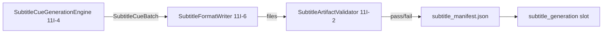

# Phase 11I-5 — Subtitle Format Writers Design

**Status:** Design only — no implementation, no FFmpeg, no file writes  
**Date:** 2026-05-28  
**Prerequisites:** 11I-4 cue generation engine PASS (in-memory `SubtitleCueBatch`)  
**Next phase:** **11I-6 — Implement Subtitle Format Writers**

---

## Executive Summary

Phase 11I-5 defines **`SubtitleFormatWriter`**, the artifact layer that converts a validated **`SubtitleCueBatch`** (11I-4) into on-disk subtitle files and a **`subtitle_manifest.json`**. Writers are **local, sidecar-only** — no FFmpeg, no video modification, no burn-in.

**Input:** `SubtitleCueBatch` + session context  
**Output:** `subtitles.srt`, `subtitles.ass`, `subtitles.vtt`, `subtitle_manifest.json` under the canonical artifact directory  
**Validation:** Reuse and extend `SubtitleArtifactValidator` (11I-2) post-write

---

## Architecture

### Pipeline position



### Module (planned)

| Path | Phase |
|------|-------|
| `content_brain/execution/subtitle_format_writer.py` | **11I-6** |
| `content_brain/execution/subtitle_timestamp_codec.py` | 11I-6 (optional internal helper) |

**Does not import:** `engines/subtitle_engine.py`, `full_video_pipeline.py`, FFmpeg, voice/video runtime engines.

### Dependencies (read-only / reuse)

| Component | Usage |
|-----------|--------|
| `subtitle_models.SubtitleCueBatch` | Writer input |
| `subtitle_cue_validator.SubtitleCueValidator` | Pre-write gate (batch must already pass) |
| `subtitle_artifact_validator.SubtitleArtifactValidator` | Post-write file validation |
| `category_runtime_compat.SUBTITLE_ARTIFACT_CATEGORY` | Path key `subtitle_generation` |
| `session_store.ExecutionSessionStore.artifact_dir()` | Directory resolution |

---

## Module Design — `subtitle_format_writer.py`

### Public API

```python
WRITER_VERSION = "11i6_v1"
MANIFEST_VERSION = "11i_v1"

SUPPORTED_FORMATS = frozenset({"srt", "ass", "vtt"})
DEFAULT_FILENAMES = {
    "srt": "subtitles.srt",
    "ass": "subtitles.ass",
    "vtt": "subtitles.vtt",
}
MANIFEST_FILENAME = "subtitle_manifest.json"

@dataclass
class SubtitleWriteRequest:
    batch: SubtitleCueBatch
    session_id: str
    artifact_dir: Path | None = None          # default: store.artifact_dir(session_id, "subtitle_generation")
    formats: list[str] | None = None          # default: ["srt", "ass", "vtt"]
    overwrite: bool = False
    profile: dict[str, Any] | None = None     # ASS style overrides
    voice_manifest_ref: str | None = None
    narration_source_path: str | None = None

@dataclass
class SubtitleFileRecord:
    format: str
    file_name: str
    file_path: str
    size_bytes: int
    cue_count: int
    validation_status: str

@dataclass
class SubtitleWriteResult:
    passed: bool
    written_at: str
    writer_version: str
    session_id: str
    artifact_dir: str
    formats_written: list[str]
    files: list[SubtitleFileRecord]
    manifest_path: str | None
    manifest: dict[str, Any] | None
    validation_status: str
    reject_code: str | None
    reject_reasons: list[str]
    warnings: list[str]

class SubtitleFormatWriter:
    def __init__(self, store: ExecutionSessionStore | None = None, project_root: Path | str = "."):
        ...

    def write(self, request: SubtitleWriteRequest) -> SubtitleWriteResult:
        """Write selected formats + manifest. No FFmpeg."""

    def write_to_dict(self, request: SubtitleWriteRequest) -> dict[str, Any]:
        ...
```

### Write flow (11I-6)

```text
1. Validate batch is non-empty (reuse SubtitleCueValidator if not already validated)
2. Resolve artifact_dir → mkdir(parents=True, exist_ok=True)
3. For each requested format:
   a. Resolve target path (canonical filename)
   b. If file exists and overwrite=False → reject FILE_EXISTS
   c. Render format string in memory
   d. Atomic write: temp file in same dir → os.replace()
   e. Record size_bytes, cue_count
4. Build subtitle_manifest.json (in memory)
5. Write manifest (same atomic pattern; overwrite rules apply)
6. Run SubtitleArtifactValidator on file records
7. If validation fails → optionally remove written files (policy: keep for debug when dry_run)
8. Return SubtitleWriteResult
```

---

## Format Specifications

### Timestamp codec (shared helper)

Convert float seconds → format-specific strings:

| Format | Pattern | Example |
|--------|---------|---------|
| **SRT** | `HH:MM:SS,mmm` | `00:00:06,240 --> 00:00:09,100` |
| **VTT** | `HH:MM:SS.mmm` | `00:00:06.240 --> 00:00:09.100` |
| **ASS** | `H:MM:SS.cc` (centiseconds) | `0:00:06.24` |

Rules:

- Hours may exceed 24 for long content (same as 11I-4 total_duration)
- Round to nearest millisecond; clamp negative to `0`
- Line endings: `\n` (LF) for all formats; manifest documents `line_ending: "lf"`

### SRT — `subtitles.srt`

```text
1
00:00:00,000 --> 00:00:03,386
Watch this hidden detail before the replay

2
00:00:03,386 --> 00:00:05,804
angle changes everything.
```

| Rule | Value |
|------|-------|
| Index | `SubtitleCue.index` (1-based) |
| Text | Plain UTF-8; no HTML; preserve cue text as-is |
| Blank line | Between cue blocks |
| Multi-line cue | Single `\n` within block if future normalizer emits stacked lines |

### WebVTT — `subtitles.vtt`

```text
WEBVTT

00:00:00.000 --> 00:00:03.386
Watch this hidden detail before the replay

00:00:03.386 --> 00:00:05.804
angle changes everything.
```

| Rule | Value |
|------|-------|
| Header | Required `WEBVTT` + blank line |
| Cue identifier | Optional — omit in V1 (use timestamp-only blocks) |
| Note | No `STYLE` blocks in V1 |

### ASS — `subtitles.ass`

Minimal valid ASS for future burn-in compatibility; styling driven by **`SubtitleCue.highlight_terms`** (dynamic only — no hardcoded niche words).

```text
[Script Info]
Title: ModirAgentOS Subtitles
ScriptType: v4.00+
PlayResX: 1080
PlayResY: 1920
WrapStyle: 0

[V4+ Styles]
Format: Name, Fontname, Fontsize, PrimaryColour, SecondaryColour, OutlineColour, BackColour, Bold, Italic, Underline, StrikeOut, ScaleX, ScaleY, Spacing, Angle, BorderStyle, Outline, Shadow, Alignment, MarginL, MarginR, MarginV, Encoding
Style: Default,Arial,72,&H00FFFFFF,&H000000FF,&H00000000,&H80000000,0,0,0,0,100,100,0,0,1,4,0,2,80,80,220,1
Style: Emphasis,Arial,72,&H0000FFFF,&H000000FF,&H00000000,&H80000000,1,0,0,0,110,110,0,0,1,4,0,2,80,80,220,1

[Events]
Format: Layer, Start, End, Style, Name, MarginL, MarginR, MarginV, Effect, Text
Dialogue: 0,0:00:00.00,0:00:03.39,Default,,0,0,0,,{\fad(80,80)}Watch this {\rEmphasis}hidden{\rDefault} detail
```

#### Default style (TikTok/Reels-safe)

| Property | Value | Rationale |
|----------|-------|-----------|
| Font | Arial 72 @ 1080×1920 | Readable on mobile vertical |
| Primary colour | White `&H00FFFFFF` | High contrast |
| Outline | 4px black | Legibility on bright footage |
| Alignment | 2 (bottom center) | Lower-third convention |
| MarginV | 220 | Safe area above UI chrome |
| BackColour | Semi-transparent black | Optional subtle backing |
| Animation | `{\fad(80,80)}` fade in/out | Soft entrance (no niche copy) |

#### Highlight rendering (11I-6)

For each cue:

1. Start from plain `cue.text`
2. For each term in `cue.highlight_terms` (max 3, already validated in 11I-4):
   - Wrap matched token with inline ASS override: `{\c&H00FFFF&\b1\fscx110\fscy110}term{\r}`
   - Use case-insensitive word-boundary match where possible
3. If no highlight terms → `Default` style only
4. **Never** apply a fixed word list — only `cue.highlight_terms`

Profile override hook (optional):

```json
{
  "subtitle_rules": {
    "ass_style": {
      "font_size": 72,
      "margin_v": 220,
      "emphasis_colour": "&H0000FFFF"
    }
  }
}
```

---

## Manifest Schema — `subtitle_manifest.json`

**Version:** `11i_v1` (aligns with 11I-1; writer adds `writer_version`)

### Required fields (11I-5 / 11I-6 validator)

```json
{
  "manifest_version": "11i_v1",
  "writer_version": "11i6_v1",
  "session_id": "exec_20260531_140029_80ea59",
  "category": "subtitle_generation",
  "provider": "local_subtitle_runtime",
  "provider_mode": "local",
  "source_type": "narration_with_timing",
  "timing_strategy": "audio_duration",
  "language": "en",
  "cue_count": 14,
  "segment_count": 3,
  "formats_written": ["srt", "ass", "vtt"],
  "format_list": ["srt", "ass", "vtt"],
  "files": [
    {
      "format": "srt",
      "file_name": "subtitles.srt",
      "file_path": "C:/.../subtitle_generation/subtitles.srt",
      "size_bytes": 2048,
      "cue_count": 14,
      "validation_status": "valid"
    },
    {
      "format": "ass",
      "file_name": "subtitles.ass",
      "file_path": "...",
      "size_bytes": 4096,
      "cue_count": 14,
      "validation_status": "valid"
    },
    {
      "format": "vtt",
      "file_name": "subtitles.vtt",
      "file_path": "...",
      "size_bytes": 2100,
      "cue_count": 14,
      "validation_status": "valid"
    }
  ],
  "total_duration_seconds": 28.4,
  "total_duration": 28.4,
  "validation_status": "valid",
  "generated_at": "2026-05-31 12:00:00",
  "batch_version": "11i4_v1",
  "voice_manifest_ref": null,
  "narration_source_path": "run_context.story_intelligence.story_architecture.beat_plans",
  "execution_status": "completed",
  "partial": false,
  "real_provider_called": false,
  "warnings": []
}
```

| Field | Source |
|-------|--------|
| `session_id` | Request |
| `category` | Always `subtitle_generation` |
| `source_type` / `timing_strategy` / `language` | From `SubtitleCueBatch` |
| `cue_count` | `batch.cue_count` |
| `formats_written` | Successfully written formats |
| `files` | Per-file records post-validation |
| `validation_status` | `valid` / `invalid` / `partial` |
| `generated_at` | Writer timestamp |
| `total_duration` | `batch.total_duration` |
| `writer_version` | `WRITER_VERSION` constant |

### Slot artifact mirror

After successful write, `subtitle_generation` slot `artifacts[]` receives one entry per format (11I-6 runtime):

```json
{
  "artifact_id": "subtitle_srt",
  "format": "srt",
  "file_name": "subtitles.srt",
  "file_path": "...",
  "size_bytes": 2048,
  "cue_count": 14,
  "validation_status": "valid"
}
```

Slot fields updated: `subtitle_manifest_path`, `cue_count`, `validation_status`, `status=completed` (runtime engine only — not writer alone in 11I-6 slice).

---

## Artifact Path Convention

```text
storage/content_brain/execution/artifacts/{session_id}/subtitle_generation/
├── subtitles.srt
├── subtitles.ass
├── subtitles.vtt
└── subtitle_manifest.json
```

**Resolution:**

```python
store = ExecutionSessionStore(project_root)
artifact_dir = store.artifact_dir(session_id, SUBTITLE_ARTIFACT_CATEGORY)
# SUBTITLE_ARTIFACT_CATEGORY == "subtitle_generation"
```

**Constants (already in 11I-2):**

- `SUBTITLE_ARTIFACT_CATEGORY = "subtitle_generation"`
- Filenames fixed in V1 — no per-episode custom names (reduces manifest drift)

---

## Writer Safety Rules

| Rule | Behavior |
|------|----------|
| **Create directory** | `artifact_dir.mkdir(parents=True, exist_ok=True)` |
| **No overwrite by default** | If target exists and `overwrite=False` → `reject_code=FILE_EXISTS`, no partial writes |
| **Atomic write** | Write to `{filename}.tmp.{pid}` in same dir → `Path.replace()` on success |
| **Pre-write batch gate** | Reject empty batch / failed cue validation → `CUE_BATCH_INVALID` |
| **Post-write validation** | `SubtitleArtifactValidator.validate()` on all written files |
| **Rollback on failure** | If validation fails after write: delete files written in this request (best-effort) |
| **Unsupported format** | Skip with warning or reject entire request if any format invalid (policy: **reject request** if unknown format in list) |
| **No FFmpeg** | Stdlib + pathlib only |
| **No video touch** | Writer never reads/writes video paths |
| **UTF-8** | All files `encoding="utf-8"` |
| **Path traversal** | Filenames from allowlist only; no user-supplied paths |

### Reject codes

| Code | When |
|------|------|
| `CUE_BATCH_INVALID` | Empty or failed cue validation |
| `FILE_EXISTS` | Target exists, `overwrite=False` |
| `UNSUPPORTED_FORMAT` | Format not in `SUPPORTED_FORMATS` |
| `WRITE_FAILED` | IO error during atomic write |
| `ARTIFACT_VALIDATION_FAILED` | Post-write validator failed |
| `MANIFEST_WRITE_FAILED` | Manifest could not be written |

---

## Validation Plan (11I-6)

**Script:** `project_brain/validate_11i6_subtitle_format_writers.py`

| # | Test | Method |
|---|------|--------|
| 1 | SRT exists, cue count matches batch | Write + parse index blocks |
| 2 | VTT exists, `WEBVTT` header present | Read first line |
| 3 | ASS exists, `Dialogue:` lines present | Regex count ≥ cue_count |
| 4 | Manifest exists with required fields | JSON schema check |
| 5 | Unsupported format (`txt`) fails safely | `UNSUPPORTED_FORMAT` |
| 6 | Overwrite protection | Second write without flag → `FILE_EXISTS` |
| 7 | Overwrite=True replaces files | Second write succeeds |
| 8 | No FFmpeg import/call | AST scan |
| 9 | No legacy `subtitle_engine` import | AST scan |
| 10 | Voice slot unchanged | Session before/after write |
| 11 | Video slot unchanged | Session before/after write |
| 12 | `SubtitleArtifactValidator` passes on output | Reuse 11I-2 validator |
| 13 | Highlight terms appear in ASS when present | Spot-check `\c` override |
| 14 | No skincare hardcoded words in ASS template | Static string scan |
| 15 | 11I-4 regression | Subprocess |
| 16 | 11I-2 / 11I-2B / 11H-2d regression | Subprocess |

### Extend `SubtitleArtifactValidator` (11I-6, optional)

Add optional `expected_cue_count` parameter to compare parsed cue count vs batch/manifest.

---

## Implementation Slices (11I-6)

| Slice | Deliverable |
|-------|-------------|
| **11I-6a** | `subtitle_timestamp_codec.py` — unit tests for SRT/VTT/ASS time strings |
| **11I-6b** | SRT + VTT renderers + atomic write helper |
| **11I-6c** | ASS renderer + dynamic highlight injection |
| **11I-6d** | Manifest builder + `SubtitleFormatWriter.write()` orchestration |
| **11I-6e** | Overwrite protection + rollback + structured errors |
| **11I-6f** | `validate_11i6_subtitle_format_writers.py` + report |

**11I-7 (future):** Wire writer into `SubtitleRuntimeEngine` + API + slot update.

---

## Integration Sketch (post-11I-6)

```python
# Future SubtitleRuntimeEngine (11I-7) — not implemented in 11I-6
cue_result = SubtitleCueGenerationEngine().generate(SubtitleCueGenerationRequest(session=session))
if not cue_result.passed:
    return reject

write_result = SubtitleFormatWriter(store).write(
    SubtitleWriteRequest(
        batch=cue_result.batch,
        session_id=session_id,
        overwrite=options.overwrite,
    )
)
# Update subtitle_generation slot from write_result + manifest
```

Writer alone (11I-6) may be invoked from validator/tests without slot mutation.

---

## Risks and Mitigations

| Risk | Impact | Mitigation |
|------|--------|------------|
| **Cue count mismatch across formats** | Manifest/slot inconsistency | Single render loop from same batch; validator cross-check |
| **ASS highlight regex breaks CJK** | Broken override tags | Word-boundary match for Latin; substring match for CJK with tests |
| **Partial write on crash** | Orphan temp files | Atomic replace; cleanup `*.tmp.*` on startup optional |
| **Overwrite accidental loss** | Destroy valid artifacts | Default `overwrite=False`; runtime policy gate |
| **Large cue batches** | Memory pressure | Stream render per cue (still in-memory string join — OK for V1) |
| **Copying legacy ASS header** | Skincare bias / wrong defaults | New template; highlights from `cue.highlight_terms` only |
| **Path on Windows vs POSIX** | Manifest paths | Store resolved absolute paths; JSON-safe |
| **Validator false positive on ASS** | Reject valid files | Align regex with 11I-2 `SubtitleArtifactValidator` patterns |
| **Burn-in confusion** | User expects embedded subs | Document: sidecar only until Assembly phase |

---

## Out of Scope (11I-5 / 11I-6)

- FFmpeg burn-in or muxing
- Video file modification
- Voice / video runtime changes
- Legacy `engines/subtitle_engine.py` import or refactor
- `full_video_pipeline.py` wiring
- Word-level / karaoke ASS (`\k` tags) — 11I-7+
- Runtime API `POST /subtitle/run` — 11I-7+
- UI panel — 11I-8+

---

## Summary

| Item | Decision |
|------|----------|
| **Module** | `content_brain/execution/subtitle_format_writer.py` |
| **Input** | `SubtitleCueBatch` + `session_id` |
| **Output** | `subtitles.srt`, `subtitles.ass`, `subtitles.vtt`, `subtitle_manifest.json` |
| **Path** | `artifacts/{session_id}/subtitle_generation/` |
| **Safety** | Atomic write, overwrite=False default, post-write validation |
| **ASS** | TikTok/Reels lower-third; dynamic highlights only |
| **Next** | **11I-6 — Implement Subtitle Format Writers** |

---

*Design only. No code, FFmpeg, or runtime changes in Phase 11I-5.*
