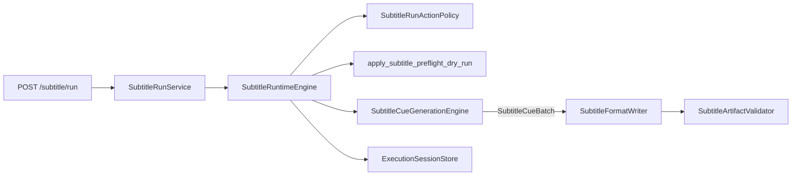
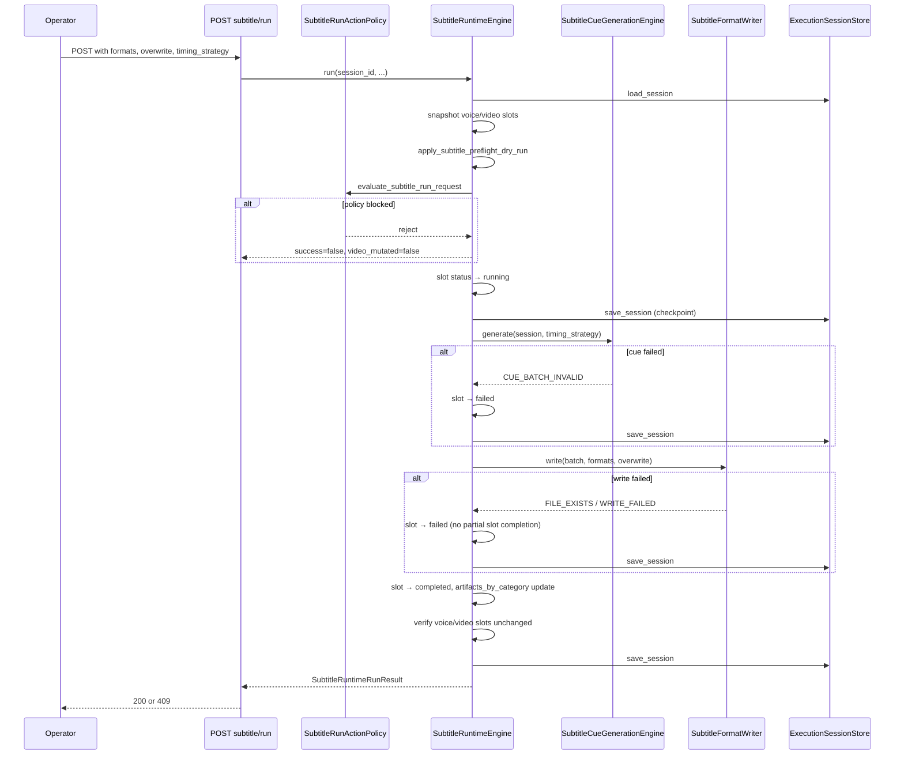

# Phase 11I-7 — Subtitle Runtime Execution API Design

**Status:** Design only — no implementation, no FFmpeg, no burn-in  
**Date:** 2026-05-31  
**Prerequisites:** 11I-2 foundation PASS, 11I-4 cue generation PASS, 11I-6 format writers PASS  
**Next phase:** **11I-8 — Implement Subtitle Runtime Execution API**

---

## Executive Summary

Phase 11I-7 defines the **first explicit subtitle execution trigger** for Content Brain Runtime:

```
POST /sessions/{session_id}/subtitle/run
```

The endpoint orchestrates the existing in-memory cue pipeline (11I-4) and artifact writers (11I-6), updates the **`subtitle_generation`** runtime slot, persists the session, and returns a structured response with **`video_mutated=false`** and **`voice_mutated=false`**.

Subtitle runs are **local, sidecar-only** — no FFmpeg, no video mutation, no voice mutation, no ElevenLabs live approval gate, and no requirement that video generation be completed in V1. Narration text alone is sufficient.

**Implementation requires separate explicit user approval (11I-8).** This document does not implement any of the above.

---

## Design Principles

| Principle | Rule |
|-----------|------|
| Explicit trigger | No auto-run on voice/video dispatch, queue dequeue, or preflight |
| Category isolation | Mutate only `subtitle_generation` (+ `artifacts_by_category.subtitle_generation`) |
| Sidecar-only | Write `.srt` / `.vtt` / `.ass` + manifest — never burn into video |
| Guard-first | Policy check before cue generation or file writes |
| Reuse existing engines | `SubtitleCueGenerationEngine` + `SubtitleFormatWriter` — no rewrite |
| Legacy isolation | No `engines/subtitle_engine.py`, no `full_video_pipeline.py`, no FFmpeg |
| Voice/video read-only | Voice manifest may be **read** for timing; voice/video slots never mutated |
| Preflight coexistence | Dry-run preflight must not clobber a completed subtitle run (mirror 11H voice fix) |

---

## Architecture

### Pipeline position



### Module map (proposed — 11I-8)

```
ui/api/main.py
  └── POST /sessions/{id}/subtitle/run
        └── SubtitleRunService                    # ui/api/subtitle_run_service.py
              └── SubtitleRuntimeEngine           # content_brain/execution/subtitle_runtime_engine.py
                    ├── subtitle_run_action_policy (eligibility)
                    ├── apply_subtitle_preflight_dry_run (refresh, preserve completed)
                    ├── SubtitleCueGenerationEngine (11I-4)
                    ├── SubtitleFormatWriter (11I-6)
                    ├── SubtitleArtifactValidator (11I-2, post-write re-check)
                    └── ExecutionSessionStore (load/save)

ui/api/schemas/subtitle_run.py                    # request/response Pydantic models
ui/api/dependencies.py                            # get_subtitle_run_service()
```

**Why two layers (service + engine)?** Mirrors the proven 11H-2 voice pattern (`VoiceRunService` → `LiveVoiceTtsEngine`). The service is a thin HTTP-facing wrapper; the engine holds orchestration, slot mutation, and session persistence — enabling validator tests without FastAPI.

---

## 1. API Endpoint Design

### Route

```
POST /sessions/{session_id}/subtitle/run
```

| Aspect | Design |
|--------|--------|
| **Purpose** | Generate subtitle cues, write SRT/VTT/ASS + manifest, update slot |
| **Auth** | Same as existing Runtime Studio API (local operator) |
| **Idempotency** | V1: none — caller uses `overwrite=false` to prevent duplicate writes |
| **Concurrency** | One active subtitle run per session (`status=running` blocks) |
| **Sync vs async** | **V1 synchronous** — full pipeline completes in one HTTP request (subtitle work is fast, no external provider) |

### HTTP status mapping

| Condition | HTTP | Response shape |
|-----------|------|-----------------|
| Session not found | `404` | FastAPI `HTTPException` |
| Guard/policy blocked | `409` | `success=false`, `code`, `reject_reasons` |
| Unsupported format / invalid body | `422` | Pydantic validation error |
| Cue/write failure after guard pass | `409` | `success=false`, slot `status=failed` persisted |
| Success | `200` | Full `SubtitleRunResponse` |

### Wiring in `main.py` (11I-8)

Follow the voice run pattern:

```python
@app.post("/sessions/{session_id}/subtitle/run", response_model=SubtitleRunResponse)
def subtitle_run(
    session_id: str,
    body: SubtitleRunRequest | None = None,
    service: SubtitleRunService = Depends(get_subtitle_run_service),
):
    request = body or SubtitleRunRequest()
    try:
        result = service.run(session_id, **request.model_dump())
    except FileNotFoundError as error:
        raise HTTPException(status_code=404, detail=str(error)) from error
    response = _subtitle_run_response(result)  # 409 on success=false policy blocks
    return response
```

**Not wired into:** `ProviderRuntimeEngine.dispatch`, video queue, voice run, or assembly.

---

## 2. Runtime Service Design

### `ui/api/subtitle_run_service.py`

Thin service wrapper — same role as `VoiceRunService`.

```python
API_VERSION = "0.7.3"  # bump when 11I-8 ships

class SubtitleRunService:
    def __init__(
        self,
        store: ExecutionSessionStore,
        *,
        engine: SubtitleRuntimeEngine | None = None,
    ):
        self._store = store
        self._engine = engine or SubtitleRuntimeEngine(store, project_root=store.project_root)

    def run(
        self,
        session_id: str,
        *,
        formats: list[str] | None = None,
        timing_strategy: str = "auto",
        overwrite: bool = False,
        language: str = "auto",
        triggered_by: str = "operator",
        force_retry: bool = False,
    ) -> dict[str, Any]:
        result = self._engine.run(
            session_id,
            formats=formats,
            timing_strategy=timing_strategy,
            overwrite=overwrite,
            language=language,
            triggered_by=triggered_by,
            force_retry=force_retry,
        )
        payload = result.to_dict()
        payload["api_version"] = API_VERSION
        return payload
```

### `content_brain/execution/subtitle_runtime_engine.py` (11I-8)

Core orchestrator — responsibilities listed for the service are implemented here:

| Step | Action |
|------|--------|
| 1 | `store.load_session(session_id)` |
| 2 | Snapshot `voice_slot` + `video_slot` (deep copy) for mutation check |
| 3 | `ensure_multi_category_shell()` if needed |
| 4 | `apply_subtitle_preflight_dry_run()` — refresh source metadata, preserve completed runs |
| 5 | `evaluate_subtitle_run_request()` — guard/policy |
| 6 | Set subtitle slot → `running`, persist checkpoint |
| 7 | `SubtitleCueGenerationEngine.generate()` |
| 8 | `SubtitleFormatWriter.write()` |
| 9 | Re-validate artifacts via `SubtitleArtifactValidator` |
| 10 | Update `artifacts_by_category.subtitle_generation` |
| 11 | Set subtitle slot → `completed` or `failed`, persist final |
| 12 | Return `SubtitleRuntimeRunResult` with `video_mutated` / `voice_mutated` flags |

**Session lock:** Use a per-session threading lock (same pattern as `RuntimeWorkerEngine`) to prevent concurrent subtitle runs from two API clients.

---

## 3. Request Body Schema

### `SubtitleRunRequest` (`ui/api/schemas/subtitle_run.py`)

```json
{
  "formats": ["srt", "ass", "vtt"],
  "timing_strategy": "auto",
  "overwrite": false,
  "language": "auto",
  "triggered_by": "operator"
}
```

| Field | Type | Default | Description |
|-------|------|---------|-------------|
| `formats` | `string[]` | `["srt", "ass", "vtt"]` | Subset of `srt`, `ass`, `vtt` |
| `timing_strategy` | `string` | `"auto"` | `"auto"` \| `"equal_chunk"` \| `"audio_duration"` |
| `overwrite` | `bool` | `false` | Passed to `SubtitleFormatWriter` |
| `language` | `string` | `"auto"` | `"auto"` resolves from profile/brief; else ISO-ish code |
| `triggered_by` | `string` | `"operator"` | Audit attribution |
| `force_retry` | `bool` | `false` | Allow re-run when `status=failed` without overwrite |

### Field resolution rules

**`timing_strategy: "auto"`**

1. If voice slot `status=completed` and voice manifest has segment durations → use `audio_duration`
2. Else → use `equal_chunk`

Explicit `"audio_duration"` when voice timing unavailable → reject with `TIMING_STRATEGY_UNAVAILABLE`.

**`language: "auto"`**

Reuse 11I-4 `_resolve_language()` order: profile `language_rules.caption_language` → brief `language` → `"en"`.

**`formats`**

- Empty list → validation error (422)
- Unknown format → `UNSUPPORTED_FORMAT` from writer (409)
- Must be subset of `SUBTITLE_SUPPORTED_FORMATS`

---

## 4. Response Schema

### `SubtitleRunResponse`

```json
{
  "success": true,
  "session_id": "exec_abc123",
  "status": "completed",
  "message": "Subtitle generation completed.",
  "code": null,
  "reject_reasons": [],
  "subtitle_slot": { "...": "..." },
  "guard_result": { "...": "..." },
  "formats_written": ["srt", "ass", "vtt"],
  "artifacts": [
    {
      "format": "srt",
      "file_name": "subtitles.srt",
      "file_path": ".../subtitles.srt",
      "size_bytes": 130,
      "cue_count": 2,
      "validation_status": "valid"
    }
  ],
  "manifest_path": ".../subtitle_manifest.json",
  "manifest": { "...": "..." },
  "cue_count": 2,
  "validation_status": "valid",
  "source_type": "narration_text_only",
  "timing_strategy": "equal_chunk",
  "video_mutated": false,
  "voice_mutated": false,
  "subtitles_executed": true,
  "real_provider_called": false,
  "api_version": "0.7.3"
}
```

### Required response fields (per spec)

| Field | Source |
|-------|--------|
| `session_id` | Path param |
| `status` | Terminal subtitle slot status or `"rejected"` |
| `subtitle_slot` | Updated slot dict |
| `formats_written` | From write result |
| `artifacts` | From write result file records |
| `manifest_path` | From write result |
| `cue_count` | From batch |
| `validation_status` | `"valid"` / `"invalid"` |
| `video_mutated` | Always `false` on success; `false` on reject (slots untouched) |
| `voice_mutated` | Always `false` |

### Failure response example

```json
{
  "success": false,
  "session_id": "exec_abc123",
  "status": "rejected",
  "code": "FILE_EXISTS",
  "reject_reasons": ["File exists: subtitles.srt"],
  "video_mutated": false,
  "voice_mutated": false,
  "subtitles_executed": false
}
```

On execution failure (guard passed, write failed): persist slot `status=failed`, return `409` with `code` from engine/write result.

---

## 5. Runtime Lifecycle — `subtitle_generation` Slot

### Status transitions

```
planned ──► pending ──► running ──► completed
                │           │
                │           ├──► failed
                │           └──► cancelled
                └──► skipped (preflight: no source)
```

| Status | Meaning |
|--------|---------|
| `planned` | Shell default — no preflight yet |
| `pending` | Preflight passed, source ready, not executed |
| `running` | Subtitle run in progress |
| `completed` | Artifacts written and validated |
| `failed` | Run attempted, no valid artifacts |
| `cancelled` | Cooperative cancel (operations flag) mid-run |
| `skipped` | No narration/voice source (preflight only) |

### Slot fields after execution (extends 11I-2 schema)

```json
{
  "category_name": "subtitle_generation",
  "status": "completed",
  "provider": "local_subtitle_runtime",
  "source_type": "narration_text_only",
  "source_ready": true,
  "timing_strategy": "equal_chunk",
  "language": "en",
  "cue_count": 2,
  "formats_written": ["srt", "ass", "vtt"],
  "manifest_path": ".../subtitle_manifest.json",
  "artifacts": [
    {
      "format": "srt",
      "file_name": "subtitles.srt",
      "file_path": "...",
      "size_bytes": 130,
      "cue_count": 2,
      "validation_status": "valid"
    }
  ],
  "validation_status": "valid",
  "supported_formats": ["srt", "ass", "vtt"],
  "executed": true,
  "dry_run": false,
  "started_at": "2026-05-31 15:00:00",
  "completed_at": "2026-05-31 15:00:01",
  "duration_seconds": 1.2,
  "error": null,
  "engine_version": "11i4_v1",
  "writer_version": "11i6_v1",
  "runtime_engine_version": "11i8_v1",
  "slot_version": "11i7_v1",
  "subtitle_preflight": { "...": "..." },
  "subtitle_run": {
    "triggered_by": "operator",
    "run_id": "subtitle_run_20260531_150000_a1b2c3",
    "formats_requested": ["srt", "ass", "vtt"],
    "overwrite": false,
    "force_retry": false
  },
  "runtime_notes": ["Narration text available for subtitle generation"],
  "created_at": "...",
  "updated_at": "..."
}
```

### `artifacts_by_category` update

On success, mirror artifact records into:

```python
runtime["artifacts_by_category"]["subtitle_generation"] = [
    {
        "format": "srt",
        "file_name": "subtitles.srt",
        "file_path": "...",
        "category": "subtitle_generation",
        "validation_status": "valid",
    },
    # ... ass, vtt, manifest reference optional
]
```

Keep legacy `subtitles` alias in sync via `sync_subtitle_category_aliases()`.

### Slot mutation helpers (11I-8)

```python
def _set_subtitle_running(slot, *, run_id, triggered_by) -> dict: ...
def _set_subtitle_completed(slot, *, write_result, batch, started_at) -> dict: ...
def _set_subtitle_failed(slot, *, code, reasons, started_at, partial_artifacts=None) -> dict: ...
def _set_subtitle_cancelled(slot, *, started_at, partial_artifacts=None) -> dict: ...
```

---

## 6. Guard / Policy Design

### `content_brain/execution/subtitle_run_action_policy.py`

Pure policy module — no file writes, no session mutation.

```python
ACTION_RUN = "run_subtitle_generation"

CODE_SESSION_NOT_FOUND = "SESSION_NOT_FOUND"          # raised before policy
CODE_SESSION_ARCHIVED = "SESSION_ARCHIVED"
CODE_SUBTITLE_SLOT_MISSING = "SUBTITLE_SLOT_MISSING"
CODE_SOURCE_NOT_READY = "SOURCE_NOT_READY"
CODE_SUBTITLE_RUN_IN_PROGRESS = "SUBTITLE_RUN_IN_PROGRESS"
CODE_OPERATIONS_CANCELLED = "OPERATIONS_CANCELLED"
CODE_OVERWRITE_REQUIRED = "OVERWRITE_REQUIRED"
CODE_TIMING_STRATEGY_UNAVAILABLE = "TIMING_STRATEGY_UNAVAILABLE"
```

### Guard checklist

| # | Check | Block code |
|---|-------|------------|
| 1 | Session exists | `404` (not policy) |
| 2 | Session not archived | `SESSION_ARCHIVED` |
| 3 | `subtitle_generation` slot exists or shell can create it | `SUBTITLE_SLOT_MISSING` |
| 4 | `source_ready=true` OR `resolve_subtitle_source_type() != unavailable` | `SOURCE_NOT_READY` |
| 5 | Subtitle slot `status != running` | `SUBTITLE_RUN_IN_PROGRESS` |
| 6 | Operations cancel not requested | `OPERATIONS_CANCELLED` |
| 7 | If slot `status=completed` and artifacts exist and `overwrite=false` and not `force_retry` | defer to writer `FILE_EXISTS` OR pre-check `OVERWRITE_REQUIRED` |
| 8 | Requested `timing_strategy=audio_duration` but no voice timing | `TIMING_STRATEGY_UNAVAILABLE` |

### Explicit non-requirements (V1)

| Gate | Required? |
|------|-----------|
| ElevenLabs live approval | **No** |
| Voice TTS executed | **No** (narration text sufficient) |
| Video generation completed | **No** |
| Video dispatch / Runway / Hailuo | **No** |

Voice manifest is an **optional timing upgrade**, not a prerequisite.

### Runnable statuses

Allow run when subtitle slot status is:

```python
RUNNABLE_STATUSES = frozenset({"pending", "failed", "cancelled", "planned", "completed"})
```

- `completed` + existing files → blocked unless `overwrite=true`
- `skipped` → blocked (`SOURCE_NOT_READY`) until narration source appears
- `running` → always blocked

---

## 7. Execution Flow (Detailed)



### Cancel handling (V1)

Check `is_cancellation_requested(session)`:

- Before cue generation
- Before format write

If cancelled mid-run: set slot `cancelled`, do not mark `executed=true`, best-effort cleanup of partial files (writer rollback already handles validation failure).

---

## 8. Safety Rules

| Rule | Enforcement |
|------|-------------|
| No FFmpeg | Engine/service AST scan in validator; no subprocess |
| No video mutation | Never write video paths; `video_mutated=false` in response; slot snapshot compare |
| No voice mutation | Read voice manifest only; `voice_mutated=false`; slot snapshot compare |
| No legacy imports | Ban `engines.subtitle_engine`, `full_video_pipeline` in new modules |
| No burn-in | Writers produce sidecar files only (11I-6 contract) |
| Atomic writes | Delegated to `SubtitleFormatWriter.atomic_write_text` |
| Rollback on validation fail | Writer deletes files; engine sets slot `failed` |
| Preflight preservation | Update `apply_subtitle_preflight_dry_run` to skip reset when `executed=true` and `status=completed` (mirror voice) |

---

## 9. Validation Plan (11I-8)

**Script:** `project_brain/validate_11i8_subtitle_runtime_execution_api.py`

| # | Test | Method |
|---|------|--------|
| 1 | Run subtitles from narration text only | Session with brief narration, no voice run |
| 2 | Run subtitles from voice manifest timing | Voice slot completed + manifest durations |
| 3 | Write all formats (srt, ass, vtt) | Assert files exist |
| 4 | Subtitle slot `status=completed` after success | Load session post-run |
| 5 | Unsupported format fails safely | Request `formats=["txt"]` → `UNSUPPORTED_FORMAT` |
| 6 | `overwrite=false` blocks existing files | Second run → `FILE_EXISTS` |
| 7 | `overwrite=true` allows rewrite | Second run succeeds |
| 8 | Voice slot unchanged | Deep compare before/after |
| 9 | Video slot unchanged | Deep compare before/after |
| 10 | No FFmpeg import/call | AST scan on engine + service |
| 11 | No legacy `subtitle_engine` import | AST scan |
| 12 | No `full_video_pipeline` import | AST scan |
| 13 | Response includes `video_mutated=false` | Assert on success and reject |
| 14 | Response includes `voice_mutated=false` | Assert on success and reject |
| 15 | `SubtitleArtifactValidator` passes post-run | Reuse 11I-2 validator |
| 16 | Manifest `cue_count` matches batch | JSON assert |
| 17 | Active run blocked | Set slot running, second request → `SUBTITLE_RUN_IN_PROGRESS` |
| 18 | Source not ready blocked | Empty session → `SOURCE_NOT_READY` |
| 19 | 11I-6 regression | Subprocess |
| 20 | 11I-4 regression | Subprocess |
| 21 | 11I-2 regression | Subprocess |
| 22 | 11H-2d regression | Subprocess |

### API-level tests (optional 11I-8b)

Use FastAPI `TestClient` against `main.app` for HTTP status codes (`404`, `409`, `200`).

---

## 10. Files Likely to Change (11I-8)

### New files

| File | Purpose |
|------|---------|
| `content_brain/execution/subtitle_runtime_engine.py` | Core orchestrator |
| `content_brain/execution/subtitle_run_action_policy.py` | Guard/policy |
| `ui/api/subtitle_run_service.py` | API service wrapper |
| `ui/api/schemas/subtitle_run.py` | Pydantic request/response |
| `project_brain/validate_11i8_subtitle_runtime_execution_api.py` | Validator |
| `project_brain/PHASE_11I8_SUBTITLE_RUNTIME_EXECUTION_API_REPORT.md` | Implementation report |

### Modified files

| File | Change |
|------|--------|
| `ui/api/main.py` | Add `POST /sessions/{id}/subtitle/run` route |
| `ui/api/dependencies.py` | Add `get_subtitle_run_service()` |
| `content_brain/execution/subtitle_preflight_runtime_slot.py` | Preserve completed executed runs (voice pattern) |
| `content_brain/execution/category_runtime_compat.py` | Bump `SUBTITLE_SLOT_VERSION` to `11i7_v1`; optional default field additions |

### Not modified

| Area | Reason |
|------|--------|
| `engines/subtitle_engine.py` | Legacy isolation |
| `pipelines/full_video_pipeline.py` | Legacy isolation |
| Voice runtime (`live_voice_tts_engine.py`, voice run API) | Category isolation |
| Video runtime / Runway / Hailuo | Category isolation |
| `SubtitleCueGenerationEngine` | Reuse as-is (11I-4) |
| `SubtitleFormatWriter` | Reuse as-is (11I-6) |

---

## 11. Risks and Mitigations

| Risk | Impact | Mitigation |
|------|--------|------------|
| Preflight clobbers completed subtitle run on video dispatch | Lost artifact metadata | Mirror `_is_completed_executed_voice_run` guard in subtitle preflight (11I-8) |
| Concurrent API calls double-write | Corrupt artifacts | Per-session lock in `SubtitleRuntimeEngine` |
| `audio_duration` requested without voice manifest | Empty/wrong cues | Policy rejects with `TIMING_STRATEGY_UNAVAILABLE`; auto mode falls back to `equal_chunk` |
| Large narration → long sync HTTP | API timeout | V1 acceptable; future async worker if needed (11I-9+) |
| Slot alias drift (`subtitles` vs `subtitle_generation`) | Panel/API inconsistency | Always call `sync_subtitle_category_aliases()` on read/write |
| Writer `FILE_EXISTS` after slot set `running` | Slot stuck in `running` | Set `running` only after overwrite pre-check; on write fail revert to `failed` |
| Session save failure after file write | Files on disk, slot pending | Idempotent re-run with `overwrite=true`; manifest is source of truth |
| Operator expects burn-in | Wrong expectation | Document sidecar-only; no FFmpeg in any phase until explicit assembly phase |

---

## 12. Isolation Diagram

```
ProviderRuntimeEngine.dispatch     SubtitleRuntimeEngine.run
  video_generation only              subtitle_generation only
  Runway / Hailuo                    local cue + file writers
  may call subtitle preflight        separate POST /subtitle/run
  (dry-run metadata only)            never touches video/voice slots

LiveVoiceTtsEngine.run             SubtitleRuntimeEngine.run
  voice_generation mutation          subtitle_generation mutation
  ElevenLabs approval gates          no ElevenLabs gate
  writes voice_manifest.json         writes subtitle_manifest.json
```

---

## 13. Implementation Slices (11I-8)

| Slice | Deliverable |
|-------|-------------|
| **11I-8a** | `subtitle_run_action_policy.py` + unit tests |
| **11I-8b** | `subtitle_runtime_engine.py` — orchestration, slot helpers |
| **11I-8c** | Preflight completed-run preservation |
| **11I-8d** | `subtitle_run_service.py` + schemas + dependencies |
| **11I-8e** | `main.py` route + HTTP status mapping |
| **11I-8f** | `validate_11i8_subtitle_runtime_execution_api.py` + report |

---

## 14. Next Phase

**PHASE 11I-8 — Implement Subtitle Runtime Execution API**

Implement the modules above, wire the endpoint, run the 11I-8 validator plus 11I-6 / 11I-4 / 11I-2 / 11H-2d regressions, and publish the implementation report.

**Future (post-11I-8):**

- UI panel "Run Subtitles" button
- Async worker mode for very long narrations
- Assembly phase subtitle burn-in (separate phase, explicit FFmpeg gate)
