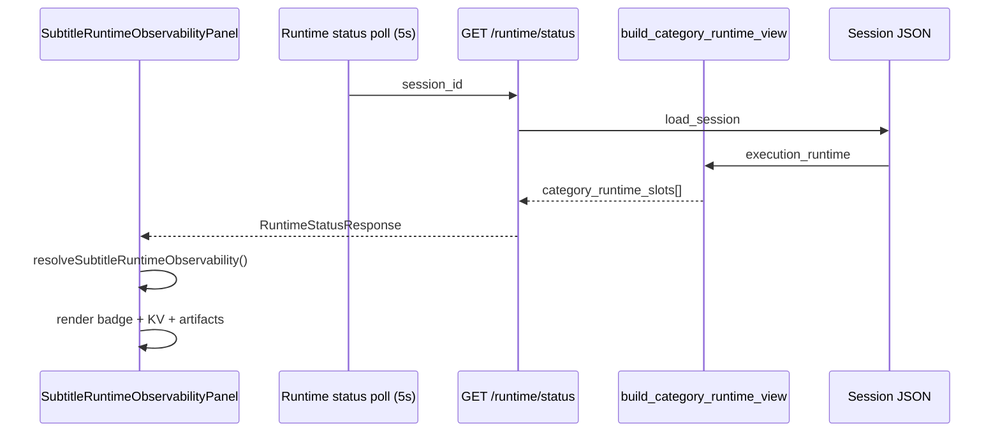

# Phase 11I-9 — Subtitle Runtime UI Observability Design

**Status:** Design only — no UI implementation, no FFmpeg, no burn-in controls  
**Date:** 2026-05-31  
**Prerequisites:** 11I-2 foundation PASS, 11I-8 execution API PASS  
**Next phase:** **11I-10 — Implement Subtitle UI Observability Panel**

---

## Executive Summary

Phase 11I-9 designs **read-only Subtitle Runtime observability** for Execution Center. Operators will see subtitle preflight metadata, execution results, artifact paths, and validation status in a dedicated **Subtitle Runtime Panel** nested inside **Runtime Observability**, adjacent to the existing voice panel.

The panel mirrors the proven `VoiceRuntimeObservabilityPanel` pattern (11H-1c/1e): normalized resolver utility, status badge, KV grid, safety banner, no action buttons in this phase.

**Key principle:** Subtitles are **sidecar files only**. The UI must never imply video burn-in, FFmpeg, or assembly is available from this panel.

**Do not start Phase 11I-10 until explicit user approval.**

---

## Current UI Architecture

### Placement today

```
SessionDrawer / ExecutionCenterPage
  └── RuntimeObservabilityPanel
        ├── Video runtime (clip artifacts, validation, failover)
        ├── CategoryRuntimeSlotsPanel          ← generic slot cards (includes subtitles row)
        └── VoiceRuntimeObservabilityPanel     ← dedicated voice read-only panel
```

`CategoryRuntimeSlotsPanel` already lists all media categories from `category_runtime_slots[]`, including `subtitle_generation` (canonical key; legacy `subtitles` aliased on backend). The generic card shows only provider, artifact count, and timestamps — **insufficient** for subtitle-specific observability.

### Data sources (existing)

| Source | Fields available today |
|--------|------------------------|
| `GET /sessions/{id}/runtime/status` → `category_runtime_slots[]` | Subtitle slot via `build_category_runtime_view()` |
| `legacyPanel` / `provider_runtime_panel.data` | Fallback for older sessions |
| Session JSON `execution_runtime.category_runtime.subtitle_generation` | Deep fallback |
| `execution_runtime.operations.subtitle_preflight_dry_run` | Preflight summary |
| `execution_runtime.operations.subtitle_execution` | Last run metadata (11I-8) |
| `execution_runtime.artifacts_by_category.subtitle_generation` | Artifact index |

### Backend slot fields (post-11I-8)

After a successful subtitle run, the slot may contain:

`status`, `provider`, `source_type`, `source_ready`, `timing_strategy`, `language`, `cue_count`, `formats_written`, `artifacts[]`, `manifest_path`, `validation_status`, `executed`, `dry_run`, `started_at`, `completed_at`, `duration_seconds`, `runtime_notes`, `error`, `subtitle_preflight`, `subtitle_run`, `supported_formats`, `slot_version`

Most fields pass through `normalize_category_slot()` via `{**base, **slot}` spread; subtitle-specific fields are also explicitly merged for `source_type`, `source_ready`, `validation_status`, etc.

---

## UI Placement Plan

### Recommended layout (11I-10)

Add **`SubtitleRuntimeObservabilityPanel`** inside `RuntimeObservabilityPanel`, **below** `VoiceRuntimeObservabilityPanel`:

```
Runtime Observability
  [session state · provider · heartbeat · preflight · validation]

Media categories                    ← CategoryRuntimeSlotsPanel (unchanged summary)
  [video · voice · music · subtitle_generation · assembly cards]

Voice runtime                       ← existing (11H-1c+)
  [voice_generation badge + KV + approval gate]

Subtitle runtime                    ← NEW (11I-10)
  [safety banner]
  [subtitle_generation badge + KV grid]
  [artifact file list]
  [error block when failed]

Clip artifacts                      ← video only (unchanged)
```

### Why a dedicated panel (not only CategoryRuntimeSlotsPanel)

| Reason | Detail |
|--------|--------|
| Field depth | Subtitle needs 15+ fields; generic card shows 4 |
| Artifact formats | SRT / VTT / ASS / manifest need distinct rows |
| Safety copy | Burn-in disclaimer belongs with subtitle context |
| Parity | Voice already has dedicated panel; subtitles deserve same |
| Future controls | Run / regenerate buttons attach here in 11I-11+ |

### Compact mode (`compact={true}`)

Used on Execution Center active-jobs list embed:

- Show: status badge, `source_ready`, `cue_count` (if present), safety one-liner
- Hide: full artifact path list, manifest JSON hint, timing details
- No buttons (same as voice compact)

---

## Subtitle Runtime Panel — Wireframe

```
┌─────────────────────────────────────────────────────────────┐
│ Subtitle runtime                                            │
│ Subtitle files only — no video burn-in yet.                 │
├─────────────────────────────────────────────────────────────┤
│ subtitle_generation                    [Subtitles ready ●]  │
├─────────────────────────────────────────────────────────────┤
│ Status          completed        Provider    local_subtitle…│
│ Source type     narration_text…  Source ready  true         │
│ Timing strategy equal_chunk      Cue count     2            │
│ Formats written srt, ass, vtt    Validation    valid        │
│ Manifest path   …/subtitle_manifest.json                  │
│ Started         2026-05-31 …     Completed    2026-05-31 …│
│ Duration        1.2s                                          │
│ Runtime notes   Narration text available for subtitle …     │
├─────────────────────────────────────────────────────────────┤
│ Subtitle artifacts                                          │
│  ● subtitles.srt      …/subtitles.srt          valid  130 B │
│  ● subtitles.vtt      …/subtitles.vtt          valid  134 B │
│  ● subtitles.ass      …/subtitles.ass          valid 1045 B │
│  ● subtitle_manifest  …/subtitle_manifest.json valid        │
├─────────────────────────────────────────────────────────────┤
│ (failed only) Error: FILE_EXISTS — File exists: subtitles…  │
└─────────────────────────────────────────────────────────────┘
```

CSS class prefix: `subtitle-runtime-observability` (mirror `voice-runtime-observability`).

---

## Fields to Display

| UI Label | Slot field | Fallback chain | Empty display |
|----------|------------|----------------|---------------|
| Status | `status` | — | `planned` |
| Provider | `provider` | default `local_subtitle_runtime` | `—` |
| Source type | `source_type` | `subtitle_preflight.source_type` | `—` |
| Source ready | `source_ready` | `subtitle_preflight.source_ready` | `—` |
| Timing strategy | `timing_strategy` | — | `—` |
| Cue count | `cue_count` | sum from `artifacts[].cue_count` | `—` |
| Formats written | `formats_written` | derive from `artifacts[].format` | `—` |
| Validation status | `validation_status` | first artifact `validation_status` | `—` |
| Manifest path | `manifest_path` | scan artifacts for `subtitle_manifest.json` | `—` |
| Started | `started_at` | — | `—` |
| Completed | `completed_at` | — | `—` |
| Duration | `duration_seconds` | format via `formatDurationSeconds()` | `—` |
| Runtime notes | `runtime_notes[]` | join with ` · ` | `—` |
| Error code | `error.code` | — | `—` |
| Error message | `error.message` | — | `—` |
| Executed | `executed` | `operations.subtitle_execution.subtitles_executed` | `—` |
| Dry run | `dry_run` | preflight `files_generated === false` | `—` |

### Human-readable source type labels

| Raw value | Display |
|-----------|---------|
| `narration_text_only` | Narration text |
| `narration_with_timing` | Voice manifest timing |
| `unavailable` | No source |

### Human-readable timing strategy labels

| Raw value | Display |
|-----------|---------|
| `equal_chunk` | Equal chunk (estimated) |
| `audio_duration` | Audio duration (voice manifest) |
| `auto` | Auto (resolved at run) |

---

## Status Badge Mapping

| Canonical `status` | Badge label | CSS class (reuse) |
|--------------------|-------------|-------------------|
| `planned` | Not started | `runtime-gate-unknown` |
| `pending` | Ready | `runtime-gate-pass` |
| `running` | Generating subtitles | `runtime-gate-pass` |
| `completed` | Subtitles ready | `runtime-gate-pass` |
| `failed` | Failed | `runtime-gate-fail` |
| `skipped` | No subtitle source | `runtime-gate-unknown` |
| `cancelled` | Cancelled | `runtime-gate-unknown` |

Implementation: `formatSubtitleStatusLabel(status, errorCode?)` in `categoryRuntimeShell.ts` (or new `subtitleRuntimeObservability.ts`).

Special case (optional 11I-10): if `failed` + `error.code === SOURCE_NOT_READY` → label **No subtitle source** (aligns with skipped semantics).

---

## Artifact Display Plan

### Primary source

1. `slot.artifacts[]` from subtitle slot (post-11I-8 run records)
2. `artifacts_by_category.subtitle_generation[]` from runtime
3. Construct expected paths from `manifest_path` parent dir when slot empty but manifest exists

### Expected files (V1 fixed names)

| File | Format key | Icon/badge |
|------|------------|--------------|
| `subtitles.srt` | `srt` | `SRT` |
| `subtitles.vtt` | `vtt` | `VTT` |
| `subtitles.ass` | `ass` | `ASS` |
| `subtitle_manifest.json` | `manifest` | `JSON` |

### Row layout per artifact

```
[format badge]  file_name (mono)
                file_path (mono, truncated with title=full path)
                validation_status · size_bytes (if available)
```

### Path interaction (11I-10)

- **Read-only:** display full path as text with `title` tooltip
- **No** `file://` links in V1 (browser security); optional copy-to-clipboard icon in 11I-11
- **No** download buttons in 11I-10 (future phase)

### Missing artifacts

When `status=completed` but file row missing → show row with `—` path and note: *Expected file not indexed — refresh session*.

When `status=pending` / `skipped` → artifact section shows muted: *No subtitle files generated yet.*

---

## Frontend Resolver Design

### New utility: `resolveSubtitleRuntimeObservability()`

Location: `ui/web/src/utils/subtitleRuntimeObservability.ts` (or extend `categoryRuntimeShell.ts`)

Pattern mirrors `resolveVoiceRuntimeObservability()`:

```typescript
export type SubtitleRuntimeObservability = {
  category_key: "subtitle_generation";
  status: string;
  statusLabel: string;
  statusClassName: string;
  provider: string;
  sourceType: string;
  sourceReady: string;
  timingStrategy: string;
  cueCount: string;
  formatsWritten: string;
  validationStatus: string;
  manifestPath: string;
  startedAt: string;
  completedAt: string;
  durationSeconds: string;
  runtimeNotes: string;
  errorCode: string;
  errorMessage: string;
  executed: string;
  dryRun: string;
  artifacts: SubtitleArtifactRow[];
  safetyNote: string;
  hasSubtitleSource: boolean;
  isSubtitleRunning: boolean;
};
```

### Slot resolution order

1. `category_runtime_slots.find(s => s.category_key === "subtitle_generation")`
2. Fallback: `category_runtime_slots.find(s => s.category_key === "subtitles")` → normalize key to `subtitle_generation`
3. Fallback: `legacyPanel.execution_runtime.category_runtime.subtitle_generation`
4. Fallback: `legacyPanel.execution_runtime.category_runtime.subtitles`
5. Placeholder: `{ status: "planned", provider: "local_subtitle_runtime" }`

**Never throw** on missing fields — all formatters return `—`.

### Extend `CategoryRuntimeSlot` TypeScript type (11I-10)

Add optional subtitle fields to avoid silent `any` casts:

```typescript
source_type?: string | null;
source_ready?: boolean;
timing_strategy?: string | null;
cue_count?: number | null;
formats_written?: string[];
manifest_path?: string | null;
validation_status?: string | null;
subtitle_preflight?: Record<string, unknown> | null;
supported_formats?: string[];
```

---

## API / DTO Gap Analysis

### Already available via `RuntimeStatusResponse.category_runtime_slots[]`

These fields are present on the session slot and pass through `build_category_runtime_view()` today:

- `source_type`, `source_ready`, `validation_status`, `supported_formats`
- `started_at`, `completed_at`, `duration_seconds`, `runtime_notes`, `error`
- `executed`, `dry_run`, `artifacts`, `subtitle_preflight`
- Post-run: `cue_count`, `formats_written`, `manifest_path`, `timing_strategy`, `language` (via slot spread)

**11I-10 can ship read-only observability using existing `GET /runtime/status` without new endpoints.**

### Recommended backend additions (11I-10, optional polish)

| Addition | Location | Why |
|----------|----------|-----|
| Explicit merge of `cue_count`, `formats_written`, `manifest_path`, `timing_strategy`, `language` in `normalize_category_slot()` | `category_runtime_compat.py` | Guarantees fields even if base schema changes |
| Top-level `subtitle_runtime_panel` excerpt on `RuntimeStatusResponse` | `runtime_service.py` | Single stable DTO for UI (mirrors future voice excerpt pattern) |
| `CategoryRuntimeSlotStatus` Pydantic extension | `schemas/runtime.py` | Typed OpenAPI docs for subtitle fields |
| `manifest` excerpt (cue_count, generated_at only — not full JSON) | runtime status | Avoid UI parsing manifest file from disk |

### Not required for 11I-10

- New GET endpoint for subtitle artifacts
- Static file serving for SRT/VTT/ASS download
- WebSocket push (poll existing 5s runtime status)

---

## Safety Copy

### Primary banner (always visible in full panel)

> **Subtitle files only — no video burn-in yet.**

Secondary muted line:

> Sidecar SRT, VTT, and ASS files are written locally. Video is not modified. FFmpeg and assembly are not available from this panel.

### Forbidden in 11I-10 UI

| Forbidden | Reason |
|-----------|--------|
| Burn subtitles button | No FFmpeg / burn-in |
| FFmpeg / transcode labels as actions | Out of scope |
| Assembly / mux button | Future phase |
| Edit video / replace video actions | Category isolation |
| Auto-run subtitle on video dispatch | Explicit API only (11I-8) |

### Validator guard (11I-10)

Add `uiContainsSubtitleBurnInActions(source: string): boolean` — scan component source for forbidden strings:

- `burn subtitle`, `burn-in`, `ffmpeg`, `Send to Assembly` (as button), `mux subtitle`

Mirror existing `uiContainsLiveTtsActions()` pattern.

---

## Future Controls (Design Only — Not 11I-10)

Place in a **`Subtitle runtime actions`** subsection below artifact list (same nesting pattern as voice approval actions):

| Control | API | Visibility gate |
|---------|-----|-----------------|
| **Run subtitles** | `POST …/subtitle/run` | `source_ready`, not `running`, not archived |
| **Regenerate subtitles** | `POST …/subtitle/run` + `overwrite: true` | `status=completed` or `failed` |
| **Download SRT / VTT / ASS** | Static file route or signed path (TBD) | `status=completed`, file exists |
| **Send to Assembly** | Future assembly API | `status=completed`, assembly phase approved |

All future controls require:

- Confirm dialog for regenerate (overwrite)
- Success toast with `video_mutated=false` confirmation
- Disabled state when `running`
- No control visible in 11I-10

---

## Legacy Session Safety

| Scenario | UI behavior |
|----------|-------------|
| Old session with only `subtitles` key | Resolver maps to `subtitle_generation` display name |
| Missing `subtitle_generation` slot | Show placeholder `planned` / Not started |
| Missing post-run fields (`cue_count`, etc.) | Display `—` |
| Empty `artifacts[]` | Show "No subtitle files generated yet" |
| `validation_status: null` | Display `—` |
| Malformed `error` (string vs object) | Coerce safely; never crash |
| Pre-11I sessions without preflight | Status from slot or `planned` |

Update `defaultPlaceholderSlots()` in `categoryRuntimeShell.ts`:

- Change `{ category_key: "subtitles", … }` → `{ category_key: "subtitle_generation", category_name: "subtitle_generation", … }` for consistency with backend canonical key.

---

## CategoryRuntimeSlotsPanel Note Update (11I-10)

Current note:

> Read-only runtime shell — only video executes today; voice shows dry-run preflight metadata.

Proposed:

> Read-only runtime shell — video dispatches clips; voice and subtitle categories show preflight and execution metadata.

Subtitle card in the generic list remains a **summary**; detail lives in `SubtitleRuntimeObservabilityPanel`.

---

## Validation Plan (11I-10)

**Script:** `project_brain/validate_11i10_subtitle_ui_observability_panel.py`

| # | Test | Method |
|---|------|--------|
| 1 | `SubtitleRuntimeObservabilityPanel` component exists | File / export scan |
| 2 | Panel mounted in `RuntimeObservabilityPanel` | Source import scan |
| 3 | `resolveSubtitleRuntimeObservability` exists | Module scan |
| 4 | Status labels map correctly (7 statuses) | Unit tests |
| 5 | Legacy `subtitles` key resolves to `subtitle_generation` | Resolver fixture |
| 6 | Missing fields render `—` without throw | Resolver fixture |
| 7 | Completed session shows artifact rows | Mock slot + snapshot |
| 8 | Safety banner text present | Source string scan |
| 9 | No burn-in / FFmpeg / assembly buttons | Forbidden string scan |
| 10 | No `Run subtitles` button in 11I-10 | Source scan |
| 11 | Compact mode hides artifact paths | Prop test or source scan |
| 12 | Voice panel unchanged | Diff scope check |
| 13 | Video artifact section unchanged | Diff scope check |
| 14 | 11I-8 regression | Subprocess |
| 15 | 11I-2 regression | Subprocess |
| 16 | 11H-2d regression | Subprocess |

Optional Playwright: open Execution Center → session with completed subtitles → badge reads "Subtitles ready".

---

## Files Likely to Change (11I-10)

### New files

| File | Purpose |
|------|---------|
| `ui/web/src/components/SubtitleRuntimeObservabilityPanel.tsx` | Dedicated read-only panel |
| `ui/web/src/utils/subtitleRuntimeObservability.ts` | Resolver + status labels + artifact rows |
| `project_brain/validate_11i10_subtitle_ui_observability_panel.py` | Validator |
| `project_brain/PHASE_11I10_SUBTITLE_UI_OBSERVABILITY_REPORT.md` | Implementation report |

### Modified files

| File | Change |
|------|---------|
| `ui/web/src/components/RuntimeObservability.tsx` | Mount `SubtitleRuntimeObservabilityPanel` |
| `ui/web/src/utils/categoryRuntimeShell.ts` | Extend types; fix placeholder key; optional shared status class |
| `ui/web/src/App.css` | Styles for `.subtitle-runtime-observability` |
| `content_brain/execution/category_runtime_compat.py` | Optional explicit subtitle field merge |
| `ui/api/schemas/runtime.py` | Optional typed subtitle fields on slot schema |

### Not modified

| Area | Reason |
|------|--------|
| Voice runtime panels / approval controls | Isolation |
| Video dispatch / clip artifacts | Isolation |
| `POST /subtitle/run` API | Already complete (11I-8) |
| Runway / Hailuo / legacy pipeline | Constraints |
| Tk Runtime Studio panels | Execution Center web scope for 11I-10 |

---

## Sequence — Data Flow



No write paths in 11I-10.

---

## Next Phase

**PHASE 11I-10 — Implement Subtitle UI Observability Panel**

Implement `SubtitleRuntimeObservabilityPanel`, resolver utility, Runtime Observability wiring, CSS, validator, and report. Keep read-only — no Run / Download / Assembly buttons until a later phase.

**Future after 11I-10:**

- **11I-11** — Subtitle Run / Regenerate UI controls (wire `POST /subtitle/run`)
- **11I-12** — Artifact download + Assembly handoff design
