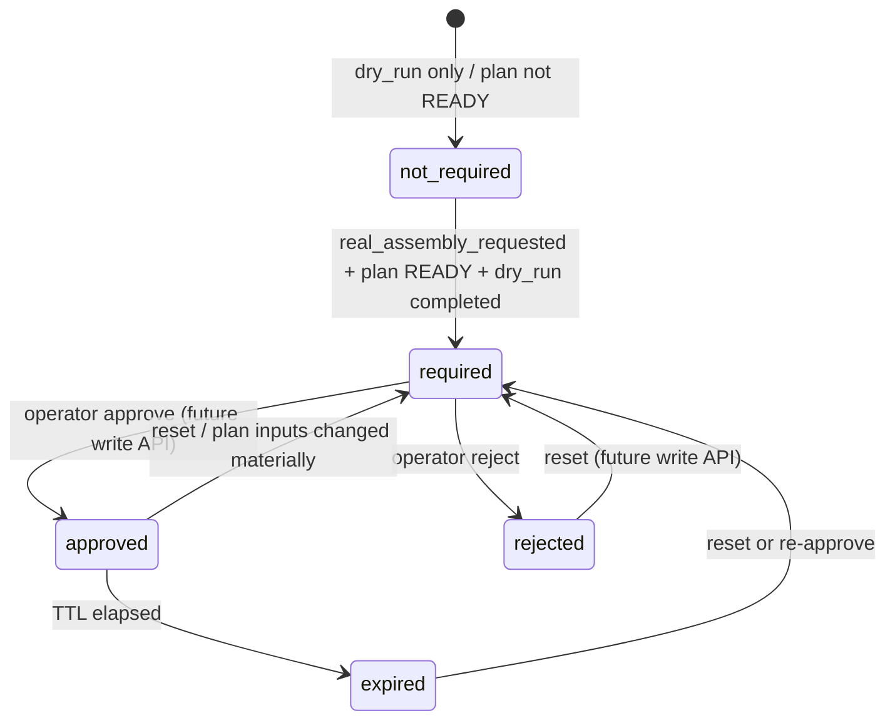
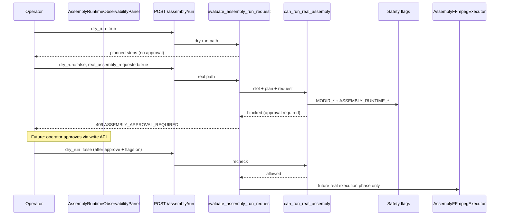

# Phase 11J-11 — Assembly Runtime Approval Gate Design

**Status:** Design only — no implementation, no approval write APIs, no FFmpeg, no Run Assembly button  
**Date:** 2026-05-31  
**Prerequisites:** 11J-2 foundation, 11J-4 plan builder, 11J-6 executor dry-run, 11J-8 API dry-run, 11J-10 UI observability  
**Next phase:** **11J-12 — Assembly Approval Gate Read-Only Implementation**

---

## Executive Summary

Content Brain already has **session-level** approval and budget governance (Phase 10F) for queueing and video provider dispatch, and a **category-scoped voice approval gate** (11H-1d–1g) for live ElevenLabs TTS. Neither covers **local FFmpeg assembly** of final publish-ready video.

Phase 11J-11 designs a **category-scoped assembly approval gate** on `execution_runtime.category_runtime.assembly_generation.approval`. It is the mandatory operator checkpoint before any real FFmpeg invocation that would create `FINAL_PUBLISH_READY.mp4`.

**Key principle:** Session `APPROVED_FOR_EXECUTION` ≠ voice approval ≠ assembly approval.

Dry-run assembly (`POST …/assembly/run` with `dry_run=true`, 11J-8) continues to **never require approval** and **never invokes FFmpeg**. Real assembly remains fail-closed until approval, environment flags, and a future executor phase all pass.

**Do not start Phase 11J-12 until explicit user approval.**

---

## Current Architecture Summary

### Assembly runtime today (11J-2 → 11J-10)

| Component | Role |
|-----------|------|
| `AssemblyPlanBuilder` | Read-only plan from upstream artifacts |
| `AssemblyFFmpegExecutor` | Dry-run step preview; `dry_run=false` → `ASSEMBLY_REAL_EXECUTION_DISABLED` |
| `evaluate_assembly_run_request()` | 11J-8 policy; blocks `dry_run=false` fail-closed |
| `AssemblyRuntimeEngine` | Orchestrates dry-run; mutates `assembly_generation` slot only |
| `AssemblyRuntimeObservabilityPanel` | Read-only UI; safety copy; no controls |
| `apply_assembly_preflight_dry_run()` | Updates assembly slot from upstream artifact checks |

Current assembly slot flags (post dry-run):

| Field | Dry-run value |
|-------|---------------|
| `executed` | `false` |
| `dry_run` | `true` |
| `real_assembly_executed` | `false` |
| `output_created` | `false` |

**No `approval` block exists today.** No `real_assembly_requested` flag exists today.

### Session-level governance (existing — unchanged)

| System | Scope |
|--------|-------|
| `ApprovalBudgetGovernanceEngine` | Session video/budget approval |
| `ExecutionReadinessGate` | Queue enqueue readiness |
| `OperationsControlEngine` | Cancel, archive, retry |

Session approval answers: *May this session dispatch video providers?*  
Assembly approval answers: *May this session invoke FFmpeg to mux/burn/export final video locally?*

### Voice approval reference pattern (11H-1d–1g)

Mirror structure, not reuse logic:

| Voice | Assembly |
|-------|----------|
| `voice_generation.approval` | `assembly_generation.approval` |
| `live_tts_requested` | `real_assembly_requested` |
| `can_run_live_voice_tts()` | `can_run_real_assembly()` |
| `live_tts_eligible` | `assembly_eligible` |
| `live_tts_blocked_reasons` | `assembly_blocked_reasons` |
| `operations.voice_approval_audit[]` | `operations.assembly_approval_audit[]` |

---

## Approval Schema

### Nested block: `assembly_generation.approval`

Add to `default_assembly_category_slot()` and preserve on normalize (11J-12):

```json
{
  "category_name": "assembly_generation",
  "status": "completed",
  "provider": "local_assembly_runtime",
  "validation_status": "READY",
  "executed": false,
  "dry_run": true,
  "real_assembly_executed": false,
  "output_created": false,
  "real_assembly_requested": false,
  "expected_output": "FINAL_PUBLISH_READY.mp4",
  "planned_steps": [],
  "approval": {
    "gate_version": "11j11_v1",
    "approval_required": false,
    "approval_state": "not_required",
    "approved_by": null,
    "approved_at": null,
    "approval_reason": null,
    "approval_expires_at": null,
    "estimated_runtime_seconds": null,
    "estimated_output_size": null,
    "estimated_disk_usage": null,
    "assembly_eligible": false,
    "assembly_blocked_reasons": ["REAL_ASSEMBLY_NOT_REQUESTED"]
  }
}
```

### Field definitions

| Field | Type | Description |
|-------|------|-------------|
| `gate_version` | string | Schema version (`11j11_v1`) |
| `approval_required` | bool | True when real FFmpeg assembly would need operator sign-off |
| `approval_state` | enum | `not_required` \| `required` \| `approved` \| `rejected` \| `expired` |
| `approved_by` | string \| null | Operator id / actor label |
| `approved_at` | timestamp \| null | When approval was granted |
| `approval_reason` | string \| null | Operator-supplied reason |
| `approval_expires_at` | timestamp \| null | TTL expiry (default 4h, configurable) |
| `estimated_runtime_seconds` | number \| null | Heuristic from clip count + subtitle mode |
| `estimated_output_size` | number \| null | Bytes estimate for final MP4 |
| `estimated_disk_usage` | number \| null | Temp + output peak disk bytes |
| `assembly_eligible` | bool | Computed: guard would allow if flags on |
| `assembly_blocked_reasons` | string[] | Machine codes explaining ineligibility |

### Companion slot flag (sibling to `approval`)

| Field | Type | Purpose |
|-------|------|---------|
| `real_assembly_requested` | bool | Operator intent to run real FFmpeg (future API/UI); default `false` |

Parallels `voice_generation.live_tts_requested`.

### State machine



Material plan change (re-approval trigger, 11J-14+):

- `validation_status` drops from `READY`
- video/voice/subtitle input counts change
- `expected_output` or output directory changes
- upstream artifact paths change (hash/summary mismatch)

---

## When Approval Is Required

### Approval **required** when ALL are true

1. `AssemblyPlan.validation_status == READY`
2. Latest assembly dry-run completed successfully (`status=completed`, `dry_run=true`, plan steps present)
3. `real_assembly_requested == true` (future request field / UI toggle)
4. Output target resolvable (`expected_output` + `output_dir` / `output_summary`)
5. Request would invoke FFmpeg (not preview-only)

→ Set `approval_required=true`, `approval_state=required` until operator approves.

### Approval **not required** when ANY is true

| Condition | `approval_state` | Notes |
|-----------|------------------|-------|
| `dry_run=true` only | `not_required` | 11J-8 path unchanged |
| Plan not `READY` | `not_required` | Guard blocks before approval matters |
| Missing upstream inputs | `not_required` | Preflight / plan builder fails first |
| Validation `FAILED` / `PARTIAL` | `not_required` | Cannot assemble |
| Slot `skipped` | `not_required` | No assembly inputs |
| `real_assembly_requested=false` | `not_required` | No real execution intent |
| Session archived / cancelled | N/A | Operations block first |

Dry-run must **never** flip `approval_required` to true solely because plan is READY.

---

## Guard Logic

### Primary function (11J-12 read-only, 11J-14 wired into run policy)

```python
def can_run_real_assembly(
    slot: dict[str, Any],
    plan: AssemblyPlan,
    request: AssemblyRunRequestContext,
    *,
    session: dict[str, Any] | None = None,
    project_root: str | Path | None = None,
) -> AssemblyRealExecutionGuardResult:
    """
    Structured guard for future real FFmpeg assembly.

    Returns allowed=True only when ALL checks pass.
    Does NOT import FFmpeg, subprocess, or full_video_pipeline.
    """
```

### Request context (design)

```python
@dataclass
class AssemblyRunRequestContext:
    dry_run: bool = True
    real_assembly_requested: bool = False
    overwrite: bool = False
    timeout_seconds: int = 120
    triggered_by: str = "operator"
```

### Check sequence (ordered, fail-fast collection)

| # | Check | Block code | Retriable |
|---|-------|------------|-----------|
| 1 | `request.dry_run is True` | — (short-circuit allow dry-run path via separate policy) | — |
| 2 | `real_assembly_requested is True` | `REAL_ASSEMBLY_NOT_REQUESTED` | false |
| 3 | Plan is `AssemblyPlan` and `validation_status == READY` | `ASSEMBLY_PLAN_INVALID` | false |
| 4 | Latest dry-run completed for current plan fingerprint | `ASSEMBLY_DRY_RUN_NOT_COMPLETED` | true |
| 5 | Session not archived | `ASSEMBLY_SESSION_ARCHIVED` | false |
| 6 | Session not cancelled | `ASSEMBLY_CANCELLED` | false |
| 7 | No active assembly run | `ASSEMBLY_RUN_ACTIVE` | true |
| 8 | Upstream artifacts still exist on disk | `ASSEMBLY_VIDEO_MISSING` / `ASSEMBLY_AUDIO_MISSING` / `ASSEMBLY_SUBTITLE_INVALID` | false |
| 9 | Output path allowed (under session artifact root) | `ASSEMBLY_OUTPUT_PATH_DENIED` | false |
| 10 | Overwrite policy valid (file exists + overwrite=false) | `ASSEMBLY_OVERWRITE_REQUIRED` | false |
| 11 | Disk headroom sufficient (estimated_disk_usage) | `ASSEMBLY_DISK_INSUFFICIENT` | true |
| 12 | `MODIR_ASSEMBLY_REAL_EXECUTION_ENABLED == "true"` | `ASSEMBLY_REAL_EXECUTION_DISABLED` | false |
| 13 | `ASSEMBLY_RUNTIME_EXECUTION_APPROVED == "true"` (env master) | `ASSEMBLY_RUNTIME_EXECUTION_DISABLED` | false |
| 14 | `approval.approval_state == approved` | `ASSEMBLY_APPROVAL_REQUIRED` | false |
| 15 | Approval not expired | `ASSEMBLY_APPROVAL_EXPIRED` | false |
| 16 | Approval not rejected | `ASSEMBLY_APPROVAL_REJECTED` | false |
| 17 | Session budget allowed (optional parity) | `BUDGET_BLOCKED` | false |

### Return shape

```python
@dataclass
class AssemblyRealExecutionGuardResult:
    allowed: bool
    blocked: bool
    block_codes: list[str]
    block_reasons: list[str]
    approval_state: str
    assembly_eligible: bool  # True iff checks 1–11 pass AND approval approved (ignoring env flags 12–13 for UI)
```

**UI `assembly_eligible`:** compute with checks 1–11 + approval state, **without** requiring env flags 12–13 — so operators see "approved but globally disabled" vs "not approved".

**Executor `allowed`:** requires all checks including env flags.

### Integration with existing 11J-8 policy

Today `evaluate_assembly_run_request()` rejects `dry_run=false` with `ASSEMBLY_REAL_EXECUTION_DISABLED` immediately.

Future wiring (11J-14+, not 11J-12):

```
evaluate_assembly_run_request()
  if dry_run: existing dry-run path (no approval)
  else:
    guard = can_run_real_assembly(...)
    if not guard.allowed: return block with guard.block_codes[0]
    else: proceed to executor (future real-execution phase only)
```

11J-12 implements guard **read-only**; 11J-8 behavior unchanged until explicit phase enables real execution.

### Estimation helpers (read-only, no FFmpeg)

| Estimate | Heuristic |
|----------|-----------|
| `estimated_runtime_seconds` | `sum(clip_durations)` if known else `video_count * 30` + subtitle burn-in overhead |
| `estimated_output_size` | `sum(input_video_sizes) * 0.85` (re-encode factor) |
| `estimated_disk_usage` | `estimated_output_size * 2.5` (temp concat + final) |

Source inputs from `AssemblyPlan` + artifact stat metadata; **no ffprobe** in 11J-12.

---

## Safety Flags

Two independent fail-closed environment gates (both default **off**):

| Flag | Default | Purpose |
|------|---------|---------|
| `MODIR_ASSEMBLY_REAL_EXECUTION_ENABLED` | `false` | Global product flag — FFmpeg assembly feature enabled |
| `ASSEMBLY_RUNTIME_EXECUTION_APPROVED` | `false` | Deployment safety latch — ops explicitly arms real execution |

Both must be `"true"` (case-insensitive) for `can_run_real_assembly().allowed` on real execution.

Recommended loading: `core/env_bootstrap.py` (same pattern as ElevenLabs env diagnostics, 11X-1).

### Fail-closed matrix

| dry_run | approval | MODIR_* | ASSEMBLY_RUNTIME_* | Result |
|---------|----------|---------|---------------------|--------|
| true | any | any | any | Dry-run preview (11J-8) |
| false | any | false | any | `ASSEMBLY_REAL_EXECUTION_DISABLED` |
| false | any | true | false | `ASSEMBLY_RUNTIME_EXECUTION_DISABLED` |
| false | not approved | true | true | `ASSEMBLY_APPROVAL_REQUIRED` |
| false | approved | true | true | Guard passes → future executor (not 11J-11/12) |

No code path in 11J-11/12 invokes FFmpeg regardless of flags.

---

## UI Design (Read-Only — 11J-12 Extension)

Extend `AssemblyRuntimeObservabilityPanel` with an **Approval gate** subsection (no buttons in 11J-12):

```
┌─────────────────────────────────────────────────────────────┐
│ Assembly approval gate                                      │
├─────────────────────────────────────────────────────────────┤
│ Approval required    false          Approval state  not_req │
│ Assembly eligible    false          Expires at      —       │
│ Est. runtime         —              Est. output     —       │
│ Est. disk usage      —                                      │
├─────────────────────────────────────────────────────────────┤
│ Blocked reasons: REAL_ASSEMBLY_NOT_REQUESTED                │
└─────────────────────────────────────────────────────────────┘
```

### Display fields (from `slot.approval`)

| UI Label | Field |
|----------|-------|
| Approval required | `approval_required` |
| Approval state | `approval_state` (human-readable) |
| Assembly eligible | `assembly_eligible` |
| Expires at | `approval_expires_at` |
| Est. runtime | `estimated_runtime_seconds` |
| Est. output size | `estimated_output_size` |
| Est. disk usage | `estimated_disk_usage` |
| Blocked reasons | `assembly_blocked_reasons[]` |

### Human-readable approval states

| Raw | Display |
|-----|---------|
| `not_required` | Not required |
| `required` | Approval required |
| `approved` | Approved for assembly |
| `rejected` | Rejected |
| `expired` | Expired |

### Safety copy (retain 11J-10 banners)

Primary dry-run banner unchanged. Add muted line when `approval_state=approved` but env flags off:

> Assembly is approved for this session, but real FFmpeg execution is globally disabled.

**No buttons** in 11J-12: no Approve, Reject, Run Assembly, Export.

### Resolver extension

`resolveAssemblyRuntimeObservability()` gains approval fields from `slot.approval` with `—` fallbacks.

---

## Future Write Actions (Design Only — Not 11J-11/12)

Follow voice approval write API pattern (`11H-1f`):

| Action | Endpoint (proposed) | Mutates |
|--------|---------------------|---------|
| Approve assembly | `POST /sessions/{id}/assembly/approval/approve` | `assembly_generation.approval` only |
| Reject assembly | `POST /sessions/{id}/assembly/approval/reject` | approval block only |
| Expire assembly approval | `POST /sessions/{id}/assembly/approval/expire` | sets `expired` (or cron/TTL job) |
| Reset assembly approval | `POST /sessions/{id}/assembly/approval/reset` | clears to `required` or `not_required` |

### Approve request (sketch)

```json
{
  "approved_by": "operator",
  "approval_reason": "Reviewed dry-run plan; ready for final export",
  "ttl_hours": 4
}
```

### Write safety rules

- Mutate **only** `assembly_generation` slot (+ alias) and audit bucket
- Never modify `video_generation`, `voice_generation`, `subtitle_generation`
- Never call FFmpeg or create `FINAL_PUBLISH_READY.mp4`
- Require plan fingerprint match at approve time (reject stale approval if inputs changed)
- Append audit event with `real_assembly_executed=false`
- Idempotent approve when already `approved` and not expired

### Eligibility policy (future)

`evaluate_assembly_approval_action()` mirrors `voice_approval_action_policy.py`:

- Approve allowed when: `approval_required`, state `required` or `expired`, plan READY, dry-run completed, not archived
- Reject allowed when: state `required` or `approved`
- Reset allowed when: not `running`, operator role

---

## Audit Trail Design

### Location

`execution_runtime.operations.assembly_approval_audit[]`

Parallel to `operations.voice_approval_audit[]`.

### Event schema

```json
{
  "event_id": "asm_appr_evt_20260531_abc123",
  "event_type": "assembly_approval_approved",
  "session_id": "exec_11j11",
  "actor": "operator",
  "timestamp": "2026-05-31 21:00:00",
  "previous_state": "required",
  "new_state": "approved",
  "reason": "Reviewed dry-run plan",
  "plan_fingerprint": "sha256:…",
  "real_assembly_executed": false,
  "metadata": {
    "gate_version": "11j11_v1",
    "estimated_runtime_seconds": 45,
    "estimated_output_size": 12500000
  }
}
```

### Event types

| `event_type` | When |
|--------------|------|
| `assembly_approval_required` | Gate computed `required` (informational, optional) |
| `assembly_approval_approved` | Operator approve |
| `assembly_approval_rejected` | Operator reject |
| `assembly_approval_expired` | TTL elapsed or manual expire |
| `assembly_approval_reset` | Operator reset |
| `assembly_approval_stale` | Plan fingerprint mismatch invalidated approval |

Every event records `real_assembly_executed=false` until a future real-execution phase explicitly sets execution audit separately (`operations.assembly_execution_audit`).

### Retention

Append-only array on session JSON; cap at 50 events with FIFO trim (match voice pattern).

---

## Failure Taxonomy Additions (Future Phases)

Register in `failure_taxonomy.py` when guard is implemented:

| Code | Category | HTTP |
|------|----------|------|
| `ASSEMBLY_APPROVAL_REQUIRED` | PREFLIGHT_REJECT | 409 |
| `ASSEMBLY_APPROVAL_REJECTED` | PREFLIGHT_REJECT | 409 |
| `ASSEMBLY_APPROVAL_EXPIRED` | PREFLIGHT_REJECT | 409 |
| `ASSEMBLY_RUNTIME_EXECUTION_DISABLED` | DISPATCH_REJECT | 409 |
| `REAL_ASSEMBLY_NOT_REQUESTED` | PREFLIGHT_REJECT | 409 |
| `ASSEMBLY_DRY_RUN_NOT_COMPLETED` | PREFLIGHT_REJECT | 409 |
| `ASSEMBLY_OUTPUT_PATH_DENIED` | PREFLIGHT_REJECT | 409 |
| `ASSEMBLY_OVERWRITE_REQUIRED` | PREFLIGHT_REJECT | 409 |
| `ASSEMBLY_DISK_INSUFFICIENT` | PREFLIGHT_REJECT | 409 |

Existing `ASSEMBLY_REAL_EXECUTION_DISABLED` retained for env flag off.

---

## Validation Plan

### Design validator (optional, 11J-11)

**Script:** `project_brain/validate_11j11_assembly_approval_gate_design.py`

Static checks that this design document exists and contains required sections.

### Implementation validators (future)

**11J-12 — read-only gate**

**Script:** `project_brain/validate_11j12_assembly_approval_gate_readonly.py`

| # | Test |
|---|------|
| 1 | Dry-run does not require approval |
| 2 | Real assembly request sets `approval_required=true` |
| 3 | Missing approval blocks `can_run_real_assembly()` |
| 4 | Expired approval blocks execution |
| 5 | Rejected approval blocks execution |
| 6 | Approved + env flags off still blocks execution |
| 7 | Approved + both env flags on allows guard pass (no FFmpeg call) |
| 8 | Approval is category-scoped (`assembly_generation` only) |
| 9 | Session approval does not imply assembly approval |
| 10 | Upstream slots unchanged after gate evaluation |
| 11 | No FFmpeg import/call in guard module |
| 12 | No `FINAL_PUBLISH_READY.mp4` created |
| 13 | 11J-8 regression |
| 14 | 11J-10 regression |

**11J-13 — write APIs** (separate validator)

**11J-14 — policy wiring** (extends 11J-8 policy tests)

---

## Implementation Slices

| Phase | Scope | FFmpeg | Output file |
|-------|-------|--------|-------------|
| **11J-11** | This design doc | No | No |
| **11J-12** | `assembly_approval_guard.py` read-only; default `approval` block; UI approval subsection; `evaluate_assembly_approval_gate()` | No | No |
| **11J-13** | Write APIs: approve / reject / expire / reset; audit append | No | No |
| **11J-14** | Wire guard into `evaluate_assembly_run_request()` for `dry_run=false`; UI approval controls (optional) | No | No |
| **11J-15+** | Real FFmpeg executor enablement (separate design + env + approval chain) | Only when all gates pass | Only when executor succeeds |

### Proposed new files (11J-12)

| File | Purpose |
|------|---------|
| `content_brain/execution/assembly_approval_guard.py` | `evaluate_assembly_approval_gate()`, `can_run_real_assembly()` |
| `project_brain/validate_11j12_assembly_approval_gate_readonly.py` | Validator |

### Proposed modified files (11J-12)

| File | Change |
|------|--------|
| `content_brain/execution/category_runtime_compat.py` | Default `approval` block; normalize merge; `real_assembly_requested` |
| `ui/web/src/utils/assemblyRuntimeObservability.ts` | Approval fields in resolver |
| `ui/web/src/components/AssemblyRuntimeObservabilityPanel.tsx` | Approval gate subsection |
| `ui/web/src/App.css` | Approval subsection styles |

### Not modified (11J-11 / 11J-12)

| Area | Reason |
|------|--------|
| `AssemblyFFmpegExecutor` real execution branch | Future 11J-15+ |
| Video / voice / subtitle runtimes | Isolation |
| Runway / Hailuo | Constraints |
| `pipelines/full_video_pipeline.py` | Forbidden |
| `POST /assembly/run` dry-run path | Unchanged in 11J-12 |

---

## Sequence — Approval Before Real Execution (Future)



No real execution in 11J-11 or 11J-12.

---

## Next Phase

**PHASE 11J-12 — Assembly Approval Gate Read-Only Implementation**

Implement `assembly_approval_guard.py`, default approval block on the assembly slot, extend the observability panel with read-only approval fields, and add `validate_11j12`. No write APIs, no FFmpeg, no Run Assembly button.

**Future after 11J-12:**

- **11J-13** — Assembly approval write APIs (approve / reject / expire / reset)
- **11J-14** — Wire guard into assembly run policy + optional UI controls
- **11J-15+** — Real FFmpeg execution enablement (separate approval + design gate)
