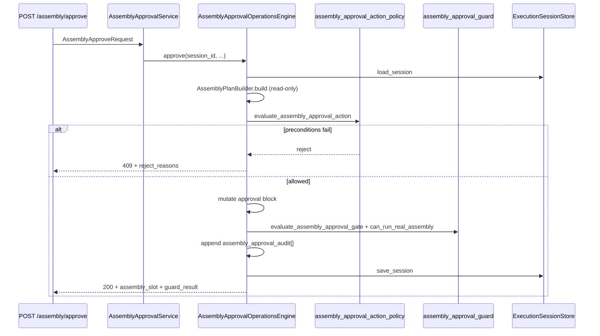

# Phase 11J-13 — Assembly Approval Write APIs Design

**Status:** Design only — no implementation, no UI buttons, no FFmpeg, no real execution flags  
**Date:** 2026-05-31  
**Prerequisites:** 11J-2 foundation, 11J-8 API dry-run, 11J-10 UI observability, 11J-12 read-only approval guard  
**Next phase:** **11J-14 — Assembly Approval Write APIs Implementation**

---

## Executive Summary

Assembly real FFmpeg execution approval is **category-scoped** on `execution_runtime.category_runtime.assembly_generation.approval`. It is separate from:

- Session-level `approval_decision` (Phase 10F — video queue/dispatch)
- Voice `approval` block (11H-1d–1g — live ElevenLabs TTS)

Phase 11J-13 designs four write endpoints that mutate **only** the assembly slot approval metadata and audit log. They never invoke FFmpeg, never create `FINAL_PUBLISH_READY.mp4`, never enable `MODIR_ASSEMBLY_REAL_EXECUTION_ENABLED` / `ASSEMBLY_RUNTIME_EXECUTION_APPROVED`, and never modify video/voice/subtitle slots.

Implementation mirrors the proven **Voice Approval Write APIs** pattern (11H-1f/g):

```
FastAPI route → AssemblyApprovalService → AssemblyApprovalOperationsEngine
  → evaluate_assembly_approval_action (policy)
  → mutate assembly_generation.approval only
  → append operations.assembly_approval_audit[]
  → re-run evaluate_assembly_approval_gate / can_run_real_assembly
  → persist session → return DTO
```

**Do not start Phase 11J-14 until explicit user approval.**

---

## Current Architecture Summary

### Assembly stack (11J-2 → 11J-12)

| Component | Role |
|-----------|------|
| `AssemblyPlanBuilder` | Builds `AssemblyPlan` (read-only) |
| `AssemblyFFmpegExecutor` | Dry-run only; real path fail-closed |
| `AssemblyRuntimeEngine` | Dry-run API orchestration (11J-8) |
| `assembly_approval_guard` | `evaluate_assembly_approval_gate()`, `can_run_real_assembly()` |
| `AssemblyRuntimeObservabilityPanel` | Read-only UI + approval gate subsection |

### Voice write API reference (11H-1f/g — mirror this)

| Voice | Assembly (11J-14) |
|-------|-------------------|
| `voice_approval_action_policy.py` | `assembly_approval_action_policy.py` |
| `voice_approval_operations_engine.py` | `assembly_approval_operations_engine.py` |
| `voice_approval_service.py` | `assembly_approval_service.py` |
| `schemas/voice_approval.py` | `schemas/assembly_approval.py` |
| `operations.voice_approval_audit[]` | `operations.assembly_approval_audit[]` |

### Session / voice / assembly approval isolation

| Gate | Location | Question |
|------|----------|----------|
| Session `approval_decision` | Session root | May this session dispatch **video** providers? |
| Voice `approval` | `voice_generation` slot | May this session run **live TTS**? |
| Assembly `approval` | `assembly_generation` slot | May this session invoke **FFmpeg assembly**? |

Write APIs must **never** set session `approval_decision` or voice `approval_state` as a side effect.

---

## Endpoint Design

Base path: `/sessions/{session_id}/assembly`

All endpoints:

- Require session to exist (`404` if missing)
- Return structured success/reject payload (`200` success metadata-only; `409` precondition reject)
- Persist via `ExecutionSessionStore.save_session(overwrite=True)`
- Include updated `assembly_slot`, `guard_result`, `panel_excerpt`, `audit_event`
- Hard invariant: `real_assembly_executed=false` in every response

### Endpoint summary

| Method | Path | Action constant | Purpose |
|--------|------|-----------------|---------|
| `POST` | `/sessions/{session_id}/assembly/approve` | `approve_assembly` | Grant category-scoped assembly approval |
| `POST` | `/sessions/{session_id}/assembly/reject` | `reject_assembly` | Reject real assembly for session |
| `POST` | `/sessions/{session_id}/assembly/expire` | `expire_assembly` | Force-expire current approval |
| `POST` | `/sessions/{session_id}/assembly/reset-approval` | `reset_assembly_approval` | Clear grant fields; re-evaluate gate |

\*Expire is idempotent when already `expired`.

### Optional read endpoint (future, not 11J-14 scope)

| Method | Path | Purpose |
|--------|------|---------|
| `GET` | `/sessions/{session_id}/assembly/approval` | Read gate + eligibility without mutation |

---

## Request / Response Schemas

### Approve — `AssemblyApproveRequest`

```json
{
  "request_real_assembly": true,
  "reason": "operator approved real assembly",
  "ttl_minutes": 30,
  "approved_by": "operator"
}
```

| Field | Type | Default | Notes |
|-------|------|---------|-------|
| `request_real_assembly` | bool | `true` | If `true`, sets `assembly_generation.real_assembly_requested=true` before gate evaluate |
| `reason` | string | `""` | Stored in `approval_reason`; recommended min 3 chars |
| `ttl_minutes` | int | `30` | Clamped to `[15, 1440]`; sets `approval_expires_at` |
| `approved_by` | string | `"operator"` | Stored in `approved_by` |

### Reject — `AssemblyRejectRequest`

```json
{
  "reason": "not ready for real assembly",
  "rejected_by": "operator"
}
```

| Field | Type | Default | Notes |
|-------|------|---------|-------|
| `reason` | string | required (min 3) | Audit + `approval_reason` |
| `rejected_by` | string | `"operator"` | Audit actor |

### Expire — `AssemblyExpireRequest`

```json
{
  "reason": "manual expiration",
  "expired_by": "operator"
}
```

### Reset — `AssemblyResetApprovalRequest`

```json
{
  "reason": "reset approval state",
  "reset_by": "operator"
}
```

Optional future field (not required 11J-14):

| Field | Type | Purpose |
|-------|------|---------|
| `clear_real_assembly_request` | bool | If `true`, sets `real_assembly_requested=false` after reset |

### Success response — `AssemblyApprovalActionResponse`

```json
{
  "success": true,
  "session_id": "exec_11j13",
  "action": "approve_assembly",
  "message": "Assembly approved for real execution (metadata only — no FFmpeg executed).",
  "assembly_slot": {
    "category_name": "assembly_generation",
    "status": "completed",
    "validation_status": "READY",
    "real_assembly_requested": true,
    "executed": false,
    "dry_run": true,
    "real_assembly_executed": false,
    "output_created": false,
    "expected_output": "FINAL_PUBLISH_READY.mp4",
    "approval": {
      "gate_version": "11j12_v1",
      "approval_required": true,
      "approval_state": "approved",
      "approved_by": "operator",
      "approved_at": "2026-05-31T20:00:00Z",
      "approval_reason": "operator approved real assembly",
      "approval_expires_at": "2026-05-31T20:30:00Z",
      "assembly_eligible": false,
      "assembly_blocked_reasons": ["ASSEMBLY_REAL_EXECUTION_DISABLED"]
    }
  },
  "guard_result": {
    "allowed": false,
    "blocked": true,
    "block_codes": ["ASSEMBLY_REAL_EXECUTION_DISABLED"],
    "approval_state": "approved",
    "assembly_eligible": false
  },
  "panel_excerpt": {
    "approval_required": true,
    "approval_state": "approved",
    "assembly_eligible": false,
    "blocked_reasons": ["ASSEMBLY_REAL_EXECUTION_DISABLED"]
  },
  "audit_event": {
    "event_id": "asm_appr_evt_20260531_200000_a1b2c3",
    "event_type": "assembly_approval_approved",
    "session_id": "exec_11j13",
    "category": "assembly_generation",
    "actor": "operator",
    "reason": "operator approved real assembly",
    "timestamp": "2026-05-31T20:00:00Z",
    "previous_state": "required",
    "new_state": "approved",
    "blocked_reasons": ["ASSEMBLY_REAL_EXECUTION_DISABLED"],
    "assembly_eligible": false,
    "real_assembly_executed": false
  },
  "real_assembly_executed": false,
  "api_version": "0.7.5"
}
```

Reject response uses `409` when preconditions fail; body shape identical with `success=false`, `code`, `reject_reasons`.

---

## Precondition Rules

### Approve — `evaluate_assembly_approval_action(action=approve)`

Policy runs **before** any slot mutation. All must pass:

| # | Check | Block code |
|---|-------|------------|
| 1 | Session exists | `ASSEMBLY_SLOT_MISSING` / 404 |
| 2 | Session not archived | `ASSEMBLY_SESSION_ARCHIVED` |
| 3 | Session not cancelled | `ASSEMBLY_CANCELLED` |
| 4 | `assembly_generation` slot exists | `ASSEMBLY_SLOT_MISSING` |
| 5 | `AssemblyPlan.validation_status == READY` | `ASSEMBLY_PLAN_NOT_READY` |
| 6 | Dry-run assembly completed (`status=completed`, `dry_run=true`, `planned_steps` non-empty OR last dry-run marker) | `ASSEMBLY_DRY_RUN_NOT_COMPLETED` |
| 7 | `expected_output` resolvable (slot or plan) | `ASSEMBLY_OUTPUT_MISSING` |
| 8 | `request_real_assembly=true` OR slot already `real_assembly_requested=true` | `REAL_ASSEMBLY_NOT_REQUESTED` |
| 9 | Upstream artifacts exist (re-use `AssemblyArtifactValidator` or plan input re-check) | `ASSEMBLY_VIDEO_MISSING` / `ASSEMBLY_AUDIO_MISSING` |
| 10 | Not `running` assembly job | `ASSEMBLY_RUN_ACTIVE` |
| 11 | Estimates present (`estimated_runtime_seconds` etc. from gate) | optional warn only |

**Explicitly NOT required:**

- Session `approval_decision.status == APPROVED_FOR_EXECUTION`
- Voice `approval_state == approved`
- Subtitle slot completed

### Reject preconditions

| Check | Notes |
|-------|-------|
| Session exists, not archived | |
| Assembly slot exists | |
| Current state in `{required, approved, expired}` | Reject from `not_required` → `409` `ASSEMBLY_APPROVAL_INVALID_STATE` |
| `reason` min length 3 | |

### Expire preconditions

| Check | Notes |
|-------|-------|
| Session + slot exist | |
| Current effective state is `approved` OR already `expired` (idempotent) | Expire from `required` → `409` |

### Reset preconditions

| Check | Notes |
|-------|-------|
| Session + slot exist | |
| Not `running` | |
| Any prior approval state allowed | Clears grant fields |

---

## State Transitions

### Approve (success)

```
approval_state          → approved
approval_required       → true
approved_by             → request.approved_by
approved_at             → UTC now
approval_reason         → request.reason
approval_expires_at     → UTC now + ttl_minutes
real_assembly_requested → true (if request_real_assembly)
assembly_eligible       → can_run_real_assembly().assembly_eligible
assembly_blocked_reasons→ guard.block_codes (may include env flag blocks)
```

Then call `evaluate_assembly_approval_gate()` to sync full approval block.

**Note:** `assembly_eligible` may remain `false` after approve if env flags are off — this is correct (approved but globally disabled).

### Reject

```
approval_state          → rejected
approval_required       → true
assembly_eligible       → false
assembly_blocked_reasons→ [ASSEMBLY_APPROVAL_REJECTED]
```

Preserve `approved_by` / `approved_at` only in audit `previous_state`; clear or overwrite grant fields per engine convention (match voice: clear grant on reject).

### Expire

```
approval_state          → expired
assembly_eligible       → false
assembly_blocked_reasons→ [ASSEMBLY_APPROVAL_EXPIRED]
```

If already expired: no-op success with same audit semantics (idempotent).

### Reset

```
approved_by             → null
approved_at             → null
approval_reason         → null
approval_expires_at     → null
approval_state          → re-evaluated:
                            - if real_assembly_requested && plan READY → required
                            - else → not_required
approval_required       → per evaluate_assembly_approval_gate()
assembly_eligible       → false until re-approved
```

Optional: `clear_real_assembly_request=true` sets `real_assembly_requested=false`.

---

## Operations Engine Design

### `AssemblyApprovalOperationsEngine`

Location: `content_brain/execution/assembly_approval_operations_engine.py`

Responsibilities per action:

1. Load session from store
2. Snapshot upstream slots (`video_generation`, `voice_generation`, `subtitle_generation`) for immutability check
3. Build `AssemblyPlan` via `AssemblyPlanBuilder` (read-only)
4. Run `evaluate_assembly_approval_action()` — reject with `409` if not allowed
5. Apply state transition to `assembly_generation.approval` (+ alias `assembly`)
6. Optionally set `real_assembly_requested` on approve
7. Re-run `evaluate_assembly_approval_gate()` + `can_run_real_assembly()`
8. Append audit event
9. Write `operations.assembly_approval_gate` mirror (optional, match voice pattern)
10. Persist session
11. Verify upstream slots unchanged
12. Return `AssemblyApprovalActionResult`

Constants:

```python
ENGINE_VERSION = "11j14_v1"
AUDIT_MAX_EVENTS = 50
CATEGORY_NAME = "assembly_generation"
MIN_TTL_MINUTES = 15
MAX_TTL_MINUTES = 1440
DEFAULT_TTL_MINUTES = 30
```

### Dry-run completed check (approve)

Accept any of:

- `assembly_slot.status == "completed"` AND `assembly_slot.dry_run is True` AND `len(planned_steps) >= 1`
- OR `operations.assembly_execution.last_status == "completed"` with `real_assembly_executed=false`

Reject if only preflight ran (`pending`) without dry-run API completion.

### Plan fingerprint (optional 11J-14 polish)

Store `plan_fingerprint` hash on approve audit event (video/voice/subtitle counts + expected_output). Future real run must match or approval invalidated (`assembly_approval_stale` event — 11J-15+).

---

## Audit Trail Design

### Location

`execution_runtime.operations.assembly_approval_audit[]`

Append-only; FIFO trim at `AUDIT_MAX_EVENTS` (50).

### Event schema

```json
{
  "event_id": "asm_appr_evt_20260531_200000_a1b2c3",
  "event_type": "assembly_approval_approved",
  "session_id": "exec_11j13",
  "category": "assembly_generation",
  "actor": "operator",
  "reason": "operator approved real assembly",
  "timestamp": "2026-05-31T20:00:00Z",
  "previous_state": "required",
  "new_state": "approved",
  "blocked_reasons": ["ASSEMBLY_REAL_EXECUTION_DISABLED"],
  "assembly_eligible": false,
  "real_assembly_executed": false,
  "engine_version": "11j14_v1",
  "metadata": {
    "ttl_minutes": 30,
    "expected_output": "FINAL_PUBLISH_READY.mp4",
    "validation_status": "READY"
  }
}
```

### Event types

| `event_type` | Trigger |
|--------------|---------|
| `assembly_approval_approved` | Approve success |
| `assembly_approval_rejected` | Reject success |
| `assembly_approval_expired` | Expire success |
| `assembly_approval_reset` | Reset success |

Every event: `real_assembly_executed=false`.

### ID generation

```python
def generate_assembly_approval_audit_event_id() -> str:
    return f"asm_appr_evt_{stamp}_{uuid.hex[:6]}"
```

---

## Safety Rules

All four endpoints **must**:

| Rule | Enforcement |
|------|-------------|
| Mutate only `assembly_generation` (+ `assembly` alias) approval fields | Engine writes only assembly slot keys |
| Append audit event | Before/after persist |
| Never run FFmpeg / subprocess | No executor import in policy/engine/service |
| Never create `FINAL_PUBLISH_READY.mp4` | No file writes |
| Never mutate `video_generation` | Deep-copy compare after persist |
| Never mutate `voice_generation` | Deep-copy compare after persist |
| Never mutate `subtitle_generation` | Deep-copy compare after persist |
| Never set env flags | Read-only `os.getenv` in guard only |
| Never bypass `can_run_real_assembly()` | Re-run guard after every mutation |
| Never call `AssemblyFFmpegExecutor.execute(dry_run=False)` | Out of scope 11J-14 |
| Response `real_assembly_executed=false` always | Hard-coded on result DTO |

Forbidden side effects:

- Enabling `MODIR_ASSEMBLY_REAL_EXECUTION_ENABLED`
- Enabling `ASSEMBLY_RUNTIME_EXECUTION_APPROVED`
- Auto-invoking `POST /assembly/run` with `dry_run=false`
- Importing `pipelines/full_video_pipeline.py`

---

## API Wiring (11J-14)

### `ui/api/main.py` routes

```python
@app.post("/sessions/{session_id}/assembly/approve", response_model=AssemblyApprovalActionResponse)
@app.post("/sessions/{session_id}/assembly/reject", response_model=AssemblyApprovalActionResponse)
@app.post("/sessions/{session_id}/assembly/expire", response_model=AssemblyApprovalActionResponse)
@app.post("/sessions/{session_id}/assembly/reset-approval", response_model=AssemblyApprovalActionResponse)
```

Mirror `_assembly_approval_response()` helper (409 on `success=false`), same pattern as voice approval.

### `ui/api/dependencies.py`

```python
def get_assembly_approval_service():
    from ui.api.assembly_approval_service import AssemblyApprovalService
    return AssemblyApprovalService(get_session_store())
```

### `ui/api/assembly_approval_service.py`

Thin wrapper — delegates to `AssemblyApprovalOperationsEngine`; stamps `api_version`.

---

## Sequence — Approve Flow



No FFmpeg. No output file.

---

## Validation Plan

**Script:** `project_brain/validate_11j14_assembly_approval_write_apis.py`

| # | Test | Method |
|---|------|--------|
| 1 | Approve without READY plan blocks | Policy fixture → `ASSEMBLY_PLAN_NOT_READY` |
| 2 | Approve without dry-run completed blocks | Slot `pending` only → `ASSEMBLY_DRY_RUN_NOT_COMPLETED` |
| 3 | Approve without `request_real_assembly` blocks | `REAL_ASSEMBLY_NOT_REQUESTED` |
| 4 | Approve with READY plan + dry-run succeeds | `approval_state=approved`, audit appended |
| 5 | Reject sets `rejected` state | Engine integration |
| 6 | Expire sets `expired` state | Engine integration |
| 7 | Reset clears grant fields | `approved_by/at` null |
| 8 | Audit trail appended for every action | Session JSON inspection |
| 9 | Video slot unchanged | Deep-copy compare |
| 10 | Voice slot unchanged | Deep-copy compare |
| 11 | Subtitle slot unchanged | Deep-copy compare |
| 12 | Response always `real_assembly_executed=false` | All action responses |
| 13 | No FFmpeg import/call in new modules | AST scan |
| 14 | No `FINAL_PUBLISH_READY.mp4` created | Temp dir artifact check |
| 15 | `validate_11j12` regression | Subprocess |
| 16 | `validate_11j8` regression | Subprocess |

Optional API route tests (11J-14):

- FastAPI TestClient POST each endpoint with fixture session on disk
- `npm run build` unchanged (no UI buttons in 11J-14)

---

## Files Likely to Change (11J-14)

### New files

| File | Purpose |
|------|---------|
| `content_brain/execution/assembly_approval_action_policy.py` | Precondition checks per action |
| `content_brain/execution/assembly_approval_operations_engine.py` | Approve/reject/expire/reset mutations + audit |
| `ui/api/assembly_approval_service.py` | Thin service wrapper |
| `ui/api/schemas/assembly_approval.py` | Request/response Pydantic models |
| `project_brain/validate_11j14_assembly_approval_write_apis.py` | Validator |
| `project_brain/PHASE_11J14_ASSEMBLY_APPROVAL_WRITE_APIS_REPORT.md` | Implementation report |

### Modified files

| File | Change |
|------|--------|
| `ui/api/main.py` | Four POST routes + response helper |
| `ui/api/dependencies.py` | `get_assembly_approval_service()` |
| `content_brain/execution/failure_taxonomy.py` | Add `ASSEMBLY_DRY_RUN_NOT_COMPLETED`, `ASSEMBLY_APPROVAL_INVALID_STATE` if missing |

### Not modified (11J-14)

| Area | Reason |
|------|--------|
| `AssemblyFFmpegExecutor` real branch | Future phase after env + policy wiring |
| `AssemblyRuntimeEngine` real execution | 11J-15+ |
| `AssemblyRuntimeObservabilityPanel` buttons | 11J-15+ UI controls design |
| Video / voice / subtitle runtimes | Isolation |
| Runway / Hailuo / `full_video_pipeline.py` | Constraints |

---

## Implementation Slices

| Phase | Scope | FFmpeg | Output file | UI buttons |
|-------|-------|--------|-------------|------------|
| **11J-13** | This design doc | No | No | No |
| **11J-14** | Write APIs + engine + policy + validator | No | No | No |
| **11J-15** | Wire guard into `evaluate_assembly_run_request` for `dry_run=false` | No | No | Design only |
| **11J-16** | Assembly approval UI controls (approve/reject in panel) | No | No | Yes (metadata) |
| **11J-17+** | Real FFmpeg execution enablement (separate env + design gate) | Only when all gates pass | Only when executor succeeds | Run Assembly (future) |

---

## Failure Taxonomy Additions (11J-14)

Register if not present:

| Code | Category | HTTP |
|------|----------|------|
| `ASSEMBLY_DRY_RUN_NOT_COMPLETED` | PREFLIGHT_REJECT | 409 |
| `ASSEMBLY_APPROVAL_INVALID_STATE` | PREFLIGHT_REJECT | 409 |
| `ASSEMBLY_APPROVAL_PRECONDITION_FAILED` | PREFLIGHT_REJECT | 409 |

Existing codes reused: `ASSEMBLY_PLAN_NOT_READY`, `ASSEMBLY_APPROVAL_REQUIRED`, `ASSEMBLY_APPROVAL_REJECTED`, `ASSEMBLY_APPROVAL_EXPIRED`, `REAL_ASSEMBLY_NOT_REQUESTED`, `ASSEMBLY_SESSION_ARCHIVED`, `ASSEMBLY_CANCELLED`.

---

## Next Phase

**PHASE 11J-14 — Assembly Approval Write APIs Implementation**

Implement policy, operations engine, service, schemas, FastAPI routes, validator, and report. Metadata and audit only — no FFmpeg, no UI buttons, no env flag changes.

**Future after 11J-14:**

- **11J-15** — Wire approval into assembly run policy for `dry_run=false` (still fail-closed on env flags)
- **11J-16** — Assembly approval UI controls design + implementation
- **11J-17+** — Real FFmpeg execution phase (separate approval + safety review)
