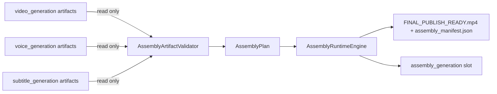

# Phase 11J-1 — Assembly Runtime Architecture Design

**Status:** Design only — no FFmpeg, no assembly execution, no video output  
**Date:** 2026-05-31  
**Prerequisites:** Video Runtime, Voice Runtime (11H), Subtitle Runtime (11I-2→11I-10), Multi-Category Runtime Shell (11G)  
**Next phase:** **11J-2 — Assembly Runtime Foundation Implementation**

---

## Executive Summary

Phase 11J-1 designs the **Assembly Runtime** category for Content Brain Runtime — the final stage that combines existing video, voice, and subtitle artifacts into a publish-ready video. This closes the gap between the new runtime and the legacy `pipelines/full_video_pipeline.py`, which is currently the only path that can produce `FINAL_PUBLISH_READY.mp4`.

Assembly Runtime is **read-only over upstream categories**. It consumes existing artifacts, never regenerates them, and owns only the `assembly_generation` slot.

**This phase implements nothing.** No FFmpeg, no assembly, no slot mutation. Architecture only.

**Do not start Phase 11J-2 until explicit approval.**

---

## Current Runtime Status

```
Topic → Story → Video → Voice → Subtitle → [ MISSING: Assembly ]
```

| Category | Status | Produces |
|----------|--------|----------|
| `video_generation` | Live (10I/11) | `clip_*.mp4`, `video_manifest.json` |
| `voice_generation` | Live (11H-2) | `narration_*.mp3`, `voice_manifest.json` |
| `subtitle_generation` | Live (11I-8) | `subtitles.srt/vtt/ass`, `subtitle_manifest.json` |
| `assembly_generation` | **Planned (this design)** | `FINAL_PUBLISH_READY.mp4`, `assembly_manifest.json` |

The legacy pipeline still owns final assembly (FFmpeg via `FinalAssemblyEngine`, `SubtitleBurner`, music, overlays). Assembly Runtime will eventually replace it.

---

## Architecture

### Pipeline position



### Module map (proposed — 11J-2+)

```
content_brain/execution/
  ├── assembly_runtime_engine.py        # orchestrator (11J-3+)
  ├── assembly_artifact_validator.py    # READY/PARTIAL/FAILED (11J-2)
  ├── assembly_models.py                # AssemblyPlan, enums (11J-2)
  ├── assembly_preflight_runtime_slot.py # dry-run slot wiring (11J-2)
  └── assembly_plan_builder.py          # build AssemblyPlan from session (11J-3)

ui/api/
  ├── assembly_run_service.py           # POST /assembly/run (11J-5)
  └── schemas/assembly_run.py

project_brain/
  └── validate_11j*_*.py
```

**Mirrors the proven subtitle runtime layering** (11I-2 foundation → 11I-4 models → 11I-8 engine → 11I-10 UI). The FFmpeg executor is isolated in its own future module so the foundation stays pure.

### Reuse (read-only)

| Component | Usage |
|-----------|-------|
| `category_runtime_compat` | Slot schema, status constants, shell helpers |
| `ExecutionSessionStore.artifact_dir()` | Output path resolution |
| `provider_categories` | New `CATEGORY_ASSEMBLY_GENERATION` constant + alias |
| Existing `*_manifest.json` files | Input artifact discovery |

---

## Category Schema

### Canonical key + alias (mirror subtitle 11I-2 pattern)

| Key | Role |
|-----|------|
| `assembly` | Legacy 11G storage key — preserved for backward compatibility |
| `assembly_generation` | **Canonical 11J key** — exposed in API/panel `category_key` |

Add to `provider_categories.py`:

```python
CATEGORY_ASSEMBLY = "assembly"                       # existing legacy
CATEGORY_ASSEMBLY_GENERATION = "assembly_generation" # NEW canonical
ASSEMBLY_CANONICAL_CATEGORY = CATEGORY_ASSEMBLY_GENERATION
ASSEMBLY_LEGACY_CATEGORY = CATEGORY_ASSEMBLY
ASSEMBLY_CATEGORY_ALIASES = frozenset({CATEGORY_ASSEMBLY, CATEGORY_ASSEMBLY_GENERATION})
```

Add `sync_assembly_category_aliases()` in `category_runtime_compat.py`, identical in shape to `sync_subtitle_category_aliases()`.

### Slot schema (default + post-run)

```json
{
  "category_name": "assembly_generation",
  "status": "planned",
  "provider": "internal_assembly_runtime",
  "assembly_mode": null,
  "subtitle_mode": null,
  "source_ready": false,
  "validation_status": null,
  "input_artifacts": {
    "video": [],
    "voice": [],
    "subtitle": []
  },
  "output_artifacts": [],
  "expected_output": "FINAL_PUBLISH_READY.mp4",
  "manifest_path": null,
  "artifacts": [],
  "executed": false,
  "dry_run": true,
  "started_at": null,
  "completed_at": null,
  "duration_seconds": null,
  "runtime_notes": [],
  "error": null,
  "assembly_preflight": null,
  "slot_version": "11j1_v1"
}
```

Constants:

```python
ASSEMBLY_PROVIDER = "internal_assembly_runtime"
ASSEMBLY_ARTIFACT_CATEGORY = ASSEMBLY_CANONICAL_CATEGORY  # "assembly_generation"
```

---

## Lifecycle

```
planned ──► pending ──► running ──► completed
                │           │
                │           ├──► failed
                │           └──► cancelled
                └──► skipped (preflight: upstream artifacts not ready)
```

| Status | Meaning |
|--------|---------|
| `planned` | Shell default — no preflight evaluated |
| `pending` | Upstream artifacts present and validated → ready to assemble |
| `running` | Assembly in progress (future FFmpeg execution) |
| `completed` | `FINAL_PUBLISH_READY.mp4` produced and validated |
| `failed` | Assembly attempted, no valid output |
| `cancelled` | Cooperative cancel mid-run |
| `skipped` | Upstream artifacts missing (video/voice/subtitle not completed) |

Status constants reuse `category_runtime_compat` (`STATUS_PLANNED` … `STATUS_SKIPPED`) plus the existing `cancelled` convention from subtitle/voice engines.

---

## Inputs (Read-Only)

Assembly Runtime consumes **existing artifacts only** and never regenerates them.

### Video (`video_generation`)

| Artifact | Source |
|----------|--------|
| `clip_001.mp4` … `clip_NNN.mp4` | `artifacts_by_category.video_generation` |
| `video_manifest.json` | Video runtime output |

### Voice (`voice_generation`)

| Artifact | Source |
|----------|--------|
| `narration_001.mp3` … | `voice_manifest.json` `files[]` |
| `voice_manifest.json` | Voice runtime output (11H-2) |

### Subtitle (`subtitle_generation`)

| Artifact | Source |
|----------|--------|
| `subtitles.srt` / `.vtt` / `.ass` | Subtitle runtime output (11I-8) |
| `subtitle_manifest.json` | `manifest_path` on subtitle slot |

### Discovery strategy

1. Read each upstream slot from `execution_runtime.category_runtime`
2. Resolve artifact paths from each slot's `artifacts[]` / `manifest_path` / `artifacts_by_category`
3. Validate file existence on disk (read-only `Path.is_file()`)
4. **Never** call upstream engines or mutate upstream slots

---

## Outputs

### Output directory

```
storage/content_brain/execution/artifacts/{session_id}/assembly_generation/
├── FINAL_PUBLISH_READY.mp4
└── assembly_manifest.json
```

Resolved via `store.artifact_dir(session_id, ASSEMBLY_ARTIFACT_CATEGORY)`.

### V1 outputs

| File | Notes |
|------|-------|
| `FINAL_PUBLISH_READY.mp4` | Single combined output |
| `assembly_manifest.json` | Always written |

### Future outputs (design only — not implemented)

- `FINAL_NO_SUBS.mp4`
- `FINAL_WITH_SUBS.mp4`
- `FINAL_VERTICAL.mp4`
- `FINAL_HORIZONTAL.mp4`

Manifest schema includes `output_artifacts[]` to accommodate multiple outputs without breaking changes.

---

## Assembly Plan Model

### `AssemblyPlan` (dataclass — `assembly_models.py`)

```python
@dataclass
class AssemblyInput:
    category: str            # video_generation / voice_generation / subtitle_generation
    file_path: str
    role: str                # clip / narration / subtitle_srt / subtitle_ass / manifest
    exists: bool

@dataclass
class AssemblyPlan:
    session_id: str
    video_inputs: list[AssemblyInput]
    audio_inputs: list[AssemblyInput]
    subtitle_inputs: list[AssemblyInput]
    assembly_mode: str           # see Assembly Modes
    subtitle_mode: str           # none / burn_in / sidecar (V1: burn_in design target)
    expected_output: str         # FINAL_PUBLISH_READY.mp4
    output_dir: str
    validation_status: str       # READY / PARTIAL / FAILED
    warnings: list[str]
    plan_version: str = "11j1_v1"

    def to_dict(self) -> dict: ...
```

**Purpose:** The engine operates exclusively from an `AssemblyPlan`. This separates *what to assemble* (plan, pure data) from *how to assemble* (future FFmpeg executor), keeping the foundation testable without FFmpeg.

---

## Assembly Modes (Design Only)

| Mode | Inputs | Phase |
|------|--------|-------|
| `video_voice_subtitle` | video + voice + subtitles | **V1 target** |
| `video_voice` | video + voice | Future |
| `video_only` | video | Future |
| `voice_only` | voice (audiogram) | Future |
| `multi_language_audio` | video + N audio tracks | Future |
| `multi_subtitle_track` | video + voice + N subtitle tracks | Future |

### Subtitle mode (sub-dimension)

| `subtitle_mode` | Behavior |
|-----------------|----------|
| `burn_in` | ASS burned into video (legacy parity, V1 design target) |
| `sidecar` | Mux soft subtitles (SRT/VTT) — future |
| `none` | No subtitles |

Enum reserved in `assembly_models.py`; only `video_voice_subtitle` + `burn_in` targeted for first implementation.

---

## Validator Design

### `assembly_artifact_validator.py`

Read-only existence + manifest checks. **No FFmpeg, no decoding.**

```python
@dataclass
class AssemblyValidationResult:
    status: str                  # READY / PARTIAL / FAILED
    video_ok: bool
    voice_ok: bool
    subtitle_ok: bool
    missing: list[str]
    warnings: list[str]
    reject_reasons: list[str]
```

### Checks

| Category | Check |
|----------|-------|
| Video | ≥1 clip file exists **and** `video_manifest.json` exists |
| Voice | ≥1 narration file exists **and** `voice_manifest.json` exists |
| Subtitle | ≥1 subtitle file exists **and** `subtitle_manifest.json` exists |

### Result mapping

| Result | Condition |
|--------|-----------|
| `READY` | All required categories valid for the chosen `assembly_mode` |
| `PARTIAL` | Some inputs present but mode requirements not fully met (e.g. video+voice ok, subtitles missing for `video_voice_subtitle`) |
| `FAILED` | No usable video, or core manifests missing |

`PARTIAL` allows future graceful degradation (e.g. fall back to `video_voice` mode with a warning) — V1 may treat `PARTIAL` as blocked.

---

## Runtime Engine Design

### `assembly_runtime_engine.py` (responsibilities — implemented in 11J-3+)

| Step | Action |
|------|--------|
| 1 | `store.load_session(session_id)` |
| 2 | Snapshot video/voice/subtitle slots (deep copy) for mutation guard |
| 3 | `apply_assembly_preflight_dry_run()` — refresh, preserve completed |
| 4 | `AssemblyArtifactValidator.validate()` → READY/PARTIAL/FAILED |
| 5 | `assembly_plan_builder.build()` → `AssemblyPlan` |
| 6 | Policy guard (`assembly_run_action_policy`) |
| 7 | Set `assembly_generation` → `running`, persist checkpoint |
| 8 | **[FUTURE 11J-4]** Execute FFmpeg assembly from plan |
| 9 | Validate output (`FINAL_PUBLISH_READY.mp4` exists, non-zero) |
| 10 | Write `assembly_manifest.json` |
| 11 | Set slot → `completed` / `failed`, persist |
| 12 | Return `AssemblyRuntimeRunResult` with `video_mutated=false`, `voice_mutated=false`, `subtitle_mutated=false` |

**This phase implements none of the above.** Step 8 (FFmpeg) is explicitly deferred and isolated in a future `assembly_ffmpeg_executor.py`.

---

## Manifest Schema

### `assembly_manifest.json`

```json
{
  "manifest_version": "11j_v1",
  "assembly_version": "11j1_v1",
  "session_id": "exec_abc123",
  "category": "assembly_generation",
  "provider": "internal_assembly_runtime",
  "assembly_mode": "video_voice_subtitle",
  "subtitle_mode": "burn_in",
  "input_artifacts": {
    "video": ["clip_001.mp4", "video_manifest.json"],
    "voice": ["narration_001.mp3", "voice_manifest.json"],
    "subtitle": ["subtitles.ass", "subtitle_manifest.json"]
  },
  "output_artifacts": [
    {
      "file_name": "FINAL_PUBLISH_READY.mp4",
      "file_path": ".../assembly_generation/FINAL_PUBLISH_READY.mp4",
      "validation_status": "valid"
    }
  ],
  "validation_status": "READY",
  "duration_seconds": null,
  "started_at": null,
  "completed_at": null,
  "generated_at": "2026-05-31 16:00:00",
  "real_assembly_executed": false,
  "warnings": []
}
```

Mirrors the subtitle manifest conventions (`manifest_version`, `*_version`, `validation_status`, `generated_at`) for UI/parser consistency.

---

## Observability Requirements (Future — No UI in This Phase)

Future `AssemblyRuntimeObservabilityPanel` (Execution Center, below Subtitle panel) should display:

| Field | Source |
|-------|--------|
| Status + badge | slot `status` |
| Validation status | `READY` / `PARTIAL` / `FAILED` |
| Input counts | video / voice / subtitle file counts |
| Assembly mode | `assembly_mode` |
| Output path | `FINAL_PUBLISH_READY.mp4` path |
| Duration | `duration_seconds` |
| Warnings | `warnings[]` |
| Errors | `error.code` / `error.message` |

Status badge mapping (mirror subtitle):

| Status | Label |
|--------|-------|
| `planned` | Not started |
| `pending` | Ready to assemble |
| `running` | Assembling video |
| `completed` | Final video ready |
| `failed` | Failed |
| `skipped` | Inputs not ready |
| `cancelled` | Cancelled |

Safety copy: *"Reads existing artifacts only — does not regenerate video, voice, or subtitles."*

---

## Safety Rules

| Rule | Enforcement |
|------|-------------|
| Never mutate `video_generation` slot | Deep-copy snapshot compare before/after |
| Never mutate `voice_generation` slot | Snapshot compare |
| Never mutate `subtitle_generation` slot | Snapshot compare |
| Owns only `assembly_generation` slot | Only this slot written |
| Read-only upstream artifacts | `Path.is_file()` only; no upstream engine calls |
| No upstream regeneration | Never import video/voice/subtitle engines for execution |
| No legacy pipeline import | Ban `full_video_pipeline` in new modules |
| Isolated FFmpeg | FFmpeg only in future `assembly_ffmpeg_executor.py`, never in foundation/validator/models |

---

## Legacy Migration Strategy

### Current state

`pipelines/full_video_pipeline.py` performs the entire flow end-to-end with tightly coupled FFmpeg engines:

```
FinalAssemblyEngine.assemble_video()
  → SubtitleBurner.burn_ass_subtitles()
  → apply_music()
  → AudioFinishEngine.smooth_audio_finish()
  → IngredientOverlayEngine / HookOverlayEngine
  → FINAL_PUBLISH_READY.mp4
```

### Migration phases (non-breaking)

| Stage | Action | Legacy impact |
|-------|--------|---------------|
| **A (11J-2→4)** | Build Assembly Runtime in parallel; legacy untouched | None — Run Studio keeps working |
| **B (11J-4)** | Assembly Runtime reuses existing FFmpeg engines (`FinalAssemblyEngine`, `SubtitleBurner`) as **libraries**, not via the pipeline orchestrator | None |
| **C (11J-5+)** | Assembly Runtime reaches feature parity (music, overlays) behind the new runtime API | Legacy marked optional |
| **D (future)** | Default Execution Center flow uses Assembly Runtime; legacy pipeline flagged deprecated | Run Studio opt-in only |
| **E (long term)** | Content Brain Runtime = single source of truth; legacy pipeline removable | Deprecated/removed |

### Compatibility principles

- Assembly Runtime **may import the low-level FFmpeg engines** (`FinalAssemblyEngine`, `SubtitleBurner`, etc.) as shared utilities in 11J-4 — these are leaf engines, not the pipeline.
- It must **not** import or invoke `pipelines/full_video_pipeline.py`.
- Both paths can coexist: legacy writes to `outputs/full_test/...`; runtime writes to `storage/content_brain/execution/artifacts/...`.
- Reuse over rewrite: wrap proven FFmpeg engines rather than reimplementing assembly logic (honors architecture safety rules).

---

## Risks

| Risk | Impact | Mitigation |
|------|--------|------------|
| **FFmpeg dependency management** | Missing/incompatible FFmpeg binary | Preflight FFmpeg availability probe (like provider preflight); fail to `skipped`/`failed` with clear code, never crash |
| **Subtitle burn-in strategy** | ASS burn-in vs soft-mux tradeoff | V1 = burn-in (legacy parity); `subtitle_mode` field reserves soft-mux future |
| **Audio/video sync drift** | Narration misaligned with clips | Reuse voice manifest durations + existing `audio_sync_engine` logic; record offsets in manifest |
| **Multi-language future** | Schema lock-in | `input_artifacts` is category→list map; `multi_language_audio` mode reserved now |
| **Artifact version compatibility** | Manifest schema drift across phases | `manifest_version` + `assembly_version` + validate upstream `*_version` fields |
| **Migration risk from legacy** | Regression for Run Studio users | Parallel coexistence; legacy untouched until parity + opt-in; no shared mutable state |
| **Partial inputs** | Assembly with missing subtitles | `PARTIAL` validation status + future mode fallback; V1 blocks with clear reason |
| **Output overwrite** | Re-run clobbers final video | `overwrite=false` default + atomic write (reuse subtitle writer pattern) |

---

## Implementation Slices

| Slice | Phase | Deliverable |
|-------|-------|-------------|
| Category constants + alias sync | **11J-2** | `CATEGORY_ASSEMBLY_GENERATION`, `sync_assembly_category_aliases()`, slot schema |
| `assembly_models.py` | **11J-2** | `AssemblyPlan`, `AssemblyInput`, mode/subtitle enums |
| `assembly_artifact_validator.py` | **11J-2** | READY/PARTIAL/FAILED (no FFmpeg) |
| `assembly_preflight_runtime_slot.py` | **11J-2** | Dry-run slot wiring (mirror subtitle preflight) |
| `assembly_plan_builder.py` | **11J-3** | Build `AssemblyPlan` from session (in-memory) |
| `assembly_run_action_policy.py` | **11J-3** | Guard/policy |
| `assembly_ffmpeg_executor.py` | **11J-4** | Isolated FFmpeg assembly (reuse legacy engines) |
| `assembly_runtime_engine.py` | **11J-4** | Orchestration + slot lifecycle |
| `ui/api` service + schema + route | **11J-5** | `POST /assembly/run` |
| `AssemblyRuntimeObservabilityPanel` | **11J-6** | Read-only UI |

Each slice gets a `validate_11j*_*.py` validator and report, following the 11I cadence.

---

## Next Phase

**PHASE 11J-2 — Assembly Runtime Foundation Implementation**

Implement category constants, alias sync, slot schema, `AssemblyPlan` model, artifact validator skeleton, and dry-run preflight — **no FFmpeg, no assembly execution**. Add `validate_11j2_assembly_runtime_foundation.py` and report.
