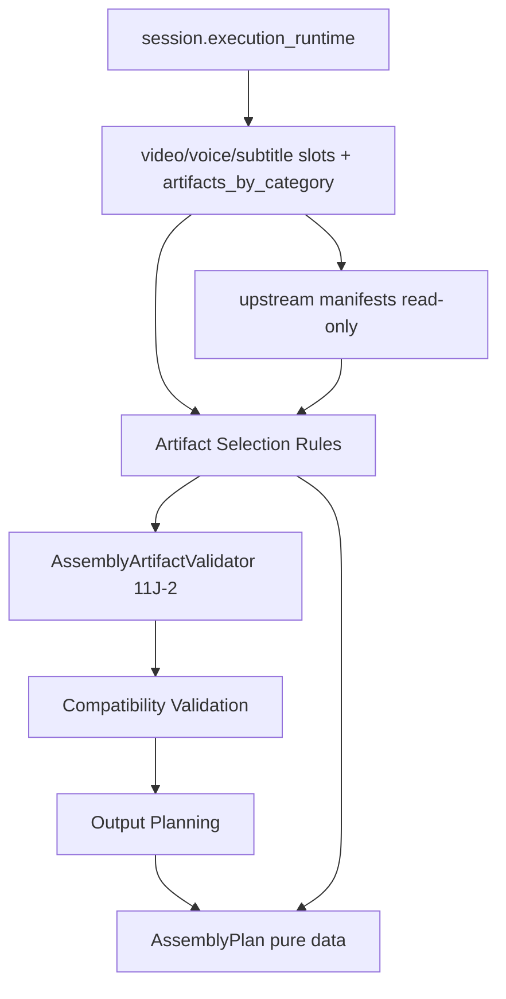

# Phase 11J-3 — Assembly Plan Builder Design

**Status:** Design only — no FFmpeg, no assembly execution, no `FINAL_PUBLISH_READY.mp4`
**Date:** 2026-05-31
**Prerequisites:** 11J-1 (architecture), 11J-2 (foundation: category, slot, models, validator, preflight)
**Next phase:** **11J-4 — Assembly Plan Builder Implementation**

---

## Executive Summary

Phase 11J-3 designs the **planning layer** that sits between the upstream runtime
categories (`video_generation`, `voice_generation`, `subtitle_generation`) and the
future FFmpeg executor (11J-5+).

The `AssemblyPlanBuilder` consumes **existing artifacts only** (read-only) and
produces a fully-resolved, pure-data `AssemblyPlan` (defined in 11J-2's
`assembly_models.py`). The plan answers *what to assemble* — which files, in what
order, in which mode, to which output — so the future executor answers only *how*.

**This phase implements nothing.** No FFmpeg, no assembly, no slot mutation, no file
writes. Architecture and contracts only.

> The builder reuses the 11J-2 `AssemblyArtifactValidator` and `AssemblyPlan` /
> `AssemblyInputArtifact` / `AssemblyManifestSkeleton` models — no parallel models
> are introduced.

---

## Position in the Pipeline

```
video_generation ┐
voice_generation ┼─► AssemblyPlanBuilder.build(session) ─► AssemblyPlan ─► [FUTURE] AssemblyFFmpegExecutor
subtitle_generation ┘            │
                                 └─► AssemblyArtifactValidator (11J-2, read-only)
```

| Layer | Phase | Role |
|-------|-------|------|
| `AssemblyArtifactValidator` | 11J-2 (done) | READY / PARTIAL / FAILED existence checks |
| `apply_assembly_preflight_dry_run` | 11J-2 (done) | Updates `assembly_generation` slot metadata |
| **`AssemblyPlanBuilder`** | **11J-3 design → 11J-4 impl** | Build concrete `AssemblyPlan` from session |
| `assembly_run_action_policy` | 11J-4 | Guard/preconditions before planning/run |
| `AssemblyFFmpegExecutor` | 11J-5 | Isolated FFmpeg execution from plan |
| `AssemblyRuntimeEngine` | 11J-5 | Orchestrate plan → execute → slot lifecycle |

---

## Module Placement (proposed — implemented in 11J-4)

```
content_brain/execution/
  ├── assembly_models.py                 # 11J-2 (done) — AssemblyPlan, AssemblyInputArtifact, ...
  ├── assembly_artifact_validator.py     # 11J-2 (done) — READY/PARTIAL/FAILED
  ├── assembly_preflight_runtime_slot.py # 11J-2 (done) — dry-run slot wiring
  ├── assembly_plan_builder.py           # 11J-4 (this design) — AssemblyPlanBuilder
  └── assembly_run_action_policy.py      # 11J-4 — guard/policy
```

No new schema modules. `AssemblyPlanBuilder` is a **pure function over a session**:
`build(session) -> AssemblyPlan`. It performs read-only disk checks (`Path.is_file()`)
but never decodes media and never writes.

---

## 1. AssemblyPlanBuilder

### Responsibilities

1. Read the three upstream slots + `artifacts_by_category` from `execution_runtime`
   (read-only; never mutate).
2. Resolve and select concrete input artifacts (video clips, narration audio,
   subtitle file, manifests) via the **artifact selection rules** below.
3. Run `AssemblyArtifactValidator` to obtain `READY / PARTIAL / FAILED`.
4. Determine `assembly_mode` and `subtitle_mode` from available inputs + caller
   options.
5. Resolve the output plan (`output_dir`, `expected_output`, future variants).
6. Assemble warnings (missing manifests, count mismatches, fallbacks).
7. Return a fully-populated `AssemblyPlan` (pure data). Optionally produce an
   `AssemblyManifestSkeleton` for preview.

### Proposed signature

```python
class AssemblyPlanBuilder:
    def __init__(self, store: ExecutionSessionStore | None = None) -> None: ...

    def build(
        self,
        session: dict,
        *,
        assembly_mode: str | None = None,     # auto-detected if None
        subtitle_mode: str | None = None,     # auto-detected if None
        require_subtitles: bool = True,
        output_variant: str = "primary",      # primary | vertical | horizontal (future)
    ) -> AssemblyPlan: ...
```

`build()` never raises on missing data — it degrades to `PARTIAL` / `FAILED`
`validation_status` with descriptive `warnings`, mirroring the validator/preflight
contract.

### Build flow (no FFmpeg)

| Step | Action |
|------|--------|
| 1 | Resolve upstream slots: `get_category_slot(session, video/voice/subtitle)` |
| 2 | Collect candidate artifacts from `artifacts_by_category` + slot `artifacts[]` |
| 3 | Read upstream manifests (read-only JSON) when paths are present |
| 4 | Apply **artifact selection rules** → ordered `AssemblyInputArtifact` lists |
| 5 | `AssemblyArtifactValidator.validate(...)` → `AssemblyValidationResult` |
| 6 | **Compatibility validation** → warnings, possible mode fallback |
| 7 | **Output planning** → `output_dir`, `expected_output` |
| 8 | Construct `AssemblyPlan(...)` (pure data) |

---

## 2. Artifact Selection Rules

The builder turns raw artifact lists/manifests into **ordered, deduplicated**
`AssemblyInputArtifact` collections. Selection is deterministic.

### Video (`video_generation`)

| Rule | Detail |
|------|--------|
| Source | `artifacts_by_category["video_generation"]` (primary), slot `artifacts[]` (fallback) |
| Filter | Keep clip files (`.mp4`/`.mov`) that exist on disk; drop manifests/non-video |
| Order | Sort by clip index parsed from filename (`clip_001`, `clip_002`, …); fallback to manifest order, then lexicographic |
| Dedup | By resolved absolute path |
| Manifest | `video_manifest.json` recorded as a `role="manifest"` input (not concatenated) |
| Role | `clip` for media, `manifest` for the manifest |

### Voice (`voice_generation`)

| Rule | Detail |
|------|--------|
| Source | `voice_manifest.json` `files[]` (authoritative ordering via `segment_index` / `beat_id`); fallback to `artifacts_by_category["voice_generation"]` |
| Filter | Existing `.mp3`/`.wav` with `validation_status == "valid"` (warn + keep if status missing) |
| Order | By `segment_index`, then `beat_id` order from story architecture |
| Single-track (V1) | Concatenate narration segments in order → one audio stream |
| Role | `narration` for media, `manifest` for `voice_manifest.json` |

### Subtitle (`subtitle_generation`)

| Rule | Detail |
|------|--------|
| Source | `subtitle_manifest.json` `files[]` (has `format` per file); fallback to slot `artifacts[]` |
| Format priority | For `burn_in`: prefer **`.ass`** (style/positioning) → `.srt` → `.vtt`. For `sidecar`: prefer `.srt`/`.vtt` |
| Selection | Choose exactly **one** subtitle file for V1 (the primary track) based on `subtitle_mode` priority |
| Role | `subtitle_ass` / `subtitle_srt` / `subtitle_vtt`, plus `manifest` for `subtitle_manifest.json` |

### General rules

- Existence is checked with `Path.is_file()` only — no probing.
- Every selected artifact carries `exists` so the executor can re-verify.
- Missing manifests are **warnings**, not hard failures, unless the validator marks
  the category invalid (see §3).

---

## 3. Compatibility Validation

Beyond the 11J-2 existence validator, the builder performs **planning-level**
compatibility checks (still no media decoding):

| Check | Behavior |
|-------|----------|
| Base video present | If no usable video clip → `FAILED` (cannot assemble) |
| Video manifest present | Missing → warning; `video_ok=false` per validator → `FAILED`/`PARTIAL` |
| Voice present for chosen mode | `video_voice*` modes require ≥1 narration; else fallback/`PARTIAL` |
| Subtitle present for chosen mode | `*_subtitle` modes require ≥1 subtitle; else fallback to `video_voice` + warning, or `PARTIAL` if `require_subtitles` |
| Subtitle format vs subtitle_mode | `burn_in` without `.ass` → warning (will burn `.srt`); `sidecar` with only `.ass` → warning |
| Manifest version sanity | Read `manifest_version` / `*_version`; unknown/older → warning (forward-compat, never crash) |
| Count/segment sanity | Record video clip count vs narration segment count as metadata; large mismatch → warning (sync risk noted for executor) |

### Validation status mapping (reuses 11J-2 result)

| `AssemblyPlan.validation_status` | Meaning |
|----------------------------------|---------|
| `READY` | All mode-required inputs present + valid; plan is executable |
| `PARTIAL` | Base video present but some required inputs/manifests missing; blocked in V1 (warnings explain) |
| `FAILED` | No usable video or core manifest missing |

V1 policy: only `READY` plans proceed to execution (enforced later by
`assembly_run_action_policy`, 11J-4). `PARTIAL` is preserved for future graceful
degradation (e.g. auto-fallback to `video_voice`).

---

## 4. Output Planning

| Field | Resolution |
|-------|------------|
| `output_dir` | `store.artifact_dir(session_id, ASSEMBLY_ARTIFACT_CATEGORY)` → `.../artifacts/{session_id}/assembly_generation/` |
| `expected_output` | `FINAL_PUBLISH_READY.mp4` (constant `EXPECTED_OUTPUT` from `assembly_models`) |
| Overwrite | Plan records `expected_output`; the future executor enforces `overwrite=false` + atomic write (reuse subtitle writer pattern). The builder only **plans** the path |
| Manifest | `assembly_manifest.json` path planned alongside output (written by executor, not builder) |

The builder may produce an `AssemblyManifestSkeleton` (11J-2 model) as a **preview**
of the manifest the executor will write — populated with `input_artifacts`,
`assembly_mode`, `subtitle_mode`, `validation_status`, `warnings`, and
`real_assembly_executed=false`. No file is written in this layer.

---

## 5. Subtitle Mode Planning

| `subtitle_mode` | Behavior | V1 |
|-----------------|----------|----|
| `burn_in` | Burn subtitles into the video frames (ASS preferred for styling) | **V1 target** |
| `sidecar` | Mux soft subtitle track (SRT/VTT) into the container | Future |
| `none` | No subtitles | Supported |

### Auto-detection (when `subtitle_mode=None`)

1. No subtitle artifacts available → `none` (+ mode downgrades to `video_voice`).
2. Subtitle available + `.ass` present → `burn_in`.
3. Subtitle available, only `.srt`/`.vtt` → `burn_in` with warning (style loss), or
   `sidecar` if explicitly requested.

The builder selects the **single** subtitle file matching the resolved mode's format
priority (§2) and records it as the subtitle input. Soft-mux multi-track is reserved
(see §7).

---

## 6. Assembly Mode Planning

Reuses the 11J-2 `ASSEMBLY_MODES` constants.

| Mode | Required inputs | V1 |
|------|-----------------|----|
| `video_voice_subtitle` | video + voice + subtitle | **V1 target** |
| `video_voice` | video + voice | Auto-fallback target |
| `video_only` | video | Future |
| `voice_only` | voice (audiogram) | Future |
| `multi_language_audio` | video + N audio tracks | Future (§7) |
| `multi_subtitle_track` | video + voice + N subtitle tracks | Future (§7) |

### Auto-detection (when `assembly_mode=None`)

```
video + voice + subtitle  -> video_voice_subtitle
video + voice             -> video_voice
video only                -> video_only
no video                  -> FAILED (no base track)
```

Explicit `assembly_mode` overrides auto-detection but still validates required
inputs; unmet requirements produce `PARTIAL` + warnings rather than a hard error.

---

## 7. Future Extensions (Design Reservations — Not Implemented)

These shape the schema now so later phases are non-breaking.

### Vertical / Horizontal variants

- `build(..., output_variant="vertical"|"horizontal"|"primary")`.
- `AssemblyPlan.output_dir` + a future `output_targets[]` (variant → filename:
  `FINAL_VERTICAL.mp4`, `FINAL_HORIZONTAL.mp4`).
- `AssemblyManifestSkeleton.output_artifacts[]` already accepts multiple outputs, so
  multi-variant manifests need no schema change.
- Aspect ratio / crop strategy is an **executor** concern (FFmpeg, 11J-5); the plan
  only declares the desired variant(s).

### Multi-language audio

- `multi_language_audio` mode: `AssemblyPlan.audio_inputs` becomes grouped by
  language (e.g. `role="narration"` + a `language` tag on `AssemblyInputArtifact`).
- Selection rule: one ordered narration set per language from per-language voice
  manifests; primary language drives default track.
- Reserved: optional `language` field on `AssemblyInputArtifact` (additive, defaults
  `None`).

### Multi-subtitle track

- `multi_subtitle_track` mode: select N subtitle files (one per language/style),
  each an `AssemblyInputArtifact` with `role="subtitle_*"` (+ future `language`).
- Combined with `sidecar` for soft multi-track mux.

### Music layer

- A future `music_generation` category (already reserved in `MEDIA_CATEGORIES`)
  contributes a background track.
- Reserved: `AssemblyPlan.music_inputs: list[AssemblyInputArtifact]` (additive,
  default empty) + `music_mode` (`none` | `bed` | `ducked`).
- Selection: pick the chosen music artifact + record target volume/ducking intent as
  plan metadata; mixing is an executor concern.

> All future fields are **additive with safe defaults**, preserving backward
> compatibility of `AssemblyPlan.to_dict()`.

---

## 8. Data Flow



---

## 9. Safety Rules

| Rule | Enforcement (in 11J-4 impl + validator) |
|------|------------------------------------------|
| No FFmpeg in builder/policy | AST + literal scan in `validate_11j4_*` |
| No media decoding/probing | `Path.is_file()` + JSON manifest reads only |
| Read-only upstream | Never mutate video/voice/subtitle slots; builder returns data, writes nothing |
| No upstream regeneration | Never import video/voice/subtitle execution engines |
| No legacy pipeline import | Ban `full_video_pipeline` in builder/policy |
| No file writes | Builder produces in-memory `AssemblyPlan` only; output paths are planned, not created (besides `artifact_dir` mkdir, which is benign and already used elsewhere) |
| Pure & deterministic | Same session → same plan (stable ordering) |

---

## 10. Planned Validation (for 11J-4 Implementation)

`project_brain/validate_11j4_assembly_plan_builder.py` will assert:

1. Full inputs → `AssemblyPlan.validation_status == READY`, mode `video_voice_subtitle`.
2. Video + voice only → mode auto-falls back to `video_voice` (subtitle `none`) with warning.
3. No video → `FAILED`.
4. Clip ordering is deterministic (`clip_001` before `clip_010`).
5. Narration ordered by `segment_index`.
6. `burn_in` selects `.ass` when present; warns when only `.srt`/`.vtt`.
7. `output_dir` resolves under `assembly_generation/`; `expected_output == FINAL_PUBLISH_READY.mp4`.
8. Missing voice manifest → warning + `PARTIAL`.
9. `AssemblyManifestSkeleton` preview serializes with `real_assembly_executed=false`.
10. Builder does not mutate video/voice/subtitle slots (deep-copy compare).
11. No FFmpeg import/call; no `full_video_pipeline` import.
12. Regressions: 11J-2, 11G, 11I-8 still pass.

---

## Next Phase

**PHASE 11J-4 — Assembly Plan Builder Implementation**

Implement `assembly_plan_builder.py` + `assembly_run_action_policy.py` per this
design (pure planning, no FFmpeg), with `validate_11j4_assembly_plan_builder.py` and
report. FFmpeg execution remains deferred to 11J-5 (`assembly_ffmpeg_executor.py`).
