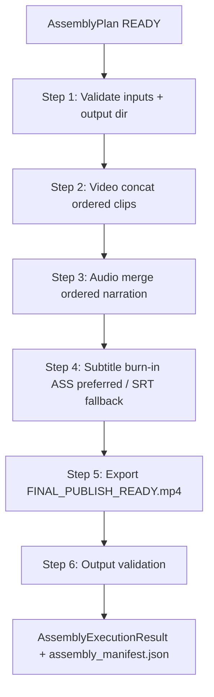

# Phase 11J-5 — Assembly FFmpeg Executor Design

**Status:** Design only — no FFmpeg implemented, no `FINAL_PUBLISH_READY.mp4` generated
**Date:** 2026-05-31
**Prerequisites:** 11J-1 (architecture), 11J-2 (foundation), 11J-3 (plan builder design), 11J-4 (plan builder impl)
**Next phase:** **11J-6 — Assembly FFmpeg Executor Implementation (Foundation / Dry-Run First)**

---

## Executive Summary

Phase 11J-5 designs the **execution layer** that turns a validated `AssemblyPlan`
(11J-4) into a publish-ready video. This is the first place FFmpeg enters the new
Content Brain Runtime — and it is **strictly isolated** to a single executor module.

```
AssemblyRuntimeEngine ─► AssemblyPlan ─► AssemblyFFmpegExecutor ─► FINAL_PUBLISH_READY.mp4
   (orchestration)        (planning)          (execution)            (output + manifest)
```

**This phase implements nothing.** No FFmpeg code, no media output, no slot mutation.
Architecture, contracts, pipeline, manifest, failure taxonomy, cancellation,
observability, legacy-reuse strategy, and risks only.

---

## Separation of Responsibilities

| Layer | Module | Owns | Never does |
|-------|--------|------|------------|
| Orchestration | `assembly_runtime_engine.py` (11J-6+) | Load session, build plan, guard policy, slot lifecycle, persist | Run FFmpeg directly |
| Planning | `assembly_plan_builder.py` (11J-4, done) | Select/order inputs → `AssemblyPlan` | Execute, write media |
| **Execution** | **`assembly_ffmpeg_executor.py` (this design)** | Run FFmpeg from a READY plan, produce output + manifest, return result | Build plans, mutate upstream slots, regenerate inputs |

The executor is a **pure consumer of `AssemblyPlan`** plus the FFmpeg binary. It does
not read the session, does not call `get_category_slot`, and does not touch upstream
artifacts beyond reading the exact paths the plan declares.

---

## Module Design — `content_brain/execution/assembly_ffmpeg_executor.py`

### Public surface (proposed)

```python
class AssemblyFFmpegExecutor:
    def __init__(self, ffmpeg_path: str | None = None, *, dry_run: bool = True) -> None: ...

    def execute(
        self,
        plan: AssemblyPlan,
        *,
        cancel_check: Callable[[], bool] | None = None,
        overwrite: bool = False,
        timeout_seconds: int | None = None,
    ) -> AssemblyExecutionResult: ...
```

### Responsibilities

- Receive an `AssemblyPlan` and **require `validation_status == READY`** (else
  `ASSEMBLY_PLAN_INVALID`).
- Execute the assembly workflow (concat → audio → subtitle burn → export).
- Generate `FINAL_PUBLISH_READY.mp4` + `assembly_manifest.json` in
  `plan.output_dir`.
- Return an `AssemblyExecutionResult`.

### Must not

- Build plans (no `AssemblyPlanBuilder` import).
- Mutate `video_generation` / `voice_generation` / `subtitle_generation` slots
  (the executor never receives the session — it only sees the plan).
- Regenerate clips, narration, or subtitles.
- Import `pipelines/full_video_pipeline.py`.

### Dry-run first (11J-6)

`dry_run=True` (default) plans and validates every FFmpeg command, writes the
manifest with `execution_status="dry_run"` and `real_assembly_executed=false`, but
**does not invoke FFmpeg**. Real execution (`dry_run=False`) is gated to a later
slice (11J-7) behind explicit approval, mirroring the voice live-TTS rollout.

---

## V1 Scope

| Supported | Mode |
|-----------|------|
| Video + Voice + **ASS** subtitles → `FINAL_PUBLISH_READY.mp4` | `video_voice_subtitle` + `burn_in` |
| Video + Voice (fallback) → `FINAL_PUBLISH_READY.mp4` | `video_voice` + `none` |

**Unsupported in V1 (reserved):** multiple audio tracks, multiple subtitle tracks,
multilingual audio, music layer, vertical/horizontal variants. The plan already
carries reserved fields (`music_inputs`, `music_mode`, `output_variant`,
`output_targets`, per-artifact `language`); the executor ignores them in V1 and
emits a warning if any are populated.

---

## Execution Pipeline



### Step 1 — Validate

- Video inputs exist (re-check `Path.is_file()` on plan `video_inputs[role=clip]`).
- Narration inputs exist (`audio_inputs[role=narration]`).
- Subtitle input exists if `subtitle_mode != none` (optional otherwise).
- `output_dir` exists / is creatable and writable.
- Failure codes: `ASSEMBLY_VIDEO_MISSING`, `ASSEMBLY_AUDIO_MISSING`,
  `ASSEMBLY_SUBTITLE_INVALID`, `ASSEMBLY_OUTPUT_INVALID`.

### Step 2 — Video assembly

- Concatenate ordered clips, preserving `AssemblyPlan` clip order.
- Strategy: FFmpeg concat (demuxer for matching codecs; filter-based fallback when
  codecs mismatch — see Risks). Intermediate written under a working subfolder of
  `output_dir`.

### Step 3 — Audio assembly

- Merge narration segments in plan order into one audio stream; align to video
  timeline using voice manifest durations (via `AudioSyncEngine` reuse).

### Step 4 — Subtitle handling (`burn_in`)

| Source | V1 |
|--------|----|
| ASS | **Preferred** (full styling/positioning) |
| SRT | Fallback (basic burn-in) |
| VTT | **Unsupported for burn-in in V1** → `ASSEMBLY_SUBTITLE_INVALID` (or skip with warning if `subtitle_mode` resolved to `none`) |

- If `subtitle_mode == none`, skip this step entirely.

### Step 5 — Export

- Produce `FINAL_PUBLISH_READY.mp4` in `plan.output_dir`.
- Atomic write: render to a temp file, then `Path.replace()` to final name
  (reuse the subtitle writer atomic pattern).
- `overwrite=false` default → existing output is preserved (re-run produces a clear
  result rather than clobbering).

### Step 6 — Output validation

- File exists, non-zero size, duration > 0 (probe via the chosen leaf engine, **not**
  raw ffprobe in the executor surface — see Risks), output path valid.
- Failure codes: `ASSEMBLY_OUTPUT_MISSING`, `ASSEMBLY_OUTPUT_INVALID`.

---

## Execution Result Model

New dataclass (proposed in `assembly_models.py`, additive — 11J-6):

```python
@dataclass
class AssemblyExecutionResult:
    session_id: str
    status: str                  # completed | failed | cancelled | dry_run
    output_file: str | None
    output_size: int | None
    duration_seconds: float | None
    execution_time_seconds: float | None
    validation_status: str       # READY consumed; output VALID/INVALID after run
    warnings: list[str]
    errors: list[dict]           # [{code, message}] using the failure taxonomy
    real_assembly_executed: bool = False
    def to_dict(self) -> dict: ...
```

---

## Assembly Manifest

`assembly_manifest.json` (written by the executor; extends the 11J-2
`AssemblyManifestSkeleton`):

```json
{
  "manifest_version": "11j_v1",
  "ffmpeg_executor_version": "11j6_v1",
  "session_id": "exec_abc123",
  "category": "assembly_generation",
  "assembly_mode": "video_voice_subtitle",
  "subtitle_mode": "burn_in",
  "input_artifacts": {
    "video": ["clip_001.mp4", "...", "video_manifest.json"],
    "voice": ["narration_001.mp3", "...", "voice_manifest.json"],
    "subtitle": ["subtitles.ass", "subtitle_manifest.json"]
  },
  "output_artifacts": [
    {
      "file_name": "FINAL_PUBLISH_READY.mp4",
      "file_path": ".../assembly_generation/FINAL_PUBLISH_READY.mp4",
      "size_bytes": null,
      "validation_status": "valid"
    }
  ],
  "validation_status": "READY",
  "execution_status": "dry_run",
  "generated_at": "2026-05-31 19:00:00",
  "duration_seconds": null,
  "real_assembly_executed": false
}
```

Mirrors voice/subtitle manifest conventions (`manifest_version`, `*_version`,
`validation_status`, `execution_status`, `generated_at`, `real_*_executed`) for
parser/UI consistency.

---

## Failure Taxonomy

New `RUNTIME_ERROR`/`ARTIFACT_REJECT`-category codes to register in
`content_brain/execution/failure_taxonomy.py` (additive in 11J-6):

| Code | Category | Retriable | Meaning |
|------|----------|-----------|---------|
| `ASSEMBLY_PLAN_INVALID` | PREFLIGHT_REJECT | false | Plan missing/`validation_status != READY` |
| `ASSEMBLY_VIDEO_MISSING` | ARTIFACT_REJECT | false | No usable video clip on disk |
| `ASSEMBLY_AUDIO_MISSING` | ARTIFACT_REJECT | false | No usable narration on disk |
| `ASSEMBLY_SUBTITLE_INVALID` | ARTIFACT_REJECT | false | Subtitle required but missing/unsupported (e.g. VTT burn-in) |
| `ASSEMBLY_FFMPEG_FAILED` | RUNTIME_ERROR | true | FFmpeg returned non-zero / crashed |
| `ASSEMBLY_OUTPUT_INVALID` | ARTIFACT_REJECT | true | Output exists but zero size / duration 0 |
| `ASSEMBLY_OUTPUT_MISSING` | ARTIFACT_REJECT | true | Output file not produced |
| `ASSEMBLY_CANCELLED` | OPERATIONS | false | Cooperative cancel triggered |
| `ASSEMBLY_TIMEOUT` | RUNTIME_ERROR | true | FFmpeg exceeded `timeout_seconds` |

---

## Runtime Slot — `assembly_generation`

Lifecycle (owned exclusively by `AssemblyRuntimeEngine`):

```
planned ──► pending ──► running ──► completed
                            │
                            ├──► failed
                            └──► cancelled
```

Additional fields written on completion:

- `output_file`, `output_size`, `execution_time_seconds`, `validation_status`
  (plus existing `manifest_path`, `artifacts[]`, `error`, `updated_at`,
  `executed`, `dry_run`).

**Must not mutate** `video_generation`, `voice_generation`, or
`subtitle_generation`. The engine snapshots these (deep copy) before/after and
asserts no change, mirroring the subtitle/voice engines.

---

## Cancellation Strategy

Cooperative cancellation via an injected `cancel_check() -> bool`, polled at safe
boundaries:

| Checkpoint | Behavior on cancel |
|------------|--------------------|
| Before video concat | Abort, no output |
| Before audio merge | Abort, preserve concat intermediate |
| Before subtitle stage | Abort, preserve video+audio intermediate |
| Before export | Abort, no final file |

- Partial/intermediate outputs are **preserved** (no auto-delete) for debugging and
  resumability.
- Final status → `cancelled` (`ASSEMBLY_CANCELLED`); slot → `cancelled`.
- An in-flight FFmpeg subprocess is signalled/terminated gracefully; the executor
  never leaves a half-written final file (atomic temp→replace guarantees this).

---

## Observability Requirements (Future — No UI in This Phase)

Future `AssemblyRuntimeObservabilityPanel` (Execution Center, below Subtitle panel)
fields:

| Field | Source |
|-------|--------|
| Status + badge | slot `status` |
| Progress | per-step progress (concat/audio/subtitle/export) |
| Output file | `output_file` |
| Output size | `output_size` |
| Duration | `duration_seconds` |
| Validation status | output `validation_status` |
| Warnings | `warnings[]` |
| Errors | `errors[].code` / `message` |

Safety copy: *"Reads existing artifacts only — does not regenerate video, voice, or
subtitles."* No UI implemented in this phase.

---

## Legacy Migration Strategy

The executor **reuses proven leaf FFmpeg components as libraries** — it does **not**
import the legacy orchestrator.

| Legacy leaf | Location | Reuse role in executor |
|-------------|----------|------------------------|
| `FinalAssemblyEngine` / `FinalCinematicAssembler` | `engines/final_assembly_engine.py`, `utils/final_cinematic_assembler.py` | Clip concatenation / final cinematic assembly |
| `SubtitleBurner.burn_ass_subtitles(input, subtitle, output)` | `engines/subtitle_burner.py` | ASS/SRT burn-in |
| `AudioSyncEngine.sync_clip_audio(...)` | `engines/audio_sync_engine.py` | Narration ↔ video timeline alignment |

### Rules

- **Allowed:** import the leaf engines above as utilities.
- **Banned:** `import pipelines.full_video_pipeline` (the orchestrator).
- **Adapter wrapping:** legacy engines hardcode `outputs/full_test/...` paths
  (e.g. `FinalAssemblyEngine.assemble_video`). The executor must call the
  lower-level leaves (`FinalCinematicAssembler.assemble(clip_paths, output_path)`,
  `SubtitleBurner.burn_ass_subtitles`) with **runtime-resolved** output paths under
  `storage/content_brain/execution/artifacts/{session_id}/assembly_generation/`, or
  wrap them in a thin adapter that redirects output — never write to the legacy
  `outputs/` tree.
- **Coexistence:** legacy `full_video_pipeline` keeps working untouched; both paths
  can run side by side (different output roots, no shared mutable state).
- **No upstream regeneration:** the executor consumes only artifacts the plan
  already references.

### Migration stages (non-breaking)

| Stage | Action |
|-------|--------|
| 11J-6 | Dry-run executor + manifest + slot wiring; **no FFmpeg invoked** |
| 11J-7 | Real FFmpeg via leaf engines behind approval gate (opt-in) |
| 11J-8 | Feature parity (sync polish), Execution Center observability |
| Future | Default flow uses Assembly Runtime; legacy pipeline flagged deprecated/opt-in |

---

## Safety Rules

- FFmpeg is **isolated to `assembly_ffmpeg_executor.py`** (and the leaf engines it
  wraps); no FFmpeg imports/calls in planning, foundation, validator, or preflight.
- Planning layer has **no dependency** on the executor.
- No regeneration of upstream artifacts; upstream slots remain **read-only**.
- Default `dry_run=True`; real execution gated behind approval (11J-7).
- Atomic output writes; `overwrite=false` default.

---

## Risks

| Risk | Impact | Mitigation |
|------|--------|------------|
| **FFmpeg version differences** | Filter/flag incompatibility across machines | Preflight FFmpeg availability + version probe; fail to `failed` (`ASSEMBLY_FFMPEG_FAILED`) with clear message, never crash |
| **Subtitle burn-in compatibility** | ASS styling/`libass` availability; VTT unsupported | ASS preferred, SRT fallback, VTT rejected for burn-in in V1 (`ASSEMBLY_SUBTITLE_INVALID`) |
| **Audio/video sync drift** | Narration misaligned with clips | Reuse `AudioSyncEngine` + voice manifest durations; record offsets in manifest; warn on clip/narration count mismatch (already surfaced by plan) |
| **Clip codec mismatch** | Concat demuxer fails | Detect mismatch → filter-based concat (re-encode) fallback; document performance cost |
| **Large output files** | Disk/time blowup | Record `output_size`; surface as warning above a threshold; future variant/bitrate controls reserved |
| **Cancellation during export** | Half-written final file | Atomic temp→replace; cancel checkpoints before export; partial intermediates preserved |
| **Migration from legacy pipeline** | Regression for Run Studio | Parallel coexistence; separate output roots; leaf reuse only; legacy untouched |
| **Timeout/hung FFmpeg** | Stuck runtime | `timeout_seconds` → terminate subprocess → `ASSEMBLY_TIMEOUT` |

---

## Implementation Slices

| Slice | Phase | Deliverable |
|-------|-------|-------------|
| `AssemblyExecutionResult` + failure codes + manifest writer (dry-run) | **11J-6** | Executor foundation, **no FFmpeg invoked**, `execution_status="dry_run"` |
| `AssemblyRuntimeEngine` orchestration + slot lifecycle + mutation guards | **11J-6** | Plan → (dry-run) execute → slot persist |
| Real FFmpeg via leaf engines behind approval gate | **11J-7** | `dry_run=False` opt-in, atomic output, output validation |
| `assembly_run_action_policy` + API route `POST /assembly/run` | **11J-7** | Guarded execution endpoint |
| `AssemblyRuntimeObservabilityPanel` | **11J-8** | Read-only UI |

Each slice gets a `validate_11j*_*.py` validator + report, following the 11I/11J
cadence, with regressions for prior phases and AST scans confirming FFmpeg stays
isolated to the executor module.

---

## Next Phase

**PHASE 11J-6 — Assembly FFmpeg Executor Implementation (Foundation / Dry-Run First)**

Implement `assembly_ffmpeg_executor.py` in **dry-run mode only** (plan validation,
command planning, manifest skeleton write, `AssemblyExecutionResult`) plus
`AssemblyRuntimeEngine` slot wiring — **no FFmpeg invocation, no
`FINAL_PUBLISH_READY.mp4`** — with `validate_11j6_*.py` and report.
