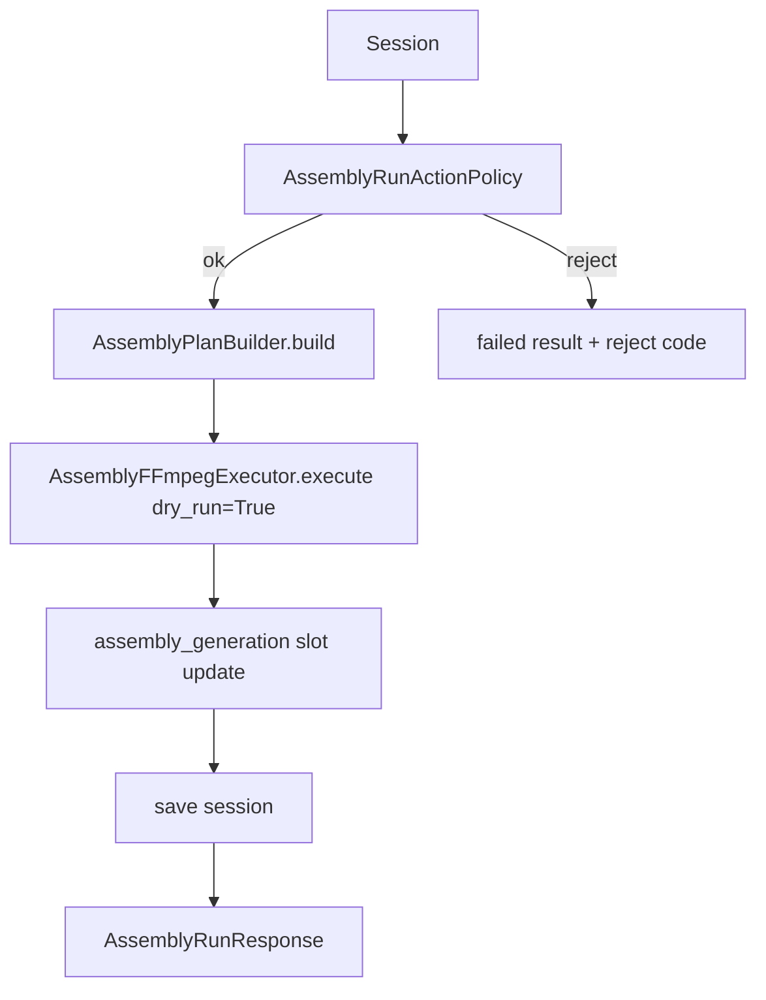

# Phase 11J-7 — Assembly Runtime API Design

**Status:** Design only — dry-run execution path only, no FFmpeg, no `FINAL_PUBLISH_READY.mp4`
**Date:** 2026-05-31
**Prerequisites:** 11J-2 (foundation), 11J-4 (plan builder), 11J-5 (executor design), 11J-6 (dry-run executor)
**Next phase:** **11J-8 — Assembly Runtime API Implementation (Dry-Run Only)**

---

## Executive Summary

Phase 11J-7 designs the **Assembly Runtime API + service layer** that drives the
dry-run executor end-to-end:

```
POST /sessions/{id}/assembly/run
  → AssemblyRunService
    → AssemblyRunActionPolicy (guards)
    → AssemblyPlanBuilder.build(session)        (11J-4)
    → AssemblyFFmpegExecutor.execute(dry_run=True)  (11J-6)
    → assembly_generation slot update
    → AssemblyRunResponse
```

This phase **implements nothing**. It mirrors the proven subtitle runtime API
(11I-8: service → engine → policy → schema → route) so the new endpoint integrates
cleanly with the existing FastAPI app, dependency wiring, and panel/observability
conventions.

**Dry-run only.** `dry_run=false` is **fail-closed** with
`ASSEMBLY_REAL_EXECUTION_DISABLED`. No FFmpeg, no media output, no upstream slot
mutation.

---

## Architecture (mirrors subtitle 11I-8)

| Layer | Module | Role |
|-------|--------|------|
| Route | `ui/api/main.py` | `POST /sessions/{id}/assembly/run`, response shaping |
| DI | `ui/api/dependencies.py` | `get_assembly_run_service()` |
| Service | `ui/api/assembly_run_service.py` | Thin wrapper → engine; attaches `api_version` |
| Engine | `content_brain/execution/assembly_runtime_engine.py` | Orchestrate plan → dry-run execute → slot lifecycle → persist |
| Policy | `content_brain/execution/assembly_run_action_policy.py` | Pre-run guard checks |
| Schemas | `ui/api/schemas/assembly_run.py` | `AssemblyRunRequest` / `AssemblyRunResponse` |
| Builder | `content_brain/execution/assembly_plan_builder.py` (11J-4, done) | Build `AssemblyPlan` |
| Executor | `content_brain/execution/assembly_ffmpeg_executor.py` (11J-6, done) | Dry-run execution |

> The **service** stays thin (DTO shaping); the **engine** owns orchestration +
> persistence, exactly like `SubtitleRunService` ↔ `SubtitleRuntimeEngine`.

---

## Endpoint

```
POST /sessions/{session_id}/assembly/run
```

Purpose:

1. Load session (`ExecutionSessionStore`).
2. Run `AssemblyRunActionPolicy` guards.
3. Build `AssemblyPlan` (`AssemblyPlanBuilder`).
4. Execute `AssemblyFFmpegExecutor.execute(plan, dry_run=True)`.
5. Update **only** the `assembly_generation` slot; persist session.
6. Return `AssemblyRunResponse`.

Status codes: `200` on accepted (dry-run completed / guard-blocked-with-body uses the
subtitle convention of `409` + structured body on `success=false`).

No FFmpeg is invoked at any point.

---

## Runtime Engine Flow



`AssemblyRuntimeEngine.run(session_id, *, dry_run=True, overwrite=False, timeout_seconds=120, triggered_by="operator")`:

- Snapshots `video_generation` / `voice_generation` / `subtitle_generation` slots
  (deep copy) **before** and asserts equality **after** → sets
  `video_mutated` / `voice_mutated` / `subtitle_mutated` (must be `false`).
- Uses a session-scoped lock (reuse subtitle/voice engine lock pattern) so two
  assembly runs cannot overlap.
- Never imports `full_video_pipeline.py`; never calls upstream engines.

---

## Request Schema — `ui/api/schemas/assembly_run.py`

```python
class AssemblyRunRequest(BaseModel):
    dry_run: bool = True
    overwrite: bool = False
    timeout_seconds: int = 120
    triggered_by: str = "operator"
```

Rules:

- `dry_run` **defaults to true**.
- `dry_run=false` **must fail closed** → `ASSEMBLY_REAL_EXECUTION_DISABLED`
  (no real execution permitted in 11J-7/11J-8).

---

## Response Schema — `AssemblyRunResponse`

```python
class AssemblyRunResponse(BaseModel):
    success: bool
    session_id: str
    status: str                       # completed | failed | cancelled (dry-run lifecycle)
    code: str | None = None
    reject_reasons: list[str] = []
    assembly_slot: dict | None = None
    validation_status: str = "FAILED" # READY / PARTIAL / FAILED
    planned_steps: list[dict] = []
    expected_output: str | None = None
    input_summary: dict | None = None
    output_summary: dict | None = None
    output_created: bool = False
    real_assembly_executed: bool = False
    warnings: list[str] = []
    errors: list[dict] = []
    video_mutated: bool = False
    voice_mutated: bool = False
    subtitle_mutated: bool = False
    guard_result: dict | None = None
    api_version: str = "0.7.x"
```

Required invariants on every dry-run response:

- `real_assembly_executed = false`
- `output_created = false`
- `video_mutated = false`
- `voice_mutated = false`
- `subtitle_mutated = false`

---

## Slot Lifecycle — `assembly_generation`

```
planned ──► pending ──► running ──► completed
                            │
                            ├──► failed
                            └──► cancelled
```

| Trigger | Slot status |
|---------|-------------|
| Guard rejects (plan not READY, archived, active run, …) | `failed` (no run) |
| Dry-run preview succeeds | `completed` |
| `dry_run=false` | `failed` (`ASSEMBLY_REAL_EXECUTION_DISABLED`) |
| Cancellation hook fires | `cancelled` |

On dry-run success the slot records: `status="completed"`, `validation_status`,
`planned_steps` (or a compact summary), `expected_output`,
`input_summary` / `output_summary`, `executed=false`, `dry_run=true`,
`real_assembly_executed=false`, `output_created=false`, `updated_at`. The slot
write is confined to `assembly_generation` (+ legacy `assembly` alias).

---

## Action Policy — `AssemblyRunActionPolicy`

`evaluate_assembly_run_request(session, plan, request) -> AssemblyRunPolicyResult`
(`allowed: bool`, `code: str | None`, `reject_reasons: list[str]`).

| Check | Reject code |
|-------|-------------|
| Session exists | `SESSION_NOT_FOUND` |
| Session not archived | `SESSION_ARCHIVED` |
| Session not cancelled | `SESSION_CANCELLED` |
| `assembly_generation` slot exists | `ASSEMBLY_SLOT_MISSING` |
| No active assembly run (`status != running`) | `ASSEMBLY_RUN_ACTIVE` |
| `AssemblyPlan.validation_status == READY` | `ASSEMBLY_PLAN_INVALID` |
| `dry_run` not false (else fail closed) | `ASSEMBLY_REAL_EXECUTION_DISABLED` |

**Must NOT require:** ElevenLabs approval, subtitle approval, video approval, or any
budget/credential approval gate. Dry-run is read-only over artifacts and produces no
media, so no approval is needed.

---

## Fail-Closed Rule

Request `{ "dry_run": false }` →

```json
{
  "success": false,
  "status": "failed",
  "code": "ASSEMBLY_REAL_EXECUTION_DISABLED",
  "real_assembly_executed": false,
  "output_created": false,
  "video_mutated": false,
  "voice_mutated": false,
  "subtitle_mutated": false
}
```

No FFmpeg call. No output generation. The executor already enforces this
(`AssemblyFFmpegExecutor` returns `ASSEMBLY_REAL_EXECUTION_DISABLED` for
`dry_run=False`); the policy rejects it earlier as defense-in-depth.

---

## Observability Data

The response + slot expose (for the future read-only UI panel, 11J-9):

| Field | Source |
|-------|--------|
| `planned_steps` | executor preview |
| `expected_output` | plan / executor |
| `validation_status` | plan (`READY`/`PARTIAL`/`FAILED`) |
| `input_summary` | counts: video / voice / subtitle |
| `output_summary` | planned output file + (future) size/duration |
| `warnings` | plan + executor warnings |
| `errors` | failure-taxonomy error objects |

No UI implemented in this phase.

---

## Validation Plan (for 11J-8 implementation)

`project_brain/validate_11j7_assembly_runtime_api_design.py` (or `_11j8_…` at impl)
will assert:

1. Dry-run request accepted (`success=true`, `status="completed"`).
2. `dry_run=false` blocked (`ASSEMBLY_REAL_EXECUTION_DISABLED`).
3. Response contains `expected_output`.
4. Response contains `planned_steps`.
5. Response `real_assembly_executed=false`.
6. Response `output_created=false`.
7. `assembly_generation` slot updated.
8. Video slot unchanged (`video_mutated=false`).
9. Voice slot unchanged (`voice_mutated=false`).
10. Subtitle slot unchanged (`subtitle_mutated=false`).
11. No FFmpeg import/call (AST scan of engine/service).
12. No `full_video_pipeline` import.

Plus regressions: 11J-6, 11J-4, 11J-2, 11I-8, 11H-2d.

---

## Files Likely to Change (11J-8)

| File | Change |
|------|--------|
| `ui/api/schemas/assembly_run.py` | **New** — request/response models |
| `ui/api/assembly_run_service.py` | **New** — thin service wrapper |
| `content_brain/execution/assembly_runtime_engine.py` | **New** — orchestration + slot lifecycle + mutation guards |
| `content_brain/execution/assembly_run_action_policy.py` | **New** — guard checks |
| `ui/api/dependencies.py` | Add `get_assembly_run_service()` |
| `ui/api/main.py` | Add route + `_assembly_run_response()` helper + imports |
| `content_brain/execution/failure_taxonomy.py` | Add policy reject codes if missing (`ASSEMBLY_SLOT_MISSING`, `ASSEMBLY_RUN_ACTIVE`, `SESSION_ARCHIVED`/`SESSION_CANCELLED` reuse if present) |

No changes to Video/Voice/Subtitle runtime execution, Runway/Hailuo, or the legacy
pipeline.

---

## Risks

| Risk | Impact | Mitigation |
|------|--------|------------|
| Accidental real execution | Unwanted FFmpeg/output | Double fail-closed (policy + executor); `dry_run` defaults true; impl validator asserts no FFmpeg |
| Upstream slot mutation | Corrupted video/voice/subtitle state | Deep-copy snapshot compare in engine → `*_mutated` flags; slot write confined to `assembly_generation` |
| Concurrent runs | Race on slot/session file | Session-scoped lock (reuse subtitle/voice engine pattern); `ASSEMBLY_RUN_ACTIVE` guard |
| Plan not READY | Confusing 200 with no work | Policy rejects with `ASSEMBLY_PLAN_INVALID` + reasons; slot stays non-completed |
| Schema drift vs subtitle/voice | Inconsistent client handling | Mirror `SubtitleRunResponse` field conventions + `api_version` |
| Approval-gate creep | Over-coupling to TTS/video gates | Policy explicitly excludes all approval gates for dry-run |
| Large `planned_steps` payload | Response bloat | Store compact summary on slot; full steps only in response (and capped) |

---

## Next Phase

**PHASE 11J-8 — Assembly Runtime API Implementation (Dry-Run Only)**

Implement the schemas, service, `AssemblyRuntimeEngine`, `AssemblyRunActionPolicy`,
DI wiring, and the `POST /sessions/{id}/assembly/run` route per this design —
dry-run only, no FFmpeg — with `validate_11j8_*.py` and report.
