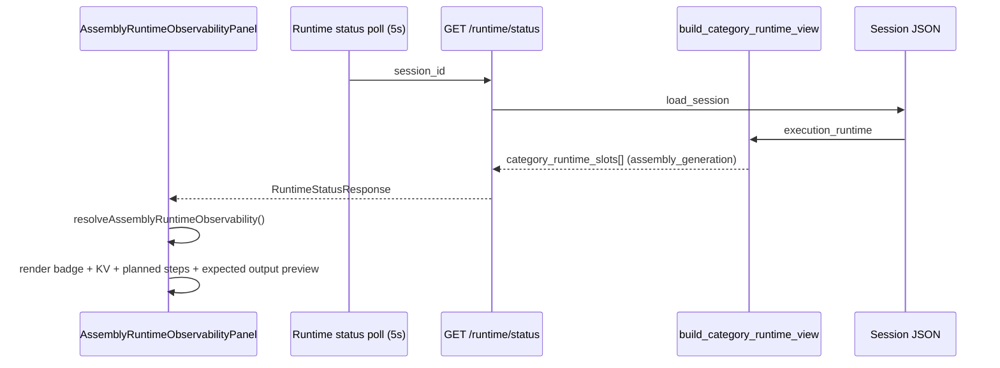

# Phase 11J-9 — Assembly Runtime UI Observability Design

**Status:** Design only — no UI implementation, no FFmpeg, no execution controls  
**Date:** 2026-05-31  
**Prerequisites:** 11J-2 foundation PASS, 11J-4 plan builder PASS, 11J-6 executor dry-run PASS, 11J-8 execution API PASS  
**Next phase:** **11J-10 — Implement Assembly Runtime UI Observability Panel**

---

## Executive Summary

Phase 11J-9 designs **read-only Assembly Runtime observability** for Execution Center. Operators will see assembly preflight metadata, dry-run execution results, planned FFmpeg steps (preview only), input/output summaries, and validation status in a dedicated **`AssemblyRuntimeObservabilityPanel`** nested inside **`RuntimeObservabilityPanel`**, below the existing Subtitle Runtime panel.

The panel mirrors the proven `SubtitleRuntimeObservabilityPanel` pattern (11I-9/11I-10): normalized resolver utility, status badge, KV grid, safety banners, planned-step list, expected-output preview — **no action buttons in this phase**.

**Key principle:** Assembly is **dry-run only**. The UI must never imply FFmpeg execution, final video generation, or export is available from this panel.

**Do not start Phase 11J-10 until explicit user approval.**

---

## Current UI Architecture

### Placement today

```
SessionDrawer / ExecutionCenterPage
  └── RuntimeObservabilityPanel
        ├── Session state · provider · heartbeat · preflight · validation  (kv-grid)
        ├── CategoryRuntimeSlotsPanel          ← generic slot cards (includes assembly row)
        ├── VoiceRuntimeObservabilityPanel     ← dedicated voice read-only panel
        ├── SubtitleRuntimeObservabilityPanel  ← dedicated subtitle read-only panel
        └── Clip artifacts                     ← video only
```

`CategoryRuntimeSlotsPanel` already lists all media categories from `category_runtime_slots[]`, including `assembly_generation` (canonical key; legacy `assembly` aliased on backend). The generic card shows only provider, artifact count, and timestamps — **insufficient** for assembly-specific observability (planned steps, input summary, dry-run flags, expected output path).

### Recommended layout (11J-10)

Add **`AssemblyRuntimeObservabilityPanel`** inside `RuntimeObservabilityPanel`, **below** `SubtitleRuntimeObservabilityPanel`:

```
Runtime Observability
  [session state · provider · heartbeat · preflight · validation]

Media categories                    ← CategoryRuntimeSlotsPanel (unchanged summary)
  [video · voice · music · subtitle_generation · assembly_generation cards]

Video Runtime                       ← (generic card summary only today)
Voice runtime                       ← existing (11H-1c+)
Subtitle runtime                    ← existing (11I-10)
Assembly runtime                    ← NEW (11J-10)
  [dry-run safety banner]
  [assembly_generation badge + KV grid]
  [planned steps list]
  [expected output preview — not generated]
  [warnings / errors blocks]

Clip artifacts                      ← video only (unchanged)
```

**Media category order** (consistent across generic cards and dedicated panels):

1. Video Runtime  
2. Voice Runtime  
3. Subtitle Runtime  
4. Assembly Runtime  

Dedicated panels follow this order inside `RuntimeObservabilityPanel` (voice → subtitle → **assembly**).

### Why a dedicated panel (not only CategoryRuntimeSlotsPanel)

| Reason | Detail |
|--------|--------|
| Field depth | Assembly needs 15+ fields plus planned-step rows |
| Dry-run semantics | `executed=false`, `real_assembly_executed=false`, `output_created=false` need explicit display |
| Safety copy | FFmpeg disabled disclaimer belongs with assembly context |
| Planned steps | Multi-step preview list has no place in generic card |
| Parity | Voice and subtitle already have dedicated panels |
| Future controls | Run Assembly / Export buttons attach here in later phases — not 11J-10 |

### Compact mode (`compact={true}`)

Used on Execution Center active-jobs list embed:

- Show: status badge, `validation_status`, dry-run safety one-liner
- Hide: full planned-steps list, output path, warnings/errors detail
- No buttons (same as voice/subtitle compact)

---

## Assembly Runtime Panel — Wireframe

```
┌─────────────────────────────────────────────────────────────────────────┐
│ Assembly runtime                                                        │
│ Assembly is currently running in dry-run mode only.                     │
│ No FFmpeg execution is enabled.                                         │
├─────────────────────────────────────────────────────────────────────────┤
│ assembly_generation                          [Assembly ready ●]         │
├─────────────────────────────────────────────────────────────────────────┤
│ Status              completed       Provider      local_assembly_runtime│
│ Validation status   READY           Assembly mode  video_voice_subtitle│
│ Subtitle mode       burn_in         Expected output FINAL_PUBLISH_…mp4│
│ Output created      false           Real assembly executed  false       │
│ Started             2026-05-31 …    Completed       2026-05-31 …      │
│ Duration            0.4s                                                │
├─────────────────────────────────────────────────────────────────────────┤
│ Input summary                                                           │
│  Video clips: 2   Voice segments: 2   Subtitle tracks: 1              │
├─────────────────────────────────────────────────────────────────────────┤
│ Output summary                                                          │
│  Expected output: FINAL_PUBLISH_READY.mp4                               │
│  Output file: —        Output created: false        Size: —             │
├─────────────────────────────────────────────────────────────────────────┤
│ Planned steps (preview only — not executed)                             │
│  1. validate_inputs   verify video/voice/subtitle inputs                │
│  2. video_concat      concatenate ordered clips                         │
│  3. audio_merge       merge ordered narration segments                  │
│  4. subtitle_handling burn_in (ASS preferred, SRT fallback)             │
│  5. export            export final video (atomic temp → replace)         │
│  6. output_validation verify file exists, non-zero size                 │
├─────────────────────────────────────────────────────────────────────────┤
│ Expected output (not generated)                                         │
│  [Expected Output Only]  FINAL_PUBLISH_READY.mp4                      │
│  …/artifacts/{session_id}/assembly_generation/FINAL_PUBLISH_READY.mp4 │
│  No final video has been generated.                                     │
├─────────────────────────────────────────────────────────────────────────┤
│ (warnings, if any)  music layer is reserved and ignored in V1          │
│ (failed only) Error: ASSEMBLY_REAL_EXECUTION_DISABLED — …               │
└─────────────────────────────────────────────────────────────────────────┘
```

CSS class prefix: `assembly-runtime-observability` (mirror `subtitle-runtime-observability`).

---

## Fields to Display

| UI Label | Slot / source field | Fallback chain | Empty display |
|----------|----------------------|----------------|---------------|
| Status | `status` | — | `planned` |
| Provider | `provider` | default `local_assembly_runtime` | `—` |
| Validation status | `validation_status` | `assembly_preflight.validation_status` | `—` |
| Assembly mode | `assembly_mode` | `assembly_preflight` (none) | `—` |
| Subtitle mode | `subtitle_mode` | — | `—` |
| Expected output | `expected_output` | `output_summary.expected_output` | `FINAL_PUBLISH_READY.mp4` (label only) |
| Output created | `output_created` | `output_summary.output_created` | `false` |
| Real assembly executed | `real_assembly_executed` | `operations.assembly_execution.real_assembly_executed` | `false` |
| Planned steps | `planned_steps[]` | — | empty list → muted "No planned steps yet." |
| Input summary | `input_summary` | `assembly_preflight.input_summary` | `—` |
| Output summary | `output_summary` | — | `—` |
| Warnings | `warnings[]` | `assembly_preflight.warnings` | hidden when empty |
| Errors | `errors[]` | coerce from `error` string or `reject_reasons` | hidden when empty |
| Started | `started_at` | `assembly_run.started_at` | `—` |
| Completed | `completed_at` | `assembly_run.completed_at` | `—` |
| Duration | `duration_seconds` | `execution_time_seconds` → compute from timestamps | `—` |

### Human-readable assembly mode labels

| Raw value | Display |
|-----------|---------|
| `video_voice_subtitle` | Video + voice + subtitles |
| `video_voice` | Video + voice |
| `video_only` | Video only |
| `voice_only` | Voice only |
| `multi_language_audio` | Multi-language audio (reserved) |
| `multi_subtitle_track` | Multi subtitle track (reserved) |

### Human-readable subtitle mode labels

| Raw value | Display |
|-----------|---------|
| `burn_in` | Burn-in (ASS/SRT) |
| `sidecar` | Sidecar mux (reserved) |
| `none` | No subtitles |

### Human-readable validation status labels

| Raw value | Display |
|-----------|---------|
| `READY` | Ready |
| `PARTIAL` | Partial — missing inputs |
| `FAILED` | Failed — inputs invalid |

### Input summary display

When `input_summary` is a dict, render compact counts:

```
Video clips: {video_count or video}
Voice segments: {voice_count or voice}
Subtitle tracks: {subtitle_count or subtitle}
```

If `missing[]` present in preflight summary, append muted line: *Missing: video_manifest, …*

---

## Status Badge Mapping

| Canonical `status` | Badge label | CSS class (reuse) |
|--------------------|-------------|-------------------|
| `planned` | Not started | `runtime-gate-unknown` |
| `pending` | Ready | `runtime-gate-pass` |
| `running` | Preparing assembly | `runtime-gate-pass` |
| `completed` | Assembly ready | `runtime-gate-pass` |
| `failed` | Failed | `runtime-gate-fail` |
| `cancelled` | Cancelled | `runtime-gate-unknown` |
| `skipped` | No assembly inputs | `runtime-gate-unknown` |

Implementation: `formatAssemblyStatusLabel(status, errorCode?)` in `assemblyRuntimeObservability.ts`.

Special cases (optional 11J-10):

- if `failed` + `error === ASSEMBLY_REAL_EXECUTION_DISABLED` → badge **Real execution disabled** (still `runtime-gate-fail`)
- if `skipped` or preflight `validation_status === FAILED` with zero inputs → **No assembly inputs**

Reuse `categoryStatusClass()` from `categoryRuntimeShell.ts` for CSS class selection (same rules as subtitle).

---

## Safety Copy

### Primary banner (always visible in full panel)

> **Assembly is currently running in dry-run mode only. No FFmpeg execution is enabled.**

Secondary muted line (always visible):

> Planned steps preview upstream artifacts only. Video, voice, and subtitle slots are not modified by assembly dry-run.

### Conditional banner (when `real_assembly_executed === false`)

Display below expected-output preview:

> **No final video has been generated.**

This line is shown whenever `real_assembly_executed` is false or absent (always true in 11J-8/11J-10 scope).

### Forbidden in 11J-10 UI

| Forbidden | Reason |
|-----------|--------|
| Run Assembly button | Execution API exists but controls deferred |
| Generate Video button | Implies FFmpeg |
| FFmpeg / transcode action labels | Out of scope |
| Export Final Video button | No output file exists |
| Burn subtitles toggle | Subtitle category isolation |
| Auto-run assembly on subtitle completion | Explicit API only (11J-8) |

### Validator guard (11J-10)

Add `uiContainsAssemblyExecutionActions(source: string): boolean` — scan component source for forbidden strings:

- `Run Assembly`, `Generate Video`, `Export Final Video`, `run assembly`, `ffmpeg`, `FFmpeg`, `FINAL_PUBLISH_READY` as button label

Mirror existing subtitle burn-in forbidden-string scan pattern.

---

## Artifact Preview Behavior

Assembly does **not** produce downloadable artifacts in the dry-run phase. The panel shows an **expected output preview only**.

### Expected output

| Constant | Value |
|----------|-------|
| Filename | `FINAL_PUBLISH_READY.mp4` |
| Directory | `{project_root}/storage/content_brain/execution/artifacts/{session_id}/assembly_generation/` |

### Preview row layout

```
[Expected Output Only]  FINAL_PUBLISH_READY.mp4
{full_path}             ← mono, truncated, title=full path
Status: Not generated   ← always when output_created=false
Size: —                 ← from output_summary.output_size
```

### Path construction (resolver)

1. If `output_summary.output_file` is a non-empty path → use it (future real execution)
2. Else if session has `expected_output` + known session id → build:
   `…/artifacts/{session_id}/assembly_generation/{expected_output}`
3. Else show filename only with path `—`

### Interaction rules (11J-10)

- **Read-only:** display path as text with `title` tooltip
- **No** `file://` links, download buttons, or video player embed
- **No** thumbnail / preview frame (no file exists)
- Clearly label section header: **Expected output (not generated)**

When `status=completed` and `output_created=false` (dry-run success): show planned steps as green-adjacent badge context but keep "Not generated" on artifact row.

When `status=pending` / `planned`: artifact section shows muted *No assembly plan executed yet.*

---

## Frontend Resolver Design

### New utility: `resolveAssemblyRuntimeObservability()`

Location: `ui/web/src/utils/assemblyRuntimeObservability.ts`

Pattern mirrors `resolveSubtitleRuntimeObservability()`:

```typescript
export type AssemblyPlannedStepRow = {
  step: number;
  name: string;
  action: string;
  detail: Record<string, unknown>;
};

export type AssemblyRuntimeObservability = {
  category_key: "assembly_generation";
  status: string;
  statusLabel: string;
  statusClassName: string;
  provider: string;
  validationStatus: string;
  assemblyMode: string;
  subtitleMode: string;
  expectedOutput: string;
  expectedOutputPath: string;
  outputCreated: string;
  realAssemblyExecuted: string;
  plannedSteps: AssemblyPlannedStepRow[];
  inputSummary: string;
  outputSummary: string;
  warnings: string[];
  errors: string[];
  errorCode: string;
  errorMessage: string;
  startedAt: string;
  completedAt: string;
  durationSeconds: string;
  safetyNote: string;
  noOutputNote: string;
  showPlannedSteps: boolean;
  showExpectedOutput: boolean;
};
```

### Slot resolution order

1. `category_runtime_slots.find(s => s.category_key === "assembly_generation")`
2. Fallback: `category_runtime_slots.find(s => s.category_key === "assembly")` → normalize key to `assembly_generation`
3. Fallback: `legacyPanel.execution_runtime.category_runtime.assembly_generation`
4. Fallback: `legacyPanel.execution_runtime.category_runtime.assembly`
5. Fallback: `execution_runtime.operations.assembly_execution` (partial metadata only)
6. Placeholder: `{ status: "planned", provider: "local_assembly_runtime", dry_run: true }`

**Never throw** on missing fields — all formatters return `—` or safe defaults.

### Extend `CategoryRuntimeSlot` TypeScript type (11J-10)

Add optional assembly fields:

```typescript
validation_status?: string | null;
assembly_mode?: string | null;
subtitle_mode?: string | null;
expected_output?: string | null;
output_created?: boolean;
real_assembly_executed?: boolean;
planned_steps?: Array<Record<string, unknown>>;
input_summary?: Record<string, unknown> | null;
output_summary?: Record<string, unknown> | null;
warnings?: string[];
errors?: Array<Record<string, unknown>>;
assembly_preflight?: Record<string, unknown> | null;
assembly_run?: Record<string, unknown> | null;
execution_time_seconds?: number | null;
```

Update `defaultPlaceholderSlots()`:

- Change `{ category_key: "assembly", … }` → `{ category_key: "assembly_generation", category_name: "assembly_generation", … }` for backend canonical key parity.

---

## Backend DTO Review

### Data source today

| Source | What it provides |
|--------|------------------|
| `GET /sessions/{id}/runtime/status` → `category_runtime_slots[]` | Primary UI source via `build_category_runtime_view()` |
| `execution_runtime.category_runtime.assembly_generation` | Deep fallback (also in `execution_runtime` on response) |
| `execution_runtime.operations.assembly_execution` | Last run metadata (11J-8): `engine_version`, `last_status`, `last_run_id`, `real_assembly_executed` |
| `execution_runtime.operations` (full) | Available on `RuntimeStatusResponse.execution_runtime` |
| `POST …/assembly/run` response | Write path only; UI polls runtime status |

### Field availability matrix (post-11J-8 dry-run)

| Required UI field | On slot after dry-run? | In `build_category_runtime_view()` today? | Notes |
|-------------------|------------------------|---------------------------------------------|-------|
| `status` | ✅ | ✅ | explicit normalize |
| `provider` | ✅ | ✅ | explicit normalize |
| `validation_status` | ✅ | ✅ | assembly block in normalize |
| `assembly_mode` | ✅ | ✅ | assembly block |
| `subtitle_mode` | ✅ | ✅ | assembly block |
| `expected_output` | ✅ | ✅ (via `{**slot}` spread) | not explicit in normalize — passes through |
| `output_created` | ✅ | ✅ (via spread) | passes through |
| `real_assembly_executed` | ✅ | ✅ (via spread) | passes through |
| `planned_steps` | ✅ | ✅ (via spread) | passes through |
| `input_summary` | ✅ | ✅ | assembly block |
| `output_summary` | ✅ | ✅ | assembly block |
| `warnings` | ✅ | ✅ (via spread) | passes through |
| `errors` | ✅ | ✅ (via spread) | passes through |
| `started_at` | ✅ | ✅ | explicit normalize |
| `completed_at` | ✅ | ✅ | explicit normalize |
| `duration_seconds` | ⚠️ | ⚠️ | Engine writes `execution_time_seconds`; normalize reads `duration_seconds` only |

**Conclusion:** 11J-10 can ship read-only observability using existing `GET /runtime/status` **without new endpoints**, with one resolver-side fallback for duration.

### Recommended backend additions (11J-10 — optional polish, no change in 11J-9)

| Addition | Location | Why |
|----------|----------|-----|
| Map `execution_time_seconds` → `duration_seconds` in assembly normalize | `category_runtime_compat.py` `normalize_category_slot()` | Stable duration field for all consumers |
| Explicit merge of `planned_steps`, `expected_output`, `output_created`, `real_assembly_executed`, `warnings`, `errors` | `normalize_category_slot()` assembly block | Guarantees fields survive base-schema changes |
| `CategoryRuntimeSlotStatus` Pydantic extension | `ui/api/schemas/runtime.py` | Typed OpenAPI docs for assembly fields |
| Top-level `assembly_runtime_panel` excerpt on `RuntimeStatusResponse` | `runtime_service.py` | Single stable DTO (optional; resolver can use slots) |
| Include `assembly_run` excerpt (run_id, started_at, completed_at) | normalize or runtime service | Cleaner UI without parsing nested object |

### Not required for 11J-10

- New GET endpoint for assembly artifacts
- Static file serving / video download for `FINAL_PUBLISH_READY.mp4`
- WebSocket push (poll existing 5s runtime status)
- Changes to `POST /assembly/run` API
- FFmpeg integration

---

## Legacy Session Safety

| Scenario | UI behavior |
|----------|-------------|
| Old session with only `assembly` key | Resolver maps to `assembly_generation` display name |
| Missing `assembly_generation` slot | Show placeholder `planned` / Not started |
| Missing post-run fields (`planned_steps`, etc.) | Display `—` or empty section |
| `validation_status: null` | Display `—` |
| Malformed `error` (string vs object) | Coerce safely; string → errorCode, never crash |
| Pre-11J sessions without preflight | Status from slot or `planned`; input summary from `—` |
| `output_summary: null` | Show expected filename only; path `—` |
| `planned_steps: []` | Muted "No planned steps yet." |
| `real_assembly_executed` absent | Treat as `false`; show "No final video has been generated." |

---

## No Controls (11J-9 / 11J-10)

This panel is **observability only**. Do not design or implement:

- Run Assembly
- Generate Video
- FFmpeg
- Export Final Video
- Retry / overwrite toggles

All execution controls belong to **later phases** after real FFmpeg execution is explicitly approved.

---

## Future Controls (Design Only — Not 11J-10)

Place in an **`Assembly runtime actions`** subsection below the expected-output preview (same nesting pattern as voice approval / future subtitle run controls):

| Control | API | Visibility gate |
|---------|-----|-----------------|
| **Plan assembly (dry-run)** | `POST …/assembly/run` `{ dry_run: true }` | Plan not READY, not `running`, not archived |
| **Run assembly (real)** | `POST …/assembly/run` `{ dry_run: false }` | Future phase after FFmpeg approval; disabled until flag enabled |
| **Re-run assembly** | `POST …/assembly/run` + `overwrite: true` | `status=completed` or `failed` |
| **Download final video** | Static file route or signed path (TBD) | `output_created=true`, file exists |
| **Open output folder** | OS / admin tooling (TBD) | `output_created=true` |

All future controls require:

- Confirm dialog for real execution and overwrite
- Success toast with upstream `*_mutated=false` confirmation
- Disabled state when `running` or session archived/cancelled
- Primary banner updated when real execution is enabled (separate phase)
- **No control visible in 11J-10**

---

## CategoryRuntimeSlotsPanel Note Update (11J-10)

Current note (post-11I-10):

> Read-only runtime shell — video dispatches clips; voice and subtitle categories show preflight and execution metadata.

Proposed:

> Read-only runtime shell — video dispatches clips; voice, subtitle, and assembly categories show preflight and execution metadata.

Assembly card in the generic list remains a **summary**; detail lives in `AssemblyRuntimeObservabilityPanel`.

---

## Validation Plan

### Design-phase validator (optional, 11J-9)

**Script:** `project_brain/validate_11j9_assembly_ui_observability_design.py`

Static checks on this design document and required sections (no UI code):

| # | Test | Method |
|---|------|--------|
| 1 | Design report exists | File scan |
| 2 | Panel name documented | String scan |
| 3 | All 16 display fields listed | Section scan |
| 4 | All 7 status badges mapped | Table scan |
| 5 | Safety copy present | String scan |
| 6 | Legacy alias support documented | String scan |
| 7 | No forbidden controls in future-controls section marked as 11J-10 | String scan |
| 8 | DTO gap analysis present | Section scan |

### Implementation validator (11J-10)

**Script:** `project_brain/validate_11j10_assembly_ui_observability.py`

| # | Test | Method |
|---|------|--------|
| 1 | `AssemblyRuntimeObservabilityPanel` component exists | File / export scan |
| 2 | Panel mounted in `RuntimeObservabilityPanel` below subtitle panel | Source import + order scan |
| 3 | `resolveAssemblyRuntimeObservability` exists | Module scan |
| 4 | Status labels map correctly (7 statuses) | Unit tests / constant scan |
| 5 | Legacy `assembly` key resolves to `assembly_generation` | Resolver fixture |
| 6 | Missing fields render `—` without throw | Resolver fixture |
| 7 | Dry-run completed session shows planned steps | Mock slot fixture |
| 8 | Safety banner text present | Source string scan |
| 9 | "No final video has been generated." when `real_assembly_executed=false` | Source + fixture |
| 10 | Expected output labeled "Expected Output Only" | Source string scan |
| 11 | No Run Assembly / FFmpeg / Export buttons | Forbidden string scan |
| 12 | Compact mode hides planned steps detail | Prop or source scan |
| 13 | Voice panel unchanged | Diff scope check |
| 14 | Subtitle panel unchanged | Diff scope check |
| 15 | Video artifact section unchanged | Diff scope check |
| 16 | 11J-8 regression | Subprocess |
| 17 | 11J-6 regression | Subprocess |
| 18 | 11J-2 regression | Subprocess |
| 19 | 11I-10 regression | Subprocess |
| 20 | npm build passes | `npm run build` |

Optional Playwright: open Execution Center → session with completed assembly dry-run → badge reads "Assembly ready" and banner shows dry-run copy.

---

## Files Likely to Change (11J-10)

### New files

| File | Purpose |
|------|---------|
| `ui/web/src/components/AssemblyRuntimeObservabilityPanel.tsx` | Dedicated read-only panel |
| `ui/web/src/utils/assemblyRuntimeObservability.ts` | Resolver + status labels + planned steps + output preview |
| `project_brain/validate_11j10_assembly_ui_observability.py` | Implementation validator |
| `project_brain/PHASE_11J10_ASSEMBLY_UI_OBSERVABILITY_REPORT.md` | Implementation report |

### Modified files

| File | Change |
|------|--------|
| `ui/web/src/components/RuntimeObservability.tsx` | Mount `AssemblyRuntimeObservabilityPanel` below subtitle panel |
| `ui/web/src/utils/categoryRuntimeShell.ts` | Extend types; fix assembly placeholder key |
| `ui/web/src/App.css` | Styles for `.assembly-runtime-observability` |
| `content_brain/execution/category_runtime_compat.py` | Optional explicit assembly field merge + duration mapping |

### Not modified

| Area | Reason |
|------|--------|
| Voice / subtitle runtime panels and controls | Isolation |
| Video dispatch / clip artifacts | Isolation |
| `POST /assembly/run` API | Already complete (11J-8) |
| `AssemblyFFmpegExecutor` real execution | Future phase |
| Runway / Hailuo / `full_video_pipeline.py` | Constraints |
| Tk Runtime Studio panels | Execution Center web scope for 11J-10 |

---

## Sequence — Data Flow



No write paths in 11J-10. No FFmpeg. No file generation.

---

## Next Phase

**PHASE 11J-10 — Implement Assembly Runtime UI Observability Panel**

Implement `AssemblyRuntimeObservabilityPanel`, resolver utility, Runtime Observability wiring, CSS, validator, and report. Keep read-only — no Run / Export / FFmpeg buttons until a later phase explicitly enables real assembly execution.

**Future after 11J-10:**

- **11J-11** — Assembly Run (dry-run) UI control design (wire existing `POST /assembly/run`)
- **11J-12+** — Real FFmpeg execution + Export Final Video (separate approval gate)
