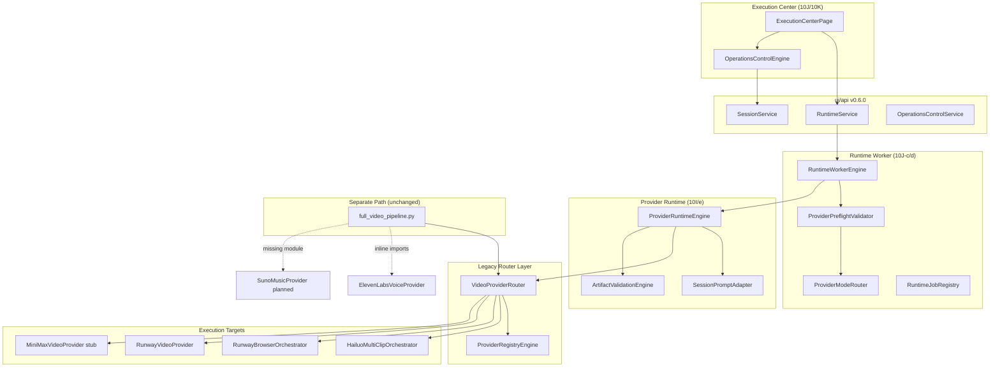
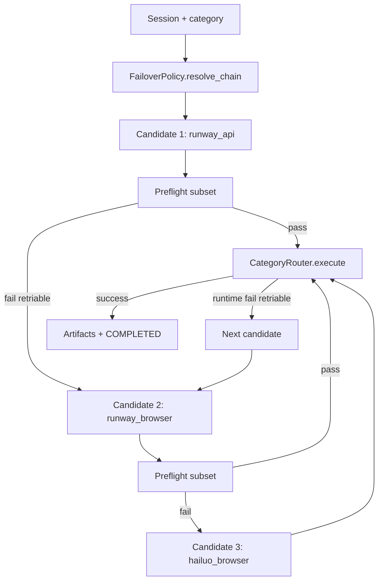

# Phase 11 — Provider Expansion Plan

**Status:** Design only — no implementation  
**Date:** 2026-05-30  
**Prerequisites:** Phase 10J (Provider Operations) closed · Phase 10K (Operations Console V1) closed  
**API version baseline:** `0.6.0`

---

## Executive Summary

ModirAgentOS already has a **working video execution spine** (queue → worker → preflight → `ProviderRuntimeEngine` → `VideoProviderRouter` → orchestrators/providers) with artifact validation, cost telemetry storage, runtime observability, and operator controls. Phase 11 should **extend** this spine to additional provider families and capabilities **without rewriting** `full_video_pipeline.py`, existing orchestrators, or the browser automation layer.

The central design principle: **compose new providers behind category routers and the existing 10J execution wrapper**, using catalog-driven mode resolution, preflight gates, and a new **failover policy layer** that sits above routers — not inside pipelines.

---

## 1. Current Provider Architecture

### 1.1 Architecture diagram (as-built)



### 1.2 Provider Runtime Engine

**Location:** `content_brain/execution/provider_runtime_engine.py`

**Role:** Session-scoped dispatch for **DEQUEUED** sessions. Currently **video_generation only** (Phase 10I scope).

| Responsibility | Implementation |
|----------------|----------------|
| Eligibility | `QueueIntegrityValidator`, `resolve_video_provider()` |
| Prompt materialization | `SessionPromptAdapter.build()` → `prompt_bundle.json` |
| Clip execution | `_execute_clips()` → `VideoProviderRouter.generate_clips()` |
| Artifact canonicalization | Copy to `storage/.../artifacts/{session_id}/video_generation/` |
| Validation | `ArtifactValidationEngine` before COMPLETED |
| Cooperative cancel | Checkpoints via `operations_cancel.py` (10K-d) |
| Audit | `provider_audit_log[]`, state history |

**Category slots (schema-only today):** `voice_generation`, `music_generation`, `image_generation`, `publishing` — defined in `provider_categories.py` with `status: planned`.

### 1.3 Provider Registry (legacy config)

**Location:** `core/provider_registry_engine.py`  
**Config:** `config/provider_registry.json`, `config/active_providers.json`

| Category | Registered providers | Active default |
|----------|---------------------|----------------|
| video | hailuo_browser, runway_browser, minimax_api, runway, luma, kling | `runway_browser` |
| music | suno | `suno` |
| voice | elevenlabs, openai_tts | `elevenlabs` |
| llm | openai, claude, gemini, deepseek | `openai` |
| trend | mock, dataforseo, serpapi, … | mock |

**Capabilities:** credential readiness, active provider lookup, provider status strings. Used directly by `VideoProviderRouter` and legacy `ui/app.py` Run Studio.

**Gap:** Not mode-aware (browser vs API keys are flat `mode` field). Overlaps with but does not replace `ProviderModeCatalog`.

### 1.4 Provider Mode Catalog (10J dual-mode)

**Location:** `content_brain/execution/provider_mode_catalog.py`  
**Override:** `config/provider_mode_catalog.json` (optional)

Defines **provider families** with browser/API duality:

| Family | Browser router key | API router key | Cost basis |
|--------|-------------------|----------------|------------|
| runway | `runway_browser` | `runway` | subscription / usage_api |
| hailuo | `hailuo_browser` | `hailuo_api` (planned) | subscription / usage_api |
| minimax | — | `minimax_api` (stub) | usage_api |

**Resolution:** `ProviderModeRouter.resolve(session)` → `ModeResolution` (family, mode, router_key, learning_key, adapter).

**Implemented router keys** (`provider_mode_router.py`): `hailuo_browser`, `runway_browser`, `runway`, `runway_api`, `minimax_api`, `hailuo` — **not** `hailuo_api`.

### 1.5 Video Provider Router

**Location:** `core/video_provider_router.py`

Hard-coded dispatch table:

| Router key | Target | Status |
|------------|--------|--------|
| `hailuo`, `hailuo_browser` | `HailuoMultiClipOrchestrator` | Production browser path |
| `runway_browser` | `RunwayBrowserOrchestrator` | Production browser path |
| `runway`, `runway_api` | `RunwayVideoProvider` | Production API path |
| `minimax_api` | `MiniMaxVideoProvider` | Stub (`NotImplementedError`) |
| *other* | — | `ValueError: Unsupported` |

**Design note:** Router is synchronous, batch-oriented (`generate_clips(prompts)` returns all paths). Preflight and worker wrap it; router itself has no retry/failover.

### 1.6 Browser Provider Path

```
ProviderPreflightValidator
  → browser probes (CDP, profile, download dir, concurrency)
  → BrowserExecutionAdapter
  → VideoProviderRouter(provider_override=router_key)
  → HailuoMultiClipOrchestrator | RunwayBrowserOrchestrator
  → BrowserManager / Playwright (inside orchestrators — do not modify in Phase 11)
```

**Characteristics:** subscription cost basis, long wait loops (`wait_seconds` 150–180), file downloads to `downloads/`, session-scoped artifact copy afterward.

### 1.7 API Provider Path

```
ProviderPreflightValidator
  → API key / endpoint / connectivity probes
  → ApiExecutionAdapter (same router entrypoint)
  → RunwayVideoProvider | MiniMaxVideoProvider
  → REST polling (Runway) or stub
```

**Characteristics:** usage-based cost basis, env-driven credentials (`RUNWAY_API_KEY`), polling intervals in provider class.

### 1.8 Runtime Worker

**Location:** `content_brain/execution/runtime_worker_engine.py`

**Lifecycle:** accept → preflight → RUNNING → `ProviderRuntimeEngine.dispatch_by_id()` → heartbeat → cost telemetry → registry finalize.

**Integration points for Phase 11:**

- Preflight already mode-aware — extend checks per provider family
- Worker is category-agnostic shell — extend to multi-category dispatch loops
- Job registry tracks single dispatch per session today

### 1.9 Parallel legacy path

`pipelines/full_video_pipeline.py` calls `VideoProviderRouter` directly and inline-imports `ElevenLabsVoiceProvider` / `SunoMusicProvider`. **Suno provider module is referenced but not present in repo** — pipeline has try/except fallback.

**Phase 11 rule:** New Content Brain providers must not require `full_video_pipeline.py` changes. Legacy path may receive thin adapter shims later (Phase 12+), not Phase 11 implementation.

---

## 2. Future Provider Types

### 2.1 Runway

| Mode | Current state | Phase 11 target |
|------|---------------|-----------------|
| Browser | Orchestrator exists, preflight + worker integrated | Harden: reference frames (image-to-video), concurrency caps |
| API | `RunwayVideoProvider` text-to-video REST | Extend catalog: image-to-video endpoint mapping, quota telemetry |

**Capabilities today:** text-to-video (API + browser).  
**Not wired:** image-to-video in session prompt adapter, multi-model selection from brief.

### 2.2 Hailuo

| Mode | Current state | Phase 11 target |
|------|---------------|-----------------|
| Browser | Primary production path via orchestrator | Stability metrics, download path normalization |
| API | Catalog entry `hailuo_api`, **router not implemented** | Design API provider class + router branch (implementation Phase 11B+) |

### 2.3 Suno

| Location | Current state |
|----------|---------------|
| Registry | `music/suno`, active default |
| Runtime | Category slot `music_generation` → planned |
| Code | **No `providers/suno_music_provider.py`** (pipeline import fails gracefully) |

**Phase 11 target:** Design `MusicProviderRouter` + Suno adapter spec; no browser path expected.

### 2.4 ElevenLabs

| Location | Current state |
|----------|---------------|
| Registry | `voice/elevenlabs`, active, credentials check |
| Provider | `providers/elevenlabs_voice_provider.py` — standalone `generate_voice()` |
| Runtime | Category slot `voice_generation` → planned |

**Phase 11 target:** Design voice category router, narration artifact schema, validation rules (audio extensions, min duration).

### 2.5 Future image providers

Registry has no image category today. `provider_categories.py` defines `image_generation` with generic placeholder.

**Candidates (design-only):** DALL·E, Midjourney API, Flux, Ideogram, Stable Diffusion hosts.

**Use cases:** thumbnail frames, reference frames for image-to-video, storyboard assets, B-roll stills.

---

## 3. Capability Matrix

Legend: **Y** = supported today · **P** = planned in Phase 11 design · **—** = not applicable / out of scope · **N** = not supported

### 3.1 By provider (current + planned)

| Provider | text-to-video | image-to-video | text-to-image | music | narration | subtitles | asset gen |
|----------|:-------------:|:--------------:|:-------------:|:-----:|:---------:|:---------:|:---------:|
| **Runway browser** | Y | P | — | — | — | — | — |
| **Runway API** | Y | P | — | — | — | — | — |
| **Hailuo browser** | Y | P | — | — | — | — | — |
| **Hailuo API** | P | P | — | — | — | — | — |
| **MiniMax API** | N (stub) | — | — | — | — | — | — |
| **Luma / Kling** | P (registry only) | P | — | — | — | — | — |
| **Suno** | — | — | — | P | — | — | — |
| **ElevenLabs** | — | — | — | — | P | — | — |
| **OpenAI TTS** | — | — | — | — | P | — | — |
| **Future image** | — | P (as input) | P | — | — | — | P |

### 3.2 By runtime category (target architecture)

| Category key | Router (proposed) | Validation engine | Artifact types |
|--------------|-------------------|-------------------|----------------|
| `video_generation` | `VideoProviderRouter` (existing) | `ArtifactValidationEngine` (video) | `.mp4`, `.webm`, `.mov`, `.mock` |
| `music_generation` | `MusicProviderRouter` (new) | `AudioArtifactValidator` (new) | `.mp3`, `.wav`, `.m4a` |
| `voice_generation` | `VoiceProviderRouter` (new) | `AudioArtifactValidator` (new) | `.mp3`, `.wav` |
| `image_generation` | `ImageProviderRouter` (new) | `ImageArtifactValidator` (new) | `.png`, `.jpg`, `.webp` |
| `publishing` | `PublishingAdapter` (future) | metadata-only | URLs, manifests |

### 3.3 Subtitles

No provider integration exists. **Design recommendation:** treat subtitles as a **post-production engine** (local FFmpeg / Whisper / LLM captioning), not a third-party generation provider in Phase 11. Category: `publishing` or `asset_post_processing`.

---

## 4. Cost Architecture

### 4.1 Current state (10J)

| Component | Behavior |
|-----------|----------|
| `SimulationReportBuilder` | Heuristic credits: ~1.0/clip (hailuo), ~2.0/clip (runway) |
| `ApprovalBudgetGovernanceEngine` | Budget block/allow from simulation + approval |
| `cost_telemetry.py` | **Storage only** — snapshots estimates, records outcome, duration; no pricing math |
| `ProviderModeCatalog.cost_basis_by_mode` | `subscription` vs `usage_api` label |

**Gap:** No actual usage accounting from provider responses; no per-family unit economics; no runtime budget stop.

### 4.2 Proposed cost model (design)

```
┌─────────────────────────────────────────────────────────┐
│  ProviderCostCatalog (new, config-driven)               │
│  family × mode × capability → unit_type, unit_cost      │
│  unit_types: clip_second, clip_flat, char, token, job  │
└───────────────────────┬─────────────────────────────────┘
                        │
┌───────────────────────▼─────────────────────────────────┐
│  CostEstimator (pre-dispatch)                          │
│  inputs: clip_count, duration, chars, provider_family  │
│  outputs: estimated_credits, estimated_usd, confidence │
└───────────────────────┬─────────────────────────────────┘
                        │
┌───────────────────────▼─────────────────────────────────┐
│  BudgetGuardrailEngine (pre + post)                      │
│  pre: block dispatch if projected > remaining_budget     │
│  post: record actual_units from provider receipt         │
└───────────────────────┬─────────────────────────────────┘
                        │
┌───────────────────────▼─────────────────────────────────┐
│  UsageLedger (append-only JSONL)                         │
│  session_id, dispatch_id, family, units, cost, outcome   │
└─────────────────────────────────────────────────────────┘
```

### 4.3 Provider credits vs USD

| Mode | Accounting approach |
|------|---------------------|
| Browser (subscription) | **Opportunity cost credits** — flat per-clip from catalog; track browser minutes separately |
| API (usage) | **Provider-reported units** where available (Runway task metadata); fallback to catalog estimate |
| Voice/Music | Per-character / per-second / per-generation flat units |

### 4.4 Budget guardrails (design rules)

1. **Pre-dispatch:** extend preflight with `BUDGET_PROJECTED_OK` check using `CostEstimator`.
2. **Mid-run:** cooperative cancel already exists (10K-d) — tie to budget threshold breach as cancel reason.
3. **Post-run:** write `actual_credits` to `cost_telemetry`; never delete artifacts on budget overrun (mark FAILED with `BUDGET_EXCEEDED`).
4. **Operations:** Retry/Requeue do not reset budget ledger — append new attempt rows.

### 4.5 Integration points (no pipeline rewrite)

- Extend `SimulationReportBuilder` to read `ProviderCostCatalog` instead of hard-coded runway/hailuo heuristic.
- Extend `ProviderPreflightValidator` with optional budget check.
- Extend `finalize_cost_telemetry()` with `actual_units` / `actual_cost` fields when provider returns them.

---

## 5. Failover Architecture

### 5.1 Design goal

```
Provider A (primary)
  ↓ fail (retriable)
Provider B (fallback #1)
  ↓ fail (retriable)
Provider C (fallback #2)
  ↓ fail
Terminal FAILED (preserve partial artifacts + audit)
```

**Without rewriting** `full_video_pipeline.py` or orchestrators.

### 5.2 Failover policy layer (new — above routers)

**Proposed module:** `content_brain/execution/provider_failover_policy.py`



**Chain source (config):** `config/provider_failover_chains.json`

```json
{
  "video_generation": {
    "default": ["runway_api", "runway_browser", "hailuo_browser"],
    "cost_optimized": ["hailuo_browser", "runway_browser"],
    "quality_optimized": ["runway_api", "runway_browser"]
  }
}
```

### 5.3 Failover scope rules

| Failover type | Allowed | Notes |
|---------------|---------|-------|
| Same family, mode switch (API → browser) | Yes | Preflight differs per mode |
| Cross-family (runway → hailuo) | Yes, config-driven | May alter visual style — audit + operator visibility |
| Cross-category (video → image) | No in Phase 11 | Different artifact contracts |
| Auto-requeue | No | 10K policy — operator must requeue |

### 5.4 Failure classification integration

Use existing `failure_taxonomy.py`:

- **Retriable:** `CREDENTIALS_MISSING`, `BROWSER_UNAVAILABLE`, `API_CONNECTIVITY_FAILED`, `PROVIDER_TIMEOUT`, `PROVIDER_TASK_FAILED`, artifact errors
- **Non-retriable:** `PROVIDER_NOT_IMPLEMENTED`, `CLIP_COUNT_MISMATCH`, `CATEGORY_NOT_SUPPORTED`
- **New codes (design):** `FAILOVER_EXHAUSTED`, `FAILOVER_CANDIDATE_SKIPPED`

### 5.5 Partial artifact preservation

On failover after partial clip success:

1. Preserve completed clips in `artifacts_by_category`.
2. Record `failover_from` / `failover_to` in `operations.failover`.
3. Remaining clip indices re-dispatched to next provider via `SessionPromptAdapter` slice.
4. **Do not** re-run successful indices unless operator retries full session.

### 5.6 What stays unchanged

- Orchestrator internals (`hailuo_multi_clip_orchestrator`, `runway_browser_orchestrator`)
- `VideoProviderRouter` dispatch table (failover calls router repeatedly with overrides)
- BrowserManager

---

## 6. Multi-Provider Router — Selection Strategy

### 6.1 Current selection (as-built)

1. Session `provider_selection.primary_provider` or category selection
2. `ProviderModeCatalog.resolve_from_session()` → family + mode
3. `ProviderModeRouter.is_router_key_implemented()` gate in preflight
4. No dynamic scoring — static session choice

### 6.2 Proposed selection engine (design)

**Module:** `content_brain/execution/provider_selection_engine.py`

**Inputs:**

| Signal | Source |
|--------|--------|
| Cost | `ProviderCostCatalog`, budget headroom |
| Quality | `story_quality_score`, provider historical success rate (future ledger) |
| Speed | Catalog `typical_clip_seconds`, mode (API often faster setup, browser longer) |
| Availability | Preflight probe results, registry `enabled`, credentials ready |

**Outputs:**

```python
SelectionResult(
    primary_router_key: str,
    failover_chain: list[str],
    rationale: dict[str, Any],  # scored dimensions
    execution_mode: str,
)
```

### 6.3 Selection strategies (operator-configurable)

| Strategy | Weighting |
|----------|-----------|
| `balanced` | Default — normalize cost/quality/speed/availability |
| `cost_optimized` | 50% cost, 20% availability, 15% speed, 15% quality |
| `quality_optimized` | 45% quality, 25% availability, 20% speed, 10% cost |
| `speed_optimized` | 40% speed, 30% availability, 20% quality, 10% cost |
| `manual` | Session selection only — no auto override |

### 6.4 Integration point

Run at **queue dequeue** or **preflight** (design choice — recommend preflight so availability is fresh):

```
ProviderSelectionEngine.rank(session, strategy)
  → update session.provider_selection.resolved (audit-only)
  → ProviderModeRouter.resolve with resolved family/mode
```

**10K compatibility:** Retry/Requeue preserve selection unless operator edits session; failover chain recomputed on each dispatch.

### 6.5 Registry unification (design debt)

Today: `ProviderRegistryEngine` + `ProviderModeCatalog` overlap.

**Phase 11 design target:** single **`ProviderCapabilityRegistry`** JSON schema merging:

- registry metadata (enabled, credentials env)
- mode catalog (router keys, cost basis)
- capability flags (text-to-video, image-to-video, …)
- selection weights defaults

Migration: read both legacy configs, emit unified config — **implementation Phase 11A**.

---

## 7. Future Runtime Requirements

Gaps that must be closed **before** production integration of Runway/Hailuo/Suno (implementation phases after 11 design):

### 7.1 Before Runway hardening

| Gap | Priority | Description |
|-----|----------|-------------|
| Image-to-video prompt path | High | `SessionPromptAdapter` must emit reference frame paths per clip |
| API quota telemetry | High | Parse Runway task response for billing units → `cost_telemetry.actual_*` |
| Failover policy MVP | Medium | At least API→browser fallback for same family |
| ProviderCostCatalog entry | Medium | Replace simulation heuristic for runway |
| Mid-batch cancel | Low | Provider-level cooperative cancel inside long API poll loops |

### 7.2 Before Hailuo API

| Gap | Priority | Description |
|-----|----------|-------------|
| `hailuo_api` router branch | **Blocker** | Catalog resolves key but router raises Unsupported |
| Hailuo API provider class | **Blocker** | New `providers/hailuo_video_provider.py` spec |
| API preflight rules | High | Separate from browser probes |
| Artifact path normalization | Medium | API download dir vs browser downloads |

### 7.3 Before Suno integration

| Gap | Priority | Description |
|-----|----------|-------------|
| Multi-category runtime | **Blocker** | `ProviderRuntimeEngine` video-only guard |
| `MusicProviderRouter` | **Blocker** | New router parallel to video |
| `AudioArtifactValidator` | High | Extension rules for music |
| Music prompt adapter | High | Brief → music prompt / style / duration |
| Suno provider module | **Blocker** | Module missing from repo |
| Category dispatch sequencing | Medium | Video → music order in worker (parallel vs sequential) |

### 7.4 Before ElevenLabs in Content Brain runtime

| Gap | Priority | Description |
|-----|----------|-------------|
| `VoiceProviderRouter` | **Blocker** | Wrap existing `ElevenLabsVoiceProvider` |
| Narration script adapter | High | Brief → narration text segments |
| Voice artifact schema | Medium | Align with `artifacts_by_category.voice_generation` |
| Multi-category worker | **Blocker** | Same as Suno |

### 7.5 Cross-cutting runtime gaps

| Gap | Affects |
|-----|---------|
| Unified `ProviderCapabilityRegistry` | All providers |
| Category-aware preflight | All non-video |
| Failover policy layer | Video first, then audio |
| Usage ledger | Cost guardrails |
| Selection engine | Smart routing |
| Per-category artifact validation profiles | All |
| Runtime observability UI panels per category | Execution Center |
| Category-specific failure codes | Taxonomy extension |

---

## 8. Risks

### 8.1 Provider lock-in

**Risk:** Hard-coded router tables and orchestrator coupling make switching costly.  
**Mitigation:** Category routers + capability registry + failover chains in config; orchestrators remain family-specific but interchangeable at router boundary.

### 8.2 API failures

**Risk:** Timeouts, quota exhaustion, version drift (Runway API headers).  
**Mitigation:** Preflight connectivity probes; retriable taxonomy; failover to browser mode; operator cancel (10K-d).

### 8.3 Cost explosion

**Risk:** Browser paths have hidden subscription burn; API paths have unbounded per-clip charges; simulation heuristics underestimate.  
**Mitigation:** `ProviderCostCatalog`, pre-dispatch budget guard, usage ledger, Operations Console visibility.

### 8.4 Asset incompatibility

**Risk:** Video clips from provider A differ in resolution/codec/duration vs provider B on failover.  
**Mitigation:** Artifact validation profiles per provider; normalization pass (design Phase 11H — FFmpeg metadata check, not provider change).

### 8.5 Provider-specific metadata

**Risk:** Runway task IDs, Hailuo session tokens, Suno song IDs — inconsistent storage.  
**Mitigation:** Standard `artifact.metadata.provider_receipt` envelope:

```json
{
  "provider_family": "runway",
  "provider_job_id": "...",
  "router_key": "runway_api",
  "raw": { }
}
```

### 8.6 Dual-path drift

**Risk:** `full_video_pipeline.py` and Content Brain runtime diverge.  
**Mitigation:** Phase 11+ requires new providers to register in category routers; legacy pipeline gets read-only shim imports, not duplicate logic.

### 8.7 Missing modules

**Risk:** Suno referenced but not implemented — silent fallback in pipeline masks gap.  
**Mitigation:** Preflight `PROVIDER_NOT_IMPLEMENTED` for Content Brain; registry `implementation_status` field.

---

## 9. Recommended Build Order

Design slices only — each becomes an implementation phase after plan approval.

| Phase | Name | Scope | Depends on |
|-------|------|-------|------------|
| **11A** | Provider Capability Registry | Unify registry + mode catalog + capability flags JSON; read shim for legacy configs | — |
| **11B** | Provider Cost Catalog + Estimator | Config-driven unit economics; wire simulation + telemetry fields (storage) | 11A |
| **11C** | Failover Policy Layer | `provider_failover_chains.json`, policy engine, audit events, video-only MVP | 11A |
| **11D** | Selection Engine | Rank providers by cost/quality/speed/availability; manual override preserved | 11A, 11B |
| **11E** | Runway Hardening | Image-to-video adapter path, API quota telemetry design impl, API→browser failover | 11C, 11B |
| **11F** | Hailuo API Path | Router branch + provider class + preflight; browser remains fallback | 11A, 11C |
| **11G** | Multi-Category Runtime Shell | Extend worker + runtime engine beyond video; category dispatch loop | 11A |
| **11H** | Voice Category (ElevenLabs) | `VoiceProviderRouter`, narration adapter, audio validation | 11G, 11B |
| **11I** | Music Category (Suno) | `MusicProviderRouter`, music adapter, Suno provider, audio validation | 11G, 11B |
| **11J** | Image Category (generic) | `ImageProviderRouter`, image validation, reference frame handoff to video | 11G |
| **11K** | Budget Guardrails + Usage Ledger | Pre/post dispatch budget checks, append-only ledger | 11B, 11G |
| **11L** | Execution Center Provider UX | Category runtime panels, failover history, cost actuals display | 11G–11K |

### 9.1 Rationale for ordering

1. **11A first** — every later slice reads one catalog source of truth.
2. **11B + 11C before provider integrations** — cost and failover are cross-cutting; Runway/Hailuo benefit immediately.
3. **11E–11F before 11G** — complete video family while runtime is still single-category (lower risk).
4. **11G unlocks audio** — Suno/ElevenLabs require multi-category runtime shell.
5. **11K last among backend** — needs actual unit data shapes from 11E–11I.
6. **11L is UI-only** — follows backend category expansion.

### 9.2 Explicitly out of Phase 11 implementation

- BrowserManager / orchestrator rewrites
- `full_video_pipeline.py` structural changes
- Subtitle generation providers
- Publishing/distribution integrations
- Auto-dispatch on retry/requeue (10K policy preserved)

---

## 10. Validation Strategy (for future implementation phases)

When implementation begins, extend validation — do not modify Phase 10K/10J matrices until features land:

| Validator (future) | Scope |
|--------------------|-------|
| `validate_11a_capability_registry.py` | Unified catalog load, legacy shim |
| `validate_11c_failover.py` | Chain traversal, partial artifact preservation |
| `validate_11g_multi_category.py` | Video + voice session dry-run |
| Extend `validate_10k_matrix` | Ensure failover/selection does not auto-dispatch on operations actions |

---

## 11. Summary

ModirAgentOS is ready for **incremental provider expansion** because Phase 10J/10K established the operational wrapper (preflight, worker, validation, observability, operator controls). Phase 11 should **not** add providers by editing pipelines — it should:

1. Unify configuration (11A)
2. Add economic and routing intelligence (11B–11D)
3. Harden video providers (11E–11F)
4. Open the runtime to new categories (11G–11J)
5. Close the loop on cost accountability (11K–11L)

**Next action:** Review and approve this plan, then open **Phase 11A — Provider Capability Registry** as the first implementation slice.

---

## References

| Document / module | Relevance |
|-------------------|-----------|
| `PHASE_10K_IMPLEMENTATION_REPORT.md` | Operator controls baseline |
| `PHASE_10J_REAL_PROVIDER_EXECUTION_ANALYSIS.md` | Router/orchestrator analysis |
| `content_brain/execution/provider_mode_catalog.py` | Dual-mode catalog |
| `core/video_provider_router.py` | Video dispatch table |
| `core/provider_registry_engine.py` | Legacy registry |
| `content_brain/execution/provider_categories.py` | Category schema slots |
| `content_brain/execution/failure_taxonomy.py` | Retriable codes for failover |
