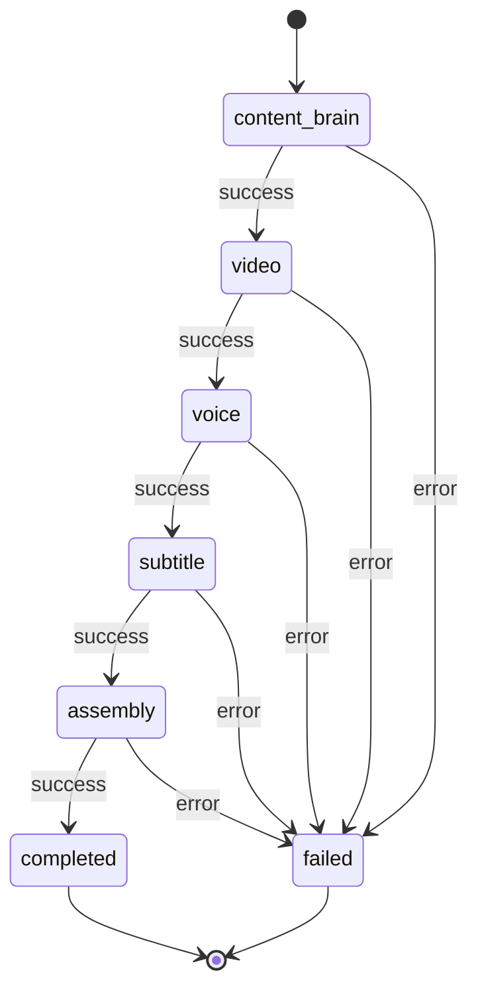

# Phase 12C — UAT Runtime UI Wizard Design

**Status:** Design only — no implementation, no provider execution, no FFmpeg  
**Date:** 2026-06-01  
**Prerequisites:** Phase 12B CLI runner PASS (15/15 validator); 12A design  
**Next phase:** **PHASE 12D — UAT Runtime Backend API Implementation**

Design references:

- [PHASE_12A_USER_ACCEPTANCE_TEST_RUNTIME_DESIGN.md](./PHASE_12A_USER_ACCEPTANCE_TEST_RUNTIME_DESIGN.md)
- [PHASE_12B_UAT_RUNTIME_IMPLEMENTATION_REPORT.md](./PHASE_12B_UAT_RUNTIME_IMPLEMENTATION_REPORT.md)
- CLI runner: `project_brain/run_12b_uat_supervised_pipeline.py`
- Caps/config: `content_brain/execution/uat_runtime_profile.py`

---

## Explicit Approval Boundary

> **This design does NOT authorize implementation, real provider runs, FFmpeg execution, batch mode, or auto-publish.**

Phase 12C specifies how the operator runs **one supervised UAT** from Execution Center. All real execution remains gated by existing approval policies and scoped env flags — the UI exposes checkboxes; it does not bypass gates.

---

## Problem Statement

Phase 12B proves the pipeline works via CLI. Operators should not need PowerShell to run acceptance tests. Execution Center already hosts session observability, voice/assembly approval panels, and runtime polling — but there is no guided **one topic → one video → human review** flow.

Phase 12C adds a **UAT Runtime** surface: a wizard-style panel that mirrors the 12B CLI contract without duplicating pipeline logic.

---

## Recommendation: Entry Point

| Option | Description | Verdict |
|--------|-------------|---------|
| **A** | Execution Center → **UAT Runtime** tab | **Recommended** |
| B | Execution Center → “New UAT” button → wizard modal | Secondary; easy to miss |

**Use Option A.** UAT is a distinct operator mode (test, not production). A dedicated tab keeps it visible, avoids modal stacking over session drawer, and allows Run & Monitor to occupy full main width.

### Navigation change (future 12E UI slice)

```
Control Center sidebar
  Execution Center          ← existing route
  (future tabs inside page)
    Sessions                ← current session table + drawer (default)
    UAT Runtime             ← new wizard (12C)
```

Implementation note: `ExecutionCenterPage.tsx` gains a top-level tab bar (`sessions` | `uat`). No new sidebar route required for v1.

---

## UI Layout

### Page structure

```
┌─────────────────────────────────────────────────────────────────┐
│ Execution Center                                                │
│ [ Sessions ]  [ UAT Runtime ]                    ← tab switcher  │
├─────────────────────────────────────────────────────────────────┤
│ UAT Runtime — User Acceptance Test                              │
│ One topic → one FINAL_PUBLISH_READY.mp4 → human review            │
│ ⚠ Test mode only. Not batch. Not auto-publish.                  │
├─────────────────────────────────────────────────────────────────┤
│ Step indicator:  ① Topic  ② Providers  ③ Safety  ④ Run  ⑤ Review │
├─────────────────────────────────────────────────────────────────┤
│                                                                 │
│   [ Active wizard step content ]                                │
│                                                                 │
├─────────────────────────────────────────────────────────────────┤
│ [ Back ]                              [ Next ]  or  [ Run UAT ] │
└─────────────────────────────────────────────────────────────────┘
```

### Visual language

- Reuse Execution Center tokens: `execution-layout`, `metric-card`, `filters-bar`, `status` badges, `mono` for session IDs.
- Mirror approval UX from `VoiceApprovalControlsPanel` / `AssemblyApprovalControlsPanel`: explicit banners, blocked-reason lists, no silent real execution.
- Stage progress: horizontal stepper (Content Brain → Video → Voice → Subtitle → Assembly → Final MP4) matching 12B `stages` keys.
- Safety copy banner (persistent on steps 3–4):

  > **UAT mode:** single run, human review required. Real providers spend credits. Nothing is published automatically.

### Component map (future files — not created in 12C)

| Component | Responsibility |
|-----------|----------------|
| `UatRuntimePage.tsx` | Tab shell, step routing, global “one active run” lock |
| `UatWizardStepTopic.tsx` | Step 1 fields + validation |
| `UatWizardStepProviders.tsx` | Step 2 dropdowns |
| `UatWizardStepSafety.tsx` | Step 3 checkboxes + eligibility hints |
| `UatWizardStepRunMonitor.tsx` | Step 4 progress, log, paths, video preview |
| `UatWizardStepReview.tsx` | Step 5 scores + comments + submit |
| `uatRuntimeClient.ts` | API wrappers + response typing |
| `uatRuntimeLabels.ts` | Stage labels, error copy, safety strings |

---

## Wizard Steps

### Step 1 — Topic

| Field | Control | Validation |
|-------|---------|------------|
| Topic | Multiline text (required) | Non-empty, max 500 chars |
| Platform | Dropdown | `youtube_shorts` \| `tiktok` \| `instagram_reels` |
| Duration (seconds) | Number input | Min 15, max 90, default 45 |

**UX notes:**

- Topic placeholder: *"Cat in the streets of Los Angeles"*
- Duration shows helper: *"Short-form UAT band: 15–90 seconds"*
- **Next** disabled until topic valid.

**Maps to:** `UatRuntimeConfig.topic`, `.platform`, `.duration_seconds` (`uat_runtime_profile.clamp_duration`).

---

### Step 2 — Providers

| Field | Options | Default | Notes |
|-------|---------|---------|-------|
| Video provider | `runway_browser`, `hailuo_browser`, `mock` | `runway_browser` | `mock` → FFmpeg lavfi clips (12B mock video path) |
| Voice provider | `elevenlabs`, `mock` | `elevenlabs` | `mock` → mock TTS provider |
| Assembly mode | `real_assembly`, `dry_run_only` | `dry_run_only` | See mapping below |

**Assembly mode mapping (UI → 12B engine):**

| UI value | Engine behavior |
|----------|-----------------|
| `real_assembly` | `confirm_real_assembly=true` — dry-run → approve → real FFmpeg |
| `dry_run_only` | `confirm_real_assembly=false` — assembly dry-run + mock/stub final MP4 for UAT path testing |

**Video `mock` mapping:**

- Skip `ProviderRuntimeEngine.dispatch_by_id` real path.
- Always use `_apply_mock_video_artifacts` (same as 12B `mock_paid_providers` video branch).

**Optional (hidden v1):** Niche profile — default `general` from 12B; expose later if needed.

---

### Step 3 — Safety confirmations

Three checkboxes (all required to proceed to Run when corresponding real paths selected):

| Checkbox | Required when | Effect |
|----------|---------------|--------|
| I approve real voice generation for this one UAT run. | `voice_provider=elevenlabs` | Sets `confirm_real_voice=true` |
| I approve real assembly for this one UAT run. | `assembly_mode=real_assembly` | Sets `confirm_real_assembly=true` |
| I understand this is one run only and not batch mode. | **Always** | Acknowledgment only; blocks Run if unchecked |

**Rules (fail-closed UI):**

- If voice = `elevenlabs` and voice checkbox unchecked → Run disabled; show inline hint linking to 11H approval semantics.
- If assembly = `real_assembly` and assembly checkbox unchecked → Run disabled.
- If voice = `mock` → voice approval checkbox hidden/disabled (not applicable).
- If assembly = `dry_run_only` → assembly approval checkbox hidden/disabled.
- Third checkbox always required.

**Do not duplicate** per-session `VoiceApprovalControlsPanel` / `AssemblyApprovalControlsPanel` in the wizard — the engine calls `VoiceApprovalOperationsEngine.approve` and `AssemblyApprovalOperationsEngine.approve` internally (12B pattern). Step 3 is the **operator intent** gate before starting the run.

---

### Step 4 — Run & Monitor

Triggered by **Run UAT** (replaces Next on step 3).

**On Run:**

1. `POST /uat/run` with wizard payload.
2. Receive `session_id` immediately (async job).
3. Navigate to monitor view; poll `GET /uat/status/{session_id}` every 2–3 s until terminal state.
4. Disable wizard Back/Edit while `status=running` (offer **Cancel** only if 12D implements cooperative cancel — optional v1.1).

**Display:**

| Element | Source |
|---------|--------|
| Current stage | `current_stage` |
| Overall status | `running` \| `completed` \| `failed` |
| Session ID | `session_id` (copy button) |
| Progress log | Append-only `progress_log[]` |
| Artifact folder | `artifact_folder` |
| Final video path | `final_video_path` when assembly completes |
| Warnings / errors | `warnings[]`, `errors[]` |
| Stage stepper | Six stages with per-stage badge |

**Stage list (fixed order):**

1. Content Brain  
2. Video  
3. Voice  
4. Subtitle  
5. Assembly  
6. Final MP4  

**Terminal success:** Enable **Continue to Review** → Step 5.  
**Terminal failure:** Show error summary; preserve log; offer **Start new UAT** (new session only — no retry-in-place).

**Optional actions (12E+):**

- Open artifact folder (`open_folder: true` in request — desktop only, backend guarded).
- Open session in Sessions tab drawer (deep link `?session={id}`).

---

### Step 5 — Review

Shown only when `status=completed` and `final_video_path` present.

**Video preview:** HTML5 `<video>` pointing at static file route or signed local path (12D must define safe read-only artifact URL — e.g. `GET /uat/artifacts/{session_id}/final-video` streaming from assembly dir).

**Scores (0–10, integer sliders or inputs):**

| Label | Request field |
|-------|---------------|
| Story Quality | `story_quality_score` |
| Visual Quality | `visual_quality_score` |
| Voice Quality | `voice_quality_score` |
| Subtitle Quality | `subtitle_quality_score` |
| Continuity | `continuity_score` |
| Overall Quality | `overall_quality_score` |

**Other fields:**

| Field | Type |
|-------|------|
| Comments | Multiline text |
| Publishable | Toggle / checkbox (`publishable: true/false`) |

**Submit:** `POST /uat/review/{session_id}` → saves:

```
project_brain/user_acceptance_reviews/{session_id}_review.json
```

Pre-fill from `{session_id}_review_template.json` if present (12B writes template at run end).

**After submit:** Success toast + read-only summary; no publish action.

---

## Backend API Design

All routes mounted on existing FastAPI app (`ui/api/main.py`). New router prefix: `/uat`.

### `POST /uat/run`

Starts one UAT job asynchronously. Returns immediately.

**Request:**

```json
{
  "topic": "Cat in the streets of Los Angeles",
  "platform": "youtube_shorts",
  "duration_seconds": 45,
  "video_provider": "runway_browser",
  "voice_provider": "elevenlabs",
  "confirm_real_voice": true,
  "confirm_real_assembly": true,
  "open_folder": false
}
```

**Request schema notes:**

| Field | Type | Default | Validation |
|-------|------|---------|------------|
| `topic` | string | required | non-empty |
| `platform` | enum | `youtube_shorts` | 12A platforms |
| `duration_seconds` | int | 45 | clamp 15–90 |
| `video_provider` | enum | `runway_browser` | includes `mock` |
| `voice_provider` | enum | `elevenlabs` | `elevenlabs` \| `mock` |
| `confirm_real_voice` | bool | false | must be true if voice=elevenlabs and real voice intended |
| `confirm_real_assembly` | bool | false | must be true if real assembly intended |
| `open_folder` | bool | false | desktop-only side effect |

**Response (202 Accepted):**

```json
{
  "session_id": "exec_uat_20260601_180000",
  "status": "running",
  "current_stage": "content_brain",
  "artifact_folder": null,
  "final_video_path": null,
  "report_path": null,
  "review_template_path": null,
  "warnings": [],
  "errors": [],
  "api_version": "12d_v1"
}
```

**Error responses:**

| Code | Condition |
|------|-----------|
| 409 | Another UAT run already active (`UAT_RUN_ALREADY_ACTIVE`) |
| 400 | Invalid payload / failed caps precheck |
| 503 | UAT engine disabled (future feature flag) |

---

### `GET /uat/status/{session_id}`

Poll run progress.

**Response:**

```json
{
  "session_id": "exec_uat_20260601_180000",
  "status": "running",
  "current_stage": "voice",
  "stages": {
    "content_brain": { "success": true, "message": "..." },
    "video": { "success": true, "video_provider_mode": "mock" },
    "voice": { "success": null, "voice_provider_mode": null },
    "subtitle": null,
    "assembly": null
  },
  "progress_log": [
    { "timestamp": "2026-06-01 18:00:01", "stage": "content_brain", "message": "Brief generated." },
    { "timestamp": "2026-06-01 18:00:45", "stage": "video", "message": "Mock video clips generated." }
  ],
  "final_video_path": null,
  "artifact_folder": "storage/content_brain/execution/artifacts/exec_uat_.../",
  "report_path": null,
  "review_template_path": null,
  "warnings": [],
  "errors": [],
  "flags_active": {
    "MODIR_VOICE_LIVE_TTS_ENABLED": false,
    "MODIR_ASSEMBLY_REAL_EXECUTION_ENABLED": false
  }
}
```

**Terminal states:** `status` = `completed` \| `failed` \| `cancelled`.

**404:** Unknown session or non-UAT session ID.

---

### `POST /uat/review/{session_id}`

Persist human review.

**Request:**

```json
{
  "story_quality_score": 7,
  "visual_quality_score": 6,
  "voice_quality_score": 8,
  "subtitle_quality_score": 7,
  "continuity_score": 5,
  "overall_quality_score": 6,
  "comments": "Hook strong; clip 3 felt disconnected.",
  "publishable": false
}
```

**Validation:** Each score 0–10 inclusive; `comments` optional string; `publishable` required bool.

**Response (201):**

```json
{
  "success": true,
  "session_id": "exec_uat_20260601_180000",
  "review_path": "project_brain/user_acceptance_reviews/exec_uat_20260601_180000_review.json",
  "submitted_at": "2026-06-01 18:45:00"
}
```

**409:** Review already submitted (immutable v1 — no overwrite without explicit reset endpoint).

---

### Optional endpoints (12E backlog)

| Method | Path | Purpose |
|--------|------|---------|
| GET | `/uat/active` | Returns active run id or null (for tab restore on refresh) |
| GET | `/uat/review/{session_id}` | Load existing review |
| GET | `/uat/artifacts/{session_id}/final-video` | Stream MP4 for preview |
| POST | `/uat/cancel/{session_id}` | Cooperative cancel (maps to operations cancel) |

Not required for 12D MVP if polling + session store suffice.

---

## Backend Service Design

### Refactor: shared engine (12D prerequisite)

Extract core pipeline from `run_12b_uat_supervised_pipeline.py` into:

```
content_brain/execution/uat_runtime_engine.py
```

**`UATRuntimeEngine` responsibilities:**

| Method | Purpose |
|--------|---------|
| `start(config) -> UatRunHandle` | Validate caps, enforce one-active-run, spawn worker |
| `get_status(session_id) -> UatRunStatus` | Read persisted progress |
| `run_sync(config, ...)` | Blocking path for CLI/tests |
| `_execute_pipeline(...)` | Stage orchestration (moved from 12B) |

**Callers after refactor:**

| Caller | Uses |
|--------|------|
| `project_brain/run_12b_uat_supervised_pipeline.py` | `UATRuntimeEngine.run_sync()` |
| `ui/api/uat_runtime_service.py` | `UATRuntimeEngine.start()` + status reads |

**Do not duplicate** video/voice/subtitle/assembly logic — keep stage functions or move intact into engine module.

---

### `ui/api/uat_runtime_service.py` (12D)

Thin FastAPI service layer:

```python
class UatRuntimeService:
    def start_run(self, request: UatRunRequest) -> UatRunResponse: ...
    def get_status(self, session_id: str) -> UatStatusResponse: ...
    def submit_review(self, session_id: str, request: UatReviewRequest) -> UatReviewResponse: ...
```

**Responsibilities:**

- Map API DTOs ↔ `UatRuntimeConfig`
- Enforce one active UAT run (file lock or in-memory + session scan for `operations.uat_run.status=running`)
- Delegate execution to `UATRuntimeEngine`
- Persist progress to session `execution_runtime.operations.uat_run` (extend 12B block)
- Return paths relative to project root
- Never set global env flags outside engine worker thread

**Schemas:** `ui/api/schemas/uat_runtime.py` (Pydantic models mirroring API above).

---

## State / Progress Model

### Global concurrency

```
┌──────────────────────────────────────┐
│ UAT active run registry (process)    │
│ max_active = 1                       │
│ active_session_id: str | null        │
└──────────────────────────────────────┘
         │
         ▼
POST /uat/run ──409 if active_session_id set
         │
         ▼
Background worker thread / asyncio task
         │
         ▼
UATRuntimeEngine._execute_pipeline
```

On completion/failure: clear `active_session_id`; set `operations.uat_run.status`.

### Session metadata (`execution_runtime.operations.uat_run`)

Extend 12B block:

```json
{
  "uat_run": {
    "mode": "user_acceptance_test",
    "status": "running",
    "current_stage": "voice",
    "started_at": "2026-06-01 18:00:00",
    "completed_at": null,
    "triggered_by": "operator_uat_ui",
    "config": {
      "topic": "...",
      "platform": "youtube_shorts",
      "duration_seconds": 45,
      "video_provider": "runway_browser",
      "voice_provider": "elevenlabs",
      "confirm_real_voice": true,
      "confirm_real_assembly": false
    },
    "stages": { },
    "progress_log": [
      { "timestamp": "...", "stage": "content_brain", "level": "info", "message": "..." }
    ],
    "final_video_path": null,
    "artifact_folder": null,
    "report_path": null,
    "review_template_path": null,
    "review_submitted": false,
    "warnings": [],
    "errors": []
  }
}
```

### Stage state machine



Each stage write updates `current_stage`, appends `progress_log`, and saves session JSON (same persistence model as existing execution sessions).

### UI polling contract

| Poll interval | 2 s while `running` |
| Stop polling | `completed` \| `failed` \| `cancelled` |
| Max poll duration | 30 min (UAT assembly timeout + buffer); then show stale warning |

Reuse pattern from `useRuntimeStatusPoll` hook where applicable.

---

## Review Workflow

```
Run completes (FINAL_PUBLISH_READY.mp4 exists)
  → 12B engine writes review_template.json
  → UI Step 5 loads template + shows video preview
  → Operator scores 0–10 + comments + publishable
  → POST /uat/review/{session_id}
  → Writes review.json (12A schema, field names aligned)
  → UAT run marked review_submitted=true
  → No publish/upload side effects
```

### Review file schema (aligned 12A + UI fields)

```json
{
  "review_version": "12c_v1",
  "session_id": "exec_uat_20260601_180000",
  "submitted_at": "2026-06-01T18:45:00Z",
  "submitted_by": "operator_ui",
  "scores": {
    "story_quality": 7,
    "visual_quality": 6,
    "voice_quality": 8,
    "subtitle_quality": 7,
    "continuity": 5,
    "overall_quality": 6
  },
  "comments": "Hook strong; clip 3 felt disconnected.",
  "publishable": false,
  "artifact_paths": {
    "final_video": "...",
    "artifact_folder": "..."
  },
  "runtime_report_path": "project_brain/uat_runs/..."
}
```

API request uses `*_score` suffix; service maps to `scores.*` on disk.

---

## Safety Rules

| Rule | Enforcement |
|------|-------------|
| One active UAT run | Service registry + 409 on second `POST /uat/run` |
| No batch | No topic list UI; no queue enqueue; validator grep |
| No auto-publish | No upload buttons; no YouTube/TikTok client imports |
| Real voice requires checkbox | UI disables run; API rejects if elevenlabs + `confirm_real_voice=false` |
| Real assembly requires checkbox | UI + API same pattern |
| Scoped env flags | Engine `try/finally` only (12B pattern) |
| No global enablement | Never set persistent `.env` or config flags |
| No provider bypass | Engine calls existing services (`VoiceRunService`, `AssemblyRunService`, etc.) |
| No `full_video_pipeline.py` | AST guard in validator (12B test 13) |
| No Runway/Hailuo internal changes | Compose dispatch only |
| Artifacts preserved on failure | No auto-delete |
| Retry = new session | UI copy + no in-place retry button v1 |

---

## UI Validation Plan

Future: `project_brain/validate_12c_uat_runtime_ui_wizard.py` (or 12E after UI lands).

| # | Test | Method |
|---|------|--------|
| 1 | UAT Runtime tab exists | Static: `UatRuntimePage` or tab label in `ExecutionCenterPage` |
| 2 | Topic input exists | Source grep + optional RTL |
| 3 | Platform dropdown exists | Options include three platforms |
| 4 | Duration enforces 15–90 | Unit test on client validator |
| 5 | Provider dropdowns exist | Video + voice options |
| 6 | Real voice checkbox required for elevenlabs | Eligibility util test |
| 7 | Real assembly checkbox required for real_assembly | Eligibility util test |
| 8 | No batch controls | Source scan: no multi-topic, no batch_mode |
| 9 | No auto-publish controls | Source scan: no upload/publish |
| 10 | Run calls `POST /uat/run` | Client mock test |
| 11 | Status polling calls `GET /uat/status/{id}` | Hook test |
| 12 | Review saves via `POST /uat/review/{id}` | Client mock test |
| 13 | `npm run build` passes | CI script |

Regression: 12B validator, 11J-19, 11H-2d remain required on backend slices.

---

## Implementation Slices

| Phase | Scope | Deliverables |
|-------|-------|--------------|
| **12D-a** | Engine refactor | `uat_runtime_engine.py`; CLI runner thin wrapper; 12B validator still PASS |
| **12D-b** | API + service | `uat_runtime_service.py`, schemas, `/uat/run`, `/uat/status`, `/uat/review` |
| **12D-c** | API validator | `validate_12d_uat_runtime_api.py` — mock run, gates, one-active-run |
| **12E-a** | UI tab + steps 1–3 | Wizard shell, forms, client stubs |
| **12E-b** | UI step 4 monitor | Polling, stage stepper, log panel |
| **12E-c** | UI step 5 review | Form + submit + video preview route |
| **12E-d** | UI validator + `npm run build` | 13 UI checks |
| **12F** | Operator manual real UAT via UI | One run, review saved, report in `uat_runs/` |

Recommended order: **12D complete before 12E** so UI integrates real endpoints from day one.

---

## Mapping: UI → 12B CLI

| UI wizard | 12B CLI flag / config |
|-----------|----------------------|
| Topic | `--topic` |
| Platform | `--platform` |
| Duration | `--duration-seconds` |
| Video provider | `--video-provider` (+ `mock` → mock video path) |
| Voice provider | `--voice-provider` |
| Voice approval checkbox | `--confirm-real-voice` |
| Assembly mode `real_assembly` | `--confirm-real-assembly` |
| Assembly mode `dry_run_only` | omit flag; mock assembly executor when testing |
| Open folder | `--open-folder` |

---

## Confirmation Checklist (Design Phase)

| Requirement | Design status |
|-------------|---------------|
| UI entry point (Option A tab) | Yes |
| Five wizard steps specified | Yes |
| Backend API (`/uat/run`, `/status`, `/review`) | Yes |
| Service + engine refactor plan | Yes |
| State/progress model | Yes |
| Review workflow + storage path | Yes |
| Safety rules documented | Yes |
| UI validation plan (13 tests) | Yes |
| Implementation slices through 12E/12F | Yes |
| No implementation in 12C | Yes |
| No provider/FFmpeg execution in 12C | Yes |
| No batch / no auto-publish | Yes |
| No approval gate bypass | Yes |

---

## Next Phase

**PHASE 12D — UAT Runtime Backend API Implementation**

1. Extract `UATRuntimeEngine` from 12B runner.  
2. Implement `UatRuntimeService` + FastAPI routes.  
3. Add `validate_12d_uat_runtime_api.py`.  
4. Confirm 12B + 11J-19 + 11H-2d regressions still PASS.  

UI wizard (12E) starts after 12D endpoints are stable.

---

*Phase 12C design complete. No code, providers, or FFmpeg were executed.*
