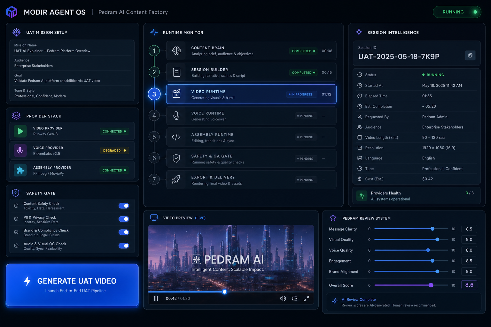

# Phase 12E — Premium UAT Runtime UI Implementation Report

**Status:** PASS — **17/17 core** (`validate_12e_premium_uat_runtime_ui --core-only`)  
**Date:** 2026-06-01  
**Prerequisites:** Phase 12D UAT backend API (18/18 PASS)  
**Owner:** Pedram

---

## Summary

Phase 12E delivers the first user-facing **ModirAgentOS** experience: a premium dark-mode **UAT Runtime** workspace inside Execution Center. Pedram can configure one supervised acceptance test, generate a single video, monitor runtime stages, preview `FINAL_PUBLISH_READY.mp4`, and submit human review scores — without CLI, batch mode, or publish actions.

---

## Visual Reference

Design mockup (layout reference for first-open experience):



**Live capture:** With API running (`python -m ui.api.main`) and UI dev server (`cd ui/web && npm run dev`), open **Execution Center → UAT Runtime** at `http://127.0.0.1:5173`.

---

## UI Structure

```
Execution Center
├── Tab: Sessions          (existing dashboard — unchanged)
└── Tab: UAT Runtime       (new premium workspace)
    ├── Brand header       MODIR AGENT OS · Pedram AI Content Factory · status pill
    ├── Left column
    │   ├── UAT Mission Setup     topic, platform chips, duration
    │   ├── Provider Stack        VIDEO / VOICE / ASSEMBLY cards + status chips
    │   ├── Safety Gate           approval toggles + billable warning
    │   └── Generate UAT Video    hero primary action
    ├── Center column
    │   └── Runtime Monitor       7-stage stepper + progress log
    ├── Right column
    │   └── Session Intelligence  session ID, stack, cost est., paths, warnings
    └── Bottom row
        ├── Video Preview         embedded MP4 player + utility actions
        └── Pedram Review System  0–10 sliders, comments, publishable yes/no
```

### Layout mapping (spec → implementation)

| Spec section | Implementation |
|--------------|----------------|
| §1 UAT Mission Setup | `MissionSetupCard` in `UatRuntimePage.tsx` |
| §2 Provider Stack | `ProviderStackCard` — selectable cards + Ready / Approval Required chips |
| §3 Safety Gate | `SafetyGateCard` — voice/assembly/one-run toggles |
| §4 Generate UAT Video | `uat-generate-btn` hero button (not “Run Pipeline”) |
| §5 Runtime Monitor | `RuntimeMonitor` — 7-stage stepper with active/completed/failed badges |
| §6 Session Intelligence | `SessionIntelligence` sidebar card rows |
| §7 Video Preview | HTML5 `<video>` via `GET /uat/artifacts/{id}/final-video` |
| §8 Human Review | `HumanReviewPanel` → `POST /uat/review/{session_id}` |

---

## Components & Files Created

| File | Role |
|------|------|
| `ui/web/src/pages/UatRuntimePage.tsx` | Main UAT workspace orchestrator |
| `ui/web/src/api/uatRuntimeClient.ts` | API client (`/uat/run`, `/uat/status`, `/uat/review`, video URL) |
| `ui/web/src/utils/uatRuntimeLabels.ts` | Brand copy, stage order, chip/status helpers |
| `ui/web/src/utils/uatRuntimeEligibility.ts` | Generate-button fail-closed rules |
| `ui/web/src/hooks/useUatStatusPoll.ts` | 2.5s status polling until terminal state |
| `ui/web/src/styles/uat-runtime.css` | Premium dark theme tokens + glass cards |
| `project_brain/validate_12e_premium_uat_runtime_ui.py` | Phase 12E validator (17 core tests) |

### Files modified

| File | Change |
|------|--------|
| `ui/web/src/pages/ExecutionCenterPage.tsx` | **Sessions \| UAT Runtime** tab switcher |
| `ui/web/src/App.tsx` | Sidebar branding: MODIR AGENT OS / Pedram AI Content Factory |
| `ui/web/src/App.css` | UAT layout width + tab spacing |
| `ui/api/main.py` | `GET /uat/artifacts/{session_id}/final-video` for embedded preview |

---

## Branding Confirmation

| Element | Value | Location |
|---------|-------|----------|
| Product title | **MODIR AGENT OS** | UAT header + sidebar eyebrow |
| Subtitle | **Pedram AI Content Factory** | UAT header + sidebar |
| Primary CTA | **Generate UAT Video** | Hero button (never “Run Pipeline” / “Submit”) |
| Status pill | READY / RUNNING / COMPLETED / FAILED | Top-right workspace pill with animated dot when running |

---

## Styling Confirmation

| Token | Spec | Implemented |
|-------|------|-------------|
| Background | `#0B0F17` | `--uat-bg: #0b0f17` |
| Panels | `#121826` | `--uat-panel: #121826` + glass overlay |
| Accent | Electric blue | `#3b82f6` gradients + glow |
| Secondary | Purple | `#8b5cf6` in gradients / group labels |
| Success / Warning / Error | Green / Amber / Red | Chip + step badge system |
| Effects | Glassmorphism, soft shadows, rounded corners | `backdrop-filter`, 16px radius, layered shadows |
| Controls | Chips, segmented platform picker, card selectors | Not plain dropdown-heavy forms |

---

## Safety & Forbidden UI

Confirmed absent from UI bundle (validator scan):

- Batch Generate
- Auto Publish
- Publish To YouTube / TikTok
- Upload
- Scheduler
- Production Queue
- Run Pipeline / Execute Runtime

Safety gate copy: *“This run may use real providers and generate billable content…”*

Generate disabled until: topic valid, one-run acknowledged, voice/assembly approvals when required, no concurrent run.

---

## API Integration

| Action | Endpoint |
|--------|----------|
| Start run | `POST /uat/run` |
| Poll status | `GET /uat/status/{session_id}` (2.5s interval) |
| Stream video | `GET /uat/artifacts/{session_id}/final-video` |
| Save review | `POST /uat/review/{session_id}` → `project_brain/user_acceptance_reviews/{session_id}_review.json` |

---

## Build Results

```
> modiragent-control-center@0.1.0 build
> tsc && vite build

✓ 71 modules transformed.
dist/index.html                   0.42 kB
dist/assets/index-C_G-Tioy.css   28.44 kB │ gzip:  5.98 kB
dist/assets/index-ZKa80qCP.js   255.02 kB │ gzip: 72.02 kB
✓ built in 574ms
```

**npm build:** PASS (also enforced inside `validate_12e`).

---

## Validation

### Primary sign-off — 12E

```
python -m project_brain.validate_12e_premium_uat_runtime_ui --core-only
```

**17/17 PASS — ACCEPTED**

Core checks include: tab wiring, MODIR branding, hero label, forbidden publish/batch labels absent, provider cards, safety warning, stepper, review panel, dark theme tokens, video endpoint, status pill, **npm build**.

### Recommended individual regressions (not nested)

```
python -m project_brain.validate_12d_uat_runtime_backend_api --core-only
python -m project_brain.validate_12b_uat_supervised_pipeline --core-only
```

---

## Operator Quick Start

1. Start API: `python -m ui.api.main`
2. Start UI: `cd ui/web && npm run dev`
3. Open Execution Center → **UAT Runtime**
4. Configure topic + providers (mock recommended for first run)
5. Acknowledge safety gate → **Generate UAT Video**
6. Watch Runtime Monitor → preview video → **Save Review**

---

## Next Steps (future phases)

- Desktop “Open Folder” / “Open Report” wiring (currently disabled placeholders — server-side path only)
- Optional `GET /uat/active` for tab restore on refresh
- Cooperative cancel (`POST /uat/cancel/{session_id}`)
- Production publish flows (explicitly out of scope for 12E)

---

**Goal achieved:** UAT Runtime reads as Pedram’s professional AI operating system — not a developer CRUD panel.
