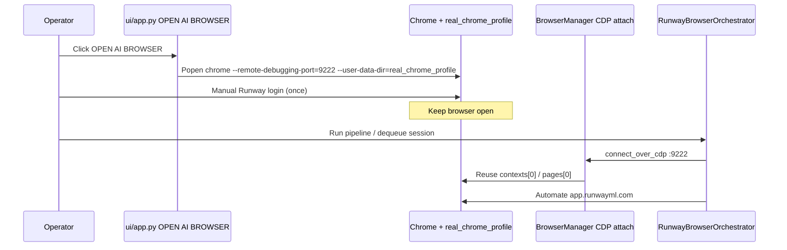

# Phase 12H — Runway Browser Login / Profile Audit (Audit Only)

**Date:** 2026-06-01  
**Status:** Audit complete — no implementation in this phase  
**Symptom:** Edge opens, not logged into Runway, automation hangs; UAT shows blue/placeholder video

---

## Executive Summary

The **original controlled-browser workflow still exists** in the legacy Tk control center (`ui/app.py`). The **new React Execution Center + UAT API path never launches that browser** and does not expose an equivalent button. Runtime automation only **attaches via CDP** to whatever is already listening on port **9222** — it does not open Chrome with the persistent profile itself.

Observed Edge + logged-out behavior is consistent with: (1) operator or OS starting **Edge** (or any Chromium browser) on `:9222` without the **`storage/real_chrome_profile`** user-data dir, and/or (2) Playwright attaching then creating a **new empty browser context** when no contexts exist. UAT blue video is **also** explained by dispatch rejection **`NOT_DEQUEUED`** → intentional **mock FFmpeg fallback**, independent of browser login.

---

## 1. Where the old launcher lives

| Component | Path | Role |
|-----------|------|------|
| **Operator launcher (button)** | `ui/app.py` → `ModirAgentControlCenter.open_ai_browser()` | Dashboard tab button **"OPEN AI BROWSER"** |
| **CDP attach (runtime)** | `automation/browser_manager.py` → `BrowserManager.launch()` | `playwright.chromium.connect_over_cdp("http://127.0.0.1:9222")` — **does not start a browser** |
| **Runway automation** | `providers/runway_browser_provider.py` → `RunwayBrowserOrchestrator` | Uses `BrowserManager` after CDP attach |
| **Catalog metadata** | `content_brain/execution/provider_mode_catalog.py` | `browser_config`: `cdp_url`, `profile_path`, `download_dir` |
| **Preflight probes** | `content_brain/execution/browser_connectivity_probe.py` | Socket + optional Playwright attach; **profile existence check only** |
| **Legacy backup** | `ui/app_backup_before_refactor.py` | Same `open_ai_browser()` pattern |

**Documented intentional gap:** `project_brain/PHASE_10J_PROVIDER_OPERATIONS_DESIGN.md` — *"No Chrome launcher in ui/web"* (prerequisite documented, not implemented in React).

**Not a launcher:** `ui/web` (Execution Center, UAT Runtime) — **no** open-browser API, button, or CDP launcher found.

---

## 2. Browser profile path (canonical)

| Setting | Value |
|---------|--------|
| **Persistent profile (intended)** | `{project_root}/storage/real_chrome_profile` |
| **CDP URL (catalog + hardcoded)** | `http://127.0.0.1:9222` |
| **Runway downloads** | `downloads/runway/` (catalog) |
| **Launcher command (Tk only)** | `chrome.exe --remote-debugging-port=9222 --user-data-dir=...\storage\real_chrome_profile` |

Tk launcher hardcodes Chrome path:

```text
C:\Program Files\Google\Chrome\Application\chrome.exe
```

**Orphan directory (not wired in code):** `storage/browser_session/` exists on disk (old profile data) but **no Python module** references it for launch or CDP today. Catalog and launcher use **`real_chrome_profile` only**.

---

## 3. Intended flow (as designed)



---

## 4. Why current UAT / Execution Center misbehaves

### 4.1 No launcher in the path you use now

- UAT runs via `ui/api` + `ui/web` (`UatRuntimePage`), not Tk Dashboard.
- `_run_video_stage()` calls `ProviderRuntimeEngine.dispatch_by_id()` directly — **never** calls `open_ai_browser()`.
- Operator must still manually start a debug browser; there is **no in-app reminder or button** in React.

### 4.2 Edge / default browser (not launched by repo code)

Repository search: **no** `msedge`, `edge.exe`, or `chromium.launch()` in application Python.

`BrowserManager` only calls **`connect_over_cdp`**. Whatever process owns port **9222** wins — on Windows that is often:

- **Microsoft Edge** if the operator started Edge with remote debugging, or
- A **default Chromium** shortcut, or
- Chrome started **without** `--user-data-dir=storage/real_chrome_profile`

Playwright labels the connection `chromium` but attaches to **Edge or Chrome** interchangeably when CDP is enabled.

### 4.3 Logged-out session / “hang”

In `automation/browser_manager.py`:

```python
if not self.browser.contexts:
    self.context = self.browser.new_context(accept_downloads=True)
else:
    self.context = self.browser.contexts[0]
```

If CDP attaches to a browser with **no existing contexts**, Playwright creates a **new empty context** → Runway is **not logged in** → UI selectors stall through long waits (`browser_max_wait_seconds` default **900s** per clip in `runway_browser_support.py`).

That matches “browser opens, not logged in, hangs.”

### 4.4 Blue / placeholder video on UAT (separate from Edge)

Recent UAT session `exec_uat_20260601_222547` shows:

- `failover_advisory.failure_code`: **`NOT_DEQUEUED`**
- `video` stage message: *"Real video dispatch failed (NOT_DEQUEUED); mock fallback used."*
- Clips from **`_apply_mock_video_artifacts()`** (FFmpeg lavfi color bars), not Runway.

`ProviderRuntimeEngine` requires session state **`DEQUEUED`** (`queue_integrity_validator.py`). UAT builds a governed session but **does not enqueue/dequeue** before `dispatch_by_id()`, so real Runway browser dispatch is **skipped** even when CDP is healthy.

---

## 5. Root cause matrix

| Issue | Root cause | Evidence |
|-------|------------|----------|
| Edge instead of controlled Chrome | No enforced launcher; CDP attaches to whatever is on `:9222` | `browser_manager.py`; no Edge strings in repo |
| Not logged in | Wrong profile or `new_context()` on empty CDP browser | `open_ai_browser` uses `real_chrome_profile`; `new_context` branch |
| Hang | Runway UI automation waiting in orchestrator poll/timeouts | `runway_browser_orchestrator.py`, 900s cap |
| UAT placeholder video | `NOT_DEQUEUED` → mock fallback | `uat_runtime_engine._run_video_stage`, session JSON |
| Old button “missing” | Launcher only in Tk `ui/app.py`, not React | `PHASE_10J_PROVIDER_OPERATIONS_DESIGN.md` |

---

## 6. Safe fix plan (before implementation)

**Constraints respected:** no credential storage, no login bypass, reuse persistent profile, keep browser open for operator login.

### Phase A — Restore operator workflow (UI/API, no provider rewrite)

1. **Extract launcher** from `ui/app.py` → shared module e.g. `automation/browser_launcher.py`:
   - Read `browser_config` from `ProviderModeCatalog` (`cdp_url`, `profile_path`).
   - Resolve Chrome executable: env `MODIR_CHROME_PATH` → standard Windows paths → clear error if missing (**do not** fall back to Edge silently).
   - `subprocess.Popen([chrome, "--remote-debugging-port=9222", f"--user-data-dir={abs_profile}", ...])` with flags: `--no-first-run`, `--no-default-browser-check`.
2. **FastAPI endpoint** e.g. `POST /operations/browser/launch` (+ `GET /operations/browser/status` using existing `browser_connectivity_probe`).
3. **Execution Center + UAT Runtime UI**: button **“Open Runway Browser (login)”** with status pill (CDP reachable / profile path / logged-in heuristic = attach OK).
4. **Pre-flight copy** when `video_provider` is `runway_browser`: “Step 1: Open controlled browser and log into Runway. Step 2: Keep browser open. Step 3: Start run.”

### Phase B — Harden CDP attach (minimal `BrowserManager` change)

1. **Never attach to wrong profile silently:** probe `browser_config.profile_path` before run; fail with actionable message if CDP up but profile directory mismatch (optional: check `Local State` path via CDP if feasible).
2. **Prefer existing logged-in context:** use `contexts[0]`; **avoid** `new_context()` unless explicit `force_isolated_context` flag for tests.
3. **Read `cdp_url` from catalog** instead of hardcoding `127.0.0.1:9222` in `BrowserManager` (align with `browser_connectivity_probe`).

### Phase C — UAT / dispatch alignment (video only)

1. **Option 1 (minimal):** Document that UAT video remains mock unless session is dequeued (current behavior).
2. **Option 2 (recommended for real Runway UAT):** UAT-only helper: after session build, run queue + dequeue (or `RuntimePolicy` override for `uat_run` that skips `NOT_DEQUEUED` while still requiring CDP preflight pass) — **scoped to `operations.uat_run`**, not global worker policy.
3. On dispatch failure, **do not silently mock** when `confirm_real_*` and `video_provider=runway_browser`; surface `NOT_DEQUEUED` / `BROWSER_UNAVAILABLE` in UI (partially done for voice).

### Phase D — Validation checklist

1. Click new UI launch → only **Chrome** with `storage/real_chrome_profile` opens.
2. Manual Runway login once; close tab but keep browser open.
3. `GET /operations/browser/status` → CDP + attach OK.
4. Dequeued Execution Center session → real `downloads/runway/*.mp4` artifacts.
5. UAT with real video path → no mock fallback when preconditions met.
6. Confirm Hailuo browser still shares same CDP port/profile policy (catalog already shares `9222` + `real_chrome_profile`).

### Explicitly out of scope for fix

- Storing Runway credentials or automating login form.
- Replacing CDP with Playwright `chromium.launch()` (would abandon persistent operator profile).
- Changing Runway DOM automation selectors (11E-c) in the same pass.

---

## 7. Files reference (implementation touch list)

| Priority | File |
|----------|------|
| P0 | `automation/browser_launcher.py` (new, extract from `ui/app.py`) |
| P0 | `ui/api/main.py` + small service for launch/status |
| P0 | `ui/web` Execution Center + UAT observability button |
| P1 | `automation/browser_manager.py` (catalog CDP URL, context policy) |
| P1 | `content_brain/execution/uat_runtime_engine.py` (dequeue or fail-loud for real video) |
| P2 | `ui/app.py` (delegate to shared launcher) |

---

## 8. Operator workaround (until fix ships)

1. Close all browsers using port 9222.
2. Start **Chrome** (not Edge) from Tk app **OPEN AI BROWSER**, or manually:

   ```powershell
   & "C:\Program Files\Google\Chrome\Application\chrome.exe" `
     --remote-debugging-port=9222 `
     --user-data-dir="C:\Users\kaman\Desktop\ModirAgentOS\storage\real_chrome_profile"
   ```

3. Log into Runway in that window; leave it open.
4. For Execution Center real dispatch: ensure session is **DEQUEUED** before Run Video.
5. For UAT today: expect **mock video** until UAT dispatch policy is fixed.
