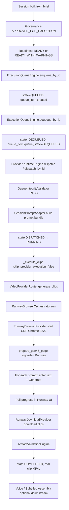

# PHASE 12I-B — Runway Dispatch / Dequeue Audit

**Date:** 2026-05-31  
**Scope:** Audit only — no implementation, no fixes  
**Reference session:** `exec_uat_20260602_052513`  
**Session file:** `storage/content_brain/execution/sessions/exec_uat_20260602_052513.json`

---

## Executive Summary

The latest successful UAT run completed voice, subtitle, and assembly and produced `FINAL_PUBLISH_READY.mp4`, but **never reached Runway browser automation**. Video dispatch was rejected at the provider-runtime integrity gate with `NOT_DEQUEUED` because the session was **`NOT_READY`** and had **no queue item** — UAT never calls `ExecutionQueueEngine.enqueue_by_id` or `dequeue_by_id`. UAT treats dispatch failure as a **non-fatal video stage success** and falls back to FFmpeg lavfi placeholder clips (`uat_mock: true`).

Chrome launcher, CDP connectivity, and Runway login (Phase 12I-A) are **downstream** of this gate and were never invoked for this session.

---

## Audit Questions (1–8)

### 1. Was video runtime actually dequeued?

**No.**

Evidence:

| Field | Value |
|-------|-------|
| `session.state` (final) | `FAILED` |
| `queue_item` | **Absent** — no `queue_item` key anywhere in session JSON |
| `state_history` | `PLANNED` → `SIMULATED` → `REJECTED` → `NOT_READY` → `FAILED` — never `QUEUED` or `DEQUEUED` |
| `operations.uat_run.stages.video.dispatch_reject_code` | `NOT_DEQUEUED` |

UAT video stage calls `ProviderRuntimeEngine.dispatch_by_id()` directly. It does **not** enqueue or dequeue.

---

### 2. What queue state was assigned?

**None.** No queue item was created.

If a normal (non-UAT) execution path had succeeded through the queue:

| Stage | Expected `session.state` | Expected `queue_item.queue_state` |
|-------|--------------------------|-----------------------------------|
| After enqueue | `QUEUED` | `QUEUED` |
| After dequeue | `DEQUEUED` | `DEQUEUED` |
| After dispatch start | `DISPATCHED` / `RUNNING` | `DEQUEUED` (unchanged until terminal) |

This session stopped at **`NOT_READY`** before any queue participation.

---

### 3. Why did dispatch not execute?

`ProviderRuntimeEngine.dispatch_by_id()` → `dispatch()` → `validate_dispatch_eligibility()` → `QueueIntegrityValidator.validate()` failed on the **first check**:

```
Session state is NOT_READY, expected DEQUEUED.
```

Source: `content_brain/execution/queue_integrity_validator.py` lines 44–47.

Flow:

1. `_run_video_stage()` loads session with `state: NOT_READY`.
2. `dispatch_by_id(session_id, policy=RuntimePolicy(skip_provider_execution=False))`.
3. Integrity check fails → `_mark_failed(..., "NOT_DEQUEUED", ...)` → session persisted as `FAILED`.
4. `DispatchResult.success == False` returned to UAT.
5. **No** `SessionPromptAdapter` bundle write for real execution, **no** `_execute_clips()`, **no** `VideoProviderRouter`, **no** `RunwayBrowserOrchestrator`.

Provider audit log entry (same timestamp as video stage):

```json
{
  "event_type": "DISPATCH_REJECTED",
  "reject_code": "NOT_DEQUEUED",
  "reject_reasons": ["Session state is NOT_READY, expected DEQUEUED."]
}
```

---

### 4. Why was placeholder fallback selected?

UAT video stage **by design** treats real dispatch failure as success with mock artifacts.

Source: `content_brain/execution/uat_runtime_engine.py` — `_run_video_stage()`:

```python
dispatch = engine.dispatch_by_id(session_id, actor=UAT_TRIGGER, policy=policy)
if dispatch.success:
    return {"success": True, "video_provider_mode": "real", ...}

info = _apply_mock_video_artifacts(...)
return {
    "success": True,
    "video_provider_mode": "mock",
    "message": f"Real video dispatch failed ({dispatch.reject_code}); mock fallback used.",
    ...
}
```

Recorded in session:

```json
"video": {
  "success": true,
  "video_provider_mode": "mock",
  "message": "Real video dispatch failed (NOT_DEQUEUED); mock fallback used.",
  "dispatch_reject_code": "NOT_DEQUEUED"
}
```

Because `video.success == True`, UAT continues to voice → subtitle → assembly. Root `session.state` remains `FAILED` from provider runtime, but `operations.uat_run.status` is set to **`completed`**.

---

### 5. Which condition triggers `NOT_DEQUEUED`?

`QueueIntegrityValidator.validate()` returns `reject_code: "NOT_DEQUEUED"` when **either**:

| # | Condition | Code location |
|---|-----------|---------------|
| A | `session.state != "DEQUEUED"` | `queue_integrity_validator.py:44–47` |
| B | `queue_item.queue_state != "DEQUEUED"` | `queue_integrity_validator.py:49–54` |

This session hit **condition A** (`NOT_READY`).

Related reject codes **not** hit on this run (would also block dispatch):

| Code | Trigger |
|------|---------|
| `READINESS_DRIFT` | `execution_readiness.decision` not in `{READY, READY_WITH_WARNINGS}` |
| `STALE_QUEUE_FINGERPRINT` | Fingerprint mismatch after enqueue |
| `INTEGRITY_FAILED` | Other integrity failures |

---

### 6. Which code path creates the placeholder MP4?

**Function:** `_apply_mock_video_artifacts()` in `uat_runtime_engine.py`

**Generator:** `_ffmpeg_generate_clip()` — FFmpeg lavfi solid-color bars:

```
ffmpeg -f lavfi -i color=c=0x224488:s=640x360:d=4 -c:v libx264 ...
```

**Output paths (this session):**

- `storage/content_brain/execution/artifacts/exec_uat_20260602_052513/video_generation/clip_001.mp4`
- `storage/content_brain/execution/artifacts/exec_uat_20260602_052513/video_generation/clip_002.mp4`

**Metadata:** each artifact has `"metadata": {"uat_mock": true}`

**Side effect:** Updates `execution_runtime.category_runtime.video_generation.state` to `COMPLETED` and writes `video_manifest.json` — assembly then concatenates these placeholder clips with real voice/subtitles into `FINAL_PUBLISH_READY.mp4`.

---

### 7. Which runtime decision prevented Runway generation?

**Primary blocker:** Session never reached `DEQUEUED` state required by provider runtime.

**Upstream causes (why session was `NOT_READY`):**

| Layer | Decision | Detail |
|-------|----------|--------|
| Content Brain | `content_decision: REVISE` | Brief not production-ready |
| Governance | `approval_decision.status: REJECTED` | Blocker: `"Content gate: REVISE"` |
| Readiness | `execution_readiness.decision: NOT_READY` | Score 49.0 |
| Readiness failures | — | `"Approval status is REJECTED, not APPROVED_FOR_EXECUTION."` |
| Readiness failures | — | `"Session state REJECTED is not governed for queue entry."` |
| UAT pipeline | No queue step | Never calls `ExecutionQueueEngine` |
| UAT video stage | Mock fallback on dispatch fail | Masks `NOT_DEQUEUED` as stage success |

**Not the blocker (verified working but unused):**

- Chrome launcher / CDP / Runway login — never reached because dispatch failed pre-provider.

Session `state_history` (all at `2026-06-02 05:25:13`):

```
PLANNED     → populated from content brief
SIMULATED   → pre-execution simulation
REJECTED    → governance: approval=REJECTED, budget=WITHIN_LIMIT
NOT_READY   → readiness gate: NOT_READY (score=49.0)
FAILED      → provider runtime failed: NOT_DEQUEUED
```

---

### 8. What exact condition must be satisfied for real Runway execution?

All of the following must pass **in order**:

#### A. Governance + readiness (before queue)

| Requirement | This session |
|-------------|--------------|
| `approval_decision.status == "APPROVED_FOR_EXECUTION"` | ❌ `REJECTED` |
| `budget_decision.budget_allowed == true` | ✅ |
| `execution_readiness.decision` in `{READY, READY_WITH_WARNINGS}` | ❌ `NOT_READY` |
| `session.state` eligible for enqueue (`READY` or `READY_WITH_WARNINGS`) | ❌ `NOT_READY` |

Reference: `ExecutionQueueEngine` enqueue eligibility (`execution_queue_engine.py` ~lines 152–172).

#### B. Queue lifecycle (UAT currently skips this entirely)

| Step | API | Result |
|------|-----|--------|
| Enqueue | `ExecutionQueueEngine.enqueue_by_id()` | `session.state = QUEUED`, `queue_item` created with fingerprint |
| Dequeue | `ExecutionQueueEngine.dequeue_by_id()` | `session.state = DEQUEUED`, `queue_item.queue_state = DEQUEUED` |

Reference demo path: `seed_runtime_demo_sessions._ready_dequeued_session()` — explicitly enqueues then dequeues before dispatch.

#### C. Provider dispatch integrity

| Requirement | Validator |
|-------------|-----------|
| `session.state == "DEQUEUED"` | `QueueIntegrityValidator` |
| `queue_item.queue_state == "DEQUEUED"` | `QueueIntegrityValidator` |
| Readiness still eligible (unless policy waives) | `QueueIntegrityValidator` |
| Queue fingerprint matches session (unless legacy/waived) | `QueueIntegrityValidator` |
| Provider resolves to supported key (`runway_browser`) | `resolve_video_provider()` |
| `RuntimePolicy.skip_provider_execution == False` | UAT sets this correctly |

#### D. Provider execution chain

| Step | Component |
|------|-----------|
| Build prompt bundle | `SessionPromptAdapter.build()` |
| Execute clips | `ProviderRuntimeEngine._execute_clips()` |
| Route provider | `VideoProviderRouter.generate_clips(provider_override="runway_browser")` |
| Browser automation | `RunwayBrowserOrchestrator.run(prompts)` |
| CDP browser | `RunwayBrowserProvider.start()` → `BrowserManager` connect port 9222 |
| Runway UI | `prepare_gen45_page()` → enter prompt → trigger Generate → poll progress → download |

#### E. Runtime environment (after dispatch succeeds)

| Requirement | Notes |
|-------------|-------|
| Chrome running with controlled profile | Phase 12I-A launcher |
| CDP reachable (default port 9222) | `BrowserManager.connect_over_cdp` |
| Runway logged in | Login probe / UAT observation |
| `skip_provider_execution=False` | UAT already satisfies |

---

## Execution Path Diagrams

### Path A — Observed (this UAT session → Placeholder)

```mermaid
flowchart TD
    A[POST /uat/run] --> B[run_uat_pipeline]
    B --> C[ContentBriefOrchestrator.run]
    C --> D[SessionPopulationBuilder.build]
    D --> E[_pipeline_session]
    E --> E1[SimulationReportBuilder]
    E1 --> E2[ApprovalBudgetGovernanceEngine]
    E2 --> E3["approval=REJECTED (REVISE)"]
    E3 --> E4[ExecutionReadinessGate]
    E4 --> E5["state=NOT_READY, score=49"]
    E5 --> F[_attach_uat_metadata + save session]
    F --> G[_run_video_stage]
    G --> H{mock_paid_providers or provider=mock?}
    H -->|No| I[ProviderRuntimeEngine.dispatch_by_id]
    I --> J[QueueIntegrityValidator]
    J --> K["FAIL: state NOT_READY ≠ DEQUEUED"]
    K --> L["_mark_failed → session.state=FAILED"]
    L --> M[DispatchResult success=false NOT_DEQUEUED]
    M --> N[_apply_mock_video_artifacts]
    N --> O["FFmpeg lavfi → clip_001/002.mp4 uat_mock=true"]
    O --> P[_run_voice_stage → real ElevenLabs]
    P --> Q[_run_subtitle_stage]
    Q --> R[_run_assembly_stage]
    R --> S[FINAL_PUBLISH_READY.mp4]
    S --> T["operations.uat_run.status=completed"]
    T --> U[Runway UI: no generation — orchestrator never called]
```



**Text summary:**

```
UAT API
  → run_uat_pipeline()
  → Content Brain (brief + REVISE decision)
  → _pipeline_session()
       → governance: approval REJECTED
       → readiness: NOT_READY (no queue_item created)
  → _run_video_stage()
       → ProviderRuntimeEngine.dispatch_by_id(skip_provider_execution=False)
       → QueueIntegrityValidator: NOT_DEQUEUED
       → _apply_mock_video_artifacts() [FFmpeg color bars]
  → _run_voice_stage() [real voice — independent path]
  → _run_subtitle_stage()
  → _run_assembly_stage() [concat mock video + real audio/subs]
  → FINAL_PUBLISH_READY.mp4
  → uat_run.status = "completed"

RunwayBrowserOrchestrator: NEVER INVOKED
```

---

### Path B — Required for Real Runway Generation



**Text summary:**

```
Content session
  → approval APPROVED_FOR_EXECUTION
  → readiness READY (+ budget allowed)
  → enqueue_by_id()  → QUEUED
  → dequeue_by_id()  → DEQUEUED
  → ProviderRuntimeEngine.dispatch()
       → integrity PASS
       → SessionPromptAdapter → prompt_bundle.json
       → _execute_clips()
       → VideoProviderRouter → runway_browser
       → RunwayBrowserOrchestrator.run()
            → RunwayBrowserProvider (CDP Chrome, logged in)
            → prompt entry + Generate + wait + download
  → real clip_*.mp4 artifacts
  → (optional) voice / subtitle / assembly
```

---

## Gap Analysis: UAT vs Execution Center

| Concern | Execution Center / seed demos | UAT pipeline (12B+) |
|---------|------------------------------|---------------------|
| Enqueue | Yes (`ExecutionQueueEngine`) | **No** |
| Dequeue | Yes | **No** |
| Dispatch entry state | `DEQUEUED` | Whatever readiness left (`NOT_READY` here) |
| Dispatch failure handling | Session `FAILED`, no mock | **Mock fallback, stage `success: true`** |
| Runway browser | Reached only if A–C pass | Never reached on this session |

The Phase 12I-A browser launcher prepares the **environment** for path B step O–P but does **not** wire UAT into the enqueue/dequeue/dispatch chain.

---

## Session Evidence Snapshot

**Session ID:** `exec_uat_20260602_052513`  
**UAT config:** `video_provider: runway_browser`, duration smoke-capped 15→10s  
**UAT outcome:** `operations.uat_run.status: completed`  
**Session root state:** `FAILED` (provider runtime)  
**Video mode:** `mock` (`dispatch_reject_code: NOT_DEQUEUED`)  
**Voice mode:** real (ElevenLabs — separate approval/runtime path)  
**Final artifact:** `.../assembly_generation/FINAL_PUBLISH_READY.mp4` (mock video + real voice)

**Key artifact metadata:**

```json
"metadata": { "uat_mock": true }
```

**Execution runtime failure (video category):**

```json
"failure": {
  "code": "NOT_DEQUEUED",
  "message": "Session state is NOT_READY, expected DEQUEUED."
}
```

---

## Code References

| Responsibility | File | Symbol |
|----------------|------|--------|
| UAT orchestration | `content_brain/execution/uat_runtime_engine.py` | `run_uat_pipeline`, `_run_video_stage` |
| Mock clip generation | `content_brain/execution/uat_runtime_engine.py` | `_apply_mock_video_artifacts`, `_ffmpeg_generate_clip` |
| Dispatch gate | `content_brain/execution/queue_integrity_validator.py` | `QueueIntegrityValidator.validate` |
| Provider dispatch | `content_brain/execution/provider_runtime_engine.py` | `dispatch`, `dispatch_by_id`, `_execute_clips` |
| Queue enqueue/dequeue | `content_brain/execution/execution_queue_engine.py` | `enqueue_by_id`, `dequeue_by_id` |
| Readiness / governance | `content_brain/execution/execution_readiness_gate.py` | `ExecutionReadinessGate.enrich_session` |
| Video routing | `core/video_provider_router.py` | `generate_clips` → `runway_browser` |
| Runway browser | `orchestrators/runway_browser_orchestrator.py` | `RunwayBrowserOrchestrator.run` |
| Reference dequeue flow | `content_brain/execution/seed_runtime_demo_sessions.py` | `_ready_dequeued_session` |

---

## Conclusion

**Root cause:** UAT calls provider dispatch without the mandatory queue dequeue step, on a session that failed governance/readiness (`NOT_READY`). Dispatch is rejected with `NOT_DEQUEUED` before any Runway code runs. UAT silently substitutes FFmpeg placeholder clips and completes the pipeline.

**Browser/login success is necessary but not sufficient** — real Runway generation additionally requires `DEQUEUED` session state, valid `queue_item`, eligible readiness, and successful passage through `ProviderRuntimeEngine` into `RunwayBrowserOrchestrator`.

---

*Audit only. No code changes in Phase 12I-B.*
