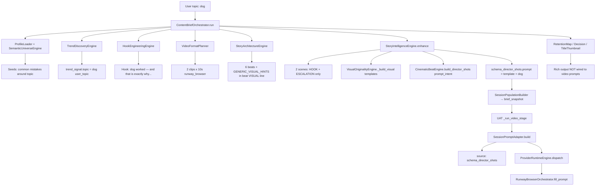

# PHASE 12J-A — Content Brain → Runway Prompt Trace Audit

**Date:** 2026-05-31  
**Scope:** Audit only — no implementation, no fixes  
**Reference session:** `exec_uat_20260602_055459` (latest UAT run with **real Runway dispatch**, browser automation entered, clip 1 timed out waiting for video URL)  
**Artifacts:** `storage/content_brain/execution/sessions/exec_uat_20260602_055459.json`, `storage/content_brain/execution/artifacts/exec_uat_20260602_055459/video_generation/prompt_bundle.json`

---

## Executive Summary

Content Brain **does run** for UAT (all major engines execute). The weak Runway prompts are **not** caused by bypassing Content Brain or by a legacy `VideoPromptEngine` path.

Quality is lost in a **narrow, deterministic chain**:

1. Profile-level **semantic universe** is built for niche `general` with fallback token **`topic`**, not the user’s runtime topic (`dog`).
2. **Story Intelligence** (Phase 9A) replaces beat-level visuals with **niche lexicon templates** (`NICHE_VISUAL_LEXICON["general"]`) and token substitution (`dog` → `dog evidence element`).
3. **Video format plan** (2×10s Runway clips) causes **SceneProgressionEngine** to keep only **HOOK_BEAT + ESCALATION_BEAT**, dropping payoff/context/pattern-break visuals.
4. **SessionPromptAdapter** concatenates those template strings with camera metadata — it does **not** pull hook engineering, retention map VISUAL notes, title/thumbnail concepts, or story_architecture `visual_prompt_hint` into Runway text.

Runway receives exactly what is in `prompt_bundle.json` → `schema_director_shots[].prompt` after adapter composition.

---

## End-to-End Trace Diagram



---

## Required Answers (1–11)

### 1. What was the original user topic?

**`dog`**

Sources:

- `operations.uat_run.topic`: `"dog"`
- `metadata.topic`: `"dog"`
- `brief_snapshot.trend_signal.topic`: `"dog"` (`source`: `"user_topic"`)

---

### 2. What was generated in Content Brief?

Full brief pipeline ran via `ContentBriefOrchestrator.run()` (UAT does not use `full_video_pipeline.py`).

| Output | Summary (this session) |
|--------|-------------------------|
| **Profile** | `default_v1`, niche `general` |
| **Semantic universe** | `universe_general_33d76fbe`, strategy `generic_decomposition`, seeds literally use word **`topic`** (not `dog`) — profile resolved before user topic is applied |
| **Trend signal** | `topic: dog`, `source: user_topic`, virality 74.9 |
| **Hook package** | Selected `hook_4_moral_discomfort_1`: *"dog worked — and that is exactly why it feels wrong in General Short-Form Content."* |
| **Video format plan** | 20s target, **2 clips × 10s**, `runway_browser`, user requested 10s (UAT smoke duration guard) |
| **Story blueprint** (architecture) | 6 beats, mode `psychological_unraveling`, beats include narration from hook + generic `VISUAL: tight close-up on the subject tied to the hook` |
| **Retention map** | Score 97, detailed per-beat VISUAL/AUDIO/CAPTION implementation notes (not passed to Runway) |
| **Uniqueness / viral / decision** | Uniqueness pass; composite 80.35; **decision REVISE** (specificity 58.5 &lt; 60) |
| **Title / thumbnail** | Titles/thumbnails reference `concrete` anchor + `dog`; **not** passed to Runway prompts |

---

### 3. What was generated in Story Blueprint?

Two layers exist in the session:

**A. `brief_snapshot.story_blueprint`** (from `StoryArchitectureEngine`) — 6 beats with structured descriptions:

| Beat | Narration (excerpt) | VISUAL line in description |
|------|---------------------|----------------------------|
| HOOK_BEAT | dog worked — and that is exactly why it feels wrong… | tight close-up on the subject tied to the hook |
| CONTEXT_BEAT | Two General Short-Form Content paths look similar until dog separates them | medium shot establishing the niche setting |
| ESCALATION_BEAT | The difference is subtle early and obvious later | detail shot revealing new information |
| PATTERN_BREAK | Shift perspective: the obvious read on dog is incomplete | camera angle or scene shift |
| PAYOFF_BEAT | Choose based on the tradeoff, not the headline | clear visual proof or story turn |
| LOOP_SEED | Leave one unanswered detail about dog… | unfinished detail held in frame… |

**B. `run_context.story_intelligence.story_blueprint`** — cinematic overlay; **only 2 scenes** used for video:

| Scene | Beat | Visual description (template) |
|-------|------|-----------------------------|
| scene_01 | HOOK_BEAT | topic-specific object in sharp focus highlighting **dog** during hook… |
| scene_02 | ESCALATION_BEAT | evidence detail macro shot highlighting **dog** during escalation… |

`schema_director_shots` (what video uses) mirrors `prompt_intent` from layer B.

---

### 4. What beats were generated?

**Six** story beats in architecture + intelligence `story_beats`.

**Two** beats selected for Runway clips (`clip_count: 2`):

1. **HOOK_BEAT** (hook / scene_01)  
2. **ESCALATION_BEAT** (escalation / scene_02)  

**Dropped for video** (still in blueprint, not in Runway prompts): `CONTEXT_BEAT`, `PATTERN_BREAK`, `PAYOFF_BEAT`, `LOOP_SEED`.

Selection logic: `SceneProgressionEngine._select_beats_for_clips()` priority list `["HOOK_BEAT", "ESCALATION_BEAT", "PAYOFF_BEAT", "LOOP_SEED"]` capped at `video_format_plan.clip_count`.

---

### 5. What visual prompts were generated?

**Story Intelligence `scene_plan` / `director_shots` (canonical for video):**

**Clip 1 — `prompt_intent` / `schema_director_shots[0].prompt`:**

```text
topic-specific object in sharp focus highlighting dog during hook — specific to dog, not generic stock footage.. Subject: dog evidence element. Action: Reveal dog detail entering frame. Mood: curiosity.
```

**Clip 2:**

```text
evidence detail macro shot highlighting dog during escalation — specific to dog, not generic stock footage.. Subject: dog evidence element. Action: Contrast two readings of dog. Mood: tension.
```

**Story Architecture `visual_prompt_hint`** (per beat, **not** used in `schema_director_shots.prompt`):

- anchor: `tight close-up on the subject tied to the hook`
- context: `medium shot establishing the niche setting`
- escalation: `detail shot revealing new information`
- etc. (`StoryArchitectureEngine.GENERIC_VISUAL_HINTS`)

**Retention map** contains richer VISUAL strings (e.g. *"VISUAL: Clip 2 opens with immediate motion or new detail…"*) — **not** referenced by video prompt path.

---

### 6. What exact text was sent to Runway?

From `prompt_bundle.json` (written by `ProviderRuntimeEngine` after `SessionPromptAdapter.build()`):

**Clip 1 (full string passed to `RunwayBrowserProvider.fill_prompt`):**

```text
topic-specific object in sharp focus highlighting dog during hook — specific to dog, not generic stock footage.. Subject: dog evidence element. Action: Reveal dog detail entering frame. Mood: curiosity. Camera: Tight macro on evidence detail. Movement: shallow depth of field. Lighting: Natural motivated light with clear subject separation — high contrast accent on focal detail. Pacing: curiosity. Continuity: Follows opening; sets up ESCALATION_BEAT..
```

**Clip 2:**

```text
evidence detail macro shot highlighting dog during escalation — specific to dog, not generic stock footage.. Subject: dog evidence element. Action: Contrast two readings of dog. Mood: tension. Camera: Slow push-in on contradicting detail. Movement: Static hold. Lighting: Natural motivated light with clear subject separation. Pacing: tension. Continuity: Follows HOOK_BEAT; sets up close..
```

`adapter_source`: **`schema_director_shots`** (not a separate Runway-specific builder).

This session: Runway automation **did run**; failure was `PROVIDER_TIMEOUT` waiting for generated video URL on clip 1, not prompt routing.

---

### 7. Which transformation reduced the story into template text?

**Primary loss point:** `VisualOriginalityEngine._build_visual()` in `content_brain/engines/story_intelligence_engine.py` (lines ~340–373).

It builds `visual_description` from:

```python
f"{lexicon} highlighting {anchor} during {scene['beat_role']} — specific to {context.topic}, not generic stock footage."
# subject: f"{anchor} evidence element"
```

where `lexicon` comes from `NICHE_VISUAL_LEXICON["general"]` e.g. **`"topic-specific object in sharp focus"`**, and `anchor` is a **single token** from `_topic_anchor_tokens(topic)` → `["dog"]`.

**Secondary loss:** `CinematicBeatEngine.build_director_shots()` (lines ~527–531) concatenates that into `prompt_intent`:

```python
f"{visual_description}. Subject: {subject}. Action: {action}. Mood: {mood}."
```

**Tertiary loss:** `SceneProgressionEngine._select_beats_for_clips()` collapses 6 beats → 2, discarding payoff/context visual arcs.

**Quaternary (composition only):** `SessionPromptAdapter._compose_prompt()` appends Camera/Movement/Lighting from `schema_director_shots` fields — it does not invent story; it **amplifies** the template base.

**Not the loss point:** Trend/Hook/Retention engines — their richer outputs are simply **not connected** to the video prompt adapter.

---

### 8. Is UAT using a smoke visual path?

**No dedicated smoke *visual* path.**

| Mechanism | Affects video prompts? |
|-----------|-------------------------|
| `apply_live_voice_smoke_duration_guard` | **Indirectly** — reduces duration to 10s → `VideoFormatPlanner` → **2 clips** (fewer/shorter beats selected) |
| `apply_uat_smoke_narration_session` (12G) | **Voice only** — merges narration segments; does not change `schema_director_shots` |
| `_apply_mock_video_artifacts` | Only when dispatch fails **without** supervised real video; not used when `confirm_real_video` + bridge succeeds |

So: UAT smoke shaping **clip count and duration**, not a separate FFmpeg/lavfi visual template. Runway prompts still come from Content Brain → Story Intelligence templates.

---

### 9. Is a legacy prompt builder being used?

**No** on the UAT path.

| Path | Used by UAT? |
|------|----------------|
| `engines/video_generation_engine.py` → `VideoProviderRouter` | **No** (Run Studio / `full_video_pipeline` only) |
| `engines/video_prompt_engine.py` / `ai_director_engine.py` | **Not imported** by Content Brain or UAT |
| `SessionPromptAdapter` → `schema_director_shots` | **Yes** — this is the 10I adapter, not legacy |

---

### 10. Which file/function generated `"topic-specific object in sharp focus..."`?

| Location | Function / constant |
|----------|-------------------|
| **Origin string** | `NICHE_VISUAL_LEXICON["general"][0]` in `story_intelligence_engine.py` line **99** |
| **Applied in scene copy** | `VisualOriginalityEngine._build_visual()` line **352–354** |
| **Prompt assembly** | `CinematicBeatEngine.build_director_shots()` line **527–531** |
| **Schema export** | `CinematicBeatEngine.to_schema_director_shots()` line **574** (`prompt=shot.get("prompt_intent")`) |
| **Runway bundle** | `SessionPromptAdapter._compose_prompt()` reading `schema_director_shots` |

There is **no** separate module named “Runway Prompt Builder”; the Runway-facing builder is **`SessionPromptAdapter`**.

---

### 11. Is Content Brain output ignored, overwritten, simplified, or bypassed?

| Engine output | Fate |
|---------------|------|
| Trend Discovery | **Partially used** — topic preserved as `dog`; semantic seeds still say `"topic"` from profile load |
| Hook Engineering | **Used in narration/beats**, **not** in Runway visual prompt text |
| Story Architecture | **Overwritten** for video — `visual_prompt_hint` replaced by Story Intelligence templates |
| Story Intelligence | **Used** — but templates are rule-based lexicon + token fill, not full narrative |
| Retention Map | **Ignored** for Runway (rich VISUAL notes unused) |
| Content Decision | **Used** for REVISE flag; UAT video bridge can override approval for dispatch only |
| Title/Thumbnail | **Ignored** for Runway |
| Semantic Universe | **Attached at profile** without runtime topic `dog` |

**Verdict:** Content Brain is **not bypassed**, but video prompts use a **simplified subset** (2 beats, template visuals). Most “advanced” fields are **composed then discarded** before `SessionPromptAdapter`.

---

## Content Brain Output vs Runway Prompt (Side-by-Side)

| Layer | Richness | Reaches Runway? |
|-------|----------|-----------------|
| Hook text | Medium (niche label boilerplate) | No (only inside beat narration metadata) |
| Story beat VISUAL hints | Generic phrases | No (superseded by intelligence) |
| Story intelligence scene_plan | Template + `dog` token | **Yes** |
| Retention implementation_note VISUAL | High | No |
| Title/thumbnail visual_prompt | Medium | No |

---

## Exact File / Function Map (Quality Loss)

```
content_brain/profiles/profile_loader.py
  _attach_semantic_universe()          # main_niche "general" → seeds with literal "topic"

content_brain/orchestrators/content_brief_orchestrator.py
  run()                                # all engines invoked; outputs stored in run_context

content_brain/engines/story_architecture_engine.py
  GENERIC_VISUAL_HINTS                 # "tight close-up on the subject tied to the hook"
  _build_*_beat() → visual_prompt_hint # used in beat description only

content_brain/engines/story_intelligence_engine.py
  NICHE_VISUAL_LEXICON["general"]      # ← "topic-specific object in sharp focus"
  SceneProgressionEngine._select_beats_for_clips()  # 6 → 2 beats
  VisualOriginalityEngine._build_visual()         # ← template visual_description
  CinematicBeatEngine.build_director_shots()      # ← prompt_intent
  to_schema_director_shots()                      # prompt field for adapter

content_brain/execution/session_prompt_adapter.py
  _resolve_shots() → schema_director_shots
  _compose_prompt()                    # final Runway string

content_brain/execution/provider_runtime_engine.py
  dispatch() → SessionPromptAdapter.build() → prompt_bundle.json

orchestrators/runway_browser_orchestrator.py
  RunwayBrowserProvider.fill_prompt(prompt)  # unchanged; receives adapter output
```

---

## Recommendations (Restore Full Intelligence — Design Only)

1. **Runtime topic into semantic + visual context**  
   Rebuild or patch semantic universe / narrative context with `pipeline_topic` (`dog`) inside `ContentBriefOrchestrator.run()`, not only at profile load (`general` → fallback token `topic`).

2. **Unify visual sources for director shots**  
   When building `schema_director_shots`, merge:
   - `StoryArchitectureEngine.visual_prompt_hint`
   - `retention_map` VISUAL implementation notes (per beat / clip)
   - `title_thumbnail_package` focal_subject / visual_prompt (optional)
   - Story intelligence scene fields  
   Instead of only `VisualOriginalityEngine._build_visual()` lexicon templates.

3. **Beat selection vs clip count**  
   For 2-clip plans, either:
   - merge PAYOFF into ESCALATION prompt, or  
   - use one clip per narrative act with explicit combined prompt text,  
   so payoff/context/pattern-break intelligence is not silently dropped.

4. **Adapter source priority**  
   Extend `SessionPromptAdapter._resolve_shots()` to prefer enriched prompts when present (e.g. `director_shots[].runway_prompt` or retention-derived), not only `schema_director_shots.prompt` from template `prompt_intent`.

5. **Hook-forward Runway copy**  
   Pass selected hook’s concrete imagery or `HookPackage` specificity fields into clip 1 prompt (first 950 chars for Runway), not only token-substituted lexicon.

6. **Decision gate alignment**  
   Session had `REVISE` for low specificity while video still used generic visuals — consider blocking real Runway UAT until decision PROCEED unless operator explicitly overrides (policy choice).

7. **Observability**  
   Persist `prompt_lineage` on `prompt_bundle.metadata` listing engines/fields merged per clip (audit-friendly, no new architecture).

---

## Session Evidence (Runway Reachability)

| Field | Value |
|-------|-------|
| `confirm_real_video` | `true` |
| `video_provider` | `runway_browser` |
| `execution_runtime.failure.message` | Timeout waiting for generated video URL (clip 1) |
| `uat_mock` on clips | **None** (no mock fallback on this supervised path) |
| UAT `status` | `failed` at video stage (after Runway entered) |

Earlier sessions (e.g. `exec_uat_20260602_052513`) used mock video; **055459** is the correct trace reference for **real** prompt submission.

---

## Confirmations (Audit Rules)

| Rule | Status |
|------|--------|
| No Runway automation changes | ✓ |
| No video/voice/subtitle/assembly runtime changes | ✓ |
| No implementation in this phase | ✓ |
| Existing Runway path reused (`fill_prompt` ← adapter) | ✓ |

---

*Audit only. End of Phase 12J-A report.*
