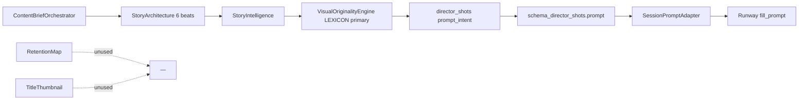
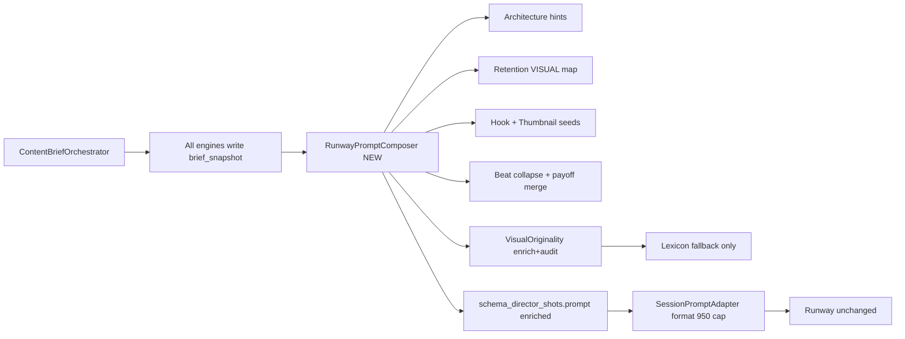

# PHASE 12J-B — Content Brain Visual Intelligence Restoration Design

**Date:** 2026-05-31  
**Status:** Design only — no implementation, no code changes  
**Inputs:** `PHASE_12J_A_CONTENT_BRAIN_TRACE_AUDIT.md`, session `exec_uat_20260602_055459`, current codebase contracts

---

## Purpose

Define how to restore **full Content Brain visual intelligence** into Runway prompts without replacing Runway automation, provider runtime, or the existing Content Brief orchestration shell.

The design keeps:

- `ContentBriefOrchestrator` as the single brief pipeline
- `StoryIntelligenceEngine` as the cinematic layer
- `SessionPromptAdapter` as the Runway-facing boundary (10I contract)
- `RunwayBrowserOrchestrator` unchanged

It changes **what fills `DirectorShot.prompt` / `schema_director_shots`** and **how beat collapse is handled**.

---

## Executive Recommendation

| Decision | Recommendation |
|----------|----------------|
| Primary prompt source | **Combination** — weighted merge, not a single engine |
| `NICHE_VISUAL_LEXICON` | **Fallback only** when richer fields are empty or fail anti-generic audit |
| `VisualOriginalityEngine` | **Enricher + auditor**, not primary author of `visual_description` |
| `SessionPromptAdapter` | **Composer** with explicit field precedence and lineage metadata |
| 6 → 2 beat collapse | **Narrative compression pass** — fold dropped beats into surviving clip prompts |
| New component (design) | **`RunwayPromptComposer`** (name TBD) between brief snapshot and `SessionPromptAdapter` |

---

## 1. Visual Fields Inventory (By Engine)

### 1.1 Content Brief (aggregate / `ContentBriefResult`)

Stored in `brief_snapshot` after `SessionPopulationBuilder`. Visual-relevant surfaces:

| Path | Fields | Visual relevance |
|------|--------|------------------|
| `profile.visual_dna` | `core_aesthetic`, `color_palette`, `lighting[]`, `camera_language[]`, `locations_preferred`, `character_consistency`, `props_and_symbols`, `forbidden_visuals` | Global look — **never reaches Runway today** |
| `profile.semantic_universe` | `semantic_clusters[].concepts`, `topic_seed_pool`, angles | Discovery context — **not in Runway prompts** |
| `trend_signal` | `topic`, `emotional_vector`, `platform_fit` | Topic/emotion — **partial** (topic token only via intelligence) |
| `run_context.story_intelligence.explainability` | `niche_visual_language[]` | Lexicon list — **becomes template source today** |

**Content Brief has no single `visual_prompt` field** — visuals are distributed across child packages.

---

### 1.2 Story Blueprint (`StoryBlueprint` + architecture internals)

**Schema (`content_brain/schemas/content_brief.py`):**

| Field | Type | Visual content |
|-------|------|----------------|
| `beats[].description` | string | `PURPOSE \| NARRATION \| VISUAL` pipe-separated block |
| `beats[].emotional_tone` | string | Tone label |
| `beats[].retention_mechanic` | string | Mechanic id |
| `sensory_anchor` | string | Concrete anchor noun/texture (e.g. from specificity engine) |
| `reveal_type`, `loop_seed` | string | Narrative framing |
| `emotional_curve` | float[] | Intensity per beat |

**Architecture-only (`StoryArchitectureEngine`, not all in schema):**

| Field | Source | Example |
|-------|--------|---------|
| `visual_prompt_hint` per beat | `NICHE_VISUAL_HINTS` / `GENERIC_VISUAL_HINTS` | `tight close-up on the subject tied to the hook` |
| Beat `VISUAL:` line in description | Composed from `visual_prompt_hint` | Same as hint |

**Story Intelligence overlay (`run_context.story_intelligence.story_blueprint`):**

| Field | Visual content |
|-------|----------------|
| `scene_plan[].visual_description` | Template lexicon + topic token |
| `scene_plan[].camera_direction`, `lighting_mood`, `motion_direction` | Cinematic spec |
| `scene_plan[].subject`, `action`, `environment`, `mood` | Structured scene |
| `director_shots[].prompt_intent` | Concatenation of above |
| `schema_director_shots[].prompt` | Copy of `prompt_intent` → **Runway input** |
| `schema_director_shots[].camera_shot`, `camera_movement`, `lighting`, `pacing`, `continuity_notes` | Adapter appends these |

---

### 1.3 Hook Engineering (`HookPackage`)

| Field | Visual relevance |
|-------|------------------|
| `best_hook_text` | **Narrative** — should inform clip 1 subject/action, not copied verbatim to Runway |
| `hook_class` | Drives story mode affinity; optional visual tone (threat vs moral discomfort) |
| `variants[].text` | Alternate hooks |
| `variants[].specificity_score` | Quality signal for composer weighting |

**No dedicated `visual_prompt` field** — hook is text-only but highly specific to topic when engineered well.

---

### 1.4 Retention Map (`RetentionMap`)

| Field | Visual relevance |
|-------|------------------|
| `beats[].implementation_note` | **Richest operational visual spec** — prefixed segments: `VISUAL:`, `AUDIO:`, `CAPTION:`, `CLIP:`, `STORY:` |
| `beats[].mechanic` | pattern_interrupt, perspective_shift, peak_moment, etc. |
| `beats[].block_label` | e.g. `story_payoff_beat`, `clip_0_mini_hook` |
| `beats[].start_second` / `end_second` | Maps to timeline / clip index |

Parsed VISUAL lines include multi-clip continuity (e.g. *"Clip 2 opens with immediate motion…"*).

**Not used by video path today.**

---

### 1.5 Title / Thumbnail Engine (`TitleThumbnailPackage`)

| Field | Visual relevance |
|-------|------------------|
| `thumbnail_concepts[].focal_subject` | Strong concrete subject |
| `thumbnail_concepts[].visual_prompt` | Packaged thumbnail frame description |
| `thumbnail_concepts[].tension_element` | What to hide/show |
| `thumbnail_concepts[].composition_note` | Framing rules |
| `recommended_thumbnail_concept` | Best concept snapshot |

Useful for **clip 1 hero frame** and **payoff reveal object**, not full motion prompts.

---

## 2. Which Fields Never Reach Runway Today?

```text
REACHES RUNWAY (exec_uat_20260602_055459):
  run_context.story_intelligence.schema_director_shots[].prompt
  + SessionPromptAdapter._compose_prompt() adds camera/movement/lighting/continuity

DOES NOT REACH RUNWAY:
  profile.visual_dna (all subfields)
  hook_package.best_hook_text (except indirectly in beat narration metadata)
  story_blueprint.beats[].description VISUAL: lines (architecture hints)
  story_architecture visual_prompt_hint (per beat)
  retention_map.beats[].implementation_note (VISUAL segments)
  title_thumbnail_package.thumbnail_concepts[].visual_prompt
  story_intelligence.scene_plan (full scene — only distilled template in prompt)
  emotional_arc, twist_or_reveal, cinematic_progression (metadata only)
  semantic_universe clusters
  video_format_plan.recommended_story_beats (timing only, not visuals)
```

**Coverage estimate:** ~15–25% of generated visual intelligence text reaches Runway; the rest is composed then discarded at `VisualOriginalityEngine._build_visual()`.

---

## 3. What Is Lost in 6 Beats → 2 Scenes Collapse?

**Mechanism:** `SceneProgressionEngine._select_beats_for_clips()` with `clip_count=2` selects priority:

1. `HOOK_BEAT`
2. `ESCALATION_BEAT`
3. (`PAYOFF_BEAT`, `LOOP_SEED` if more clips)

**Dropped entirely for Runway in 2-clip UAT:**

| Beat | Lost visual (architecture) | Lost narrative |
|------|--------------------------|----------------|
| `CONTEXT_BEAT` | medium shot establishing niche setting | Grounding path / why topic matters |
| `PATTERN_BREAK` | camera angle or scene shift | Perspective shift before payoff |
| `PAYOFF_BEAT` | clear visual proof or story turn | **Payoff proof** — hook promise delivery |
| `LOOP_SEED` | unfinished detail in frame | Comment/sequel open loop |

**Lost retention guidance** (still in `retention_map` but unmapped):

- `story_payoff_beat` VISUAL: clear visual proof or story turn
- `story_pattern_break_beat` VISUAL: camera angle or scene shift
- `clip_1_mini_payoff` / continuity blocks between clips

**Lost emotional arc segment:** intensity curve skips grounding → tension jump; payoff peak absent from visuals.

**Design implication:** Collapse is correct for **clip count** but wrong if **no compression** merges dropped beat semantics into clip 2 (payoff + pattern break should inform escalation or a combined “act 2–3” prompt).

---

## 4. Should Runway Prompts Be Built From…?

| Source | Role in recommended design | Weight (2-clip UAT) |
|--------|---------------------------|---------------------|
| **Architecture visuals** (`visual_prompt_hint` + beat `VISUAL:`) | **Primary scene intent** per selected beat | High |
| **Director shots** (intelligence cinematic fields) | **Camera/light/motion/continuity** — not primary prose | High (structured) |
| **Retention visuals** (`implementation_note` VISUAL) | **Operational direction** per clip/time window | High |
| **Thumbnail visuals** | **Hero subject + tension** for clip 1; payoff object for clip 2 | Medium |
| **Hook text** | **Clip 1 subject/action** seed (condensed, not full sentence) | Medium |
| **Lexicon templates** | **Fallback** only | Low (last resort) |
| **Combination** | **Yes — required** | — |

**Not recommended:** Single-source prompts (e.g. retention-only ignores cinematic continuity; architecture-only ignores retention clip boundaries).

---

## 5. `SessionPromptAdapter` Redesign (Design)

### Current behavior

1. `_resolve_shots()` → prefers `schema_director_shots` only
2. `_compose_prompt()` → `shot.prompt` + Camera/Movement/Lighting/Pacing/Continuity
3. Truncates at 950 chars for Runway

### Proposed behavior (12J-B)

Rename responsibility mentally to **`RunwayPromptAdapter`** or extend `SessionPromptAdapter` with a composition phase:

```text
SessionPromptAdapter.build(session, provider)
  → RunwayPromptComposer.compose(brief_snapshot, video_format_plan)  # NEW
  → list[ComposedClipPrompt] with fields + lineage
  → _compose_prompt() formats final string per provider rules
```

**`ComposedClipPrompt` (design contract):**

| Field | Description |
|-------|-------------|
| `clip_number` | 1..N |
| `beat_ids[]` | All story beats folded into this clip |
| `primary_visual` | Main scene description (prose) |
| `hook_anchor` | Optional clip-1 hook-derived visual |
| `payoff_anchor` | Optional clip-2 payoff-derived visual |
| `camera_shot`, `camera_movement`, `lighting`, `pacing` | From director shot / retention |
| `continuity_in`, `continuity_out` | From intelligence + retention CLIP notes |
| `profile_visual_dna_snippet` | Short DNA summary (palette, lighting style) |
| `lineage` | dict of source field paths used |
| `runway_prompt` | Final merged string (pre-truncation) |

**Precedence rules (first non-empty wins for prose layers, then merge):**

1. **Retention** `VISUAL` for blocks mapped to this clip index / time range
2. **Architecture** `visual_prompt_hint` for primary beat
3. **Story intelligence** `scene_plan` fields (if not template — see §6)
4. **Thumbnail** `visual_prompt` (clip 1 = recommended concept; clip 2 = tension/payoff)
5. **Lexicon fallback** only if anti-generic score below threshold

**Merge strategy (prose):**

- Clip 1: `[Hook visual seed]. [Architecture hint]. [Retention VISUAL]. [DNA lighting/camera].`
- Clip 2: `[Payoff + pattern-break compressed]. [Escalation architecture]. [Retention VISUAL]. [Continuity from clip 1].`

**Hard constraints:**

- Runway 950 char cap — composer truncates **by section priority**, not blind tail cut
- Preserve continuity sentence last on each clip
- Store full pre-truncation prompt in `prompt_bundle.metadata` for audit

**Backward compatibility:**

- If `brief_snapshot.run_context.runway_composed_prompts` absent → fall back to today’s `schema_director_shots` path (feature flag `RUNWAY_PROMPT_COMPOSER_ENABLED`)

---

## 6. `VisualOriginalityEngine` Role Change

### Current role (12J-A)

- **Primary author** of `visual_description` via `NICHE_VISUAL_LEXICON` templates
- Overwrites architecture hints

### Proposed role

| Function | Owner |
|----------|--------|
| **Author** primary visual prose | Architecture `visual_prompt_hint` + Retention VISUAL + Composer merge |
| **Enrich** | VisualOriginalityEngine — add niche-specific detail, topic tokens, profile `visual_dna` accents |
| **Audit** | AntiGenericSceneEngine — flag template-only scenes; trigger fallback or regen |
| **Lexicon supply** | Only when enrichment cannot reach specificity threshold |

**Revised `_build_visual()` logic (conceptual):**

```text
IF architecture_hint OR retention_visual FOR scene:
    base = merge(architecture_hint, retention_visual)
    enriched = enrich_with_dna_and_topic(base, context)
    IF anti_generic_pass(enriched):
        RETURN enriched
RETURN lexicon_fallback(context, beat_role)  # last resort
```

**Story Intelligence still produces** `scene_plan`, `director_shots`, `schema_director_shots` — but `prompt` field becomes **composer output**, not raw `prompt_intent` template.

---

## 7. `NICHE_VISUAL_LEXICON` — Fallback Only?

**Yes**, with explicit policy:

| Tier | Source |
|------|--------|
| T1 | Architecture + Retention + Thumbnail + profile visual_dna |
| T2 | NarrativeStrategyEngine `niche_visual_language` (topic-token-enriched list) |
| T3 | `NICHE_VISUAL_LEXICON[niche]` phrase inserted into sparse scenes |
| T4 | `NICHE_VISUAL_LEXICON["general"]` — **only** if T1–T3 fail audit |

**Anti-pattern to eliminate:** `"topic-specific object in sharp focus highlighting {token} during hook"` as default for all general-niche UAT runs.

**Semantic universe:** Rebuild or patch at orchestrator `run()` time with `pipeline_topic` so T2 includes real topic concepts, not literal string `"topic"`.

---

## 8. Preserving Hook, Escalation, Payoff, Continuity, Visual Originality

| Narrative element | Preservation strategy |
|-------------------|----------------------|
| **Hook** | Clip 1 composer section: extract concrete nouns/actions from `hook_package.best_hook_text`; map retention `visual_hook` / `pattern_interrupt` blocks; architecture HOOK `visual_prompt_hint` |
| **Escalation** | Clip 2 base: ESCALATION beat architecture + retention `stakes_increase` / escalation VISUAL |
| **Payoff** | **Compression:** merge PAYOFF + PATTERN_BREAK beats into clip 2 prose even when not selected as scenes; pull retention `story_payoff_beat` VISUAL |
| **Continuity** | `schema_director_shots.continuity_notes` + retention `CLIP:` / `mini_payoff` / `mini_hook` notes + explicit “Clip 2 opens with…” between-clip directive |
| **Visual originality** | DNA palette/lighting; thumbnail tension (hide payoff); anti-generic audit; topic-specific enrichment; forbid lexicon-only prompts when specificity &lt; threshold |

### Beat-collapse algorithm (design)

For `clip_count = N`:

1. Select N primary beats (existing priority list).
2. For each clip `i`, collect **secondary beats** by act mapping:
   - Clip 1: HOOK (+ optional CONTEXT snippets)
   - Clip 2: ESCALATION + PAYOFF + PATTERN_BREAK excerpts
   - Clip N (if 3+): PAYOFF + LOOP_SEED
3. Run **RetentionMapAligner** — map `retention_map.beats` to clip index by `start_second` / `CLIP:` tag.
4. Emit `ComposedClipPrompt` per clip.

---

## Current Flow vs Future Flow

### Current flow (12J-A)



### Future flow (12J-B design)



---

## Field Mapping Table (Source → Runway)

| Source field | Target in Runway prompt | Clip typical |
|--------------|-------------------------|--------------|
| `hook_package.best_hook_text` | Subject/action seed (extracted) | 1 |
| `story_blueprint.sensory_anchor` | Focal object / texture | 1–2 |
| `beats[HOOK].description` → VISUAL line | Primary visual clause | 1 |
| `architecture visual_prompt_hint[hook]` | Primary visual clause | 1 |
| `retention_map` VISUAL for hook window | Motion/contrast directive | 1 |
| `thumbnail recommended visual_prompt` | Hero frame composition | 1 |
| `profile.visual_dna.lighting/camera_language` | Lighting/camera suffix | 1–2 |
| `beats[ESCALATION].visual` + PAYOFF merge | Tension + proof | 2 |
| `retention_map` payoff/pattern VISUAL | Payoff turn | 2 |
| `director_shots.camera/lighting/motion` | Structured tags | 1–2 |
| `continuity_notes` + retention CLIP | Between-clip bridge | 2 |
| `NICHE_VISUAL_LEXICON` | Fallback phrase | rare |

---

## Data Flow Diagram (Detailed)

```text
┌─────────────────────────────────────────────────────────────────┐
│ USER TOPIC (e.g. dog)                                            │
└────────────────────────────┬────────────────────────────────────┘
                             ▼
┌─────────────────────────────────────────────────────────────────┐
│ ContentBriefOrchestrator                                       │
│  TrendDiscovery → topic=dog                                      │
│  HookEngineering → best_hook_text                                │
│  StoryArchitecture → 6 beats, visual_prompt_hint per beat        │
│  StoryIntelligence → scene_plan (2 scenes), schema_director_shots│
│  RetentionMap → implementation_note (VISUAL|AUDIO|CLIP|…)        │
│  TitleThumbnail → thumbnail visual_prompt, focal_subject         │
│  profile.visual_dna → global look                                │
└────────────────────────────┬────────────────────────────────────┘
                             ▼
┌─────────────────────────────────────────────────────────────────┐
│ brief_snapshot (SessionPopulationBuilder)                      │
└────────────────────────────┬────────────────────────────────────┘
                             ▼
              ┌──────────────────────────────┐
              │ RunwayPromptComposer (NEW)      │
              │  • align retention → clips      │
              │  • collapse beats + merge payoff│
              │  • precedence merge             │
              │  • VisualOriginality enrich     │
              │  • anti-generic audit           │
              └──────────────┬───────────────┘
                             ▼
              ┌──────────────────────────────┐
              │ schema_director_shots[].prompt│
              │ (updated in run_context or     │
              │  transient at dispatch)        │
              └──────────────┬───────────────┘
                             ▼
┌─────────────────────────────────────────────────────────────────┐
│ SessionPromptAdapter._compose_prompt()                           │
│  • format for runway_browser                                     │
│  • 950 char intelligent truncate                                 │
└────────────────────────────┬────────────────────────────────────┘
                             ▼
┌─────────────────────────────────────────────────────────────────┐
│ ProviderRuntimeEngine → prompt_bundle.json                     │
└────────────────────────────┬────────────────────────────────────┘
                             ▼
┌─────────────────────────────────────────────────────────────────┐
│ RunwayBrowserProvider.fill_prompt()  [UNCHANGED]                 │
└─────────────────────────────────────────────────────────────────┘
```

---

## Recommended Architecture

### Layer model

| Layer | Module (existing / new) | Responsibility |
|-------|-------------------------|----------------|
| L0 | `ContentBriefOrchestrator` | Unchanged orchestration order |
| L1 | Engines (Hook, Architecture, Retention, Thumbnail, Intelligence) | Emit visual fields; intelligence stops owning primary prose |
| L1b | `SemanticUniverseEngine` | Called with **runtime topic** at brief run |
| L2 | **`RunwayPromptComposer`** (new, `content_brain/execution/`) | Clip-aligned merge, beat compression, lineage |
| L2b | `VisualOriginalityEngine` (refocus) | Enrich + audit only |
| L3 | `SessionPromptAdapter` | Provider formatting + truncation policy |
| L4 | `ProviderRuntimeEngine` | Unchanged dispatch |
| L5 | `RunwayBrowserOrchestrator` | Unchanged |

### Integration points (minimal churn)

1. **`ContentBriefOrchestrator.run()`** — after `story_intelligence_payload`, call composer in **dry-run** mode to write `run_context.runway_prompt_preview` (optional, for UI/debug).

2. **`ProviderRuntimeEngine.dispatch()`** — before `SessionPromptAdapter.build()`, invoke composer if `schema_director_shots` lack `lineage_version` (idempotent).

3. **UAT** — no separate path; same composer via `brief_snapshot`.

### Configuration (design)

| Flag / policy | Purpose |
|---------------|---------|
| `RUNWAY_PROMPT_COMPOSER_ENABLED` | Gate new behavior |
| `RUNWAY_PROMPT_LEXICON_FALLBACK_MIN_SCORE` | Specificity threshold to allow lexicon |
| `RUNWAY_PROMPT_MERGE_PAYOFF_INTO_LAST_CLIP` | Default true for N=2 |
| `RUNWAY_PROMPT_MAX_CHARS` | 950 (Runway) |

### Observability

`prompt_bundle.metadata.prompt_lineage[]` per clip:

```json
{
  "clip_number": 1,
  "sources": [
    "hook_package.best_hook_text",
    "story_architecture.HOOK_BEAT.visual_prompt_hint",
    "retention_map.story_hook_beat.VISUAL",
    "profile.visual_dna.lighting"
  ],
  "fallback_used": false,
  "pre_truncation_length": 1120,
  "post_truncation_length": 940
}
```

---

## Phased Rollout (Design-Only Roadmap)

| Phase | Scope | Risk |
|-------|--------|------|
| **12J-C** | `RunwayPromptComposer` + retention/architecture merge; lexicon fallback | Low — UAT + dispatch only |
| **12J-D** | VisualOriginality enrich-only refactor; deprecate template `_build_visual` primary | Medium |
| **12J-E** | Runtime semantic universe topic binding; hook/thumbnail weight tuning | Low |
| **12J-F** | UI: show prompt lineage in UAT / Execution Center | Low |

---

## Success Criteria (Post-Implementation)

For topic `dog`, 2-clip Runway UAT:

1. Prompt **mentions concrete hook imagery**, not only `"dog evidence element"`.
2. Clip 2 includes **payoff/pattern-break** language from dropped beats or retention.
3. **Retention VISUAL** phrases appear in `prompt_bundle` lineage.
4. `NICHE_VISUAL_LEXICON["general"][0]` **absent** when T1 sources present.
5. Specificity score (existing viral dimension) improves vs 12J-A sessions.
6. Runway automation **unchanged** — only prompt string quality improves.

---

## Explicit Non-Goals (12J-B)

- No LLM call requirement in this design (rule-based merge first).
- No change to voice/subtitle/assembly/browser launcher.
- No replacement of `StoryIntelligenceEngine` or `ContentBriefOrchestrator`.
- No new Runway-specific DOM automation.

---

## Summary Answers (Quick Reference)

| # | Answer |
|---|--------|
| 1 | Visual fields documented in §1 across Brief, Blueprint, Hook, Retention, Thumbnail |
| 2 | §2 — retention, thumbnail, architecture hints, visual_dna, hook text do not reach Runway |
| 3 | §3 — payoff, context, pattern-break, loop, retention clip notes dropped on 2-clip collapse |
| 4 | **Combination** with precedence (§4) |
| 5 | §5 — adapter becomes formatter; composer owns merge |
| 6 | §6 — enricher + auditor, not primary template author |
| 7 | §7 — **yes, fallback only** |
| 8 | §8 — beat-collapse merge + retention map + hook/thumbnail seeds |

---

*Design only. No code changes in Phase 12J-B.*
