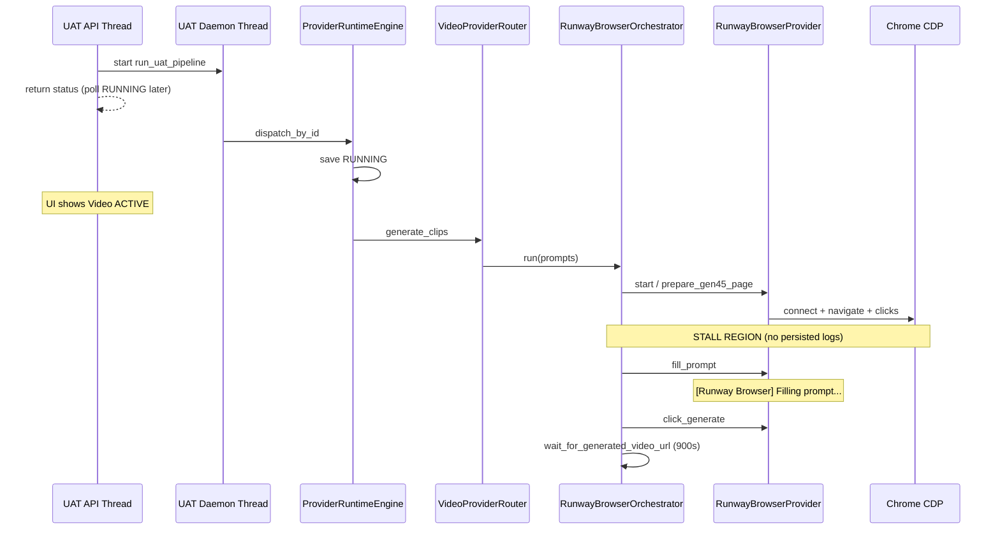

# PHASE 12J-C2A — Video Runtime Stall Audit

**Date:** 2026-06-02  
**Status:** Audit only — no fixes, no implementation  
**Primary session:** `exec_uat_20260602_102106`  
**Dispatch:** `disp_20260602_102108_164793`  
**Observation:** Session `RUNNING`, Session Builder completed, Video Runtime active — Runway page idle, no prompt typing, no Generate click visible.

**Related design:** `PHASE_12J_C_STEP2_RUNWAY_WAIT_DOWNLOAD_HARDENING_DESIGN.md` (observability gaps)  
**Related prior failure class:** `PHASE_12J_C_STEP1_RUNWAY_DOWNLOAD_TRACE.md` (post-submit wait timeout)

---

## Executive Summary

For `exec_uat_20260602_102106`, the pipeline **did reach** `ProviderRuntimeEngine.dispatch()` and set **`RUNNING` before browser work**. Queue enqueue/dequeue **completed**. `prompt_bundle.json` was written at **10:21:08**.

The stall is **not** “waiting on queue/dequeue” and **not** “dispatch never started.” The UAT API runs the pipeline in a **background daemon thread**; while that thread is blocked inside synchronous Playwright work, the session correctly shows **`RUNNING`** and the UI can show **Video active** even when the operator’s visible Runway tab has **no automation activity**.

**Most likely blocking region (code order):** inside `RunwayBrowserOrchestrator.run()` **after** `RUNNING` is persisted, **before or during** `RunwayBrowserProvider.fill_prompt()` — i.e. CDP connect, `prepare_gen45_page()`, or (if on the automation tab) the **900s** `wait_for_generated_video_url()` loop after an already-submitted job.

**Composer:** Not involved in this session (`lineage: null` in `prompt_bundle`); stall is unrelated to 12J-C composer.

---

## Reference Session Evidence (`exec_uat_20260602_102106`)

| Field | Value |
|-------|--------|
| `session.state` | `RUNNING` |
| `execution_runtime.state` | `RUNNING` |
| `running_at` | `2026-06-02 10:21:08` |
| `completed_at` | `null` |
| `provider_resolved` | `runway_browser` |
| `confirm_real_video` | `true` |
| `prompt_bundle` | Written (2 clips, template prompts) |
| `category_runtime.video_generation.state` | `RUNNING` |
| `category_runtime.video_generation.executed` | `false` |
| Audit events | `DISPATCHED` + `RUNNING` at 10:21:08 — **no** `FAILED` / `COMPLETED` yet |
| UAT `progress_log` last entry | `"Running video stage."` (10:21:06) — **no** `"Video stage completed."` |

**Artifacts:** `storage/.../exec_uat_20260602_102106/video_generation/prompt_bundle.json` only — no `runway_clip_*.mp4`.

---

## Exact Execution Path (UAT → Runway)

```text
POST /uat/run
  → UatRuntimeService.start()
  → UATRuntimeEngine.start()
       → threading.Thread(daemon=True).start(run_uat_pipeline)   # returns immediately
  → GET /uat/status  (polls; sees RUNNING once dispatch saves)

run_uat_pipeline()  [background thread]
  → ContentBriefOrchestrator.run()          # Session Builder / content_brain ✓
  → SessionPopulationBuilder.build()
  → _pipeline_session()
  → progress: "Content brief generated."

  → _run_video_stage()
       → validate_runway_browser_operator_ready()   # CDP + login probe (pre-dispatch)
       → uat_runway_queue_and_dispatch_prepare()    # enqueue + dequeue ✓
       → uat_log UAT_RUNWAY_EXECUTION dispatch_started=True
       → ProviderRuntimeEngine.dispatch_by_id()

ProviderRuntimeEngine.dispatch()
  → [optional] apply_runway_prompt_composer_to_session()  # skipped when flag off
  → SessionPromptAdapter.build()  → prompt_bundle
  → save session DISPATCHED
  → save session RUNNING  ◄── UI shows Video ACTIVE here
  → _execute_clips(prompts, runway_browser, ...)
       → VideoProviderRouter.generate_clips()
            → log_runway_wait_config()  → [RUNWAY_WAIT_CONFIG] wait_seconds=900 ...
            → RunwayBrowserOrchestrator.run(prompts)
                 → RunwayBrowserProvider.start()
                      → BrowserManager.launch()
                           → sync_playwright().start()
                           → chromium.connect_over_cdp("http://127.0.0.1:9222")
                 → RunwayBrowserProvider.prepare_gen45_page()
                      → open_runway() / click_generate_video_home() / select_gen45() / click_try_it()
                 → [CLIP 1]
                      → fill_prompt()  ◄── last line immediately BEFORE prompt typing
                      → apply_default_settings()
                      → click_generate()
                      → wait_for_generated_video_url()  # up to 900s (12J-C2a)
```

**Critical ordering bug (observability, not logic):** `RUNNING` is written **before** `_execute_clips()` begins. Any long browser block appears as “Video Runtime active” with **no** corresponding stage progress update.

```326:336:content_brain/execution/provider_runtime_engine.py
        running_ts = _now()
        execution_runtime["state"] = STATE_RUNNING
        ...
        session["state"] = STATE_RUNNING
        ...
        self.store.save_session(session, overwrite=True)

        ...
            clip_paths = self._execute_clips(
```

---

## Answers to Required Questions

### 1. What is the last log entry before stall?

**Persisted (session / audit):**

| Source | Last entry |
|--------|------------|
| `operations.uat_run.progress_log` | `"Running video stage."` @ 10:21:06 |
| `runtime/audit.jsonl` | `RUNNING` @ 10:21:08 (`pevt_bdc504515b26`) |
| `state_history` | `provider runtime: running (runway_browser)` @ 10:21:08 |

**Stdout (not persisted to session; only on daemon thread console):**  
Last **expected** line immediately before prompt typing:

```text
[Runway Browser] Filling prompt...
```

(from `RunwayBrowserProvider.fill_prompt()`)

**Lines that should appear earlier on the same thread (if execution reached orchestrator):**

```text
[UAT_RUNWAY_EXECUTION] session_id=... dispatch_started=True router_selected=VideoProviderRouter
============================================================
VIDEO PROVIDER ROUTER
[Router] Active video provider: runway_browser
[RUNWAY_WAIT_CONFIG] wait_seconds=900 source=default:900
[Runway Browser Orchestrator] STARTED
[BrowserManager] Download path: ...
[Runway Browser] Opening Runway dashboard...
...
[Runway Browser] CLIP 1
```

**Uvicorn API terminal** (`python -m ui.api.main`) shows only `GET /uat/status` — **not** browser logs (daemon thread stdout is separate).

---

### 2. Did ProviderRuntimeEngine call dispatch?

**Yes.**

Evidence: `prompt_bundle` in `execution_runtime`, `dispatched_at` / `running_at`, audit `DISPATCHED` + `RUNNING`, `state_history` DISPATCHED → RUNNING.

Entry: `_run_video_stage()` → `engine.dispatch_by_id(session_id, actor=operator_uat, ...)`.

---

### 3. Did VideoProviderRouter select runway_browser?

**Yes.**

`provider_resolved: runway_browser`, `provider_override` from session provider selection, router branch `if provider_name == "runway_browser":`.

```37:46:core/video_provider_router.py
        if provider_name == "runway_browser":
            ...
            wait_seconds, _source = log_runway_wait_config()
            orchestrator = RunwayBrowserOrchestrator(wait_seconds=wait_seconds)
            return call_with_optional_cancel_check(orchestrator.run, prompts, cancel_check=cancel_check)
```

---

### 4. Did RunwayBrowserProvider receive the request?

**Yes — if orchestrator started** (inferred yes from RUNNING + no immediate FAILED).

`RunwayBrowserOrchestrator.run()` constructs `RunwayBrowserProvider(cancel_check=...)` and calls `provider.start()` then `prepare_gen45_page()` before any clip loop.

There is **no** separate HTTP “request”; the provider is invoked **in-process** on the UAT background thread.

---

### 5. Did RunwayBrowserOrchestrator start?

**Yes — inferred.**

`RUNNING` without `execution_runtime.failure` implies `_execute_clips()` entered and has **not** returned/exited through `ProviderRuntimeEngine`’s exception handler.

Orchestrator entry prints `[Runway Browser Orchestrator] STARTED` then calls browser layer.

---

### 6. Is it waiting on queue/dequeue?

**No.** Queue bridge completed before dispatch.

Evidence:

- `state_history`: `QUEUED` → `DEQUEUED` → `DISPATCHED` → `RUNNING`
- `queue_item.queue_state`: `DEQUEUED`
- `uat_runway_queue_and_dispatch_prepare()` only runs **before** `dispatch_by_id`; failure there raises before RUNNING

```91:145:content_brain/execution/uat_real_video_bridge.py
def uat_runway_queue_and_dispatch_prepare(...):
    ...
    enqueue = queue.enqueue_by_id(...)
    dequeue = queue.dequeue_by_id(...)
    ...
    if state != "DEQUEUED" ...
    uat_log("UAT_QUEUE", ..., dispatch_started=True, session_state=state)
```

---

### 7. Is it waiting on browser readiness?

**Partially — pre-pass only.**

Before dispatch, `_run_video_stage()` calls `validate_runway_browser_operator_ready()` (CDP reachable + `runway_login_detected`). That **passed** for this run (otherwise dispatch would not proceed to RUNNING).

**During stall**, readiness is **not** re-checked. Blocking may still occur at:

| Step | Function | Block type |
|------|----------|------------|
| Playwright start | `sync_playwright().start()` | Sync init |
| CDP attach | `BrowserManager.launch()` → `connect_over_cdp` | Network/CDP (default Playwright timeout ~30s if unreachable) |
| Navigation | `open_runway()` → `page.goto(..., timeout=15000)` | Up to 15s |
| UI prep | `click_generate_video_home`, `select_gen45`, `click_try_it` | Playwright clicks + `browser_page_settle_seconds()` (8s default) each |

```48:66:content_brain/execution/uat_real_video_bridge.py
def validate_runway_browser_operator_ready(project_root: Path) -> dict[str, Any]:
    status = get_browser_operator_status(project_root, probe_login=True)
    if not status.get("browser_running"): raise ...
    if not status.get("cdp_connected"): raise ...
    if not status.get("runway_login_detected"): raise ...
```

**Note:** Pre-dispatch probe uses a **separate** short Playwright connect (`timeout_ms=4000`). `BrowserManager` uses a **second** connect **without** an explicit timeout argument — different code path.

---

### 8. Is it waiting on lock/mutex/session state?

| Mechanism | Applies to UAT path? |
|-----------|----------------------|
| `UATRuntimeEngine._global_lock` | Only blocks **second concurrent UAT** (`UatRunAlreadyActiveError`), not in-run stall |
| `RuntimeWorkerEngine._session_lock` | **No** — UAT uses direct `dispatch_by_id`, not async worker |
| `ExecutionQueueEngine` mutex | Queue already DEQUEUED |
| Playwright sync on daemon thread | **Yes** — entire dispatch blocks **one thread**; no deadlock with API polls |
| Chrome/CDP single-browser | Operator + automation share CDP; manual focus does not stop automation but can confuse observation |

**Session state `RUNNING` is expected** while the background thread is inside `_execute_clips()` — not a lock waiting for another state transition.

---

### 9. Which exact function is currently blocking?

**Cannot be pinned to a single stack frame without a live thread dump.** From code + session `RUNNING` + “no typing / no Generate,” the blocking call must be **one of** (in order of pipeline):

| Priority | Blocking function | Symptom if operator watches wrong tab |
|----------|-------------------|-------------------------------------|
| **A** | `BrowserManager.launch()` → `playwright.chromium.connect_over_cdp(...)` | All tabs idle |
| **B** | `RunwayBrowserProvider.open_runway()` / `page.goto` | One tab navigates; others idle |
| **C** | `prepare_gen45_page()` sub-steps (`_click_first`, `click_text_in_region`) | Automation tab moves; no prompt yet |
| **D** | `RunwayBrowserProvider.fill_prompt()` → `page.keyboard.type(..., delay=5)` | Typing on **automation** tab only |
| **E** | `wait_for_generated_video_url()` (max **900s** after 12J-C2a) | Prompt filled + Generate clicked; page looks “idle” while polling |

**If truly no Generate on the automation tab:** stall is **before** `click_generate()` → **A, B, C, or D**.

**If Generate already fired on automation tab:** stall is **E** (wait loop) — operator may report “idle” during generation wait.

```13:45:automation/browser_manager.py
    def launch(self):
        self.playwright = sync_playwright().start()
        ...
        self.browser = self.playwright.chromium.connect_over_cdp(
            "http://127.0.0.1:9222"
        )
        ...
        if self.context.pages:
            self.page = self.context.pages[0]   # ◄── first tab only
```

**Tab mismatch hypothesis:** Automation attaches to `context.pages[0]`. Operator may watch a different Runway tab that stays idle while automation works (or blocks) elsewhere.

---

### 10. What log line should appear immediately before prompt typing?

```text
[Runway Browser] Filling prompt...
```

Immediately before:

```136:137:providers/runway_browser_provider.py
    def fill_prompt(self, prompt: str):
        print("[Runway Browser] Filling prompt...")
```

**Immediately before that** (same clip, orchestrator):

```82:89:orchestrators/runway_browser_orchestrator.py
                print(f"[Runway Browser] CLIP {index}")
                ...
                before_sources = self.get_video_sources(provider.page)
                ...
                provider.fill_prompt(prompt)
```

**Immediately before first clip** (orchestrator startup chain):

```56:77:orchestrators/runway_browser_orchestrator.py
        print("[Runway Browser Orchestrator] STARTED")
        ...
            provider.start()
            ...
            provider.prepare_gen45_page()
```

---

## Stall vs Step 1 Timeout Failure

| Mode | Session end state | Operator sees |
|------|-------------------|---------------|
| **Step 1 (080026)** | `FAILED` ~3–4 min | Wait exhausted (was 180s); no URL |
| **Current (102106)** | `RUNNING` (open) | Long-running block inside `_execute_clips` — consistent with **900s** wait or slow prep |

12J-C2a removes early **180s** false timeout but **increases** how long `RUNNING` can persist during `wait_for_generated_video_url()` without UI substate (12J-C2e not implemented).

---

## Flow Diagram (Where Stall Fits)



---

## Question Matrix (Summary)

| # | Question | Answer |
|---|----------|--------|
| 1 | Last log before stall | Persisted: `"Running video stage."` / audit `RUNNING`. Stdout: likely before `[Runway Browser] Filling prompt...` |
| 2 | Dispatch called? | **Yes** |
| 3 | Router `runway_browser`? | **Yes** |
| 4 | Provider received? | **Yes** (in-process on BG thread) |
| 5 | Orchestrator started? | **Yes** (inferred) |
| 6 | Queue/dequeue wait? | **No** (done) |
| 7 | Browser readiness wait? | Pre-check passed; may block on CDP/goto/prep |
| 8 | Lock/session wait? | **No** queue lock; `RUNNING` = thread still in `_execute_clips` |
| 9 | Blocking function? | **Most likely** `launch` / `prepare_gen45_page` / `fill_prompt` / or `wait_for_generated_video_url` |
| 10 | Line before typing? | `[Runway Browser] Filling prompt...` |

---

## Observability Gaps (Why Audit Cannot Be Exact)

1. **UAT `start()` swallows worker exceptions** — `except Exception: pass` can leave odd states on crash (this session is still `RUNNING`, so thread is **alive**, not crashed).
2. **Browser logs not in session JSON** — only print to daemon stdout.
3. **No `runway_wait` substate** (12J-C2e not built) — UI cannot distinguish prep vs wait vs download.
4. **No timeout debug bundle** (12J-C2c not built).
5. **`RUNNING` set before browser work** — misleading “active” while prep blocked.

---

## Composer / Scope Boundaries

| Component | Stall involvement |
|-----------|-------------------|
| `RunwayPromptComposer` | **None** for 102106 (composer not enabled) |
| Content Brain | Completed before video stage |
| Voice / Subtitle / Assembly | Not started (`current_stage: video`) |
| `browser_launcher.py` | Read-only preflight via `get_browser_operator_status` |
| Generate click logic | Not modified; stall is **before** or **after** click, not missing router |

---

## Recommended Next Audit Step (Not Implementation)

To **prove** blocking frame on next run (still audit-only operationally):

1. Watch **daemon thread stdout** (process running `python -m ui.api.main`) for last `[Runway Browser] ...` line.
2. Confirm which Chrome tab is `pages[0]` during RUNNING (CDP target vs visible Runway tab).
3. Note whether `[Runway Browser] Filling prompt...` or `[Runway Browser] Waiting for generated video URL (max 900s)...` appears.

Implementation follow-ups belong to **12J-C2b/C2c/C2e** (signals, debug capture, UI substate) — out of scope here.

---

## References

- `content_brain/execution/uat_runtime_engine.py` — `_run_video_stage`, `UATRuntimeEngine.start`
- `content_brain/execution/uat_real_video_bridge.py`
- `content_brain/execution/provider_runtime_engine.py` — `dispatch`, `_execute_clips`
- `core/video_provider_router.py`
- `orchestrators/runway_browser_orchestrator.py`
- `providers/runway_browser_provider.py`
- `automation/browser_manager.py`
- `storage/content_brain/execution/sessions/exec_uat_20260602_102106.json`
- `storage/content_brain/execution/runtime/audit.jsonl` (`pevt_be2eebadfec8`, `pevt_bdc504515b26`)
- `PHASE_12J_C2A_RUNWAY_TIMEOUT_AUTHORITY_FIX_REPORT.md`
