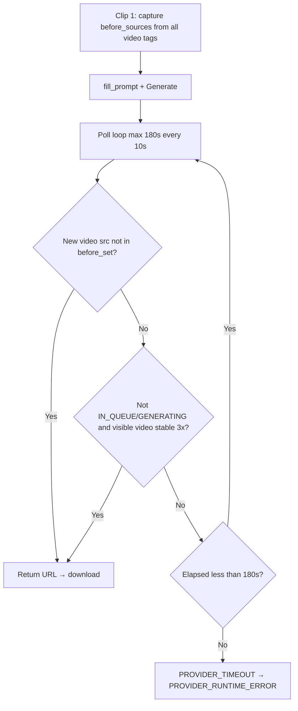

# PHASE 12J-C STEP 1 — Runway Download Trace (Audit Only)

**Date:** 2026-06-02  
**Status:** Audit only — no fixes, no implementation  
**Primary session:** `exec_uat_20260602_080026`  
**Dispatch:** `disp_20260602_080028_d6b627`  
**Failure:** `PROVIDER_RUNTIME_ERROR` — `[Runway Browser] Timeout waiting for generated video URL (clip 1)`  
**Related prior session (same failure class):** `exec_uat_20260602_055459` (`disp_20260602_055500_f8cb8b`)

---

## Executive Summary

The failure occurred **before any download**. `RunwayDownloadProvider.download_video_url()` was never called because `wait_for_generated_video_url()` did not return a URL within the **effective 180-second generation wait** imposed by `VideoProviderRouter` (not the 900s browser default).

There is **no persisted evidence** in session artifacts or storage that Runway finished clip 1 or produced a playable file in this run. The automation never observed a **new** `<video>` `src` / `currentSrc` and did not satisfy the **visible-video stability fallback** within the wait window.

**12J-C composer:** Enabled on this session (`runway_composer_version: 12j_c_v1`). Composer only changed **prompt text** submitted to Runway; it does **not** participate in browser wait, URL detection, or download. **No** — composer did not cause this failure class.

---

## Timeline (Session `exec_uat_20260602_080026`)

| Timestamp | Event |
|-----------|--------|
| 2026-06-02 08:00:26 | UAT content brain complete; video stage started |
| 2026-06-02 08:00:28 | Queue ENQUEUED / DEQUEUED; dispatch RUNNING (`runway_browser`, 2 clips) |
| 2026-06-02 08:00:28 | `prompt_bundle` written; composer active (`12j_c_v1`) |
| 2026-06-02 08:04:05 | FAILED — timeout clip 1 |

**Wall-clock dispatch → failure:** ~**217 seconds** (3m 37s).

**Artifacts under** `storage/content_brain/execution/artifacts/exec_uat_20260602_080026/video_generation/`:

- `prompt_bundle.json` only  
- **No** `runway_clip_*.mp4`, **no** `clip_01.*`, **no** partial paths  

`operations.failover_advisory`: `partial_artifacts_present: false`, `partial_paths: []`.

---

## Answers (Required)

### 1. Did Runway generation actually complete?

**Unknown from system evidence; not proven.**

What we know:

- Prompt submit path likely succeeded (failure is **wait**, not `fill_prompt` / `click_generate` / session-invalid errors).
- No URL was accepted by the waiter → download never ran.
- No video files were saved.

What we **cannot** assert without a browser recording or Runway UI snapshot at 08:04:05:

- Whether Runway had finished rendering in the UI but used a DOM pattern the scraper does not read (e.g. no new `<video src>`, preview in canvas, delayed `src` assignment).
- Whether generation was still **in queue / generating** after 180s of polling.

**Best audit conclusion:** Generation **may** have completed in the human-visible UI, but the automation **did not detect completion** and treats the run as a timeout.

---

### 2. Did Runway produce a playable video?

**Not in ModirAgentOS storage for this session.**

- Zero bytes downloaded.
- `RunwayDownloadProvider` HTTP fetch was not reached.
- Playability on Runway’s side is **unverified** (no URL captured).

---

### 3. Which selector is used to detect completed video?

There is **no separate “completion” CSS selector**. Completion is inferred when a **video URL** is obtained via DOM evaluation on **`<video>` elements**:

**Primary detection (new URL):**

```149:159:orchestrators/runway_browser_orchestrator.py
    def get_video_sources(self, page):
        try:
            return page.evaluate(
                """
                () => Array.from(document.querySelectorAll("video"))
                    .map(v => v.currentSrc || v.src || "")
                    .filter(Boolean)
                """
            )
```

Logic in the wait loop:

```251:269:orchestrators/runway_browser_orchestrator.py
            current_sources = self.get_video_sources(page)
            visible_infos = self.get_visible_video_sources_with_info(page)
            new_sources = [src for src in current_sources if src and src not in before_set]

            ...

            if new_sources:
                newest = new_sources[-1]
                ...
                return newest
```

`before_sources` is captured **immediately before** `fill_prompt` / `click_generate` for the clip.

**Supplementary page-state text scan** (not a video selector; gates errors and fallback):

```188:210:orchestrators/runway_browser_orchestrator.py
    def get_page_generation_state(self, page):
        ...
            if "in queue" in lower or "your generation is in queue" in lower:
                return "IN_QUEUE"
            if "generating" in lower:
                return "GENERATING"
            ...
            if "downloaded" in lower or "download" in lower:
                return "READY_OR_HISTORY"
            return "UNKNOWN"
```

**Fallback “completion” (visible stable video, not “new URL”):**

```161:186:orchestrators/runway_browser_orchestrator.py
    def get_visible_video_sources_with_info(self, page):
        ...
                () => Array.from(document.querySelectorAll("video"))
                    .map((v, index) => {
                        ...
                            visible: !!(
                                (v.currentSrc || v.src) &&
                                rect.width > 80 &&
                                rect.height > 80
                            )
```

Used only when `page_state` is **not** `IN_QUEUE` or `GENERATING` and the same candidate `src` is stable for **3 consecutive polls** (see §3 below).

---

### 4. Which selector is used to extract video URL?

**Same as detection:** `document.querySelectorAll("video")` → `currentSrc || src`.

Returned string is passed to download:

```103:108:orchestrators/runway_browser_orchestrator.py
                download_meta = download_provider.download_video_url(
                    video_url=new_video_url,
                    filename_prefix=f"runway_clip_{index}",
                    clip_index=index,
                )
```

There is **no** alternate extractor (no `<source>`, no `video[src]` attribute-only pass, no network interception, no Runway API task id).

---

### 5. What exact timeout value expired?

**Effective generation wait: `180` seconds** for this UAT path.

| Layer | Value | Source |
|-------|-------|--------|
| **Applied wait** | **180 s** | `VideoProviderRouter` hardcodes `RunwayBrowserOrchestrator(wait_seconds=180)` |
| Orchestrator default (if router did not pass) | 900 s | `RUNWAY_BROWSER_MAX_WAIT_SECONDS` env default in `browser_max_wait_seconds()` |
| Poll interval | 10 s default | `RUNWAY_BROWSER_POLL_INTERVAL` |
| Error payload | `max_wait_seconds: 180` | Raised in `RunwayProviderError.details` at timeout |

```37:46:core/video_provider_router.py
        if provider_name == "runway_browser":
            ...
            orchestrator = RunwayBrowserOrchestrator(
                wait_seconds=180
            )
```

```19:20:providers/runway_browser_support.py
def browser_max_wait_seconds() -> int:
    return max(1, int(os.getenv("RUNWAY_BROWSER_MAX_WAIT_SECONDS", "900")))
```

```297:301:orchestrators/runway_browser_orchestrator.py
        raise RunwayProviderError(
            f"[Runway Browser] Timeout waiting for generated video URL (clip {clip_index})",
            code="PROVIDER_TIMEOUT",
            details={"clip_index": clip_index, "max_wait_seconds": max_wait},
        )
```

**Wall-clock ~217 s** = ~180 s wait loop + browser launch, `prepare_gen45_page`, long prompt fill (`keyboard.type(..., delay=5)`), settings, generate click, and poll sleeps.

**Note:** `ProviderRuntimeEngine` surfaces this as `PROVIDER_RUNTIME_ERROR` (generic wrapper), not `PROVIDER_TIMEOUT`, in session JSON — taxonomy code is in the underlying `RunwayProviderError.code`.

---

### 6. Is Runway UI different from the selector assumptions?

**Plausible yes — several structural mismatches:**

| Assumption in code | Runway UI risk |
|--------------------|----------------|
| Output appears as `<video>` with populated `src`/`currentSrc` | Preview may use canvas/WebGL, lazy `src`, or blob URLs that do not change when a “new” clip completes |
| **New** URL ∉ `before_set` | Reused CDN URL, in-place `src` update, or history panel video already in `before_set` → `new_sources` stays empty |
| Fallback requires `page_state` ∉ `{IN_QUEUE, GENERATING}` | If body still contains “generating” after 180s, fallback path is **blocked** even if a large `<video>` is visible |
| Visible fallback needs 80×80 px `<video>` | Thumbnail strip or off-DOM previews may not qualify |
| `get_page_generation_state` uses `document.body.innerText` | False positives/negatives if copy changed (Gen-4.5 UI strings not in list) → `UNKNOWN` or stuck `GENERATING` |
| Prompt / workspace selectors (`textarea`, Gen-4.5 tab, Generate) | Separate from wait — if submit worked, mismatch here is less likely for *this* failure |

**This audit did not capture a live DOM snapshot** at timeout; mismatch is inferred from code + absence of URL/artifacts.

---

### 7. Did composer affect this failure?

**No (by architecture).**

Session evidence:

- `enable_runway_prompt_composer` / `runway_composer_version: 12j_c_v1` on `exec_uat_20260602_080026`
- `prompt_bundle` includes `prompt_lineage` and longer merged clip-1 prose vs template-only runs

Composer impact stops at **prompt string** written to `schema_director_shots` → `SessionPromptAdapter` → `prompt_bundle.prompts[0]`.

**Unchanged in this failure path:**

- `RunwayBrowserOrchestrator`
- `RunwayBrowserProvider` / `RunwayDownloadProvider`
- `wait_for_generated_video_url()` selectors and timeouts
- `VideoProviderRouter(wait_seconds=180)`

The same timeout occurred on **`exec_uat_20260602_055459`** (~213 s, clip 1) **before** composer-length prompts, which supports “not composer-specific.”

A longer prompt could **slow** Runway generation wall-clock, making 180s more likely to expire — that is indirect, not a composer bug in download logic.

---

### 8. What page state existed when timeout occurred?

**Not persisted** in session JSON or artifact store. Stdout lines like `[Runway Browser] State: …` are not captured in `execution_runtime`.

**Inferred terminal condition** (must have been true when the loop exited):

```234:295:orchestrators/runway_browser_orchestrator.py
        while time.monotonic() - start < max_wait:
            ...
            page_state = self.get_page_generation_state(page)
            ...
            new_sources = [src for src in current_sources if src and src not in before_set]
            ...
            if new_sources:
                return newest   # NOT taken

            if page_state not in ["IN_QUEUE", "GENERATING"] and visible_infos:
                ... stable_count >= 3
                return candidate   # NOT taken

            time.sleep(min(poll_every, remaining))
```

At timeout, therefore **all** of:

1. `time.monotonic() - start >= 180` (wait budget exhausted), and  
2. `new_sources` was **empty** every poll, and  
3. Either `page_state` ∈ `{IN_QUEUE, GENERATING}`, or `visible_infos` empty, or stable fallback never reached **3** polls.

**Most likely labels** (ranked):

1. **`GENERATING` or `IN_QUEUE`** for most of the 180s (fallback blocked).  
2. **`UNKNOWN`** with no qualifying new/visible `<video>` URL.  
3. **`READY_OR_HISTORY`** with videos present but **no new `src`** vs `before_set` (history/download copy without new URL).

**Not** triggered (or session would show different message):

- `LOGIN_REQUIRED` / `SESSION_EXPIRED` → `BROWSER_SESSION_INVALID`  
- `GENERATION_ERROR` → `PROVIDER_TASK_FAILED`

---

## Exact Function: `wait_for_generated_video_url()`

Full implementation:

```212:301:orchestrators/runway_browser_orchestrator.py
    def wait_for_generated_video_url(
        self,
        page,
        before_sources,
        clip_index,
        already_downloaded_urls=None,
        max_wait_seconds=None,
        *,
        cancel_check: CancelCheck | None = None,
        partial_paths: list[str] | None = None,
    ):
        max_wait = max_wait_seconds if max_wait_seconds is not None else self.wait_seconds
        poll_every = browser_poll_interval()

        print(f"[Runway Browser] Waiting for generated video URL (max {max_wait}s)...")

        before_set = set(before_sources or [])
        start = time.monotonic()
        last_sources: list[str] = []
        stable_candidate = None
        stable_count = 0

        while time.monotonic() - start < max_wait:
            check_cancel(cancel_check, "generation_wait", partial_paths=partial_paths)

            page_state = self.get_page_generation_state(page)
            if page_state in {"LOGIN_REQUIRED", "SESSION_EXPIRED"}:
                raise RunwayProviderError(
                    f"[Runway Browser] Session unavailable ({page_state})",
                    code="BROWSER_SESSION_INVALID",
                    details={"clip_index": clip_index, "page_state": page_state},
                )
            if page_state == "GENERATION_ERROR":
                raise RunwayProviderError(
                    "[Runway Browser] Provider page reported generation error",
                    code="PROVIDER_TASK_FAILED",
                    details={"clip_index": clip_index, "page_state": page_state},
                )

            current_sources = self.get_video_sources(page)
            visible_infos = self.get_visible_video_sources_with_info(page)
            new_sources = [src for src in current_sources if src and src not in before_set]

            if current_sources != last_sources:
                elapsed = int(time.monotonic() - start)
                print(
                    f"[Runway Browser] State: {page_state} | "
                    f"Current videos: {len(current_sources)} | "
                    f"Visible videos: {len(visible_infos)} | "
                    f"New: {len(new_sources)} | elapsed={elapsed}s"
                )
                last_sources = current_sources

            if new_sources:
                newest = new_sources[-1]
                print("[Runway Browser] New video URL detected:")
                print(newest)
                return newest

            if page_state not in ["IN_QUEUE", "GENERATING"] and visible_infos:
                visible_infos_sorted = sorted(
                    visible_infos,
                    key=lambda item: item.get("top", 0),
                    reverse=True,
                )
                candidate = visible_infos_sorted[0].get("src")
                if candidate:
                    if candidate == stable_candidate:
                        stable_count += 1
                    else:
                        stable_candidate = candidate
                        stable_count = 1
                    print(
                        f"[Runway Browser] Fallback candidate stable {stable_count}/3"
                    )
                    if stable_count >= 3:
                        print("[Runway Browser] Using latest visible video URL:")
                        print(candidate)
                        return candidate

            remaining = max_wait - (time.monotonic() - start)
            if remaining <= 0:
                break
            time.sleep(min(poll_every, remaining))

        raise RunwayProviderError(
            f"[Runway Browser] Timeout waiting for generated video URL (clip {clip_index})",
            code="PROVIDER_TIMEOUT",
            details={"clip_index": clip_index, "max_wait_seconds": max_wait},
        )
```

### Why it timed out (this session)



For `exec_uat_20260602_080026`, execution reached **H**:

- **180 s** generation wait exhausted (router cap).  
- **No** qualifying `new_sources` URL.  
- **No** successful 3-poll stable fallback.  
- **No** download / playable artifact saved.

---

## Call Chain (Where Timeout Surfaces)

```text
UAT _run_video_stage (confirm_real_video=true)
  → ProviderRuntimeEngine.dispatch()
       → apply_runway_prompt_composer_to_session()   # prompt only
       → SessionPromptAdapter.build()               # prompt_bundle.json
       → VideoProviderRouter.generate_clips(..., runway_browser)
            → RunwayBrowserOrchestrator.run(wait_seconds=180)
                 → fill_prompt(composed clip-1 text)
                 → click_generate()
                 → wait_for_generated_video_url()  ← TIMEOUT
                 → (never) RunwayDownloadProvider.download_video_url()
```

---

## Evidence Table

| Question | Verdict | Evidence |
|----------|---------|----------|
| Generation complete? | Unproven | No URL, no artifact |
| Playable video produced? | Not captured locally | No mp4 under artifact root |
| Completion selector | `<video>` src diff + body text state | `get_video_sources`, `get_page_generation_state` |
| URL extractor | Same `<video>` src | Returned string to download provider |
| Timeout value | **180 s** wait (+ ~37 s setup) | Router + ~217 s audit timestamps |
| UI vs assumptions | Likely gaps | `<video>`-only, new-URL heuristic, GENERATING blocks fallback |
| Composer caused? | **No** | Browser layer unchanged; same failure pre-composer |
| Page state at timeout | Not logged | Inferred: no URL path; likely GENERATING/IN_QUEUE or no new src |

---

## Audit Constraints

- No code changes proposed (per step scope).  
- No live browser replay in this audit.  
- Re-run with **console capture** or DOM snapshot at failure would be step 2 (observability), not step 1.

---

## References

- Session: `storage/content_brain/execution/sessions/exec_uat_20260602_080026.json`
- Audit trail: `storage/content_brain/execution/runtime/audit.jsonl` (`pevt_b5cbab860a62`)
- `orchestrators/runway_browser_orchestrator.py`
- `core/video_provider_router.py`
- `providers/runway_browser_support.py`
- `project_brain/PHASE_12I_B_REAL_RUNWAY_EXECUTION_BRIDGE_REPORT.md`
- `project_brain/PHASE_12J_A_CONTENT_BRAIN_TRACE_AUDIT.md` (prior timeout on `055459`)
