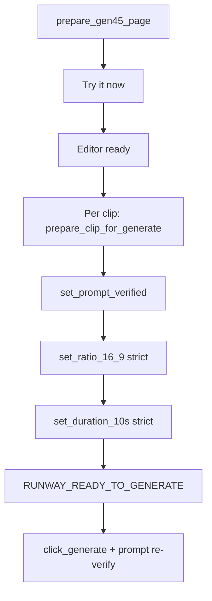

# PHASE 12J-E0 — Runway Interaction Order Fix Report

**Date:** 2026-06-02  
**Problem:** Prompt truncated (e.g. `evidence — specific t`) when ratio/duration controls were changed **before** prompt entry, causing focus loss / re-render (blue highlight).  
**Scope:** Runway browser provider + orchestrator only — no Content Brain, Prompt Composer, Voice, Subtitle, or Assembly changes.

---

## Summary

| Item | Change |
|------|--------|
| **Page prep** (`prepare_gen45_page`) | Try it now → editor ready only (**no** ratio/duration) |
| **Per clip** (`prepare_clip_for_generate`) | Full prompt → verify → 16:9 → 10s → verify → ready |
| **Generate** (`click_generate`) | Re-verifies full prompt; **no click** if incomplete |
| **Injection** | Prefer `locator.fill()`; removed slow `keyboard.type(delay=5)` and `mouse.click(1200,700)` |
| **Failure code** | `PROMPT_INJECTION_INCOMPLETE` after one retry |

---

## New interaction order



### `prepare_gen45_page` (once per run)

1. Open Runway → Video mode → Gen-4.5  
2. **Try it now** (if needed)  
3. **Wait** until generate editor ready (`prompt_box_ready`)  

### `prepare_clip_for_generate(prompt)` (each clip)

1. `[RUNWAY_PROMPT_SET_START]` — paste/fill full prompt  
2. `[RUNWAY_PROMPT_VERIFY]` — length, first/last 50 chars, placeholder check  
3. On fail: clear + paste **once**, re-verify  
4. `[RUNWAY_PROMPT_SET_DONE]`  
5. `[RUNWAY_RATIO_SET]` — 16:9 (strict)  
6. `[RUNWAY_DURATION_SET]` — 10s (strict)  
7. `[RUNWAY_READY_TO_GENERATE]`  

### `click_generate`

- Requires `_last_filled_prompt`  
- Runs `_verify_prompt_injection` again  
- Then existing guards (not generating, button enabled, etc.)

---

## Prompt verification rules

| Check | Rule |
|-------|------|
| Minimum length | `actual_len >= max(32, expected_len × 0.90)` |
| Prefix | First 50 characters must match (or full string if shorter) |
| Suffix | Last 50 characters must match |
| Placeholder | Fails if editor still shows `describe your shot` / similar and text is shorter than expected |
| Retry | One retry: Ctrl+A, clear, paste again |
| Fail code | `PROMPT_INJECTION_INCOMPLETE` |

---

## Files changed

| File | Change |
|------|--------|
| `providers/runway_browser_provider.py` | Order, `set_prompt_verified`, verification, logs |
| `providers/runway_browser_support.py` | Prompt verification constants |
| `orchestrators/runway_browser_orchestrator.py` | `prepare_clip_for_generate` per clip |
| `project_brain/validate_12j_e0_runway_interaction_order.py` | **New** static validator |
| `project_brain/validate_12j_d_b_step1_runway_prep_generate_duration.py` | Updated for per-clip duration order |

---

## Validation (static)

```powershell
python project_brain/validate_12j_e0_runway_interaction_order.py
python project_brain/validate_12j_d_b_step1_runway_prep_generate_duration.py
```

| # | Requirement | Result |
|---|-------------|--------|
| 1 | Prompt fully present before ratio/duration | **PASS** — `prepare_clip_for_generate` order |
| 2 | 16:9 after prompt verification | **PASS** |
| 3 | 10s after prompt verification | **PASS** |
| 4 | Generate only after prompt + ratio + duration | **PASS** — `click_generate` re-verifies prompt |
| 5 | No partial prompt path to Generate | **PASS** — no slow type; verify gate on click |

All **12J-E0** and **12J-D-B Step 1** checks passed (including C2A observability regression).

---

## Log tags (operator)

| Tag | When |
|-----|------|
| `[RUNWAY_PROMPT_SET_START]` | Before paste/fill |
| `[RUNWAY_PROMPT_SET_DONE]` | After successful verify |
| `[RUNWAY_PROMPT_VERIFY]` | Each verify attempt (`expected_len`, `actual_len`, `ok=`) |
| `[RUNWAY_RATIO_SET]` | After 16:9 click (`selected=`, `clicked=`) |
| `[RUNWAY_DURATION_SET]` | After 10s (`target=`, `verified=`) |
| `[RUNWAY_READY_TO_GENERATE]` | Clip prep complete, safe to Generate |

---

## Related audits

- `PHASE_12J_E_RUNWAY_REAL_OUTPUT_DETECTION_AUDIT.md` — empty-state URL fallback (separate issue)  
- `PHASE_12J_D_B_STEP1_RUNWAY_PREP_GENERATE_DURATION_FIX_REPORT.md` — Try it now / Gen-4.5 prep  

---

## Operator note

Re-run supervised UAT after this fix. Expect full prompts in Runway before ratio/duration UI changes. If `PROMPT_INJECTION_INCOMPLETE` still appears, capture `[RUNWAY_PROMPT_VERIFY]` line (actual vs expected lengths) in the terminal log.
