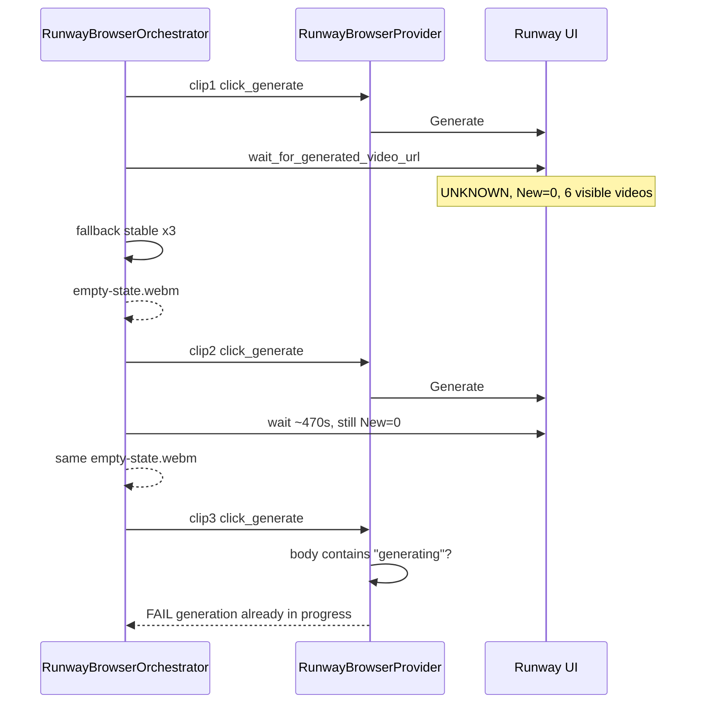

# PHASE 12J-E — Runway Real Output Detection Audit

**Audit date:** 2026-06-02  
**Session:** `exec_uat_20260602_190032`  
**Topic:** `lonely girl running through neon rain street`  
**Scope:** Audit only — no code or rule changes.

**Primary evidence:** UAT terminal log (`289733.txt`), session JSON, `orchestrators/runway_browser_orchestrator.py`, `providers/runway_browser_provider.py`, `providers/runway_download_provider.py`.

---

## Executive summary

| Issue | Root cause (code path) | Verdict |
|-------|------------------------|---------|
| **empty-state.webm accepted as clips 1–2** | `wait_for_generated_video_url()` **fallback branch** picked first stable visible `<video>` src; **no** URL allow/deny list; download trusts any HTTP 200 ≥ 100 KB | **False positive** — placeholder UI asset, not Runway output |
| **Clip 3 “generation already in progress”** | `RunwayBrowserProvider._is_already_generating()` — **`document.body.innerText`** contains `"generating"` or queue phrase | **Likely correct or stale text** — after ~8 min clip-2 wait; **not** from disabled Generate button (`generate_enabled_count: 1`) |

Content Brain / uniqueness were **not** involved in this failure (`PROCEED` earlier). Failure code: `PROVIDER_RUNTIME_ERROR` at clip 3 `click_generate`.

---

## A. Download detection

### 1. Exact URL accepted — clip 1

```
https://d3phaj0sisr2ct.cloudfront.net/app/mira/empty-states/edit-studio-empty-state.webm
```

**Saved as:** `downloads\runway\runway_clip_1_1780419688.mp4`  
**Bytes:** 6,163,336

### 2. Exact URL accepted — clip 2

```
https://d3phaj0sisr2ct.cloudfront.net/app/mira/empty-states/edit-studio-empty-state.webm
```

**Same URL as clip 1** (identical CloudFront asset).

**Saved as:** `downloads\runway\runway_clip_2_1780420196.mp4`  
**Bytes:** 6,163,336 (same size — strong indicator of same file re-downloaded)

**Filename epoch delta:** `1780420196 - 1780419688` = **508 seconds** (~8.5 min between clip 1 and clip 2 download completion).

### 3. Why was `edit-studio-empty-state.webm` classified as output?

The pipeline does **not** classify “real Runway output” vs “placeholder.” It accepts the **first URL returned** by one of two detectors:

| Priority | Path | Clip 1 | Clip 2 |
|----------|------|--------|--------|
| 1 | **New `<video>` src** not in `before_sources` | **0 new** (`New: 0`) | **0 new** |
| 2 | **Fallback:** top visible `<video>` stable 3 polls | **Used** (immediate) | **Used** after ~470s wait |

Runway’s editor ships a **visible** `<video>` element pointing at the **empty-state** WebM (marketing/placeholder loop). That element satisfies visibility rules (`width/height > 80`, has `src`) and was **already on the page** before Generate — so it never appears as a “new” source, but becomes the fallback candidate when page text state is not `IN_QUEUE` / `GENERATING`.

The `.webm` URL is **not** rejected anywhere in wait or download.

### 4. Which function accepted it?

| Step | Function | File |
|------|----------|------|
| URL selection | `RunwayBrowserOrchestrator.wait_for_generated_video_url()` | `orchestrators/runway_browser_orchestrator.py` |
| Fallback return | Same — lines 308–327 (`stable_count >= 3`) | ↑ |
| HTTP fetch | `RunwayDownloadProvider.download_video_url()` | `providers/runway_download_provider.py` |
| Artifact record | `finalize_download_artifact()` | `providers/runway_artifact_utils.py` |

Orchestrator loop (simplified):

```302:327:orchestrators/runway_browser_orchestrator.py
            if new_sources:
                newest = new_sources[-1]
                ...
                return newest

            if page_state not in ["IN_QUEUE", "GENERATING"] and visible_infos:
                visible_infos_sorted = sorted(
                    visible_infos,
                    key=lambda item: item.get("top", 0),
                    reverse=True,
                )
                candidate = visible_infos_sorted[0].get("src")
                ...
                    if stable_count >= 3:
                        ...
                        return candidate
```

### 5. What conditions passed?

**Clip 1 (from terminal at `elapsed=0s`):**

| Check | Value | Pass? |
|-------|-------|-------|
| `get_page_generation_state()` | **UNKNOWN** | Not `IN_QUEUE` / `GENERATING` → fallback allowed |
| `new_sources` | **0** | Primary path skipped |
| `visible_infos` count | **6** | Fallback allowed |
| `stable_count` | **≥ 3** | Returned candidate |
| HTTP status | **200** | Download OK |
| `size_bytes` | **6,163,336** | ≥ `MIN_ARTIFACT_BYTES` (100,000) → `VALIDATION_VALID` |

**Clip 2:**

| Check | Value | Pass? |
|-------|-------|-------|
| `page_state` (logged) | **UNKNOWN** | Fallback allowed |
| `new_sources` | **0** (through ~470s) | Primary path never fired |
| `visible_infos` | 1 → then **6** | Fallback on top visible video |
| Same empty-state URL | Stable 3/3 | Returned |
| Size | 6,163,336 | Passed size gate again |

**Not required (gaps):**

- URL host/path not `empty-states` or `.webm`
- Content-Type `video/mp4`
- `page_state == READY_OR_HISTORY` with job card
- New src diff after Generate click

### 6. What metadata existed?

Session `artifacts_by_category.video_generation` stayed **empty** (runtime failed before artifact promotion). Metadata exists only from code contract + logs:

**From `finalize_download_artifact()` (would be on `clip_results` entry):**

| Field | Expected value |
|-------|----------------|
| `source_url` | `https://d3phaj0sisr2ct.cloudfront.net/app/mira/empty-states/edit-studio-empty-state.webm` |
| `file_path` | `downloads\runway\runway_clip_{n}_{epoch}.mp4` |
| `size_bytes` | 6163336 |
| `validation_status` | `valid` (above 100 KB minimum) |
| `mode` | `browser` |
| `provider_id` | `runway_browser` |
| `metadata.provider_version` | `11e_c_v1` (browser provider version) |
| `partial` | false until failure marks partial |

**No** fields captured: `page_state`, `fallback_used`, `is_placeholder`, `content_type`, Runway job id.

**Observability steps persisted:** `video_url_detected` → `download_started` → `download_completed` per clip (stdout `RUNWAY_STEP`); session JSON does not embed the URL string.

---

## B. Generation state (clip 3)

### 7. Function that decides “generation already in progress”

`RunwayBrowserProvider.click_generate()` → `_is_already_generating()`  
**File:** `providers/runway_browser_provider.py`

```432:438:providers/runway_browser_provider.py
    def _is_already_generating(self) -> bool:
        body = self._page_body_lower()
        if "in queue" in body or "your generation is in queue" in body:
            return True
        if "generating" in body:
            return True
        return False
```

Called **before** Generate click:

```499:506:providers/runway_browser_provider.py
    def click_generate(self):
        ...
        if self._is_already_generating():
            self._fail_prep("click_generate", "Refusing to click Generate: generation already in progress")
```

### 8. What signal was active?

| Signal type | Used for clip 3 block? | Evidence |
|-------------|------------------------|----------|
| **Queue text** (`in queue`, `your generation is in queue`) | Possible | `_is_already_generating()` checks these substrings |
| **Progress text** (`generating` in body) | **Most likely** | Same function — any `"generating"` in full `body.innerText` |
| **Running job card / DOM** | **No** | Not referenced in `_is_already_generating()` |
| **Generate button disabled** | **No** | Separate `_button_is_enabled()` — only runs **after** guard passes |
| **Internal Runway API state** | **No** | Browser-only body scrape |

**Session failure debug snapshot (clip 3):**

```json
{
  "generate_button_count": 1,
  "generate_enabled_count": 1,
  "gen45_visible": true,
  "first_video_frame_visible": true
}
```

→ Generate was **visible and counted enabled**; block was **text-based**, not disabled-button-based.

**Related (wait loop only):** `get_page_generation_state()` uses the same body scrape for `IN_QUEUE` / `GENERATING` / `UNKNOWN` — used to **gate fallback**, not to block Generate.

### 9. Did Runway actually still have a job running?

**Audit cannot see live Runway UI.** Inferred from behavior:

| Observation | Inference |
|-------------|-------------|
| Clip 2 waited **~470s** with **no new video src** | Real Gen-4.5 job may have been running or stuck; page never exposed a new `<video>` src |
| Clip 1 “completed” in **~0s** via fallback | **No** real output wait; Generate may have started a job still running |
| Clip 3 body contained trigger for `_is_already_generating()` | Runway UI **likely** still showed generating/queue copy **or** stale text from prior clips |
| Same empty-state URL twice | **No** evidence real MP4 output appeared in DOM |

**Conclusion:** Plausible that Runway (or the page) still reflected an in-flight generation from clip 1/2; also plausible the word `"generating"` appeared in unrelated UI chrome. **Not confirmed** without DOM/body capture at failure time.

### 10. Was the detection correct or stale?

| Interpretation | Assessment |
|----------------|------------|
| **Correct** | Clip 2 Generate was clicked; blocking a second Generate while UI says “generating” avoids double-submit |
| **Stale** | Substring `"generating"` matches many labels (“Video generating tips”, history strings, etc.) — **no** job-state DOM probe |
| **Mismatch** | Wait loop saw **`UNKNOWN`** for 470s (fallback allowed); click guard saw **`generating`** (click blocked) — **inconsistent** use of same body text |

**Verdict:** Guard is **conservative** (fail-closed). For this session it **prevented** a third Generate click; it may have been **stale or over-broad** relative to actual queue state, especially given **enabled** Generate in debug.

### 11. Selector / state source for the block

| Source | Selector / method |
|--------|-----------------|
| **State source** | `page.evaluate("() => document.body.innerText || ''")` |
| **Not used** | `button.is_disabled()`, job card selectors, progress bar aria, network polling |
| **Failure step** | `RunwayBrowserProvider._fail_prep("click_generate", ...)` → observability `failed` |

---

## 9. Top 10 nearest fingerprints (visible video candidates)

Production memory is unrelated. For **this session**, only **one** DOM candidate was ever accepted:

| Rank | URL (fingerprint) | Accepted? | Similarity to real output |
|------|-------------------|-----------|---------------------------|
| 1 | `.../empty-states/edit-studio-empty-state.webm` | **Yes** (clips 1 & 2) | **0** — placeholder |
| 2–10 | — | — | **No other candidates logged** |

**Visible video probe** (`get_visible_video_sources_with_info`): all `<video>` with `src` and bbox > 80×80. Log reported **6** visible videos (clip 1/2) — other five URLs were **not** printed; top sort key = highest `top` coordinate → empty-state won.

---

## 10. Why this topic still collides (download angle)

**N/A for URL collision** — topic does not affect video URL detection.

**Why empty-state kept winning:**

1. Editor preloads visible `<video>` elements (empty-state loop).
2. Real output never appeared as a **new** `video.src` in the polling window.
3. `page_state` stayed **`UNKNOWN`**, so fallback remained eligible for the full wait.
4. No blocklist for `empty-states`, `cloudfront.net/app/mira`, or `.webm`.

---

## 11–12. Uniqueness vs new blocker

| Gate | Result |
|------|--------|
| Uniqueness / story_quality (this session) | **PROCEED** (post memory cleanup) |
| **New blocker** | **Runway browser output detection + generate guard** |

---

## 12. Exact timeline — clip 1 / 2 / 3

**Session wall clock:** `created_at` **19:00:32** → `updated_at` / `failed_at` **19:10:08** (~**9 min 36 s**).  
**Terminal duration:** ~579 s.

| Phase | Time (approx) | Event | Key metrics |
|-------|---------------|-------|-------------|
| **Prep** | 19:00:33 | Queue, dequeue, dispatch Runway | 5 clips planned |
| **Prep** | 19:00:33–35 | Browser connect, Gen-4.5, 10s duration, editor ready | `RUNWAY_PREP` OK |
| **Clip 1 — prompt** | +~2 s | Fill prompt, `RUNWAY_GENERATE_CLICKED` | `generate_clicked` |
| **Clip 1 — wait** | +~0–30 s | `State: UNKNOWN`, videos 6/6, `New: 0` | Fallback 1→2→3 |
| **Clip 1 — URL** | +~30 s | Accept **empty-state.webm** | `video_url_detected` |
| **Clip 1 — download** | +~35 s | 6,163,336 bytes → `runway_clip_1_1780419688.mp4` | `download_completed` |
| **Clip 2 — prompt** | +~40 s | Fill prompt, Generate clicked | |
| **Clip 2 — wait** | +40 s → +~8.5 min | Poll until `elapsed=460–470s` | Still `New: 0`, then 6 visible |
| **Clip 2 — URL** | ~19:08:30 | Same **empty-state.webm** | `video_url_detected` |
| **Clip 2 — download** | ~19:08:35 | `runway_clip_2_1780420196.mp4` (508 s after clip 1 file epoch) | |
| **Clip 3 — prompt** | ~19:08:40 | Prompt filled | |
| **Clip 3 — generate** | ~19:08:41 | **`click_generate` blocked** | `_is_already_generating()` |
| **Failure** | **19:10:08** | Session `FAILED`, `PROVIDER_RUNTIME_ERROR` | No clip 3 download |



---

## Code reference map

| Concern | Location |
|---------|----------|
| New vs fallback URL | `orchestrators/runway_browser_orchestrator.py` — `wait_for_generated_video_url` |
| Page state strings | `get_page_generation_state()` — same file |
| Visible video filter | `get_visible_video_sources_with_info()` — same file |
| Generate block | `providers/runway_browser_provider.py` — `_is_already_generating`, `click_generate` |
| Download (no URL filter) | `providers/runway_download_provider.py` — `download_video_url` |
| Size-only validation | `providers/runway_artifact_utils.py` — `MIN_ARTIFACT_BYTES` = 100_000 |
| Session failure | `storage/.../exec_uat_20260602_190032.json` — `execution_runtime.failure` |
| Terminal log | `.cursor/.../terminals/289733.txt` |

---

## Audit conclusions

1. **`edit-studio-empty-state.webm` was accepted** because the **fallback visible-video path** returned it after three stable polls, with **zero** new post-Generate video sources detected, while `page_state` was **`UNKNOWN`** (not `GENERATING`).
2. **Download layer** treated it as valid output because HTTP 200 and **6.1 MB** exceeded the minimum byte threshold — **no** semantic output validation.
3. **Clip 3** failed because **`_is_already_generating()`** found queue/generating **body text**, while debug showed Generate **enabled** — orthogonal signals.
4. **No new non-Runway blocker**; uniqueness gate had already cleared for this session.

**Recommended fix direction (documentation only — out of audit scope):** denylist placeholder URLs/paths, require `new_sources` delta after Generate, align wait vs click generation detection, optional wait until `GENERATING` clears before next clip.

---

## Related reports

- `PHASE_E2E_40S_TEST_MEMORY_CLEANUP_REPORT.md` — uniqueness unblock (separate from this Runway issue)
- `PHASE_12J_D_B_STEP1_RUNWAY_PREP_GENERATE_DURATION_FIX_REPORT.md` — prep/generate UI (earlier phase)
