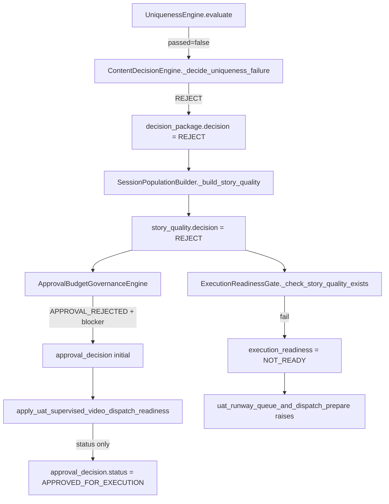

# PHASE E2E-40S — Story Quality REJECT Root Cause Audit

**Audit date:** 2026-06-02  
**Session under audit:** `exec_uat_20260602_183049`  
**Scope:** Audit only — no code or rule changes.

---

## Executive summary

`story_quality.decision = REJECT` for this session is **not** produced by Story Intelligence scoring. The composite story score is **88.6** (above governance minimum **70**). REJECT is copied from **`ContentDecisionEngine`**, which hard-rejects when **`UniquenessEngine`** reports critical collision: `uniqueness_score = 0.0` and `max_similarity = 1.0`, crossing production thresholds `<= 40` and `>= 0.85` respectively.

The session topic (`girls dancing  and singing under rain street`) differs from the single prior uniqueness memory record (`Girl in Rain`, written at **18:16:43**), but the **canonical six-beat story template** matches that record exactly, producing **beat_sequence_fingerprint similarity 1.0** — the decisive failure.

Supervised UAT approval patches `approval_decision.status` to `APPROVED_FOR_EXECUTION` but **does not** clear `story_quality` REJECT; `ExecutionReadinessGate` remains **NOT_READY**, blocking Runway dispatch.

---

## Session facts

| Field | Value |
|-------|--------|
| **execution_session_id** | `exec_uat_20260602_183049` |
| **brief_id** | `brief_20260602_183049_19611a9a` |
| **User topic** | `girls dancing  and singing under rain street` |
| **Requested duration** | 40s (`user_duration_requested`: 40) |
| **Planned clips** | 5 × 10s → 50s aligned target (`video_format` planner) |
| **Provider** | `runway_browser` |
| **Final session state** | `NOT_READY` |
| **Readiness failures** | Story quality REJECT + critical failures |

**Evidence path:** `storage/content_brain/execution/sessions/exec_uat_20260602_183049.json`

---

## Decision propagation chain



---

## Answers to audit questions

### 1. Which engine produced REJECT?

**Primary:** `ContentDecisionEngine` (`content_brain/engines/content_decision_engine.py`).

**Upstream cause:** `UniquenessEngine` (`content_brain/engines/uniqueness_engine.py`) set `uniqueness_report.passed = false` before viral tier logic could yield PROCEED.

**Not the producer of REJECT (but involved in the report):**

| Engine | Role |
|--------|------|
| `StoryIntelligenceEngine` | Supplies composite **88.6** — passes |
| `ViralScoringEngine` | Composite **67.02**, tier B; `passed_gate: false` due to uniqueness dimension **0.0** — symptom, not root veto |
| `SessionPopulationBuilder` | **Copies** `decision_package` → `story_quality.decision` |
| `ApprovalBudgetGovernanceEngine` | Mirrors content REJECT into approval blockers |
| `ExecutionReadinessGate` | Enforces persisted `story_quality` REJECT at dispatch |

---

### 2. Which exact rule failed?

**Content Decision Engine** — uniqueness failure branch (evaluated because `not uniqueness_report.passed`):

```329:341:content_brain/engines/content_decision_engine.py
    def _decide_uniqueness_failure(
        self,
        uniqueness_report: UniquenessReport,
        reasons: list[str],
    ) -> tuple[ContentDecision, float]:
        if (
            uniqueness_report.uniqueness_score <= self.REJECT_UNIQUENESS_SCORE
            or uniqueness_report.max_similarity >= self.REJECT_SIMILARITY_THRESHOLD
        ):
            reasons.append(
                "Uniqueness failed with critically high similarity or very low uniqueness score."
            )
            return ContentDecision.REJECT, 0.9
```

**Constants:** `REJECT_UNIQUENESS_SCORE = 40.0`, `REJECT_SIMILARITY_THRESHOLD = 0.85`.

**Uniqueness Engine** — layer rules (profile `uniqueness_rules.layers` + twist collision). Failed layers in session:

| Layer | Similarity | Threshold | Passed |
|-------|------------|-----------|--------|
| `topic_similarity` | 0.1111 | 0.72 | yes |
| `hook_fingerprint` | 0.8143 | 0.68 | **no** |
| `beat_sequence_fingerprint` | **1.0** | 0.7 | **no** |
| `twist_type_collision` | 0.8615 | 0.65 | **no** |
| `generic_pattern_detection` | 0.0 | — | yes |
| `niche_banned_patterns` | 0.0 | — | yes |

Aggregate gate (engine-internal): `uniqueness_score >= uniqueness_gate_minimum_score (65)` — **failed** because `uniqueness_score = 0.0` and failed layers present.

**Regeneration directive emitted:** `Keep topic; change hook class and opening.`

---

### 3. Which score failed?

| Score | Value | Gate / role | Result |
|-------|-------|-------------|--------|
| **uniqueness_score** | **0.0** | `<= 40` → REJECT; viral min **65** | **Failed (critical)** |
| **max_similarity** | **1.0** | `>= 0.85` → REJECT | **Failed (critical)** |
| Viral composite | 67.02 | min gate 65.0 | Below gate (uniqueness dimension 0.0) |
| Story Intelligence composite | **88.6** | story_quality_min 70 | **Passed** |
| execution_confidence_estimate | 80.6 | min 60 | **Passed** |
| retention_score_estimate | 100.0 | — | **Passed** |
| story_memory_* | ~0.11 | SAFE | **Passed** |

The **story_quality composite 88.6** is Story Intelligence quality, not the uniqueness/viral veto.

---

### 4. Which threshold was crossed?

| Threshold | Config value | Observed | Effect |
|-----------|--------------|----------|--------|
| `REJECT_UNIQUENESS_SCORE` | **40.0** | uniqueness_score **0.0** | REJECT |
| `REJECT_SIMILARITY_THRESHOLD` | **0.85** | max_similarity **1.0** | REJECT |
| `beat_sequence_fingerprint` layer | **0.7** | **1.0** | Layer fail → drives max_similarity |
| `hook_fingerprint` layer | **0.68** | **0.8143** | Layer fail |
| `twist_type_collision` layer | **0.65** | **0.8615** | Layer fail |
| `uniqueness_gate_minimum_score` (profile) | **65** | **0.0** | `uniqueness_report.passed = false` |
| `story_quality_min` (governance) | **70** | **88.6** | Not blocking |

---

### 5. Full Story Quality report (session)

From `exec_uat_20260602_183049.json` → `story_quality`:

```json
{
  "composite_score": 88.6,
  "score": 88.6,
  "decision": "REJECT",
  "critical_failures": [
    "Uniqueness failed with critically high similarity or very low uniqueness score."
  ],
  "warnings": [
    "uniqueness",
    "Keep topic; change hook class and opening.",
    "Packaging skipped: brief decision is REJECT.",
    "Resolve upstream scoring or uniqueness issues before generating titles.",
    "Memory: Switch reveal_type to the least-used twist in recent channel history.",
    "Memory: Flatten mid-section tension and spike payoff later in the arc.",
    "Viral score gate not passed."
  ],
  "cost_risk_score": 0.11,
  "metadata": {
    "viral_composite": 67.02,
    "production_tier": "B",
    "memory_decision": "SAFE",
    "story_intelligence_applied": true,
    "source_engines": [
      "story_intelligence",
      "story_memory",
      "content_decision",
      "viral_scoring"
    ]
  },
  "originality_score": 92.0,
  "cinematic_score": 100.0,
  "emotional_tension_score": 53.2,
  "visual_diversity_score": 100.0,
  "scene_necessity_score": 100.0,
  "visual_note_count": 5
}
```

**Related upstream package** (`brief_snapshot.decision_package`):

```json
{
  "decision": "REJECT",
  "confidence": 0.9,
  "reasons": [
    "Uniqueness failed with critically high similarity or very low uniqueness score."
  ],
  "weak_dimensions": ["uniqueness"],
  "revision_targets": ["hook", "story_beats", "trend_context"],
  "regeneration_required": false,
  "priority_fixes": ["Keep topic; change hook class and opening."],
  "production_ready": false
}
```

---

### 6. All critical failures

**`story_quality.critical_failures` (authoritative for readiness):**

1. `Uniqueness failed with critically high similarity or very low uniqueness score.`

**`execution_readiness.readiness_failures`:**

1. `Story quality decision is REJECT.`
2. `Story quality has critical failures.`

**Governance / approval blockers (persist after UAT override):**

- `Content gate: REJECT` on `approval_decision.blockers`

**Dispatch failure (operator-visible):** `uat_runway_queue_and_dispatch_prepare` raises because readiness ∉ `{READY, READY_WITH_WARNINGS}` after supervised patch.

---

### 7. Why did the 40s planning probe return PROCEED while this run returned REJECT?

**Planning probe (documented in `PHASE_E2E_40S_VALIDATION_REPORT.md`):**

- One-shot `ContentBriefOrchestrator.run()` with topic **`Girl in Rain`**, `user_duration_seconds=40`, production memory path.
- Run **before** uniqueness memory contained the canonical `Girl in Rain` fingerprint (or against empty history).
- Result: **`decision = PROCEED`**, `production_ready = true`, `planned_clip_count = 5`.
- Default orchestrator flag **`record_uniqueness_on_success=True`** — a successful PROCEED **writes** to `storage/content_brain/memory/uniqueness/content_history.json`.

**Current memory (1 record, explains later failures):**

```json
{
  "record_id": "uniq_e792a4abf5",
  "created_at": "2026-06-02 18:16:43",
  "topic": "Girl in Rain",
  "beat_sequence": [
    "HOOK_BEAT", "CONTEXT_BEAT", "ESCALATION_BEAT",
    "PATTERN_BREAK", "PAYOFF_BEAT", "LOOP_SEED"
  ],
  "hook_class": "moral_discomfort",
  "reveal_type": "comparison_reveal"
}
```

**Timeline:**

| Event | Session / action | Uniqueness vs memory | Decision |
|-------|------------------|----------------------|----------|
| 17:01 | `exec_uat_20260602_170119` — topic `girl in rain` | **0 prior records** (`record_uniqueness_on_success=False` in UAT) | **PROCEED** — full 10s smoke E2E |
| ~18:16 | E2E **planning probe** — `Girl in Rain` @ 40s | **0 prior** → then **records** fingerprint | **PROCEED** (pollutes memory) |
| 18:22 | `exec_uat_20260602_182215` — `Girl in Rain` @ 40s | **1 prior**, all layers **1.0** | **REJECT** |
| 18:30 | **`exec_uat_20260602_183049`** — UI topic `girls dancing…` | **1 prior**; topic OK; **beat_sequence 1.0** | **REJECT** |

**This audited session** used a **different topic string** than the memory record but the **same default story beat template**, so `beat_sequence_fingerprint` hit **1.0** while `topic_similarity` stayed low (**0.1111**).

**UAT runtime** (`uat_runtime_engine.py`) sets `record_uniqueness_on_success=False` — evaluation still runs against persisted memory; failures are from **similarity**, not from recording the current run.

---

### 8. REJECT cause classification

| Hypothesis | Verdict | Evidence |
|------------|---------|----------|
| **Topic** | **Partial** | Topic text differs from memory; `topic_similarity` **passed**. Not sole cause. |
| **Duration (40s)** | **No** | 5-clip plan succeeded; duration not in decision reasons. |
| **Retention** | **No** | `retention_score_estimate`: 100.0; retention_architecture viral dim: 100.0. |
| **Continuity** | **No** | SI continuity notes present; `continuity_risk`: low in simulation. |
| **Confidence** | **No** | `execution_confidence_estimate`: 80.6 (> 60). |
| **Story quality score (88.6)** | **No** | Above `story_quality_min` 70; decision still REJECT via content gate. |
| **Missing fields** | **No** | `required_fields_completeness` readiness check **passed**. |
| **Uniqueness / similarity** | **Yes — root** | `uniqueness_score` 0.0, `max_similarity` 1.0, three layer fails. |

---

### 9. Can supervised UAT approval override REJECT today?

**No — not for video dispatch readiness.**

`apply_uat_supervised_video_dispatch_readiness` only sets:

- `approval_decision.status` → `APPROVED_FOR_EXECUTION`
- `approval_state` → `approved`
- `session.state` → `GOVERNED` (transient)

It does **not** modify `story_quality.decision`, `critical_failures`, or `brief_snapshot.decision_package`.

`ExecutionReadinessGate._check_story_quality_exists` still fails when:

```294:302:content_brain/execution/execution_readiness_gate.py
        decision = str(story_quality.get("decision", "")).upper()
        if decision in {"REJECT", "REGENERATE"}:
            failures.append(f"Story quality decision is {decision}.")
        ...
        critical = story_quality.get("critical_failures") or []
        if critical:
            failures.append("Story quality has critical failures.")
```

**Session proof:** `approval_decision.status = APPROVED_FOR_EXECUTION` with `blockers: ["Content gate: REJECT"]` and `execution_readiness.decision = NOT_READY`.

Initial governance for this session also set `recommended_state: REJECTED` (`state_history`: `approval=REJECTED`) before the bridge override.

---

### 10. Minimum change for a true 40s E2E validation run (without weakening production rules)

Production thresholds (`REJECT_UNIQUENESS_SCORE`, `REJECT_SIMILARITY_THRESHOLD`, layer thresholds, `story_quality_min`) should **remain unchanged**. Minimum viable path:

#### A. Content input (operator / brief — no rule changes)

1. **Regenerate** per directive: *Keep topic; change hook class and opening* — and alter **story beat sequence** or `reveal_type` so `beat_sequence_fingerprint` and `twist_type_collision` fall below layer thresholds.
2. **Or** use a **novel topic + story structure** with no collision against `content_history.json` (all layers pass, `uniqueness_score >= 65`).

#### B. Test hygiene (harness / process — not production rule relaxation)

3. **Stop polluting production uniqueness memory from validation probes:** run E2E planning probes with `record_uniqueness_on_success=False` (same as UAT), or isolated `memory_path` under a temp directory — mirrors `content_brief_orchestrator` self-test pattern at line 653–660.
4. **Align UAT submission topic** with harness intent **only after** memory is clean or content is differentiated — using `Girl in Rain` again without structural change will reproduce `182215`-class **full 1.0** collision.

#### C. What will NOT work

- **Supervised UAT approval alone** — does not bypass `story_quality` REJECT.
- **Lowering** uniqueness or story-quality thresholds — would weaken production rules (out of scope).
- **40s duration flag alone** — planning already supports 5 clips; blocker is uniqueness, not duration.

#### Recommended single runbook for next 40s attempt

1. Remove or archive the test-only row in `storage/content_brain/memory/uniqueness/content_history.json` **only if** it exists solely from the E2E planning probe (operational cleanup of test pollution, not a rule change).
2. Re-run UAT with **`Girl in Rain`** (or chosen topic) **after** changing `hook_class` + opening + at least one beat/reveal variant so uniqueness passes.
3. Keep `UAT_E2E_VALIDATION_FULL_DURATION=1` for duration caps.
4. Fix harness probe to `record_uniqueness_on_success=False` before further probes (prevents recurrence).

---

## Comparative sessions (context)

| Session | Topic | Uniqueness | story_quality.decision | Video dispatch |
|---------|-------|------------|------------------------|----------------|
| `exec_uat_20260602_170119` | girl in rain | passed (0 prior) | PROCEED | Completed (10s smoke) |
| `exec_uat_20260602_182215` | Girl in Rain | all layers 1.0 | REJECT | Blocked |
| **`exec_uat_20260602_183049`** | girls dancing… | beat 1.0, hook/twist fail | **REJECT** | Blocked after UAT override |

---

## Key file references

| Component | Path |
|-----------|------|
| Session artifact | `storage/content_brain/execution/sessions/exec_uat_20260602_183049.json` |
| Uniqueness memory | `storage/content_brain/memory/uniqueness/content_history.json` |
| Content decision | `content_brain/engines/content_decision_engine.py` |
| Uniqueness evaluation | `content_brain/engines/uniqueness_engine.py` |
| Story quality mapping | `content_brain/execution/session_population_builder.py` |
| Readiness gate | `content_brain/execution/execution_readiness_gate.py` |
| UAT supervised patch | `content_brain/execution/uat_real_video_bridge.py` |
| UAT no-record flag | `content_brain/execution/uat_runtime_engine.py` (~970) |
| E2E validation report | `project_brain/PHASE_E2E_40S_VALIDATION_REPORT.md` |

---

## Audit conclusion

**Root cause:** `UniquenessEngine` critical collision against one persisted prior record (seeded by the E2E **Girl in Rain** 40s planning probe), triggering `ContentDecisionEngine` hard REJECT thresholds. `SessionPopulationBuilder` surfaces that as `story_quality.decision = REJECT`. Supervised UAT approval does not clear it; `ExecutionReadinessGate` blocks real 40s video dispatch.

**Not root cause:** 40s duration, retention, continuity, execution confidence, Story Intelligence composite 88.6, or missing session fields.
