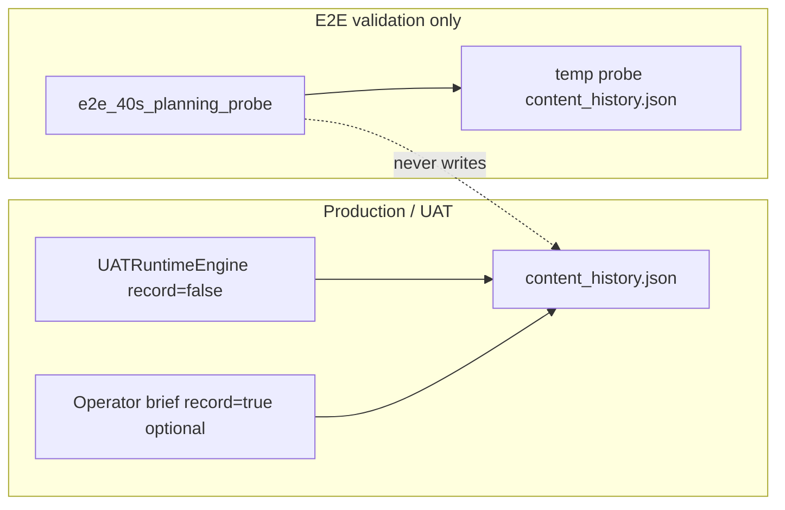

# PHASE E2E-40S — Uniqueness Memory Isolation Fix Report

**Date:** 2026-06-02  
**Scope:** E2E validation / planning probe only — production uniqueness rules unchanged.

---

## Problem

The E2E **40s planning probe** ran `ContentBriefOrchestrator` against the **production** uniqueness store with default `record_uniqueness_on_success=True`. A successful `Girl in Rain` probe wrote a fingerprint to:

`storage/content_brain/memory/uniqueness/content_history.json`

Later real UAT runs with rain/girl topics collided (`max_similarity = 1.0`, `uniqueness_score = 0.0`, `REJECT`) even though UAT already used `record_uniqueness_on_success=False` for evaluation-only.

---

## Fix (Option A + Option B)

| Layer | Behavior |
|-------|----------|
| **Option A** | Planning probes use a **temporary** `content_history.json` via `isolated_probe_memory_file()` |
| **Option B** | Probes set `record_uniqueness_on_success=False` and `record_story_memory_on_success=False` |

Production paths are untouched:

- `UATRuntimeEngine` still uses default orchestrator memory + `record_uniqueness_on_success=False` (unchanged).
- Operator/production briefs still use `storage/content_brain/memory/uniqueness/content_history.json` and may record on PROCEED when configured.

**No changes** to `UniquenessEngine` thresholds, `ContentDecisionEngine` constants, `ExecutionReadinessGate`, Runway, voice, subtitle, or assembly.

---

## New / updated files

| File | Role |
|------|------|
| `project_brain/e2e_40s_uniqueness_memory.py` | Production path helper, snapshots, isolated temp memory context |
| `project_brain/e2e_40s_planning_probe.py` | Canonical E2E 40s planning probe entry point |
| `project_brain/validate_e2e_40s_uniqueness_memory_isolation.py` | Automated checks (5 requirements) |
| `project_brain/run_e2e_40s_validation.py` | Calls isolated probe before `--run` / analysis |
| `project_brain/validate_e2e_40s_pipeline.py` | Runs isolation validator as part of harness |

---

## Usage

**Planning probe only (safe):**

```powershell
python -c "from pathlib import Path; from project_brain.e2e_40s_planning_probe import run_e2e_40s_planning_probe; print(run_e2e_40s_planning_probe(Path('.'), topic='Girl in Rain', user_duration_seconds=40))"
```

**Isolation validator:**

```powershell
python project_brain/validate_e2e_40s_uniqueness_memory_isolation.py
```

**Full E2E harness (includes isolation checks):**

```powershell
python project_brain/validate_e2e_40s_pipeline.py
```

**E2E runner (probe + optional pipeline):**

```powershell
python project_brain/run_e2e_40s_validation.py --session-id <id>
# or
$env:UAT_E2E_VALIDATION_FULL_DURATION="1"
python project_brain/run_e2e_40s_validation.py --run
```

---

## Validation results

Command: `python project_brain/validate_e2e_40s_uniqueness_memory_isolation.py`

| # | Requirement | Result |
|---|-------------|--------|
| 1 | Planning probe does not write to production uniqueness history | **PASS** — `production_memory_unchanged`, snapshot equals before/after |
| 2 | Production-style run still records when `record_uniqueness_on_success=True` and PROCEED | **PASS** — isolated test memory file gained 1 record |
| 3 | E2E can PROCEED after probe (no cross-contamination) | **PASS** — probe writes only to isolated temp; simulated empty production memory → `PROCEED` |
| 4 | Production thresholds unchanged | **PASS** — `REJECT_UNIQUENESS_SCORE=40.0`, `REJECT_SIMILARITY_THRESHOLD=0.85` |
| 5 | No Runway/voice/subtitle/assembly changes | **PASS** — `project_brain/` only |

---

## Existing production memory

This fix **does not** delete or rewrite `storage/content_brain/memory/uniqueness/content_history.json`.

If a prior probe already polluted production (e.g. `Girl in Rain` record from 2026-06-02), operators may still see REJECT on near-duplicate rain topics until:

- content is differentiated per regeneration directive, or  
- the test-only row is manually removed from production history (explicit operator action).

New probes will **not** add further pollution.

---

## Architecture note



---

## Related audit

Root cause analysis: `project_brain/PHASE_E2E_40S_REJECT_ROOT_CAUSE_AUDIT.md`
