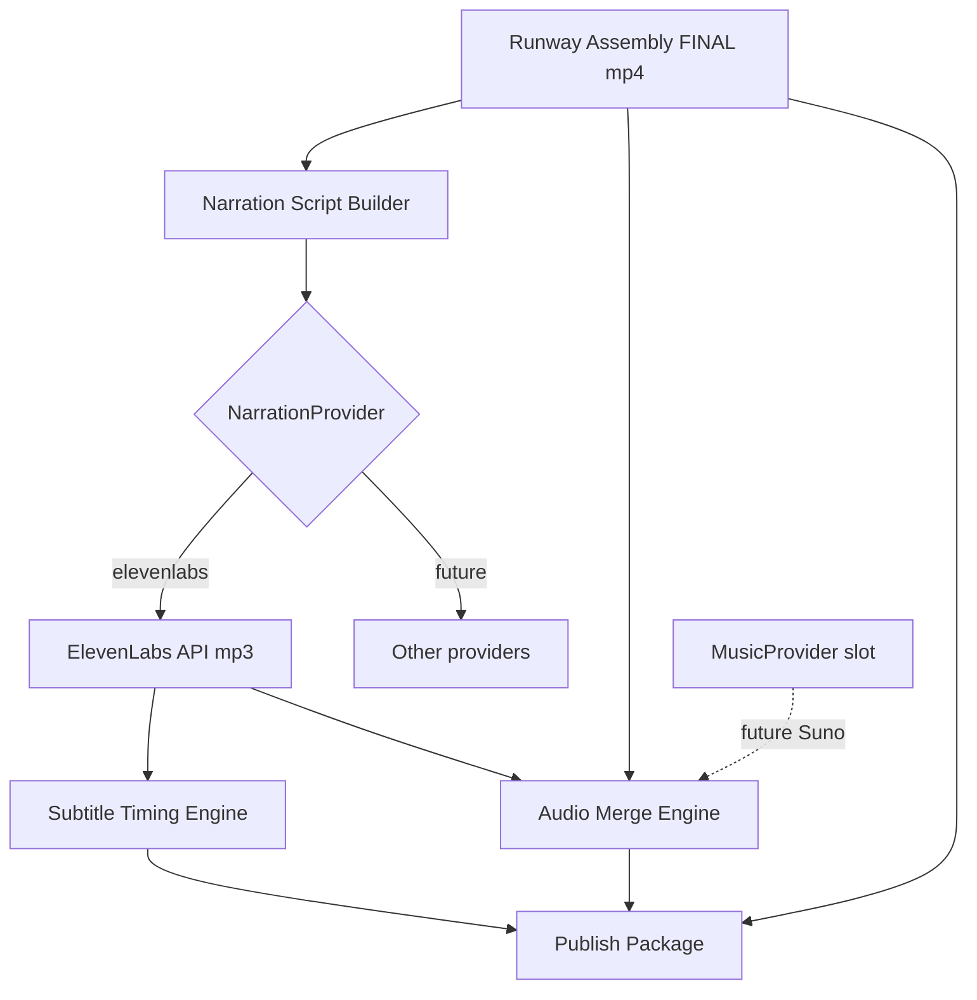

# Phase ElevenLabs Runtime v1 Report

## Summary

Extended the live post-processing pipeline after assembly with a Suno-ready audio architecture: narration provider abstraction, ElevenLabs runtime, narration script builder, audio merge, real subtitle timing, and publish package enrichment.

No Runway automation or provider router changes were made.

## Target Pipeline (implemented segment)

```
Assembly → Narration Provider → Audio Merge → Subtitle Generator → Publish Package
                              ↘ MusicProvider slot (Suno future)
```

## Files Created

| Path | Purpose |
|------|---------|
| `providers/audio/base.py` | `NarrationProvider`, `MusicProvider` interfaces |
| `providers/audio/elevenlabs_provider.py` | ElevenLabs narration provider |
| `providers/audio/local_music_provider.py` | Local MP3 + Suno placeholder |
| `providers/audio/provider_registry.py` | Provider resolution |
| `providers/audio/__init__.py` | Package exports |
| `content_brain/audio/narration_script_builder.py` | Director-aware narration script |
| `content_brain/audio/narration_engine.py` | Script + provider orchestration |
| `content_brain/audio/audio_merge_engine.py` | FFmpeg video + narration merge |
| `content_brain/audio/subtitle_timing_engine.py` | Real SRT/VTT timing from audio |
| `content_brain/audio/audio_post_processing.py` | Post-assembly audio orchestrator |
| `content_brain/audio/__init__.py` | Audio runtime exports |
| `project_brain/validate_elevenlabs_runtime_v1.py` | Validation suite |
| `project_brain/PHASE_ELEVENLABS_RUNTIME_V1_REPORT.md` | This report |

## Files Modified

| Path | Change |
|------|--------|
| `content_brain/execution/runway_live_post_processor.py` | Calls `run_audio_post_processing()` after assembly; publish package includes narration assets |
| `content_brain/product_settings/channel_profile_store.py` | `default_voice`, `default_narration_provider`, `music_provider` |
| `ui/api/schemas/product_studio.py` | Channel profile DTO fields |
| `ui/web/src/api/productClient.ts` | Channel profile types |
| `ui/web/src/pages/SettingsPage.tsx` | Future-ready audio settings (Suno disabled) |

## Architecture Diagram



## Provider Abstraction

- **NarrationProvider**: `validate_connection()`, `get_available_voices()`, `generate_voice()`
- **MusicProvider**: `validate_connection()`, `generate_music()` — Suno stub returns `NOT_IMPLEMENTED`
- Publish package reads provider ids from settings/manifests — no hardcoded ElevenLabs in publish copy logic

## Future Suno Integration Path

1. Implement `SunoMusicProvider.generate_music()` using Suno API
2. Set `music_provider` in channel profile (UI already reserved)
3. `AudioMergeEngine` already accepts optional `music_audio_path` and amix filter
4. No refactor of narration or publish orchestration required

## Hook Location

`run_live_post_processing()` in `runway_live_post_processor.py`:

1. Assembly
2. **`run_audio_post_processing()`**
3. Publish package (with `audio_post_result`)

## Publish Package Contents (when audio completes)

- `FINAL_RUNWAY_PHASE_I_VIDEO.mp4`
- `FINAL_RUNWAY_PHASE_I_NARRATED.mp4`
- `narration/narration_script.txt`
- `narration/narration.mp3`
- `subtitles/subtitles.srt` + `.vtt` (real timing when narration succeeds)
- `metadata.json` with `narration_provider`, `voice_id`, `duration_seconds`

## User Settings

- `default_voice` — ElevenLabs voice_id override (optional)
- `default_narration_provider` — `elevenlabs` or `none`
- `music_provider` — `none` (Suno controls not exposed)

API keys remain in environment (`ELEVENLABS_API_KEY`) — not exposed in UI.

## Validation Results

Run:

```bash
python project_brain/validate_elevenlabs_runtime_v1.py
```

Result: **ALL PASS** (includes `validate_director_layer_v1.py` and `validate_live_post_processing_hook.py` regression).

## Runway Automation Unchanged

- `runway_ui_navigator.py` — untouched
- `RunwayLiveSmokeRunner` automation path — untouched
- Provider router — untouched
- Extension occurs only in post-assembly post-processing
