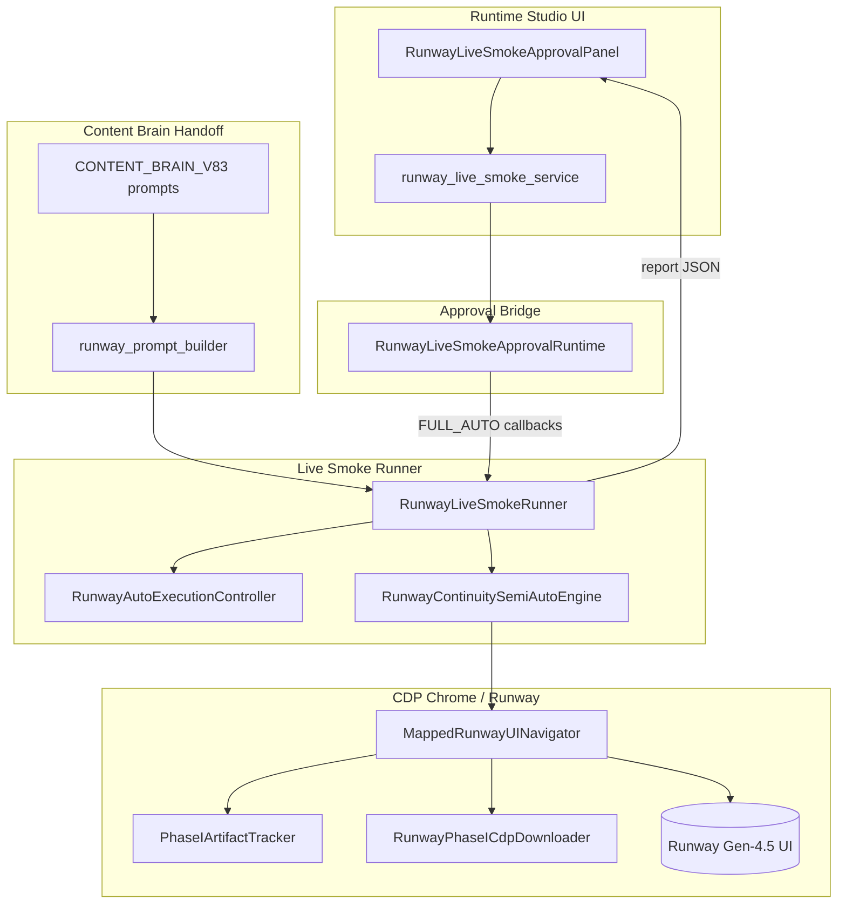
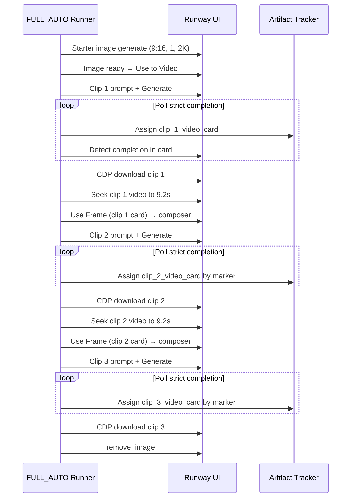

# Phase I-A — First Successful 3-Clip Continuity Run

**Status:** PASS (first verified end-to-end live run)  
**Phase:** `runway_starter_to_video_i_3clip_v1`  
**Project:** `phase_i_live`  
**Execution mode:** `FULL_AUTO`  
**Source report:** `project_brain/runway_phase_i_3clip_last_report.json`  
**Prompt handoff:** Content Brain V8.3 (`cb_e2e_20260608_214146_fcbcf78e`)  
**Topic:** The Ants  
**Runway session:** `5920152d-ba9d-4d74-81c0-534f4b43486c`  
**Started:** 2026-06-08 21:43:08  
**Finished:** 2026-06-08 22:37:16  
**Final status:** `completed`

---

## Executive Summary

This documents the **first successful live CDP run** that completed the full Phase I continuity chain:

1. Starter image (9:16, 1×, 2K)  
2. Use to Video → Clip 1  
3. Use Frame @ ~9.2s → Clip 2  
4. Use Frame @ ~9.2s → Clip 3  
5. CDP download for all three clips  
6. Final `remove_image` cleanup  

All 37 semi-auto steps completed. Three distinct clip cards were assigned (`clip_1_video_card`, `clip_2_video_card`, `clip_3_video_card`). Both Use Frame handoffs verified as `composer_ready`.

---

## Timing Summary

| Metric | Duration | Notes |
|--------|----------|-------|
| **Total runtime** | **54 min 8 sec** | 21:43:08 → 22:37:16 |
| Pre-clip pipeline (probe → image → Use to Video) | ~9 min 31 sec | Through 21:52:29 |
| Clip 1 Runway generation | **15 min 45 sec** | Generate 21:52:29 → complete 22:08:14 |
| Clip 2 Runway generation | **15 min 55 sec** | Generate 22:08:26 → complete 22:24:21 |
| Clip 3 Runway generation | **12 min 9 sec** | Generate 22:24:34 → complete 22:36:43 |
| Post-clip cleanup | ~33 sec | Download clip 3 → remove_image → finish |

### Per-clip generation time (Generate click → strict completion)

| Clip | Generate (local) | Completion / download gate | Generation wall time |
|------|------------------|----------------------------|--------------------|
| 1 | 21:52:29 | 22:08:14 | **~15m 45s** |
| 2 | 22:08:26 | 22:24:21 | **~15m 55s** |
| 3 | 22:24:34 | 22:36:43 | **~12m 9s** |

### Download times (CDP fetch at approval gate)

Downloads are triggered immediately when strict completion passes. File timestamps match gate times:

| Clip | Gate / file timestamp | Strategy | Scoped to card |
|------|----------------------|----------|----------------|
| 1 | 22:08:14 | `cdp_fetch` | Yes |
| 2 | 22:24:21 | `cdp_fetch` | Yes |
| 3 | 22:36:43 | `cdp_fetch` | Yes |

**Output files:**

- `downloads/runway/runway_clip_1_session_20260608_220814.mp4`
- `downloads/runway/runway_clip_2_session_20260608_222421.mp4`
- `downloads/runway/runway_clip_3_session_20260608_223643.mp4`

CDP fetch itself is sub-second per clip; wall time is dominated by Runway generation polling (~2s poll interval during `wait_for_strict_clip_completion`).

### Use Frame handoff times (seek → click → composer ready → next generate)

| Transition | Seek time | Strategy | Click | Handoff result | Gap to next Generate |
|------------|-----------|----------|-------|----------------|----------------------|
| Clip 1 → 2 | **9.2 s** | `duration_minus_0.7s` | Success (attempt 1) | `composer_ready` | **~12 s** (22:08:14 → 22:08:26) |
| Clip 2 → 3 | **9.2 s** | `duration_minus_0.7s` | Success (attempt 1) | `composer_ready` | **~13 s** (22:24:21 → 22:24:34) |

Each handoff includes: strict completion check on source clip → seek on source card video → pause → Use Frame click → settle → handoff verification → clip prompt fill → settings → Generate.

---

## Prompts Used

**Handoff:** `CONTENT_BRAIN_V83` / `content_brain_live_smoke_handoff_v1_1`  
**Prompt file:** `project_brain/content_brain_test_results/latest.runway_prompts.txt`

| Asset | Marker | Story beat | Chars |
|-------|--------|------------|-------|
| Starter image | (hero frame) | Intro / colony / lab observation setup | 1932 |
| Clip 1 | `Clip 1 of 3` | Open — foraging behavior | 1198 |
| Clip 2 | `Clip 2 of 3` | Middle — species diversity, colony roles, pheromones | 1331 |
| Clip 3 | `Clip 3 of 3` | Close — ecosystem impact | 1196 |

**Continuity anchors (all clips):**

- Character: entomologist specializing in ants  
- Location: forest floor, ant colonies, laboratory observation  
- Lighting / camera / palette: documentary 9:16 vertical lock (see continuity notes in report)  
- Clip 1 opens via **Use to Video** from starter image  
- Clips 2–3 open via **Use Frame** from prior clip last safe frame  

**Prompt quality audit (from report):**

- `prompts_three_unique`: true  
- `continuity_preserved_all_clips`: true  
- `setting_locked` / `wardrobe_locked`: true  
- `character_locked`: false (story brief character vs. continuity anchor mismatch — non-blocking)  
- Story progression audit: weak discovery/escalation separation (warning only)

---

## Continuity Chain Status

| Check | Result |
|-------|--------|
| `clips_completed` | 3 / 3 |
| `use_frame_after_clips` | [1, 2] |
| Clip 1 card assigned | `clip 1 of 3` — verified |
| Clip 2 card assigned | `clip 2 of 3` — verified |
| Clip 3 card assigned | `clip 3 of 3` — verified |
| Clip 2 Use Frame handoff | `composer_ready`, reference thumbnail detected |
| Clip 3 Use Frame handoff | `composer_ready`, reference thumbnail detected |
| Strict completion (all clips) | `strict_complete` |
| `remove_image_executed` | true |
| `download_confirmed` | true |
| `total_downloads_completed` | 3 |

**Chain flow (as executed):**

```
Starter image → Use to Video → Clip 1 (10s) → download
  → seek 9.2s on Clip 1 card → Use Frame → Clip 2 prompt → generate → download
  → seek 9.2s on Clip 2 card → Use Frame → Clip 3 prompt → generate → download
  → remove_image
```

---

## Failures Encountered During Development

These occurred on **prior runs** while stabilizing Phase I; the successful run above had **zero step failures**.

| # | Symptom | Stopped step / cause |
|---|---------|----------------------|
| 1 | Generate never clicked in FULL_AUTO | False `generation_in_progress` from notification banner; stale CSS on Generate button |
| 2 | All three outputs labeled “Clip 1 of 3”; same starting frame | Async seek before Use Frame; wrong source card; prompt not enforced per clip |
| 3 | Duplicate Generate clicks (parallel same-prompt videos) | Retry loop + `click_control()` fallback double-submitting |
| 4 | UI showed FAIL while browser still progressed | Stale `last_report` during active run; timeline not synced during long polls |
| 5 | Clip 2 “completed” in ~21s; wrong card downloaded | Strict completion matched Clip 1 card for Clip 2 (`clip_marker_mismatch` / missing token scoping) |
| 6 | Use Frame click failed after successful seek | React `node.click()` in evaluate ignored; fixed with pointer events + Playwright mouse click + retries |
| 7 | 25-minute timeout on Clip 1 wait | Global generation flag blocked before card-scoped eval; stale negative-Y cards from prior session |
| 8 | Use Frame handoff timeout (`invalid_card_only`) | Card selected without composer reference thumbnail; re-click + verify loop added |
| 9 | Prompt editor not ready during Clip 2+ while generating | Fatal on timeout even when generation already running |

---

## Fixes That Resolved Them

| Fix area | Module(s) | What changed |
|----------|-----------|--------------|
| Real vs weak generation detection | `runway_ui_navigator.py` | Ignore notification banners; actionable Generate fallback |
| Single-submit Generate policy | `runway_ui_navigator.py`, `runway_auto_execution_controller.py` | Per-clip dedup lock; removed duplicate click fallbacks |
| Last-frame Use Frame | `runway_phase_i_last_frame_use_frame.py` | Seek to `duration - 0.7s`; verify not first frame; scoped click |
| Strict card-scoped completion | `runway_phase_i_strict_completion_gate.py` | Card-first eval; stale card rejection; Apps menu as completion signal |
| Clip N card assignment | `runway_phase_i_artifact_tracker.py`, strict gate | `clip N of` marker matching; exclude prior clip fingerprints |
| Use Frame click reliability | `runway_phase_i_artifact_tracker.py` | Pointer/mouse dispatch; Playwright `mouse.click`; 5-attempt retry; fingerprint refresh |
| FULL_AUTO validation path | `runway_auto_execution_controller.py`, `runway_continuity_semi_auto.py` | Auto-approve gates; skip fatal when generation already started |
| UI runtime sync | `runway_live_smoke_approval_runtime.py`, `runway_live_smoke_service.py`, panel | `running` status during polls; hide stale FAIL; final timeline on finish |
| Per-clip prompt enforcement | `runway_ui_navigator.py` | `ensure_clip_prompt_applied` with `clip N of` marker verification |
| CDP download | `runway_phase_i_cdp_downloader.py` | Card-scoped URL fetch; fallback UI Apps path |

**Reference fix reports:** `PHASE_I_GENERIC_LAST_FRAME_USE_FRAME_FIX_REPORT.md`, `PHASE_I_STRICT_COMPLETION_CARD_SCOPING_FIX_REPORT.md`, `PHASE_I_FALSE_FAIL_WHILE_GENERATING_FIX_REPORT.md`, `PHASE_I_USE_FRAME_HANDOFF_VERIFICATION_REPORT.md`, `PHASE_I_ARTIFACT_TRACKING_AND_CDP_DOWNLOAD_REPORT.md`

---

## Architecture Diagram



**Layer roles:**

| Layer | Responsibility |
|-------|----------------|
| Content Brain handoff | Starter + 3 clip prompts with continuity locks |
| Dry-run plan | 37 steps, 7 logical approval gates (auto in FULL_AUTO) |
| Semi-auto engine | Step execution, gates, failure propagation |
| Navigator | DOM actions: chips, Generate, seek, Use Frame, downloads |
| Artifact tracker | Card fingerprints, clip roles, scoped clicks |
| Strict completion gate | Per-clip “truly done” before download |
| Approval runtime | UI status, timeline, operator surface (legacy MANUAL) |

---

## Final Runtime Flow (37 steps, 3 clips)



**Step budget (approximate wall time this run):**

| Phase | Steps | Wall time |
|-------|-------|-----------|
| Starter image pipeline | 001–012 | ~9.5 min |
| Clip 1 video | 013–019 | ~16 min |
| Clip 2 chain (Use Frame + video) | 020–028 | ~16 min |
| Clip 3 chain (Use Frame + video) | 029–036 | ~13 min |
| Final cleanup | 037 | <1 min |

---

## Known Remaining Weaknesses

1. **Card fingerprint includes document X/Y** — layout scroll after download can stale fingerprints; mitigated by loose tail match + rescan, not eliminated.  
2. **Prior-session cards in feed** — stale “Lion Big Animal” / negative-Y cards appear in DOM; excluded but add scan noise.  
3. **25-minute per-clip wait cap** — sufficient this run (~16 min max); longer Runway queues could still timeout.  
4. **Character lock audit mismatch** — story brief “presenter” vs continuity “entomologist”; prompts align but audit flag remains.  
5. **Story progression audit** — discovery/escalation/payoff separation still weak (content-side, not runtime).  
6. **Browser closed on runner exit** — `BrowserManager.close()` in smoke test `finally`; CDP Chrome may stay open but automation thread ends.  
7. **No in-run video QA** — success is structural (markers, handoff, files exist), not visual continuity review.  
8. **Single-session proof** — one topic, one Runway session; not yet proven across cold starts / N-clip generalization beyond 3.  
9. **Download path** — CDP fetch of CloudFront URL; no checksum / duration validation beyond file size > 0.  
10. **UI timeline granularity** — auto log records gate events, not every poll iteration during 12–16 min waits.

---

## Recommended Hardening Tasks

| Priority | Task | Rationale |
|----------|------|-----------|
| P0 | Add post-download MP4 duration (~10s) + non-zero size assert | Catch empty or truncated CDP pulls |
| P0 | Persist per-step timestamps in report (not only gate events) | Easier ops metrics without parsing action_log |
| P1 | Fingerprint v2: stable ID from card text hash + clip marker, not position | Reduce scroll/layout stale assignments |
| P1 | Session feed hygiene: auto-scroll + hide stale cards before clip N assign | Fewer false candidates from prior runs |
| P1 | Visual continuity smoke (frame diff clip N end vs clip N+1 start) | Validate Use Frame quality beyond structural PASS |
| P2 | Configurable `max_wait_minutes_per_clip` per project / clip index | Clip 3 was faster; asymmetric timeouts save fail time |
| P2 | Keep browser automation alive on non-fatal recoverable errors | Allow manual resume without full restart |
| P2 | Align story brief character with continuity anchor in Content Brain | Clear `character_locked` audit |
| P3 | N-clip parameterized validator on live CDP (4–5 clips) | Prove loop generalizes beyond 3 |
| P3 | Assembly handoff: stitch 3 MP4s with overlap metadata | Close loop to Phase J pipeline |

---

## Validation Commands (reproduce structural PASS)

```powershell
python project_brain/validate_phase_i_last_frame_use_frame.py
python project_brain/validate_phase_i_use_frame_handoff_verification.py
python project_brain/validate_phase_i_strict_completion_card_scoping.py
python project_brain/validate_phase_i_full_auto_mode.py
python project_brain/validate_phase_i_false_fail_while_generating.py
```

Live re-run: Runtime Studio → Phase I panel → FULL_AUTO → 3-clip → topic with Content Brain handoff loaded.

---

## Related Artifacts

| Artifact | Path |
|----------|------|
| Machine report (this run) | `project_brain/runway_phase_i_3clip_last_report.json` |
| Human live report | `project_brain/PHASE_RUNWAY_STARTER_TO_VIDEO_I_3CLIP_LIVE_REPORT.md` |
| Use Frame diagnostics (success) | `project_brain/runway_phase_i_last_frame_use_frame_diagnostics.json` |
| Prompts | `project_brain/content_brain_test_results/latest.runway_prompts.txt` |
| Downloads | `downloads/runway/runway_clip_{1,2,3}_session_20260608_*.mp4` |
| Screenshots | `project_brain/runway_live_smoke_artifacts/phase_i_live_*` |

---

*Phase I-A documents structural and operational success of the first full 3-clip Runway continuity automation run. Visual/narrative quality review is a separate Phase I-B concern.*
