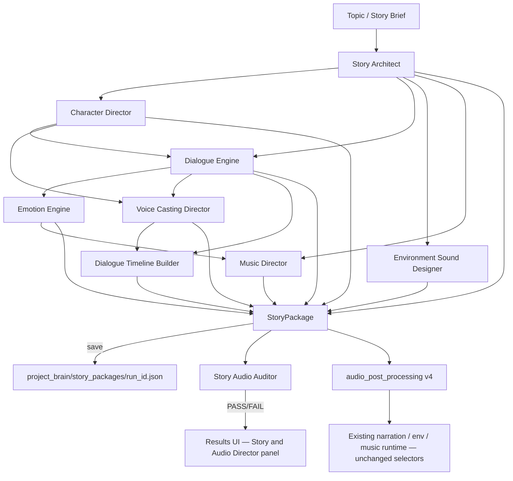

# PHASE STORY-AUDIO-1 — Professional Cinematic Story System

**Status:** Complete  
**Date:** 2026-06-03  
**Scope:** Story + audio director layer on top of existing Content Brain pipeline (Runway, browser, provider router, Visual Memory, AI Director V2 **untouched**).

---

## Goal

Transform output from narrated slideshows into **animated-short-film structure**:

- Named characters with personalities and voice casting
- Actual quoted dialogue (not director stage directions)
- Per-scene emotional arcs
- Environment ambience plans
- Music mood + intensity curves
- Multi-voice dialogue timeline (provider-ready)

---

## Architecture



### Pipeline comparison

| Before | After (STORY-AUDIO-1) |
|--------|------------------------|
| Topic → Story → Runway → single narration → Publish | Topic → Story Architect → Characters → Dialogue → Emotion → Voice/Env/Music directors → Timeline → Audit → Publish |

Runtime video generation (Runway, merge, branding) is unchanged. The new layer **plans** cinematic story/audio before and alongside existing post-processing.

---

## Files created

### Story layer (`content_brain/story/`)

| File | Responsibility |
|------|----------------|
| `story_niche.py` | Genre detection: cartoon, wildlife, technology, history, horror, educational |
| `story_architect.py` | `StoryBlueprint` — hook, setup, conflict, discovery, escalation, climax, resolution, ending CTA, scene progression |
| `character_director.py` | `CharacterProfile` — name, role, age, gender, personality, visual_traits, voice_style, emotional_traits |
| `dialogue_engine.py` | `DialoguePlan` — per-scene dialogue lines, narration, emotional intent |
| `emotion_engine.py` | `EmotionPlan` — joy, curiosity, fear, surprise, sadness, excitement, tension, relief scores per scene |
| `story_package.py` | `StoryPackage` orchestrator + save/load to `project_brain/story_packages/` |

### Audio director layer (`content_brain/audio/`)

| File | Responsibility |
|------|----------------|
| `voice_casting_director.py` | `VoiceCastPlan` — narrator + character voice styles, ElevenLabs/MiniMax/OpenAI-ready |
| `environment_designer.py` | `EnvironmentPlan` — forest/jungle/cave/desert/city/ocean/mountains/snow/space + ambience layers |
| `music_director.py` | `MusicPlan` — mood, intensity curve, climax boost, ending fade |
| `dialogue_timeline_builder.py` | `DialogueTimeline` — separate tracks per speaker (Narrator, Character A, B, …) |

### Quality (`content_brain/quality/`)

| File | Responsibility |
|------|----------------|
| `story_audio_auditor.py` | Fail-closed audit: story arc, dialogue, characters, emotion, ambience, music, voice casting, timeline |

### Validators (`project_brain/`)

- `validate_story_architect.py`
- `validate_character_director.py`
- `validate_dialogue_engine.py`
- `validate_emotion_engine.py`
- `validate_voice_casting_director.py`
- `validate_environment_designer.py`
- `validate_music_director.py`
- `validate_story_audio_auditor.py`

All validators **PASS** for topic `"Cute orange cartoon cat explorer"`.

---

## Integration points

### 1. Audio post-processing (`content_brain/audio/audio_post_processing.py`)

- Version bumped to `audio_design_post_v4`
- Calls `build_and_save_story_package()` before existing audio design
- Persists `story_package_path` and `story_audio_audit` in runway phase-I audio manifest
- Does **not** modify Runway automation, provider router, or merge selectors

### 2. Results loader + UI

- `content_brain/platform/results_run_loader.py` — loads story package, runs auditor, exposes `story_audio_director` panel data
- `ui/api/schemas/product_studio.py` — `story_audio_director` schema field
- `ui/web/src/api/productClient.ts` — TypeScript types
- `ui/web/src/pages/ResultsPage.tsx` — **Story & Audio Director** panel (scores, character/voice counts, environment, music mood)

### 3. Storage

```
project_brain/story_packages/<run_id>.json
```

Example run: `cb_e2e_20260611_225308_dc20bc1f.json` — audit **PASS**, characters Whiskers + Sage, dialogue includes `"Wow! What is that?"`.

---

## Example output (cartoon cat explorer)

**Characters:** Whiskers (young playful cat), Sage (smart protective fox), Narrator (warm storyteller)

**Dialogue (scene 1):**

```
Whiskers: "Wow! What is that?"
Sage: "Be careful, Whiskers!"
Narrator: "The adventure had begun beneath the ancient jungle arch."
```

**Emotion arc:** curiosity → tension → joy

**Environment:** jungle/forest — wind, leaves, birds, footstep movement layers

**Music:** adventure mood with rising intensity curve and ending fade

**Voice cast:** 3 voices (narrator + 2 characters), multi-track timeline ready for ElevenLabs

---

## Circular import fix

Initial wiring caused `story_package → audio.__init__ → audio_post_processing → story_audio_auditor → story_package`.

**Resolution:**

- Lazy `run_audio_post_processing` in `content_brain/audio/__init__.py`
- Lightweight `content_brain/story/__init__.py` and `content_brain/quality/__init__.py`
- Auditor uses `Protocol` instead of importing `StoryPackage` at module load

---

## Future expansion path

| Phase | Work |
|-------|------|
| **STORY-AUDIO-2** | Wire `DialoguePlan` + `DialogueTimeline` into `narration_script_builder` / `narration_engine` so TTS renders character lines, not director prose |
| **STORY-AUDIO-3** | ElevenLabs multi-voice synthesis per timeline track; merge in `audio_mix_engine` |
| **STORY-AUDIO-4** | Consume `EnvironmentPlan` / `MusicPlan` in runtime engines with perceptibility gates (learn from QF-3 validator honesty) |
| **STORY-AUDIO-5** | Screenwriter agent (beat-to-scene prose) between Architect and Dialogue Engine |
| **STORY-AUDIO-6** | Subtitle Director — burn dialogue lines from `DialoguePlan`, not narration script |

---

## Validation commands

```powershell
cd C:\Users\kaman\Desktop\ModirAgentOS
python project_brain/validate_story_architect.py
python project_brain/validate_character_director.py
python project_brain/validate_dialogue_engine.py
python project_brain/validate_emotion_engine.py
python project_brain/validate_voice_casting_director.py
python project_brain/validate_environment_designer.py
python project_brain/validate_music_director.py
python project_brain/validate_story_audio_auditor.py
```

---

## Success criteria (met)

For `"Cute orange cartoon cat explorer"` the system automatically generates:

- [x] Named characters (Whiskers, Sage)
- [x] Actual dialogue (quoted lines, not stage directions)
- [x] Emotional progression (per-scene scores + arc summary)
- [x] Environment audio plan (ambience, weather, movement, animals)
- [x] Music plan (mood + intensity curve)
- [x] Voice casting plan (multi-voice, provider-ready)
- [x] Story package persisted under `project_brain/story_packages/`
- [x] Quality auditor fail-closed (empty package → FAIL)
- [x] Results UI panel
- [x] Eight standalone validators

---

## Not in scope (by design)

- Runway automation / selectors / browser automation
- Provider router
- Upload Center / Automation Center
- Visual Memory Engine / AI Director V2
- Re-mixing or re-burning existing cartoon run video (plan-only layer until STORY-AUDIO-2)
