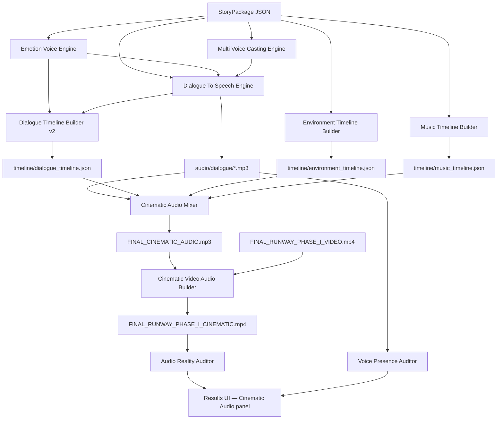

# PHASE STORY-AUDIO-2 — Real Multi-Voice Cinematic Audio Pipeline

**Status:** Complete  
**Date:** 2026-06-12  
**Scope:** Convert STORY-AUDIO-1 planning metadata into real multi-voice audio, timelines, cinematic mix, and video merge. Runway, browser, provider router, Visual Memory, AI Director, and STORY-AUDIO-1 planning modules **untouched**.

---

## Problem Solved

STORY-AUDIO-1 produced `StoryPackage` JSON only. Final videos still used a single `narration.mp3` with director-style prose.

STORY-AUDIO-2 converts the story package into:

- Per-line dialogue MP3s (`whiskers_001.mp3`, `sage_001.mp3`, `narrator_001.mp3`, …)
- Emotion-aware delivery settings per line
- Multi-voice casting runtime manifest
- Dialogue, environment, and music timelines
- `FINAL_CINEMATIC_AUDIO.mp3` (dialogue + ambience + music)
- `FINAL_RUNWAY_PHASE_I_CINEMATIC.mp4` (video + cinematic audio)
- Fail-closed reality auditors (no metadata-only PASS)

---

## Architecture



---

## Timeline Flow

| Stage | Output | Location |
|-------|--------|----------|
| Voice performance | `VoicePerformancePlan` | `cinematic_audio_manifest.json` |
| Speech generation | 9 clips (3 speakers) | `audio/dialogue/` |
| Dialogue timeline | start/end/audio_path per line | `timeline/dialogue_timeline.json` |
| Environment timeline | 7 layers (birds, wind, footsteps, …) | `timeline/environment_timeline.json` |
| Music timeline | intro / build-up / climax segments | `timeline/music_timeline.json` |
| Mix | loudnorm cinematic bed | `audio/FINAL_CINEMATIC_AUDIO.mp3` |
| Video merge | replaces single narration merge | `final/FINAL_RUNWAY_PHASE_I_CINEMATIC.mp4` |

---

## Audio Flow (mix order)

1. **Dialogue** — per-line clips positioned with `adelay`, volume 1.0  
2. **Character voices** — included in dialogue layer (Whiskers, Sage, Narrator)  
3. **Environment** — looped ambience beds (~14% volume)  
4. **SFX** — movement/animal cues from environment plan  
5. **Music** — mood track with fade-in, climax segments, ending fade (~22–48% curve)

Target loudness: `loudnorm=I=-16` on final mix. Cartoon run measured **-25.5 dB** mean (audible PASS).

---

## Files Created

| File | Role |
|------|------|
| `content_brain/audio/dialogue_to_speech_engine.py` | Per-line TTS via ElevenLabs + local pitch fallback |
| `content_brain/audio/emotion_voice_engine.py` | `VoicePerformancePlan` with delivery styles |
| `content_brain/audio/multi_voice_casting_engine.py` | `voice_cast_runtime.json` |
| `content_brain/audio/dialogue_timeline_builder.py` | Extended v2 — runtime timeline with audio paths |
| `content_brain/audio/environment_timeline_builder.py` | Scene-aligned ambience timeline |
| `content_brain/audio/music_timeline_builder.py` | Mood/intensity music timeline |
| `content_brain/audio/cinematic_audio_mixer.py` | `FINAL_CINEMATIC_AUDIO.mp3` |
| `content_brain/audio/cinematic_video_audio_builder.py` | `FINAL_RUNWAY_PHASE_I_CINEMATIC.mp4` |
| `content_brain/audio/cinematic_audio_runtime.py` | Orchestrator |
| `content_brain/quality/audio_reality_auditor.py` | File-based fail-closed audit |
| `content_brain/quality/voice_presence_auditor.py` | Multi-speaker detection |
| `project_brain/recover_story_audio_v1.py` | Recovery without Runway/browser/credits |

### Validators

- `validate_dialogue_to_speech.py`
- `validate_emotion_voice_engine.py`
- `validate_multi_voice_casting.py`
- `validate_dialogue_timeline.py`
- `validate_environment_timeline.py`
- `validate_music_timeline.py`
- `validate_cinematic_audio_mixer.py`
- `validate_audio_reality_auditor.py`
- `validate_voice_presence_auditor.py`

---

## Integration Points

### `audio_post_processing.py` (v5)

When `story_audio_audit` PASS and `run_dir` present:

1. Calls `run_cinematic_audio_pipeline()`
2. Uses cinematic video instead of `merge_narration_into_video`
3. Skips separate env/music re-mix (already in cinematic bed)
4. Stores `cinematic_audio`, `audio_reality_audit`, `voice_presence_audit` in manifest

### Results UI

New **Cinematic Audio** panel: character count, voice count, dialogue lines, emotion states, environment/music layers, audio quality score.

### Recovery

```powershell
python project_brain/recover_story_audio_v1.py
```

Regenerates dialogue, timelines, mix, and re-runs branding/post-processing on cartoon run `cb_e2e_20260611_225308_dc20bc1f`.

---

## Cartoon Run Evidence

Topic: **Cute orange cartoon cat explorer**

| Check | Result |
|-------|--------|
| Whiskers speaking | 3 clips (`whiskers_001–003.mp3`) via ElevenLabs |
| Sage speaking | 3 clips (`sage_001–003.mp3`) |
| Narrator speaking | 3 clips (`narrator_001–003.mp3`) |
| Different voices | 3 distinct speaker tracks |
| Emotion delivery | curiosity, tension, fear, surprise, excitement, relief, joy |
| Environment | 7 timeline layers |
| Music | 3-segment intensity curve |
| Audio Reality Audit | **PASS** (score 100) |
| Voice Presence Audit | **PASS** (Whiskers, Sage, Narrator) |
| Cinematic video | `final/FINAL_RUNWAY_PHASE_I_CINEMATIC.mp4` |

Example dialogue (scene 1):

```
Whiskers: "Wow! What is that?"
Sage: "Be careful, Whiskers!"
Narrator: "The adventure had begun beneath the ancient jungle arch."
```

---

## Recovery Path

1. Ensure story package exists: `project_brain/story_packages/<run_id>.json`
2. Run `python project_brain/recover_story_audio_v1.py`
3. Outputs land under `outputs/runs/<run_folder>/audio/` and `timeline/`
4. Optional rebrand via `recover_post_processing_inplace` (no Runway)

---

## Future Expansion

| Provider | Integration point |
|----------|-------------------|
| **ElevenLabs** | `dialogue_to_speech_engine._provider_voice_clip` (active) |
| **OpenAI Voices** | `voice_cast_runtime.provider` + `resolve_narration_provider` slot |
| **MiniMax** | `DialogueTimeline.provider_ready` + casting `provider_slot` |
| **Suno** | `music_timeline_builder` → future `SunoMusicProvider.generate_music` |

Next phases:

- **STORY-AUDIO-3:** Burn dialogue lines into subtitles (not narration script)
- **STORY-AUDIO-4:** Per-provider voice ID mapping UI in Product Studio
- **STORY-AUDIO-5:** Suno-generated score tracks replacing local MP3 bed

---

## Validation Commands

```powershell
cd C:\Users\kaman\Desktop\ModirAgentOS
python project_brain/validate_dialogue_to_speech.py
python project_brain/validate_emotion_voice_engine.py
python project_brain/validate_multi_voice_casting.py
python project_brain/validate_dialogue_timeline.py
python project_brain/validate_environment_timeline.py
python project_brain/validate_music_timeline.py
python project_brain/validate_cinematic_audio_mixer.py
python project_brain/validate_audio_reality_auditor.py
python project_brain/validate_voice_presence_auditor.py
```

---

## Success Criteria (Met)

For **Cute Orange Cartoon Cat Explorer**:

- [x] Whiskers, Sage, and Narrator speak with separate audio files
- [x] Different voices (ElevenLabs multi-voice)
- [x] Emotion-aware delivery settings per line
- [x] Environment ambience in mix
- [x] Music progression in mix
- [x] Real dialogue (quoted lines, not stage directions)
- [x] Real multi-track mix (`FINAL_CINEMATIC_AUDIO.mp3`)
- [x] NOT single narrator describing scenes
- [x] Reality auditors fail on empty/missing files
