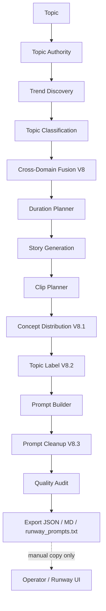
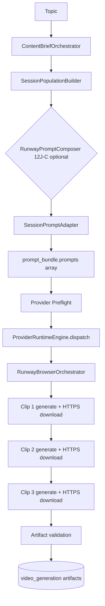
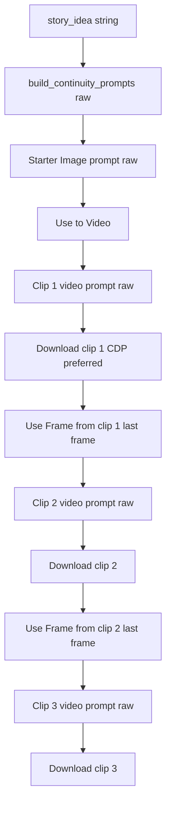
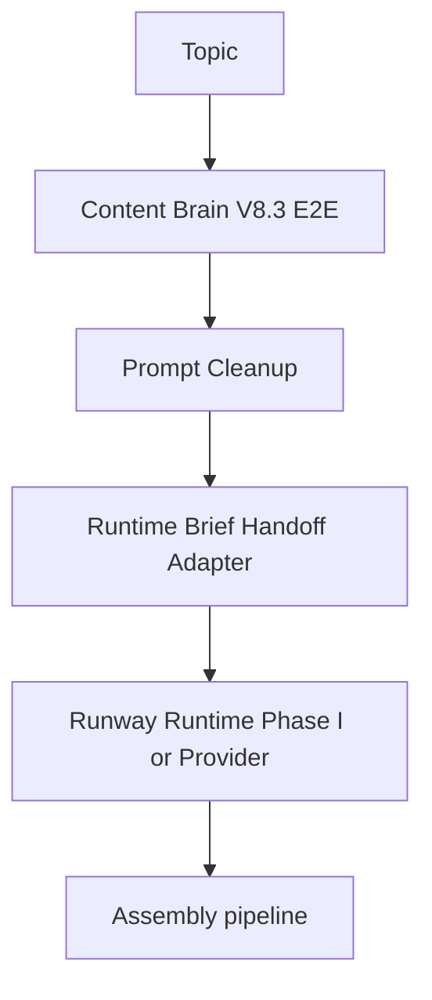

# Phase RUNWAY-RUNTIME-AUDIT — Content Brain V8.3 → Runway Runtime Verification

**Date:** 2026-06-07  
**Scope:** Audit only — no code changes  
**Studio version audited:** `content_brain_e2e_micro_test_studio_v8_3`

---

## Executive Summary

Content Brain V8.3 (fusion, concept distribution, topic labels, prompt cleanup) is **fully implemented and exported** by the **Content Brain E2E Micro Test Studio**, but it is **not automatically consumed** by the production Runway execution paths.

There are **two separate Runway runtime stacks** in this repo:

| Stack | Entry | Prompt source | Starter image | Use Frame continuity |
|-------|--------|---------------|---------------|----------------------|
| **A — Provider Runtime** | `ProviderRuntimeEngine` → `RunwayBrowserOrchestrator` | `SessionPromptAdapter` ← `ContentBriefOrchestrator` brief | **No** | **No** |
| **B — Phase I Live Smoke** | `RunwayLiveSmokeRunner` → `RunwayContinuitySemiAutoEngine` | `build_continuity_prompts(story_idea)` (raw builder) | **Yes** | **Yes** |

**Content Brain Test Studio (V8.3)** is a **third pipeline** that writes exports to `project_brain/content_brain_test_results/` (including cleaned `latest.runway_prompts.txt`). Nothing in Stack A or B reads those exports programmatically today.

**Verdict:** V8.3 outputs are **production-quality in Test Studio**, but **not production-wired**. Runtime still uses older or parallel prompt paths.

---

## 1. Content Brain Export → Runtime Input

### What V8.3 exports (confirmed)

`ContentBrainE2EMicroTestStudio.run()` produces steps including:

| Step key | V8 artifact |
|----------|-------------|
| `cross_domain_fusion` | Fusion weights, `domain_concepts_by_domain`, strategic angle |
| `story_generation` | Story brief with `topic_label`, `concept_distribution`, `clip_assigned_concepts` |
| `concept_distribution` | Per-clip primary/secondary concepts |
| `prompt_generation` | Raw `runway_prompt_builder` output |
| `prompt_cleanup` | Cleaned starter + clip prompts, noise/efficiency scores |
| `export` | `latest.json`, `latest.md`, **`latest.runway_prompts.txt`** |

Export rendering **prefers `prompt_cleanup` over `prompt_generation`**:

- `content_brain/execution/content_brain_e2e_micro_test_studio.py` — `_render_runway_prompts()` reads `step_key == "prompt_cleanup"` first, then falls back to `prompt_generation`.

The Test Studio UI **Runway Prompts** card uses the same preference (`ContentBrainTestStudioPage.tsx`).

### What production runtime consumes (confirmed)

**Provider Runtime / UAT:**

```
ContentBriefOrchestrator.run()
  → SessionPopulationBuilder.build(brief_result)
  → session["brief_snapshot"]
  → (optional) apply_runway_prompt_composer_to_session()  [12J-C composer]
  → SessionPromptAdapter.build(session, provider)
  → execution_runtime["prompt_bundle"]  { prompts: string[] }
  → VideoProviderRouter.generate_clips(prompts)
```

Sources:

- `content_brain/execution/uat_runtime_engine.py` — UAT `content_brain` stage uses `ContentBriefOrchestrator`, not E2E studio.
- `content_brain/execution/provider_runtime_engine.py` — dispatch builds `prompt_bundle` via `SessionPromptAdapter`.
- `content_brain/execution/session_prompt_adapter.py` — reads `brief_snapshot` → `story_intelligence.schema_director_shots` or `director_shots` or `story_blueprint.beats_fallback`.

**Runway Live Smoke:**

```
run_live_smoke_test(story_idea)
  → build_continuity_prompts(story_idea, auto_story_brief=True)
  → RunwayContinuitySemiAutoEngine (starter + clips)
```

Source: `content_brain/execution/runway_live_smoke_test.py` line ~789.

### Gap matrix

| V8.3 artifact | In E2E export | Consumed by Provider Runtime | Consumed by Live Smoke |
|---------------|---------------|------------------------------|------------------------|
| Topic label | ✅ `story.topic_label` | ❌ Not in adapter path | ❌ |
| Cross-domain fusion | ✅ `story.cross_domain_fusion` | ❌ Composer uses story_intelligence, not fusion payload | ❌ |
| Concept distribution | ✅ `story.concept_distribution` | ❌ | ❌ (unless brief has `clip_assigned_concepts`) |
| Cleaned clip prompts | ✅ `prompt_cleanup.clip_prompts` | ❌ | ❌ |
| Cleaned starter image | ✅ `prompt_cleanup.starter_image_prompt` | ❌ (no starter slot in provider bundle) | ❌ (uses raw `build_continuity_prompts` starter) |
| Quality scores (noise, diversity) | ✅ `quality_audit` | ❌ | ❌ |

### Manual bridge only

- **Topic Universe → E2E:** `TopicUniverseStudioService.handoff_to_e2e()` runs `ContentBrainE2EMicroTestStudio` — still **export-only**, no runtime session.
- **Operator copy-paste:** `latest.runway_prompts.txt` is intended for manual Runway entry (documented in UI).

**Conclusion:** There is **no automated Content Brain Export → Runtime Input link**. Confirmed working link is **Test Studio → filesystem export → human operator**.

---

## 2. Starter Image Prompt

### V8.3 path (Test Studio)

- Built in `prompt_generation` via `build_continuity_prompts_from_brief()`.
- Cleaned in `prompt_cleanup` via `resolve_prompt_cleanup()` (dedupe, section compression).
- Exported in `latest.runway_prompts.txt` under `=== STARTER IMAGE PROMPT ===`.

### Provider Runtime path

- `SessionPromptAdapter` produces **`prompts[]` only** — no `starter_image_prompt` field in `PromptBundle`.
- `RunwayBrowserOrchestrator` calls `prepare_clip_for_generate(prompt)` per clip — **text-to-video style**, not Image → Use to Video.

### Live Smoke path

- Uses `bundle.starter_image_prompt` from **`build_continuity_prompts(story_idea)`** directly.
- Does **not** call `resolve_prompt_cleanup()`.
- Does **not** load from E2E export or `latest.runway_prompts.txt`.

**Conclusion:** Runtime does **not** use the cleaned V8.3 starter image prompt. Live Smoke uses a **parallel raw builder path**; Provider Runtime **does not implement starter image at all**.

---

## 3. Clip Prompt Path (Cleanup vs Raw Builder)

### V8.3 Test Studio (correct)

Pipeline order in `content_brain_e2e_micro_test_studio.py`:

```
prompt_generation  →  prompt_cleanup  →  quality_audit (uses cleaned)  →  export (uses cleaned)
```

Quality audit reads prompts from `prompt_cleanup_step` when present (`_step_quality_audit`).

### Live Smoke (raw)

```python
bundle = build_continuity_prompts(self.story_idea, ...)
# clip prompts = bundle.clip_prompts  — NO prompt_cleanup pass
```

Clip text is injected in `runway_continuity_semi_auto.py` via `clip.prompt` from the continuity plan — sourced from raw builder.

**Note:** `runway_prompt_builder.py` **does** support `clip_assigned_concepts` when present on `story_brief`, but Live Smoke’s `auto_story_brief` path never runs concept distribution, so clip-scoped behavior is **inactive** in smoke unless a pre-built brief is passed manually (not implemented in CLI).

### Provider Runtime (different schema entirely)

Clip prompts come from **director shot `prompt_intent` strings** merged by `SessionPromptAdapter` / optional `RunwayPromptComposer` — not from `RunwayContinuityPromptBundle.clip_prompts`.

**Conclusion:** Clips 1–3 in production runtime **do not** use Prompt Cleanup output. Test Studio and validators do; Runway execution paths do not.

---

## 4. Use Frame Continuity

### Where Use Frame exists (confirmed)

**Phase I Live Smoke only:**

- Dry-run plan: `runway_continuity_dry_run.py` — steps `use_frame_for_clip_{2,3}`, `settle_after_use_frame_*`, `verify_use_frame_handoff_*`.
- Runtime execution: `runway_continuity_semi_auto.py` — `prepare_last_frame_use_frame_for_clip()` → scoped Use Frame click.
- Navigator: `runway_ui_navigator.py` — `prepare_last_frame_use_frame_for_clip`, `verify_use_frame_composer_handoff`.
- Last-frame logic: `runway_phase_i_last_frame_use_frame.py`.

Clip 2 is intended to hand off from **final frame of Clip 1**; Clip 3 from Clip 2.

### Where Use Frame does NOT exist

**Provider Runtime / `RunwayBrowserOrchestrator`:**

- Loop: `prepare_clip_for_generate(prompt)` → `click_generate()` → `download_video_url()` for each prompt.
- **No** starter image workflow, **no** Use Frame, **no** continuity semi-auto engine.

**Conclusion:** Use Frame continuity is **real and implemented** in the **Live Smoke / Phase I** path only. It is **not** part of the Provider Runtime video dispatch path. Content Brain V8.3 export is unrelated to Use Frame wiring.

---

## 5. Download Path

### Provider Runtime — `RunwayDownloadProvider`

File: `providers/runway_download_provider.py`

- After generation, orchestrator passes detected `video_url` to `download_video_url()`.
- Uses **`requests.get(video_url, stream=True)`** on the detected URL (typically HTTPS CDN).
- **No UI fallback** in this path — failure raises `DOWNLOAD_FAILED`.
- Classifies URLs via `runway_output_url_classifier` before download (orchestrator layer).

### Live Smoke / Phase I — `RunwayPhaseICdpDownloader`

File: `content_brain/execution/runway_phase_i_cdp_download.py`

Strategy: **`cdp_preferred`** (configured in `RunwayLiveSmokeRunner.run()` via navigator).

1. Extract scoped media URLs from assigned video card (`extract_media_urls_for_clip`).
2. If URL is safe **http/https** (not `blob:`): try **page fetch (CDP evaluate + fetch)** then **`requests` fallback**.
3. If direct fetch fails and `fallback_to_ui_download=True`: **scoped UI Download click** → directory verify (`STRATEGY_UI_FALLBACK`).
4. If still failing: `STRATEGY_DIR_VERIFY` on download directory.

**Conclusion:** Direct HTTPS download when a safe URL exists is **confirmed in both paths** (Provider Runtime always; Live Smoke preferred). Live Smoke adds **UI fallback**; Provider Runtime does not.

---

## 6. Assembly Readiness

### Category slots (session shell)

From `category_runtime_compat.py` — default shell at dispatch:

| Category | Slot key | Default status | Engine | Notes |
|----------|-----------|----------------|--------|-------|
| Video | `video_generation` | `pending` / active | `ProviderRuntimeEngine` | Only category executed at 10I dispatch |
| Voice | `voice_generation` | `planned` | `LiveVoiceTtsEngine` | UAT + API services exist |
| Subtitle | `subtitle_generation` | `planned` | `SubtitleRuntimeEngine` | UAT stage wired |
| Assembly | `assembly_generation` | `planned`, `dry_run: true` | `AssemblyRuntimeEngine` | Gated real execution |

Registry note (`provider_categories.py`): voice/subtitle/assembly marked **`status: planned`** at registry level; UAT runs full multi-stage pipeline.

### Video artifacts

- **Provider Runtime:** `storage/content_brain/execution/artifacts/{session_id}/video_generation/` — `prompt_bundle.json`, `clip_01.mp4`, validation via `ArtifactValidationEngine`.
- **Live Smoke:** `project_brain/runway_live_smoke_artifacts/` + Phase I download dir (`RunwayPhaseIDownloadTracker`).

### Voice artifacts

- `LiveVoiceTtsEngine` — segments under voice artifact root, `voice_manifest.json`, `AudioArtifactValidator`.
- Wired in UAT (`_run_voice_stage`) and `ui/api/voice_run_service.py`.

### Subtitle artifacts

- `SubtitleRuntimeEngine` — cues + `subtitle_manifest.json`, format writers.
- UAT `_run_subtitle_stage`; `ui/api/subtitle_run_service.py`.

### Assembly generation slot

- `AssemblyRuntimeEngine` (11J-19) — builds `AssemblyPlan` from video/voice/subtitle artifacts (read-only builder), FFmpeg executor gated by approval policy.
- UAT `_run_assembly_stage` produces `final_video_path` when all prior stages succeed.
- Default slot: **`executed: false`, `dry_run: true`** until real assembly approved.

**Conclusion:** Multi-category pipeline **exists end-to-end in UAT**; production queue dispatch is still **video-first**. Assembly slot is **implemented but gated**; not automatically fed from Content Brain Test Studio exports.

---

## 7. End-to-End Path Diagram

### A. Content Brain V8.3 (Test Studio — as built)



### B. Provider Runtime (production dispatch — actual)



### C. Phase I Live Smoke (continuity — actual)



### D. Target state (not implemented)



---

## Confirmed Working Links

| Link | Status |
|------|--------|
| E2E studio → `prompt_cleanup` step | ✅ Wired |
| E2E export → `latest.runway_prompts.txt` uses cleaned prompts | ✅ Wired |
| Test Studio UI → cleaned prompts display | ✅ Wired |
| Quality audit → cleaned prompt texts | ✅ Wired |
| Topic Universe → E2E handoff API | ✅ Wired (export only) |
| Live Smoke → Use Frame continuity (Phase I) | ✅ Wired (independent of V8.3) |
| Live Smoke → CDP download + UI fallback | ✅ Wired |
| Provider Runtime → HTTPS direct download | ✅ Wired |
| UAT → voice / subtitle / assembly stages | ✅ Wired (separate from Test Studio) |

---

## Missing Links

| Missing link | Impact |
|--------------|--------|
| E2E export → `ExecutionSession` / `brief_snapshot` | Runtime never sees V8 fusion, distribution, labels |
| `prompt_cleanup` → `SessionPromptAdapter` | Production prompts lack dedupe / efficiency pass |
| `prompt_cleanup.starter_image_prompt` → Live Smoke | Smoke uses raw starter text |
| `RunwayStoryBrief` with V8 fields → `build_continuity_prompts` in smoke CLI | Clip-scoped builder logic unused in smoke |
| Content Brain Test Studio → Provider Runtime dispatch | No one-click Topic → Video |
| `prompt_bundle` schema → starter + per-clip continuity metadata | Provider path cannot express Phase I workflow |

---

## Stale / Parallel Code Paths

| Path | Issue |
|------|--------|
| `ContentBriefOrchestrator` + `SessionPromptAdapter` | Production “Content Brain” — **different pipeline** from E2E V8.3 |
| `RunwayPromptComposer` (12J-C) | Optional merge layer on **orchestrator brief**, not V8.3 cleanup |
| `build_continuity_prompts(story_idea, auto_story_brief=True)` | Live Smoke default — **skips** fusion, distribution, cleanup |
| `runway_prompt_builder` with `clip_assigned_concepts` | Implemented for E2E briefs; **inactive** in smoke auto path |
| Export files in `content_brain_test_results/` | Consumed by validators and humans only |

---

## Risks

1. **False confidence:** Test Studio scores (diversity, noise, fusion) **do not govern** what Runway executes in production or smoke.
2. **Prompt regression:** Operators copying from `latest.runway_prompts.txt` get V8.3 quality, but **Live Smoke CLI** and **Runtime dispatch** can diverge silently.
3. **Dual Runway semantics:** Provider Runtime (multi-prompt T2V) vs Phase I (starter + Use Frame) — integrating V8.3 requires choosing **which runtime** is canonical.
4. **Starter image gap:** Provider Runtime cannot consume V8.3 starter prompts without schema and orchestrator changes.
5. **Assembly isolation:** Full assembly pipeline runs in UAT with orchestrator briefs, not E2E exports — final video path may not reflect Test Studio intelligence.

---

## Recommended Next Implementation Step

**Single integration slice (smallest high-value bridge):**

1. **Add `ContentBrainRuntimeHandoffAdapter`** (one module) that maps E2E `latest.json` (or in-memory `ContentBrainE2ETestResult`) to:
   - `RunwayStoryBrief` + `clip_assigned_concepts` + cleaned `starter_image_prompt` / `clip_prompts`
2. **Wire Live Smoke entry** (`run_runway_live_smoke_test.py` or API) to accept:
   - `--e2e-export latest.json` **or** `--run-id cb_e2e_*`
   - Load **`prompt_cleanup`** payloads instead of `build_continuity_prompts(story_idea)`
3. **Add validator:** `validate_content_brain_runtime_handoff.py` — byte-compare exported cleaned prompts vs what smoke runner loads.

**Do not** merge into `SessionPromptAdapter` until Provider Runtime adopts Phase I starter/Use Frame semantics — otherwise cleanup would apply to the wrong workflow.

**Second phase (after smoke handoff):** Extend `prompt_bundle` schema with `starter_image_prompt`, `clip_prompts[]`, `content_brain_version`, and `handoff_metadata` for Provider Runtime + queue dispatch.

---

## Audit Method

- Static trace of `content_brain/execution/content_brain_e2e_micro_test_studio.py`, `session_prompt_adapter.py`, `provider_runtime_engine.py`, `runway_live_smoke_test.py`, `runway_continuity_semi_auto.py`, `runway_browser_orchestrator.py`, `runway_phase_i_cdp_download.py`, `runway_download_provider.py`, `uat_runtime_engine.py`, `assembly_runtime_engine.py`.
- Repo-wide grep for `prompt_cleanup`, `resolve_prompt_cleanup`, `content_brain_test_results` importers (none found outside Test Studio / validators).
- Sample export inspected: `project_brain/content_brain_test_results/latest.json` (`studio_version: v8_3`, `prompt_cleanup` step present).

**No runtime execution was performed for this audit.**
